# 量化交易零基础入门：34：底层接口的时间处理 🕒

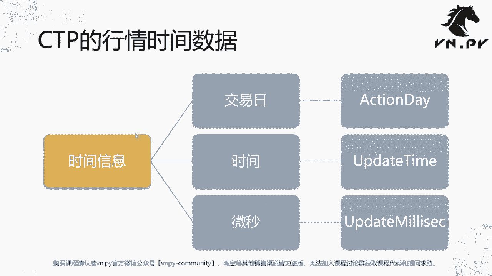

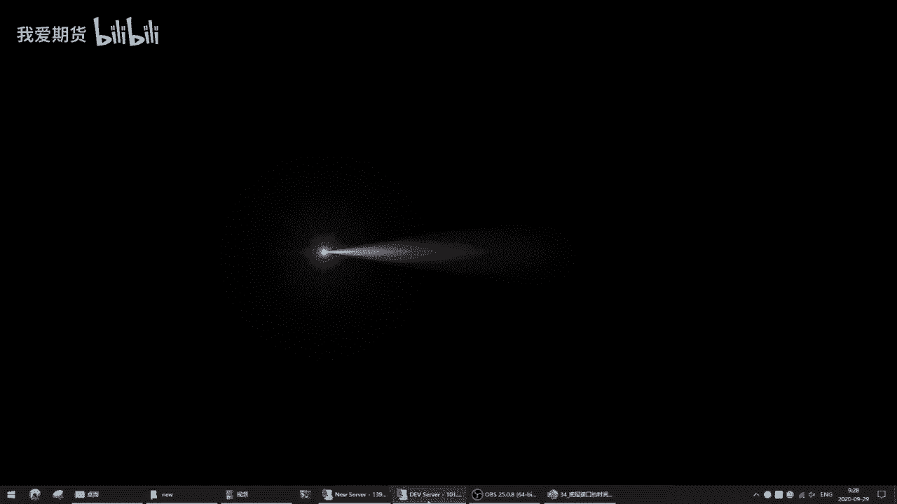

在本节课中，我们将学习如何在VN Trader的底层交易接口中处理时间信息。我们将以CTP接口为例，详细解析行情数据中的时间字段，并学习如何将其转换为Python中可用的datetime对象，同时理解时区处理的重要性。

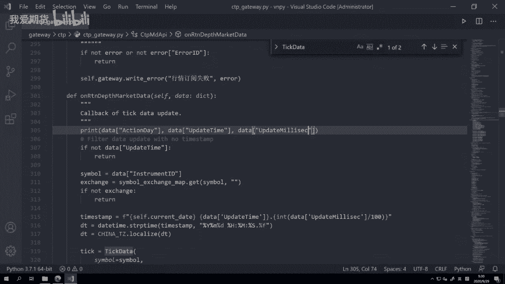

上一节我们介绍了`datetime`模块的基本用法，本节中我们来看看它在真实交易场景中的应用。

## CTP行情数据结构中的时间信息

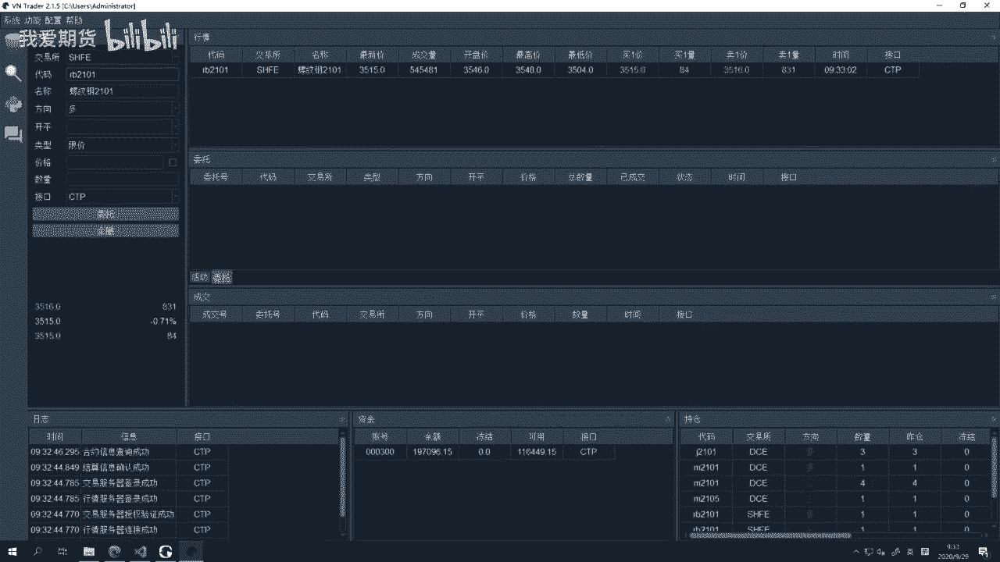

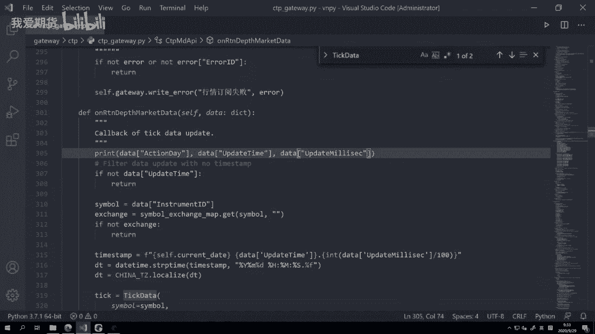

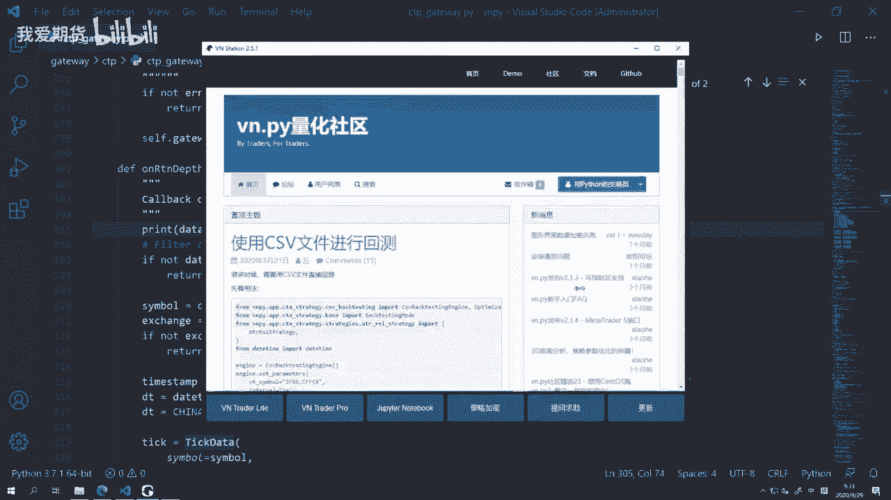

CTP接口推送的行情数据（Tick数据）中，时间信息包含三个部分：

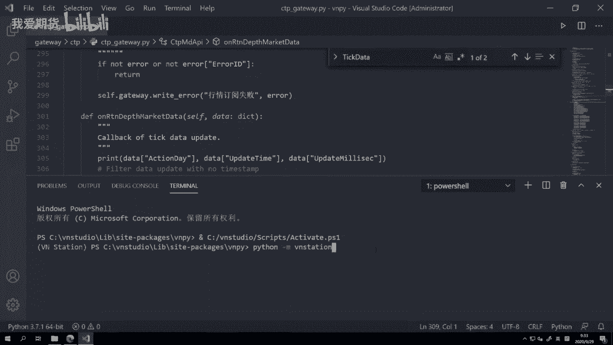

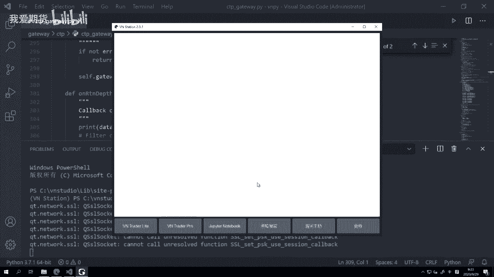

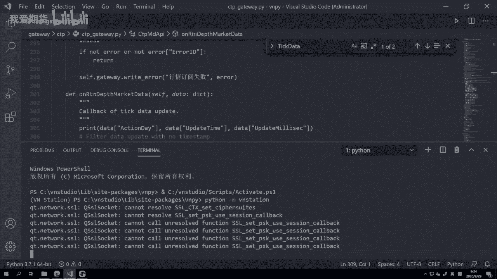

*   **交易日**：字段名为 `action_day`。
*   **时间**：字段名为 `update_time`。
*   **微秒**：字段名为 `update_millisec`。

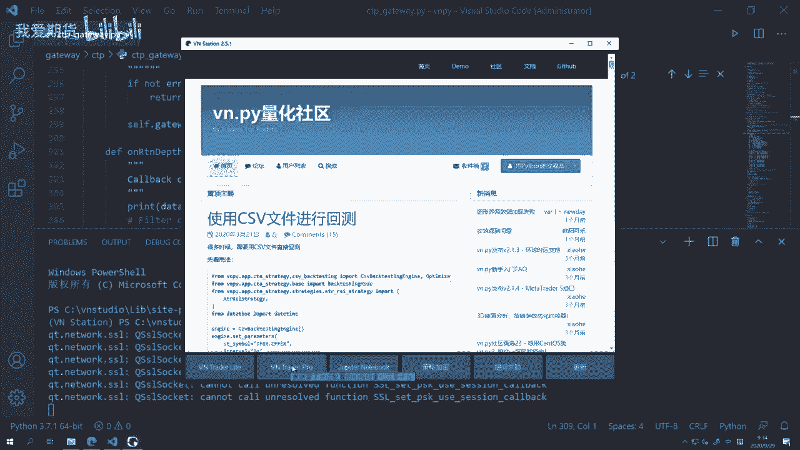

以下是获取并打印这些字段的示例代码片段，位于CTP网关的回调函数中：
```python
print(pDepthMarketData.ActionDay, pDepthMarketData.UpdateTime, pDepthMarketData.UpdateMillisec)
```

## 时间字符串的拼接与转换

我们需要将上述三个字段拼接成一个完整的字符串，然后转换为`datetime`对象。

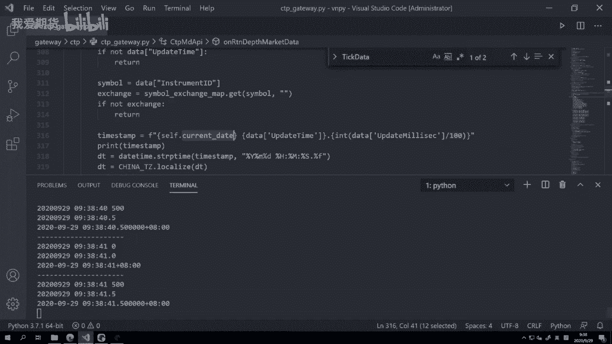

以下是拼接和转换的核心步骤：
1.  **拼接字符串**：将日期、时间和处理后的毫秒数拼接起来。
    ```python
    time_str = f"{current_date} {update_time}.{int(update_millisec/100)}"
    ```
2.  **转换为datetime对象**：使用`strptime`方法，按照指定格式进行转换。
    ```python
    dt = datetime.strptime(time_str, "%Y%m%d %H:%M:%S.%f")
    ```

**注意**：在拼接时，我们使用本地当前日期（`current_date`）而非`action_day`。这是因为国内期货的夜盘行情在“交易日”概念上归属于下一个自然日，而不同交易所规则不一。为保持一致性（仅关心行情发生的实际自然日时间），VN Trader选择使用本地日期。

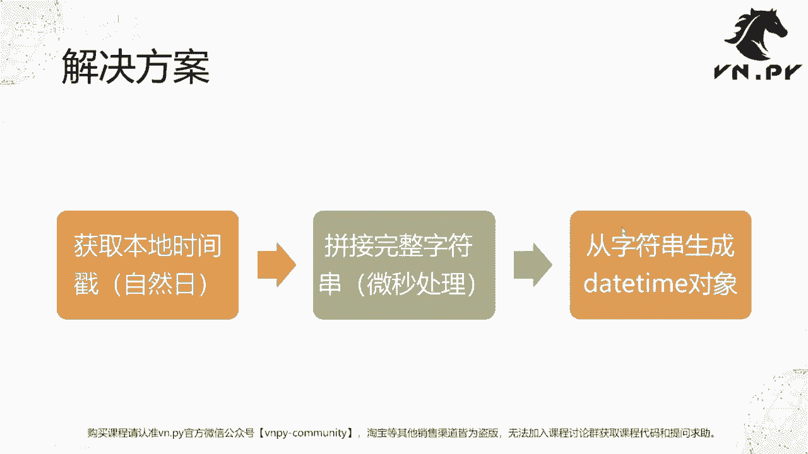

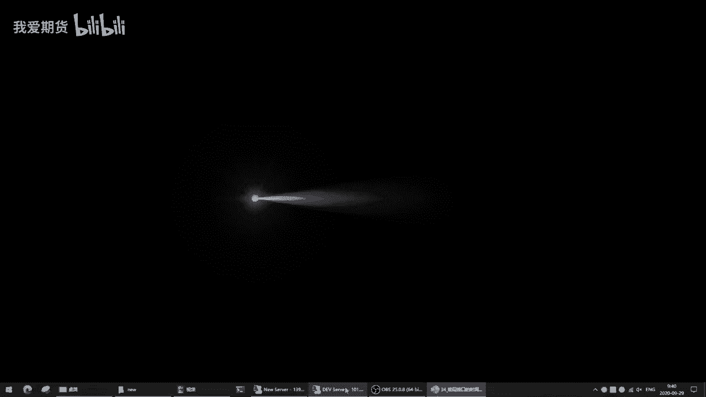

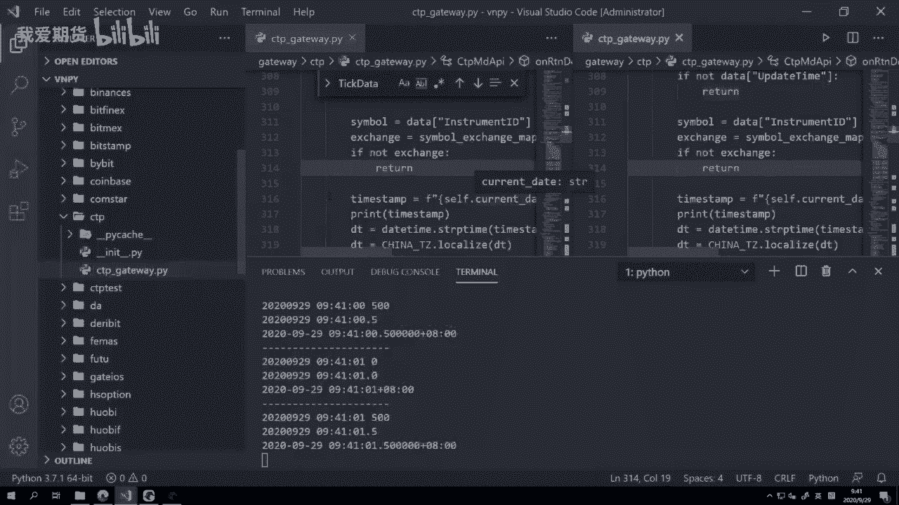

## 时区处理

在处理国际化品种（如内外盘套利）时，时区统一至关重要。VN Trader对所有时间戳都加入了时区信息，以确保显示、数据存储和回测时的时间一致性。

以下是处理时区的关键代码：
1.  **定义时区**：创建代表中国时区（东八区）的对象。
    ```python
    from pytz import timezone
    CHINA_TZ = timezone("Asia/Shanghai")
    ```
2.  **本地化时间**：将无时区的`datetime`对象绑定上中国时区。
    ```python
    dt = CHINA_TZ.localize(dt)
    ```
经过此处理后的`dt`对象即带有时区信息，可以准确地进行跨时区比较和转换。

## 数据管理模块中的时间格式

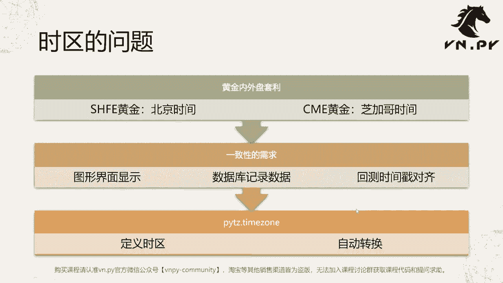

在VN Trader的“数据管理”模块中导入CSV数据时，需要指定时间列的格式。此格式必须与CSV文件中时间字符串的实际格式完全匹配，否则会导致加载失败。

例如，如果CSV中时间为`20201102 14:30:00.500`，则格式应设置为`%Y%m%d %H:%M:%S.%f`。

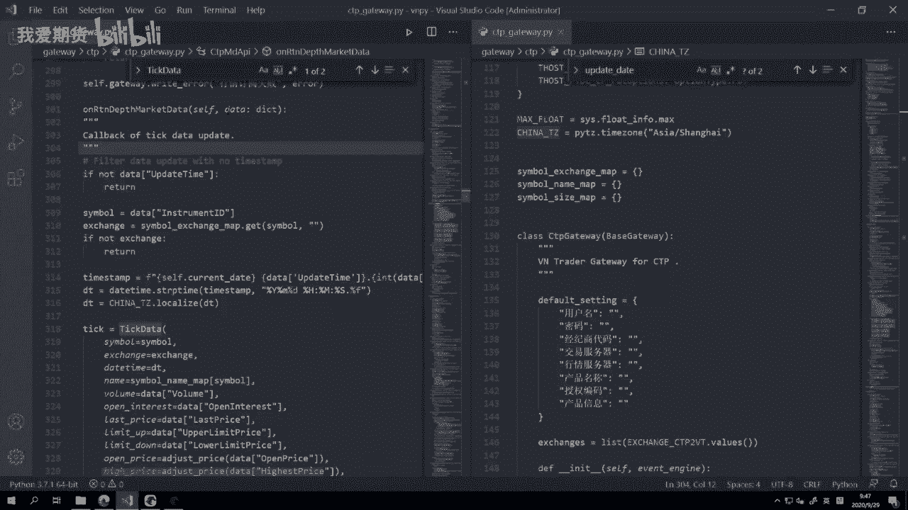

---

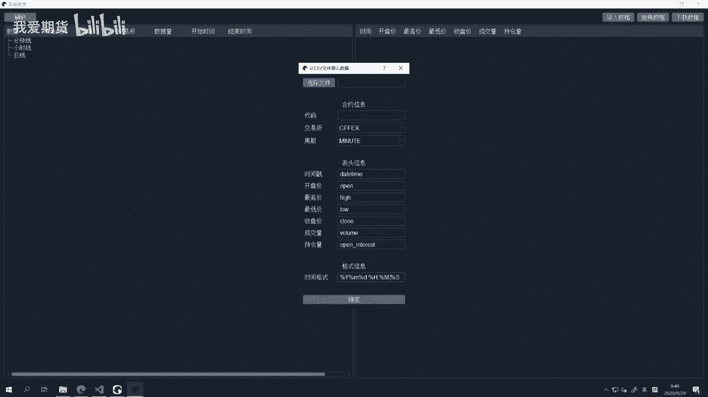

本节课中我们一起学习了：
1.  CTP接口行情数据中时间字段的构成。
2.  如何将原始时间字符串拼接并转换为Python的`datetime`对象。
3.  为何在期货交易中优先使用“自然日”而非“交易日”进行时间处理。
4.  如何使用`pytz`库为时间对象添加时区信息，以满足国际化交易的需求。
5.  在VN Trader图形界面中导入数据时，时间格式匹配的重要性。

理解底层接口的时间处理机制，是构建稳定、准确的量化交易系统的基础。