# 量化交易零基础入门：35：CSV模块详解 📊

在本节课中，我们将要学习Python的`csv`模块。该模块专门用于读写CSV（逗号分隔值）文件。在金融和量化交易领域，CSV文件因其格式简单，常被用来保存历史行情数据、成交记录等。掌握`csv`模块的读写操作，是进行数据处理的基础。

## 模块概述与核心类

`csv`模块的功能主要分为两大方向：**写入**和**读取**。每个方向下又提供了两种操作方式：
*   **写入**：使用 `writer` 类或 `DictWriter` 类。
*   **读取**：使用 `reader` 类或 `DictReader` 类。

简单来说，`writer`和`reader`处理列表形式的数据，而`DictWriter`和`DictReader`则处理字典形式的数据，后者在管理具有键值对关系的数据时更为方便。

## 写入CSV文件

上一节我们介绍了`csv`模块的核心类，本节中我们来看看如何使用`writer`类将数据写入CSV文件。

写入操作通常涉及四个关键步骤：
1.  使用 `with` 操作符管理文件。
2.  使用 `open()` 函数以写入模式打开文件。
3.  创建 `writer` 对象。
4.  调用 `writerow()` 方法逐行写入数据。

以下是具体代码示例：

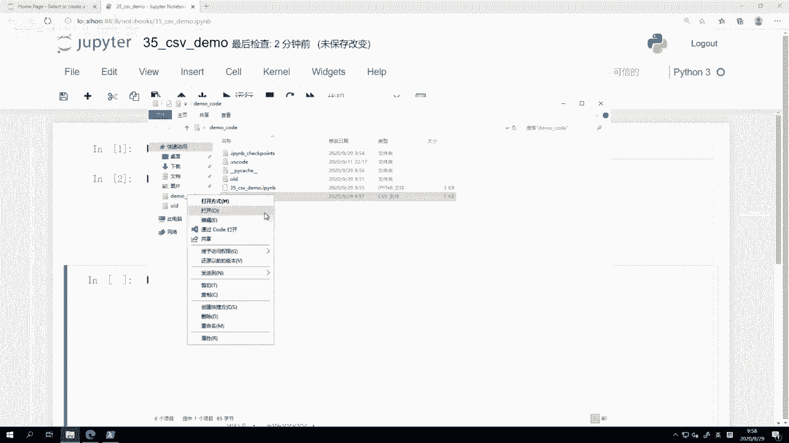

```python
import csv

# 1. 使用with语句打开文件，'w'表示写入模式，newline=''用于处理换行
with open('test1.csv', 'w', newline='') as f:
    # 2. 创建writer对象
    writer = csv.writer(f)
    # 3. 写入表头（一行数据，以列表形式提供）
    writer.writerow(['symbol', 'date', 'close'])
    # 4. 逐行写入数据
    writer.writerow(['RB2101', '2020-09-07', '3500'])
    writer.writerow(['RB2101', '2020-09-08', '3550'])
    writer.writerow(['RB2101', '2020-09-09', '3530'])
```

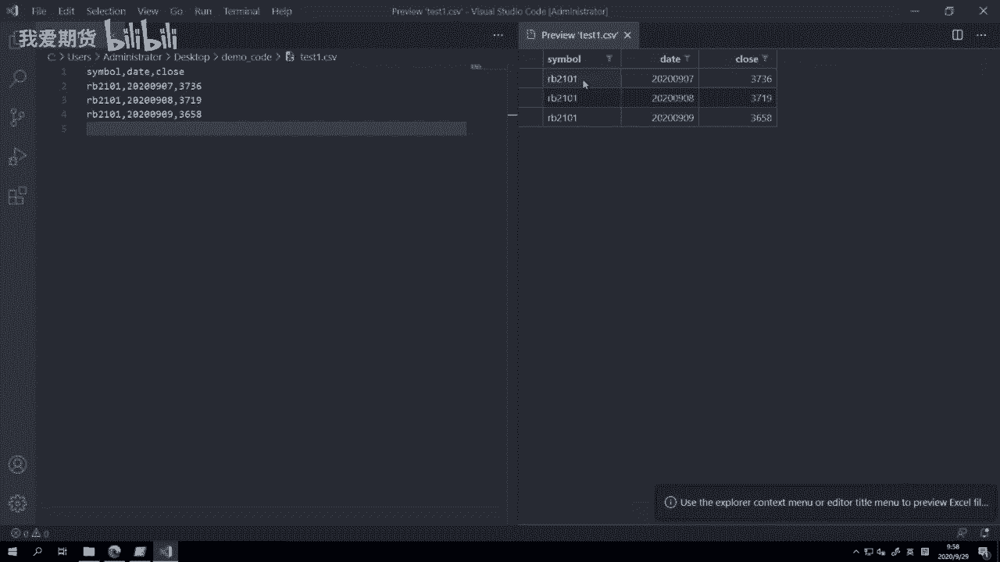

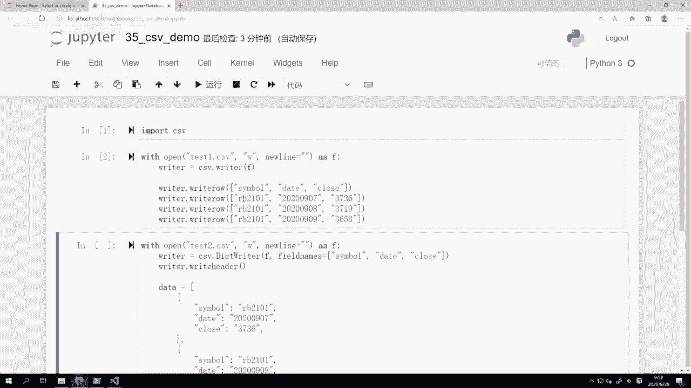

**核心要点**：
*   `writerow()` 方法接受一个**列表**作为参数，列表中的每个元素代表该行的一个单元格。
*   写入的内容必须是**字符串**类型。如果是整数、浮点数等其他类型，需要先使用 `str()` 函数进行转换。

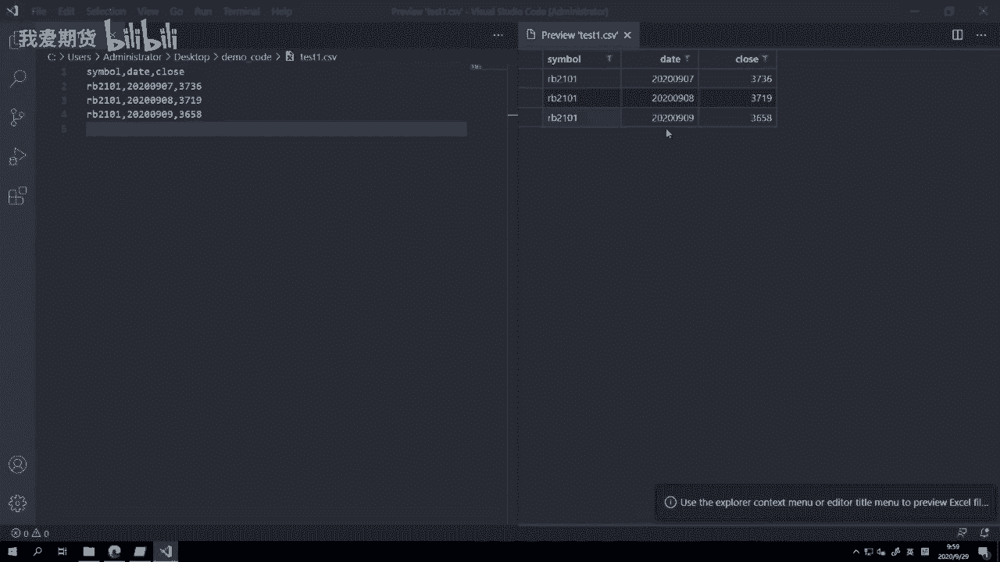

### 关于 `with` 语句和文件关闭

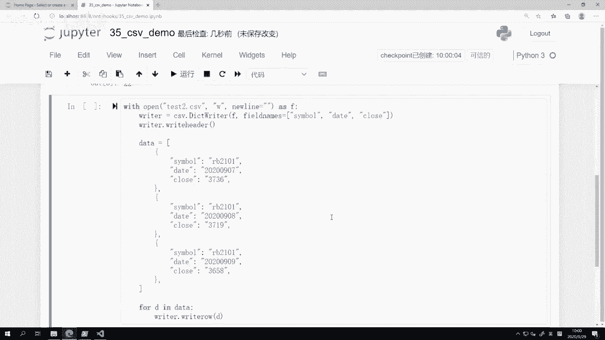

`with` 语句是一个上下文管理器，它能确保文件在使用后被正确关闭。如果不用 `with`，则需要手动调用 `f.close()` 来关闭文件并确保数据从内存缓冲区写入硬盘。忘记关闭文件可能导致数据丢失。

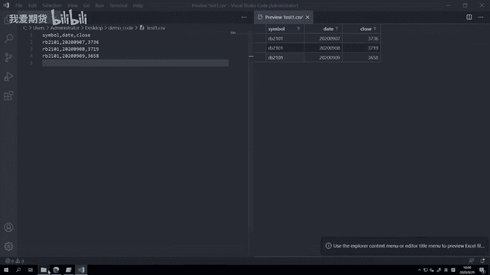

```python
# 不使用with的写法（不推荐，易忘记关闭文件）
f = open('test0.csv', 'w', newline='')
writer = csv.writer(f)
writer.writerow(['symbol', 'date', 'close'])
# ... 写入其他数据
f.close() # 必须手动关闭
```

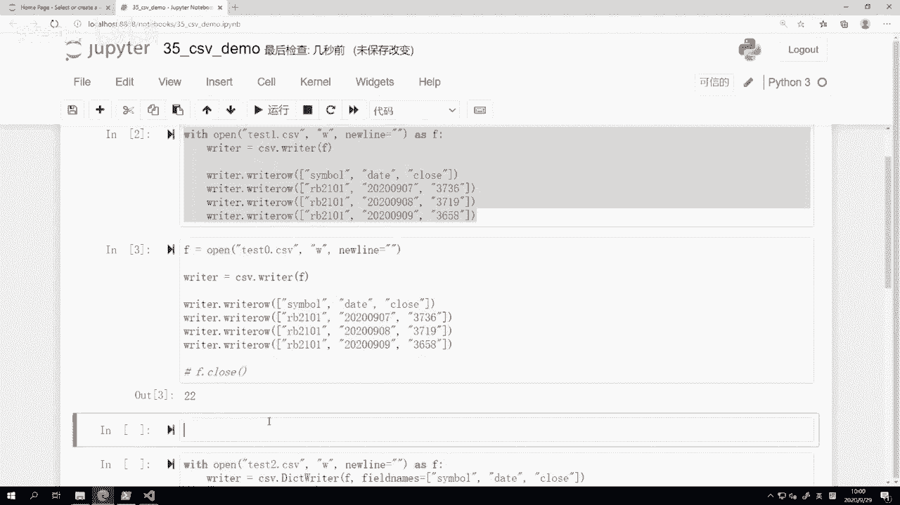

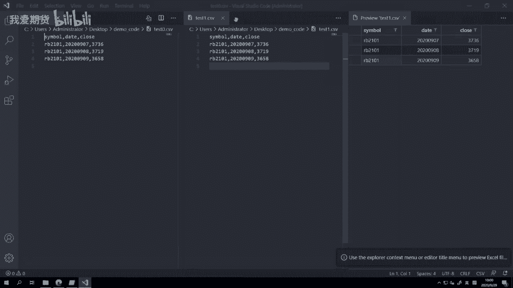

## 使用字典写入CSV文件

当数据以字典形式组织时，使用 `DictWriter` 类会更加直观。它允许我们通过键名来指定数据写入哪一列。

使用 `DictWriter` 写入数据分为三步：
1.  定义表头字段名 (`fieldnames`)。
2.  写入表头 (`writeheader()`)。
3.  逐行写入数据字典 (`writerow()`)。

以下是具体操作：

```python
import csv

# 准备数据：一个字典列表
data = [
    {'symbol': 'RB2101', 'date': '2020-09-07', 'close': '3500'},
    {'symbol': 'RB2101', 'date': '2020-09-08', 'close': '3550'},
    {'symbol': 'RB2101', 'date': '2020-09-09', 'close': '3530'}
]

with open('test2.csv', 'w', newline='') as f:
    # 定义CSV文件的列名（表头）
    fieldnames = ['symbol', 'date', 'close']
    # 创建DictWriter对象，传入文件对象和表头
    writer = csv.DictWriter(f, fieldnames=fieldnames)
    # 写入表头
    writer.writeheader()
    # 循环写入每一行数据（每个字典）
    for row in data:
        writer.writerow(row)
```

这种方法使得代码意图更清晰，数据与列的对应关系一目了然。

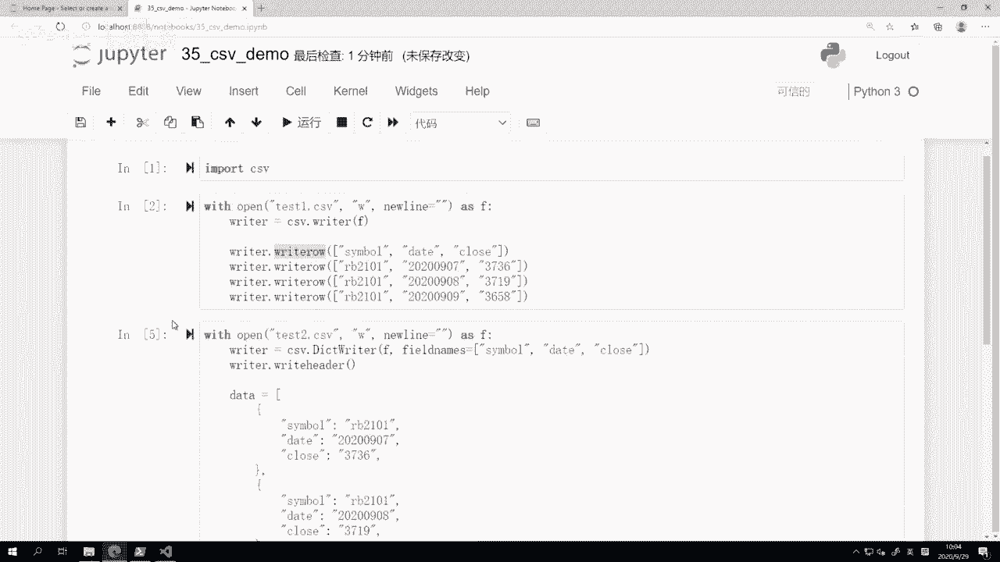

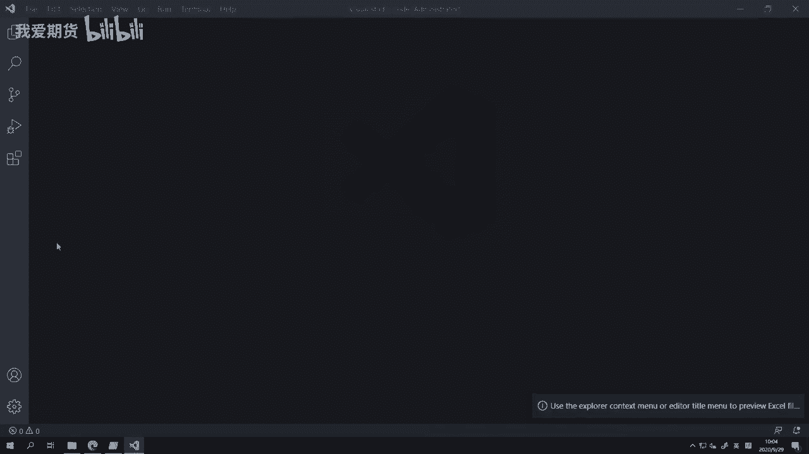

## 读取CSV文件

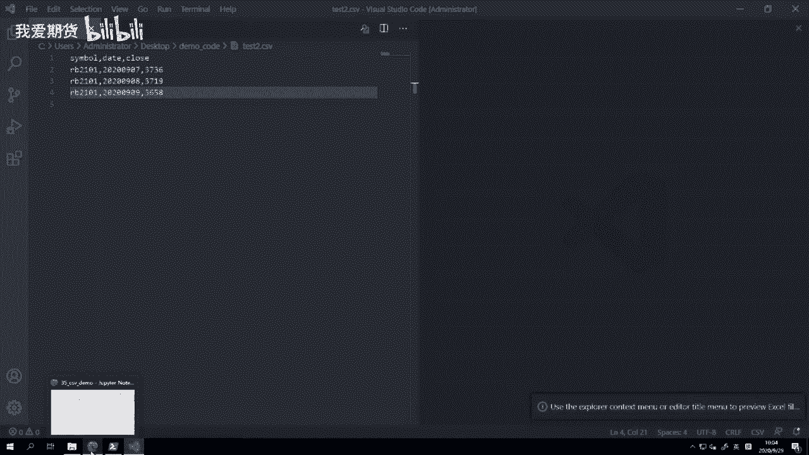

学会了写入，接下来我们学习如何从CSV文件中读取数据。读取操作同样推荐使用 `with` 语句和 `DictReader` 类，因为它能将每一行数据自动解析为字典，便于后续处理。

读取CSV文件的基本步骤是：
1.  以读取模式 (`'r'`) 打开文件。
2.  创建 `DictReader` 对象。
3.  遍历读取器对象，获取每一行数据。

以下是代码示例：

```python
import csv

with open('test2.csv', 'r') as f: # 注意模式是 'r'
    # 创建DictReader对象
    reader = csv.DictReader(f)
    # 遍历每一行数据
    for row in reader:
        # 每一行row都是一个字典
        print(row)
        # 可以直接通过键名访问数据
        # print(row['symbol'], row['date'], row['close'])
```

**执行结果示例**：
每一行 `row` 是一个类似 `{'symbol': 'RB2101', 'date': '2020-09-07', 'close': '3500'}` 的字典，你可以通过键名直接访问特定列的数据，这在后续的数据分析和回测中非常方便。

如果使用普通的 `reader` 类，读出的每一行将是一个列表，你需要自己记住列表中每个位置的元素代表什么含义，不如 `DictReader` 直观。

## 总结

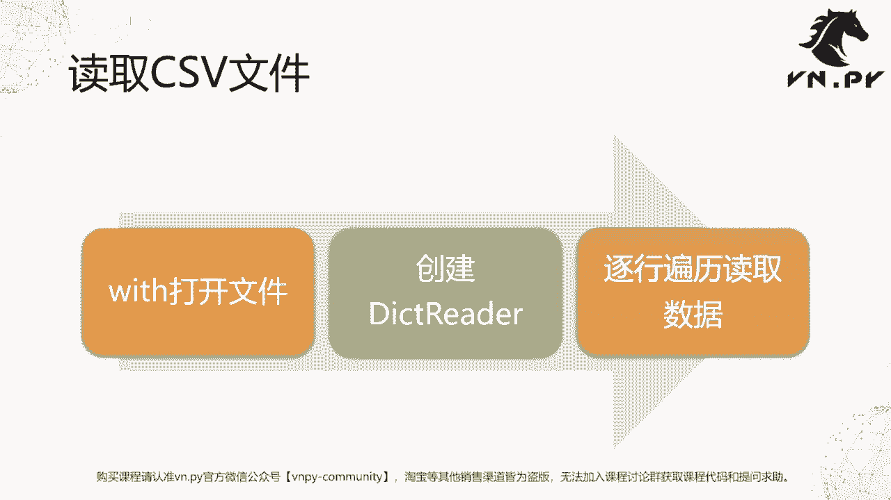


本节课中我们一起学习了Python `csv` 模块的核心用法。我们掌握了：
*   **写入CSV**：使用 `csv.writer()` 和 `csv.DictWriter()`，配合 `writerow()` 方法，并理解了使用 `with` 语句管理文件资源的重要性。
*   **读取CSV**：使用 `csv.DictReader()` 可以方便地将文件内容读入字典结构，便于数据访问和处理。
*   **核心概念**：所有写入的数据都应是字符串；`DictWriter`/`DictReader` 通过键值对操作数据，更符合Python处理结构化数据的习惯。

通过结合之前学过的列表、字典、循环等知识，你现在已经能够使用Python进行简单的CSV文件读写操作了。这是数据处理的基础，请务必动手练习以巩固理解。

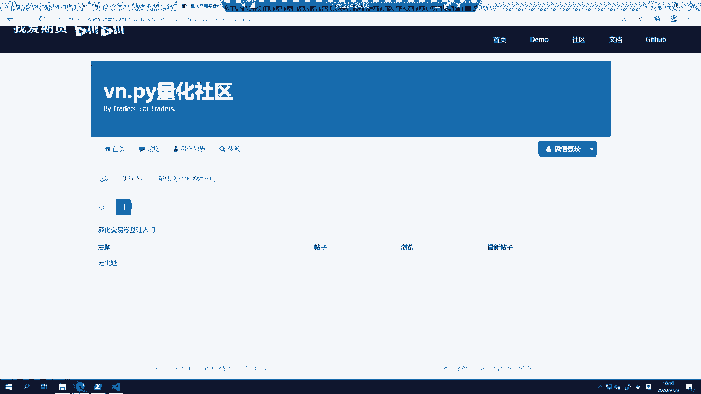


---
**遇到问题？** 学习过程中如有疑问，欢迎访问我们的VnPy社区论坛，在“量化交易零基础入门”专区提问，会有专人进行解答。