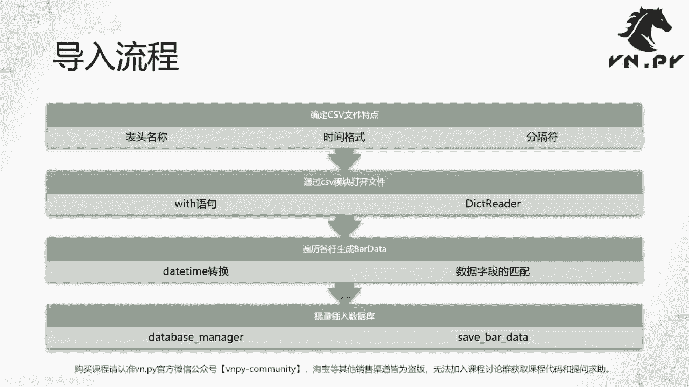
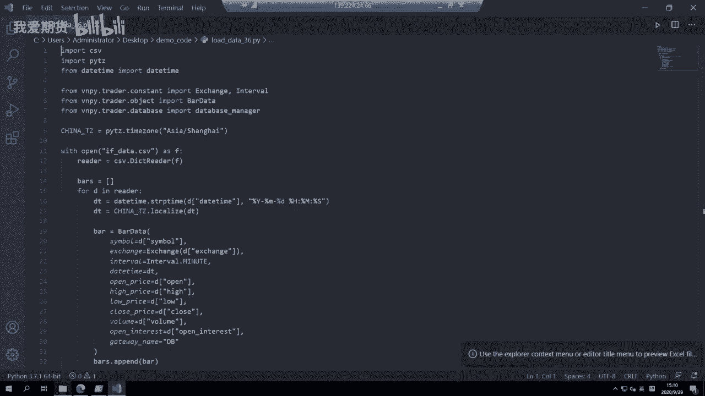
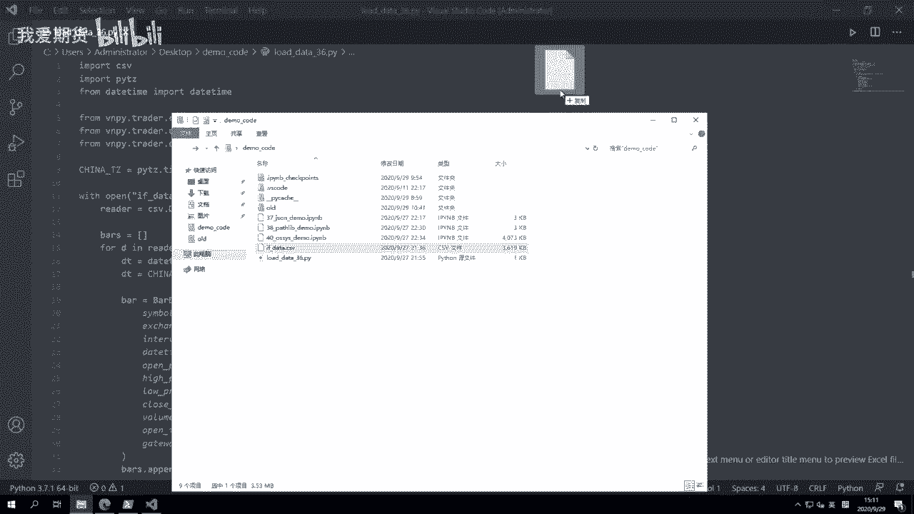
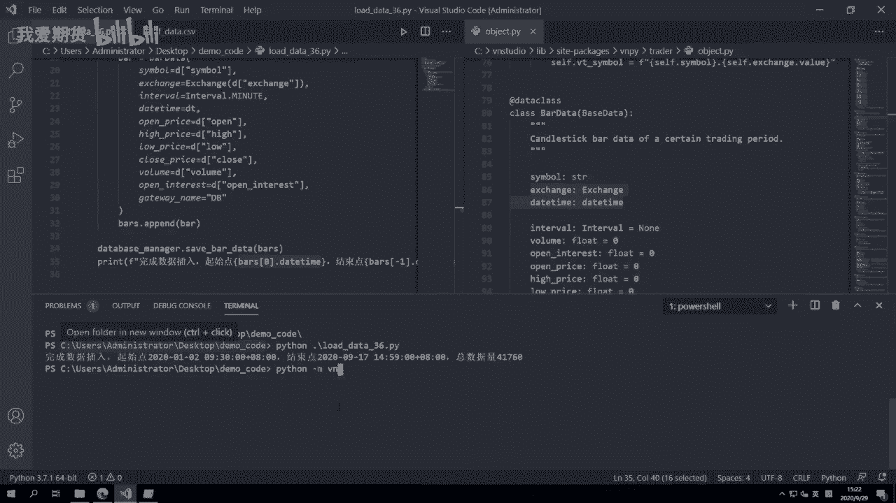
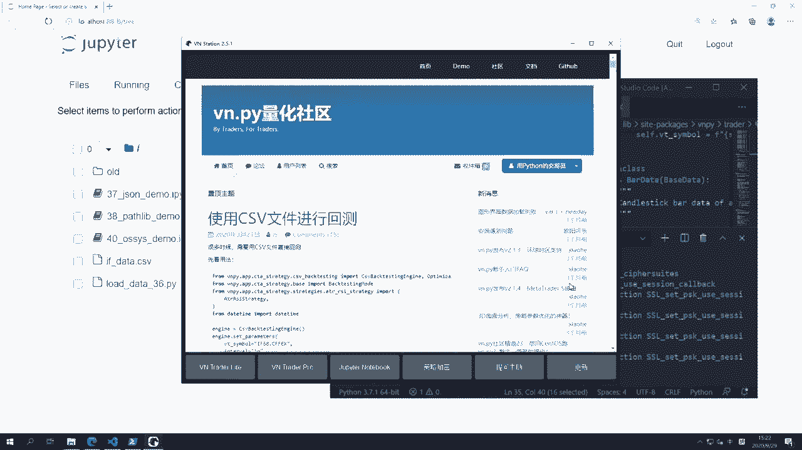
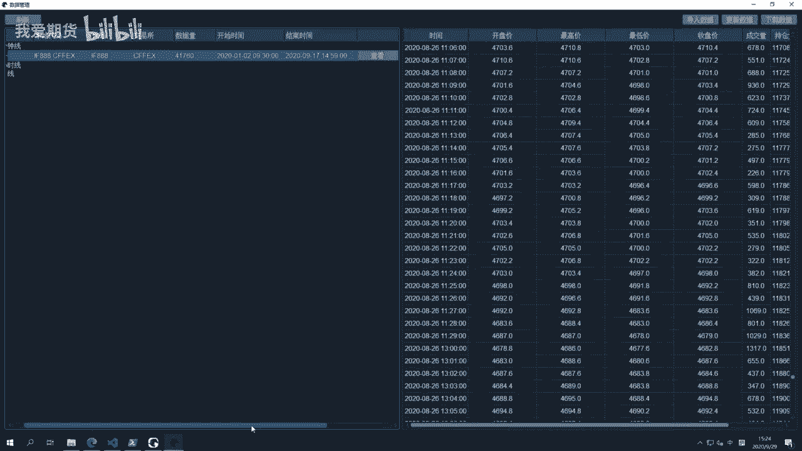
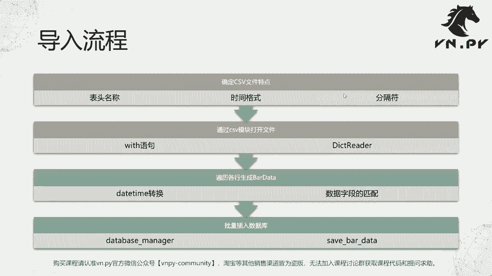

# 量化交易零基础入门：36：载入CSV历史数据 📊

在本节课中，我们将学习如何将CSV格式的历史数据导入到VN Trader的数据库中。这是将外部数据源整合到量化交易系统中的关键一步。

## 概述



上一节我们介绍了CSV模块的基本用法，本节中我们来看看它的实践应用。我们将通过一个具体的例子，演示如何读取一个包含期货K线数据的CSV文件，并将其转换为VN Trader内部的数据结构，最终批量存入数据库。



整个导入操作可以分为四个主要步骤：
1.  查看并确认CSV文件的结构。
2.  使用CSV模块读取文件。
3.  遍历数据行，生成`BarData`对象。
4.  使用`DatabaseManager`将数据批量插入数据库。



接下来，我们将详细讲解每一步的实现。

## 第一步：查看CSV文件结构

在编写代码之前，我们需要先了解数据源的结构。我们使用的示例文件是`if_data.csv`，它包含了股指期货（IF）连续合约的数据。

以下是该文件的部分内容预览：
```
symbol,exchange,datetime,open,high,low,close,volume,open_interest
IF888,CFEX,2020-01-02 09:30:00,4155.0,4158.6,4154.6,4156.2,100,200
...
```

通过观察，我们可以确认以下信息：
*   **表头**：包含`symbol`、`exchange`、`datetime`、`open`、`high`、`low`、`close`、`volume`、`open_interest`等标准字段。
*   **日期格式**：`datetime`字段的格式为`年-月-日 时:分:秒`。
*   **分隔符**：字段之间使用逗号`,`分隔。

这些信息将指导我们后续的代码编写。

## 第二步：编写数据加载代码

我们创建一个名为`load_data_36.py`的Python文件来完成数据加载任务。首先，需要导入必要的模块。

以下是需要导入的模块：
```python
import csv
from datetime import datetime
import pytz

from vnpy.trader.constant import Exchange, Interval
from vnpy.trader.object import BarData
from vnpy.trader.database import database_manager
```

代码分为几个部分：
1.  **导入Python内置模块**：`csv`用于读取文件，`datetime`用于处理时间，`pytz`用于处理时区。
2.  **导入VN Trader模块**：`Exchange`和`Interval`是枚举类型，`BarData`是K线数据结构，`database_manager`是数据库管理对象。

## 第三步：读取CSV并转换数据

定义好时区后，我们开始核心的数据读取与转换流程。

以下是数据加载与转换的主要步骤：
```python
# 定义中国时区（北京）
china_tz = pytz.timezone("Asia/Shanghai")

# 用于存储所有BarData对象的列表
bars = []

# 使用with语句打开CSV文件
with open("if_data.csv") as f:
    reader = csv.DictReader(f)  # 以字典形式读取每一行

    # 遍历CSV文件中的每一行数据
    for d in reader:
        # 1. 转换时间字符串为datetime对象，并本地化为中国时区
        dt = datetime.strptime(d["datetime"], "%Y-%m-%d %H:%M:%S")
        dt = china_tz.localize(dt)

        # 2. 创建BarData对象，并填充各字段数据
        bar = BarData(
            symbol=d["symbol"],
            exchange=Exchange(d["exchange"]),  # 将字符串转换为Exchange枚举
            datetime=dt,
            interval=Interval.MINUTE,          # 本例数据为1分钟K线
            open_price=float(d["open"]),
            high_price=float(d["high"]),
            low_price=float(d["low"]),
            close_price=float(d["close"]),
            volume=float(d["volume"]),
            open_interest=float(d["open_interest"]),
            gateway_name="DB",                 # 标识数据来自数据库
        )

        # 3. 将创建好的BarData对象添加到列表中
        bars.append(bar)
```

**关键点解析**：
*   **时区处理**：VN Trader内部要求时间戳必须带有时区信息。我们使用`pytz`将原生时间对象本地化为`Asia/Shanghai`时区。
*   **创建BarData**：`BarData`是VN Trader中表示一根K线的核心对象。创建时需要传入必要的参数，如合约代码、交易所、时间、开高低收价格等。
*   **字段映射**：CSV文件中的列名（如`open`）需要映射到`BarData`对象的对应属性（如`open_price`）。
*   **数据类型转换**：从CSV中读取的数据默认是字符串，需要转换为`float`等数值类型。

## 第四步：保存数据到数据库

数据转换完成后，就可以批量保存到数据库了。

保存数据到数据库的代码如下：
```python
# 使用database_manager的save_bar_data方法批量保存数据
database_manager.save_bar_data(bars)

# 打印导入完成日志
print(f"完成数据插入，起始：{bars[0].datetime}， 结束：{bars[-1].datetime}， 总数据量：{len(bars)}")
```

**注意事项**：
*   `database_manager`是VN Trader框架中已经初始化好的全局数据库管理对象，直接调用其`save_bar_data()`方法即可，**无需**自行实例化。
*   该方法会遍历`bars`列表，将所有的`BarData`对象插入到底层数据库（默认为SQLite）中。
*   插入大量数据可能需要一些时间，完成后打印日志便于确认。

## 验证数据



代码运行完成后，我们可以启动VN Station进行验证。



以下是验证数据是否成功入库的步骤：
1.  打开VN Trader Pro。
2.  点击左上角的“数据管理”组件按钮。
3.  点击“刷新”按钮，即可在列表中看到刚导入的`IF888`合约数据。
4.  点击“查看”按钮，可以选择时间范围来浏览具体的K线数据。

如果能看到相应的数据记录，并且数量、时间范围与日志输出一致，则说明数据导入成功。

## 总结





本节课我们一起学习了如何将外部的CSV历史数据导入到VN Trader的数据库中。我们回顾了从查看文件结构、读取CSV、转换并生成`BarData`对象，到最后批量插入数据库的完整流程。掌握这个方法后，你就可以将来自不同数据源的K线数据整合到VN Trader中，为后续的策略回测和实盘交易提供数据基础。