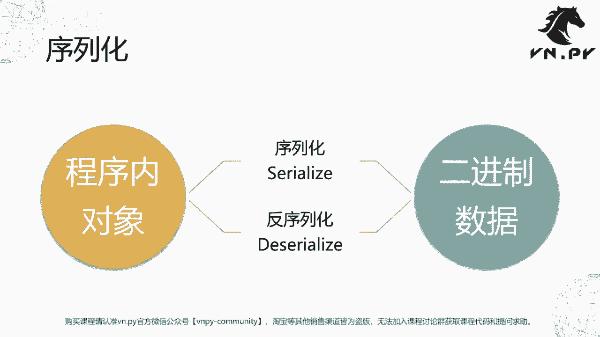
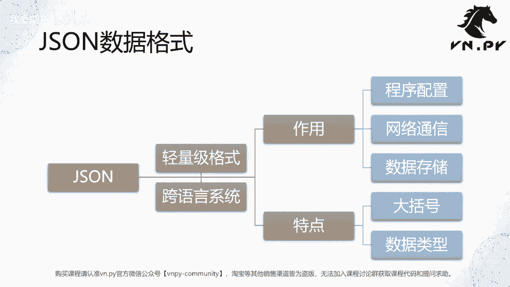
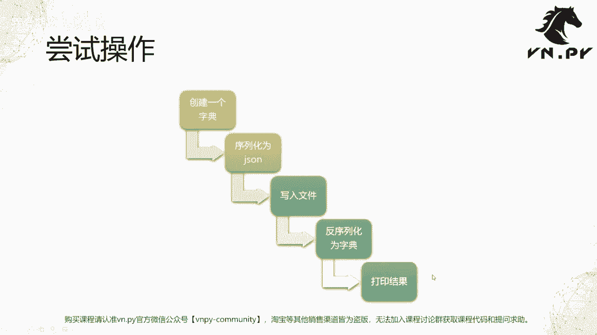
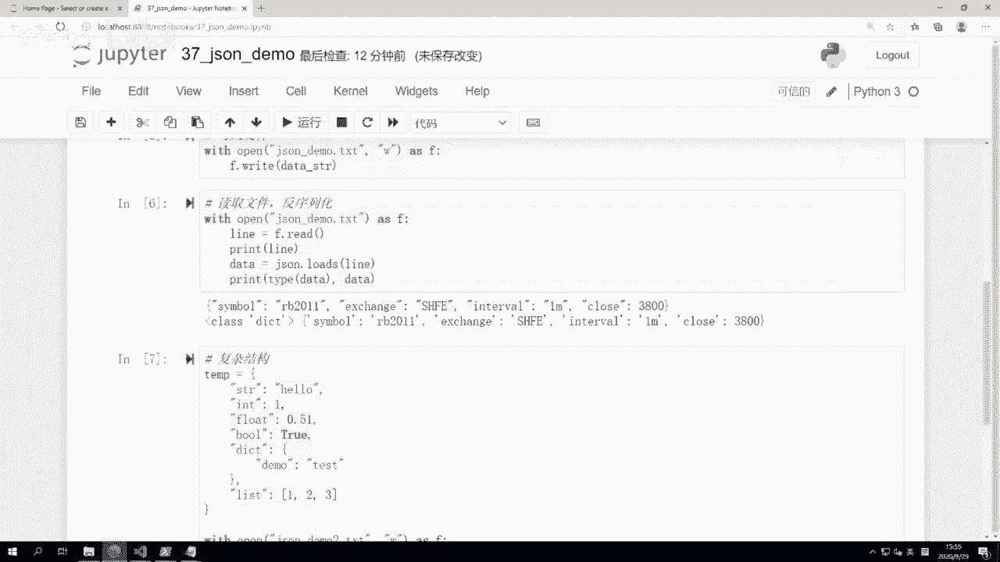
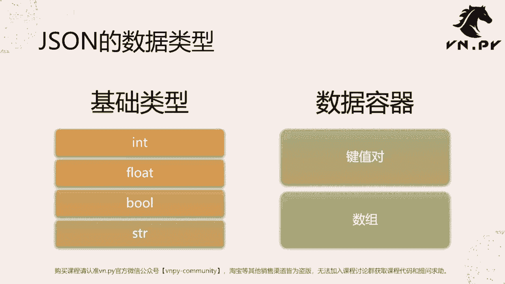

# Python量化开发：37：JSON模块详解 📚

在本节课中，我们将学习Python中的`json`模块。我们将了解什么是序列化与反序列化，掌握JSON数据格式的特点，并通过实例学习如何使用`json`模块进行数据的读写操作。

## 序列化与反序列化概念 🔄

上一节我们介绍了CSV模块，本节中我们来看看JSON模块。在学习JSON之前，首先需要掌握序列化的概念。

截止到目前为止，大家接触了很多Python内部的程序内对象，包括最基本的Python内的数据结构，例如字符串`string`、整数`int`、布尔值`bool`、浮点数`float`，以及数据容器`dict`、`list`等。它们都是Python程序内的对象，存在于Python内存中。如果你把Python的解释器关闭，或者退出Jupyter，它们就会立即从内存中消失。

有没有办法可以把它们保存下来？有两种方案。第一种方案是写入到硬盘上的文件。第二种方案是通过网络发送到另一个服务器上保存。为了实现这个功能，我们需要把程序内的对象转化成二进制数据。二进制数据才可以在文件系统中保存，或者在网络上发送。由程序内对象转到二进制数据的操作叫做序列化（`serialize`）。反过来，由二进制数据转回程序内对象的操作叫做反序列化（`deserialize`）。



这里的二进制数据是一个比较宽泛的概念。严格意义上讲的二进制，就是由`010101`组成的纯粹二进制数据结构。结合不同的编码格式后，二进制数据也可以通过人类可读的字符串形式来表示。尽管我们看到的是字符串，但操作系统知道每个字符对应系统内的一段`0101`组合。所以字符串也可以认为是一种广义上的二进制数据。

## JSON数据格式介绍 🌐

JSON是一种轻量级的数据格式。它是在互联网发明以来，主要为了在互联网上传递数据而发明的特殊数据结构。它有一个非常好的特征叫做跨语言、跨系统。你可以很方便地在Windows上用Python写一个JSON文件，然后通过U盘复制到Linux系统上，再通过C++语言写的程序把它读出来。这既跨了编程语言，也跨了操作系统。或者，你也可以通过网络通讯工具直接发送过去。



正因为这么方便，JSON的应用领域很广泛，包括程序配置、网络通讯、数据在硬盘上的储存都可以使用。在特点上，主要第一点是用大括号`{}`来把数据整合在一起。第二点，它的数据类型和Python里面的基本类型高度接近。

## JSON模块基础操作 🛠️



接下来我们通过例子来学习。我们将尝试一个五步的流程操作。首先在Python里面创建一个字典，然后把它序列化成一个JSON字符串，接着写入到一个文件里面。第四步是把文件数据再读出来，反序列化为字典。最后把结果打印出来。

以下是操作步骤：

1.  **导入模块**：首先需要导入`json`模块。
    ```python
    import json
    ```

2.  **创建字典**：创建一个包含数据的字典。
    ```python
    d = {
        'symbol': 'rb2401',
        'exchange': 'SHFE',
        'interval': '1m',
        'close': 3800
    }
    print(type(d), d)
    ```

3.  **序列化为JSON字符串**：使用`json.dumps()`函数将字典序列化为JSON格式的字符串。
    ```python
    data_string = json.dumps(d)
    print(type(data_string), data_string)
    ```

4.  **写入文件**：将JSON字符串写入到文本文件中。
    ```python
    with open('json_demo.txt', 'w', encoding='utf-8') as f:
        f.write(data_string)
    ```

5.  **读取文件并反序列化**：从文件中读取JSON字符串，并使用`json.loads()`函数将其反序列化为Python字典。
    ```python
    with open('json_demo.txt', 'r', encoding='utf-8') as f:
        line = f.read()
        print('从文件读取的内容:', line)
        data = json.loads(line)
        print('反序列化后的数据:', data, type(data))
    ```

## 处理复杂数据结构与美化输出 ✨

上一节我们介绍了基础操作，本节中我们来看看如何处理更复杂的数据结构以及美化输出。

我们可以创建一个包含多种数据类型的复杂字典。

以下是复杂数据结构的序列化与反序列化示例：

```python
# 创建一个复杂的数据结构
temp = {
    'name': 'Alice',
    'age': 30,
    'score': 95.5,
    'is_student': False,
    'address': {
        'city': 'Beijing',
        'street': 'Zhongguancun'
    },
    'hobbies': ['reading', 'coding', 'hiking']
}

# 使用 json.dump 直接写入文件，并设置缩进美化格式
with open('demo2.json', 'w', encoding='utf-8') as f:
    json.dump(temp, f, indent=4)  # indent参数用于设置缩进，使输出更易读

# 使用 json.load 直接从文件读取并反序列化
with open('demo2.json', 'r', encoding='utf-8') as f:
    result = json.load(f)
    print('从文件加载的复杂数据:', result)
    print('数据类型:', type(result))
```

`json.dump()`和`json.load()`函数直接处理文件对象，而`json.dumps()`和`json.loads()`处理字符串。`indent`参数可以使写入的JSON数据具有层次分明的缩进格式，便于人类阅读。

## JSON支持的数据类型 📊

JSON支持的数据类型比Python要少，主要支持以下六种类型：

以下是JSON支持的数据类型列表：



*   **基础类型**：
    *   整数 (`int`)
    *   浮点数 (`float`)
    *   布尔值 (`bool`)
    *   字符串 (`string`)，**注意：JSON字符串必须使用双引号**。
*   **数据容器**：
    *   键值对对象 (`dict`)
    *   数组 (`list`)

JSON不支持Python中自定义的对象或其他复杂对象（例如上节课定义的`BarData`对象）。如果需要序列化自定义对象，必须将其转换为字典（提取每个字段的值）后才能进行JSON序列化。

## 总结 📝



本节课中我们一起学习了Python的`json`模块。我们理解了序列化与反序列化的核心概念，认识了JSON作为一种跨语言、跨平台的轻量级数据交换格式。我们掌握了使用`json.dumps()`/`json.loads()`进行字符串与数据的转换，以及使用`json.dump()`/`json.load()`直接进行文件读写操作。我们还了解了JSON所支持的数据类型及其与Python类型的对应关系，并学会了使用`indent`参数美化输出。这些知识是进行数据持久化、配置管理以及网络通信的重要基础。