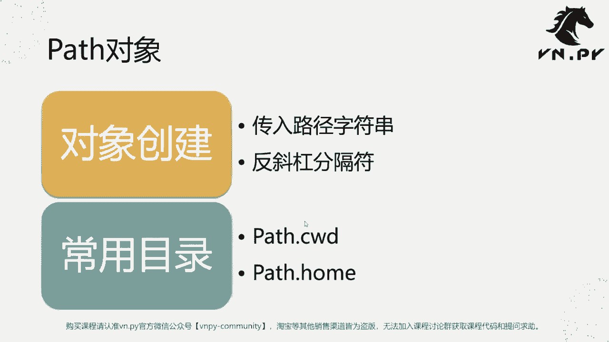
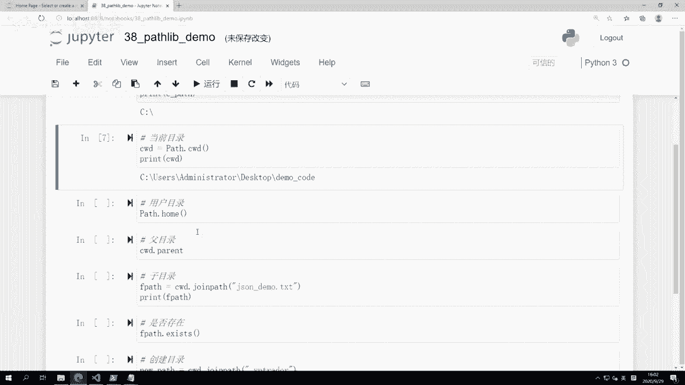
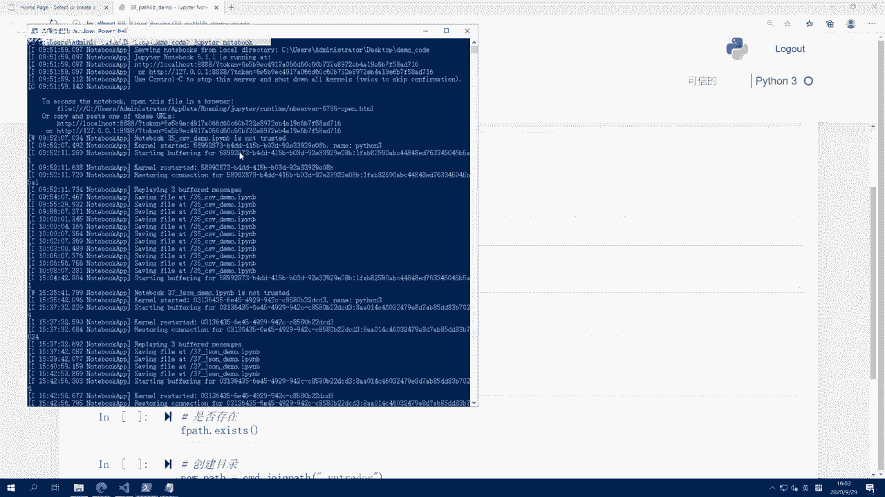
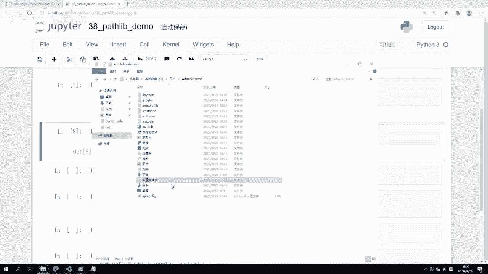
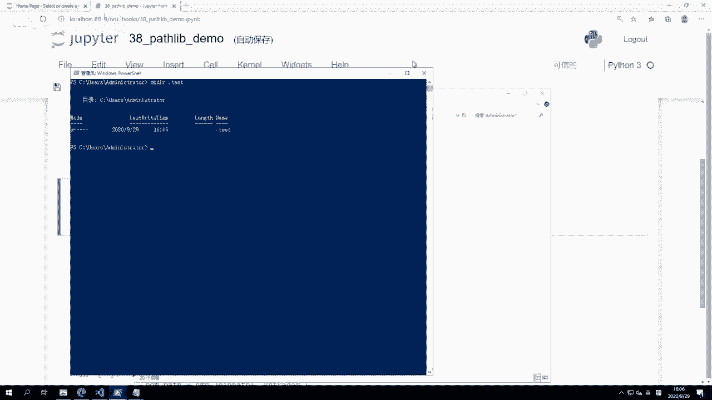
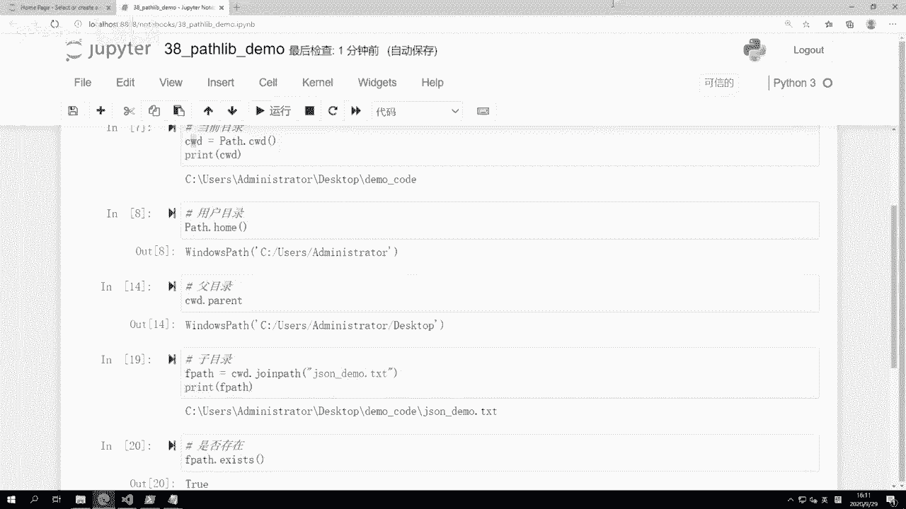
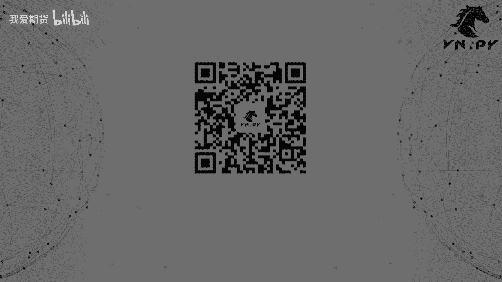

# Python量化开发：38：pathlib模块入门指南 📂

## 概述

在本节课中，我们将学习Python的`pathlib`模块。该模块提供了一种面向对象的方式来处理文件系统路径，使得路径操作更加直观和方便。我们将学习如何创建路径对象、获取当前工作目录和用户目录，以及进行常见的路径操作，如检查文件是否存在和创建新目录。



---

## 路径对象创建

上一节我们介绍了`pathlib`模块的基本概念，本节中我们来看看如何创建一个路径对象。

要创建一个路径对象，我们需要从`pathlib`模块导入`Path`类，并传入一个表示路径的字符串。在Windows系统中，由于反斜杠`\`在Python字符串中是转义字符，我们需要使用双反斜杠`\\`或在字符串前加`r`来创建原始字符串。

```python
from pathlib import Path

# 创建C盘路径对象
path_c = Path('C:\\')
print(path_c)
```

或者，我们可以使用正斜杠`/`作为路径分隔符，这在`pathlib`中是跨平台兼容的。

```python
# 使用正斜杠创建路径对象
path_c = Path('C:/')
print(path_c)
```



---



## 常用目录操作

在创建了路径对象之后，我们可以进行一些常用的目录操作。以下是两个最常用的属性：当前工作目录和用户主目录。

### 当前工作目录

当前工作目录是指Python程序运行时所在的目录。我们可以使用`Path.cwd()`方法来获取它。

```python
# 获取当前工作目录
current_path = Path.cwd()
print(current_path)
```

### 用户主目录

用户主目录是操作系统为每个用户分配的专属目录，通常用于存储用户的个人文件和配置。我们可以使用`Path.home()`方法来获取它。

```python
# 获取用户主目录
home_path = Path.home()
print(home_path)
```

---

## 路径操作



有了路径对象，我们可以围绕它进行各种操作。以下是几个常见的路径操作方法。



### 获取父目录

要获取一个路径的父目录，我们可以使用`parent`属性。这个属性返回一个新的`Path`对象，表示当前路径的上一级目录。

```python
# 获取当前工作目录的父目录
parent_path = current_path.parent
print(parent_path)
```

### 拼接子路径

如果我们需要在当前路径下拼接一个子目录或文件，可以使用`joinpath()`方法。

```python
# 拼接子文件路径
file_path = current_path.joinpath('json_demo.txt')
print(file_path)
```

### 检查路径是否存在

在操作文件或目录之前，我们通常需要检查它是否存在。可以使用`exists()`方法来实现。

```python
# 检查文件是否存在
if file_path.exists():
    print("文件存在")
else:
    print("文件不存在")
```

### 创建新目录

如果我们需要在Python程序中创建一个新目录，可以使用`mkdir()`方法。

```python
# 创建新目录
new_dir_path = current_path.joinpath('.vn_trader')
if not new_dir_path.exists():
    new_dir_path.mkdir()
    print("目录创建成功")
else:
    print("目录已存在")
```

---





## 总结

本节课中我们一起学习了`pathlib`模块的基本用法。我们了解了如何创建路径对象、获取当前工作目录和用户主目录，以及进行常见的路径操作，如获取父目录、拼接子路径、检查路径是否存在和创建新目录。掌握了这些知识后，我们可以更方便地在Python程序中管理文件和目录路径。

在下一节课中，我们将结合`json`模块和`pathlib`模块，实现一个方便的文件配置和缓存数据读写功能。