# 量化交易零基础入门：39：VN.PY配置存储

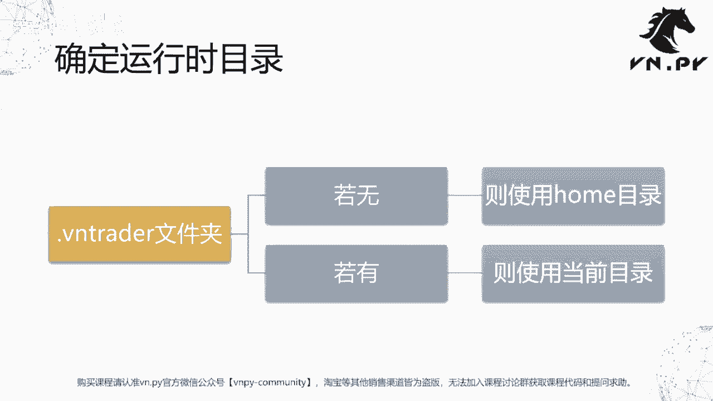


在本节课中，我们将学习如何将之前学习的JSON序列化模块和`pathlib`路径管理模块结合起来，实现VN.PY框架内部的配置存储功能。我们将重点理解运行时目录的确定机制，以及围绕它提供的几个核心文件操作函数。

## 确定运行时目录

上一节我们介绍了`pathlib`模块，本节我们来看看VN.PY如何确定其核心的工作目录。

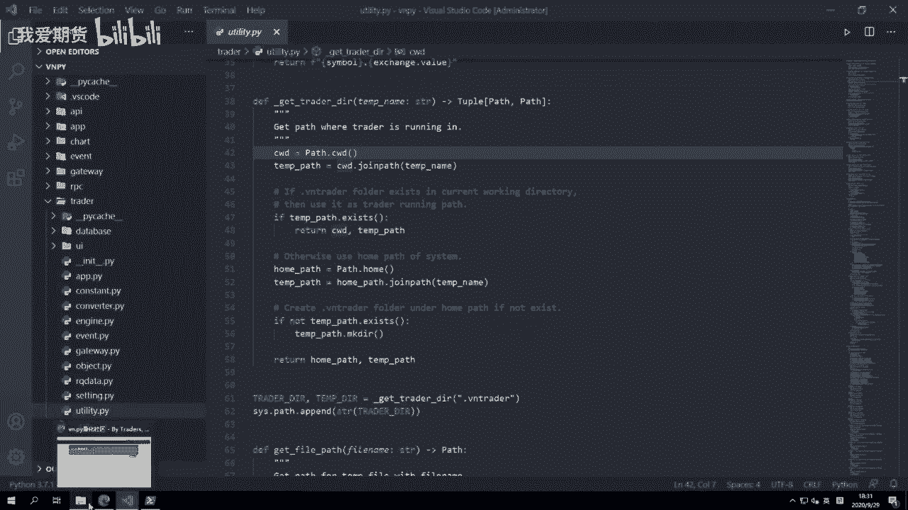

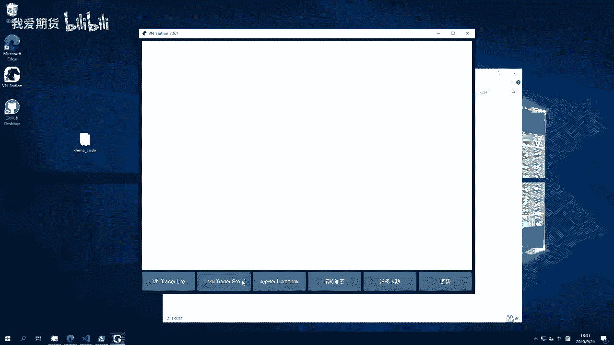

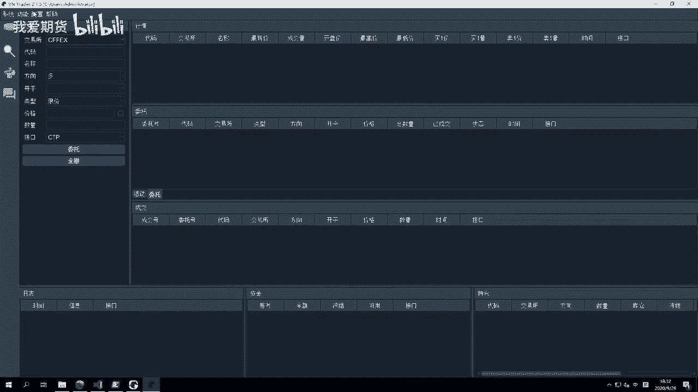

VN Trader（即量化交易平台）有两个关键目录：
1.  **运行时目录**：VN Trader会自动扫描并加载此目录中的策略代码及其他用户开发的代码文件。
2.  **临时文件目录**：VN Trader通过此目录读取和保存系统配置、缓存运行状态数据等。

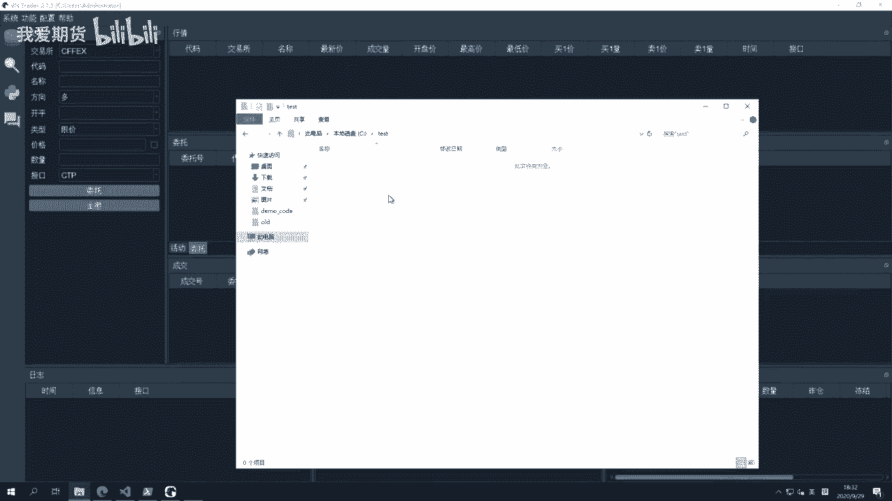

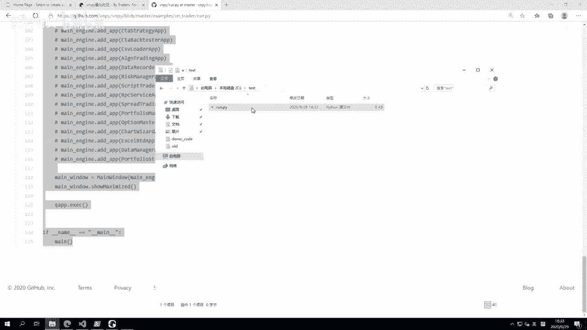

这两个目录的确定逻辑核心在于寻找一个名为 **`.vntrader`** 的文件夹。其规则如下：

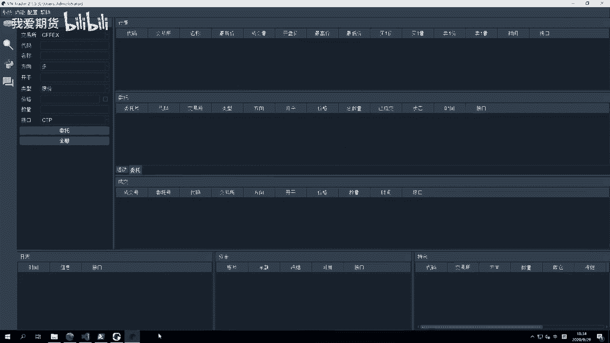

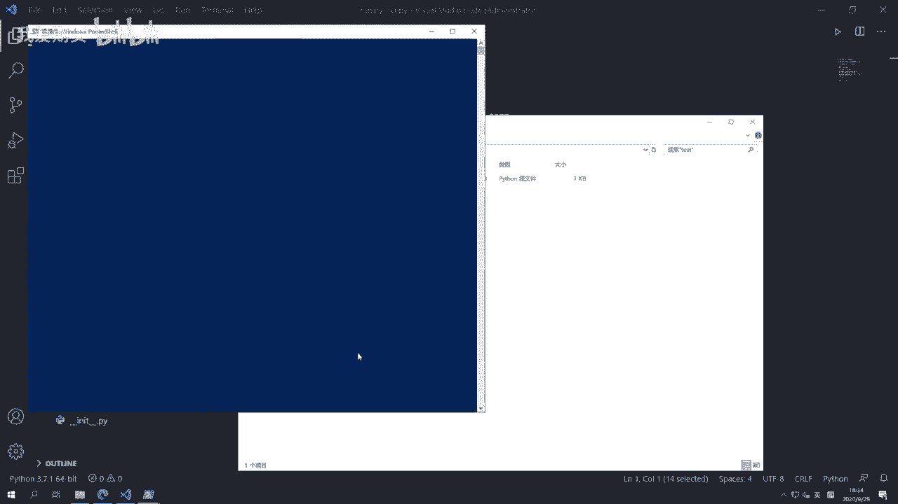

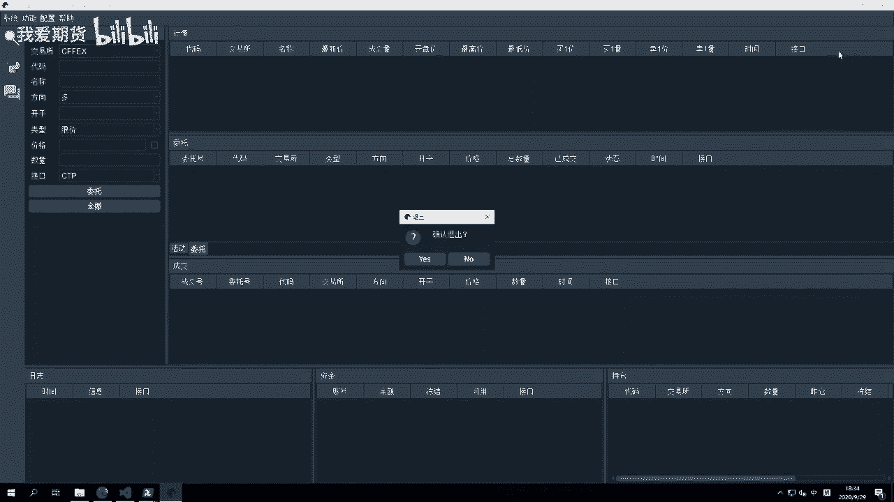

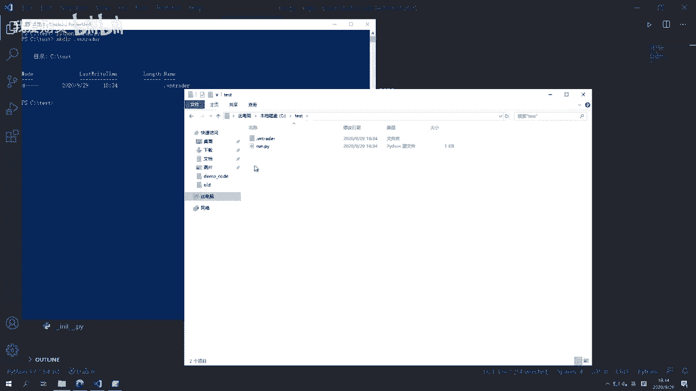

*   如果启动VN Trader的当前目录下存在`.vntrader`文件夹，则**当前目录**被用作运行时目录。
*   如果当前目录下没有`.vntrader`文件夹，则使用操作系统的**用户主目录（home目录）**作为运行时目录，并在其中创建`.vntrader`文件夹作为临时文件目录。

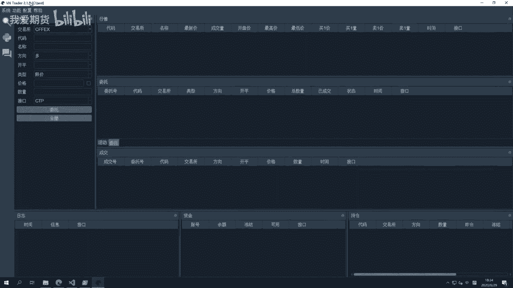

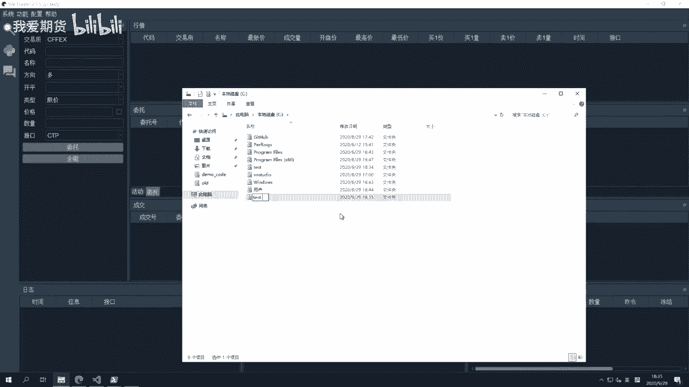

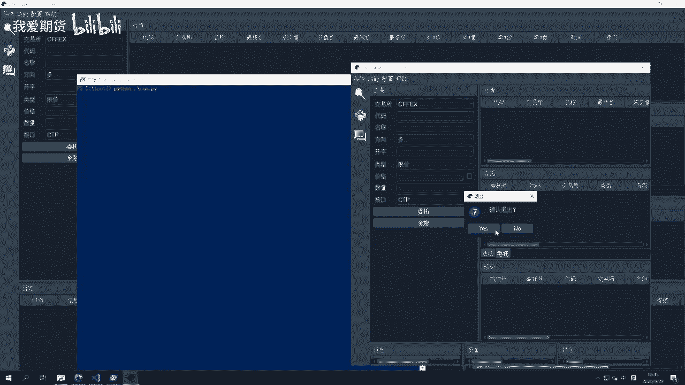

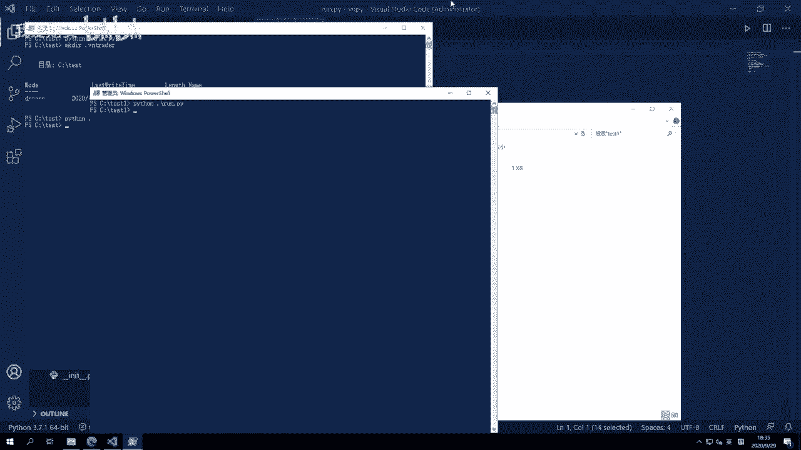

在代码中，这一逻辑由`utility.py`文件中的`get_trader_dir`函数实现。确定目录后，运行时目录会被添加到Python解释器的环境变量中，以便后续加载用户策略。


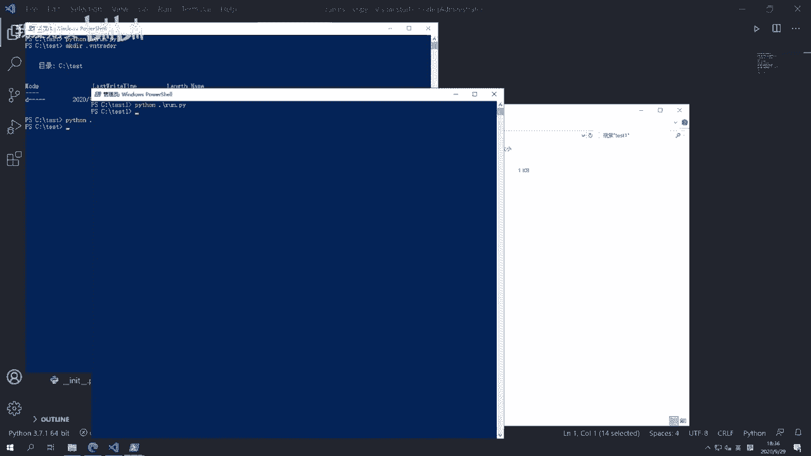

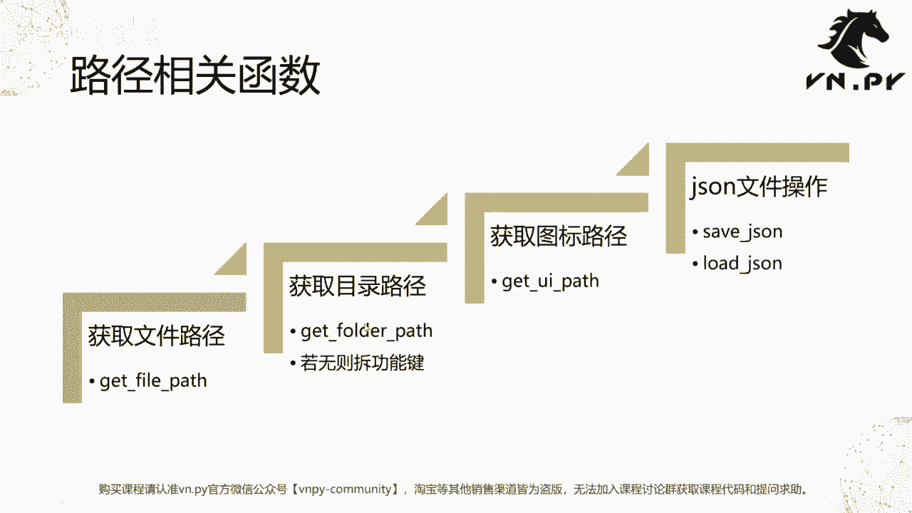

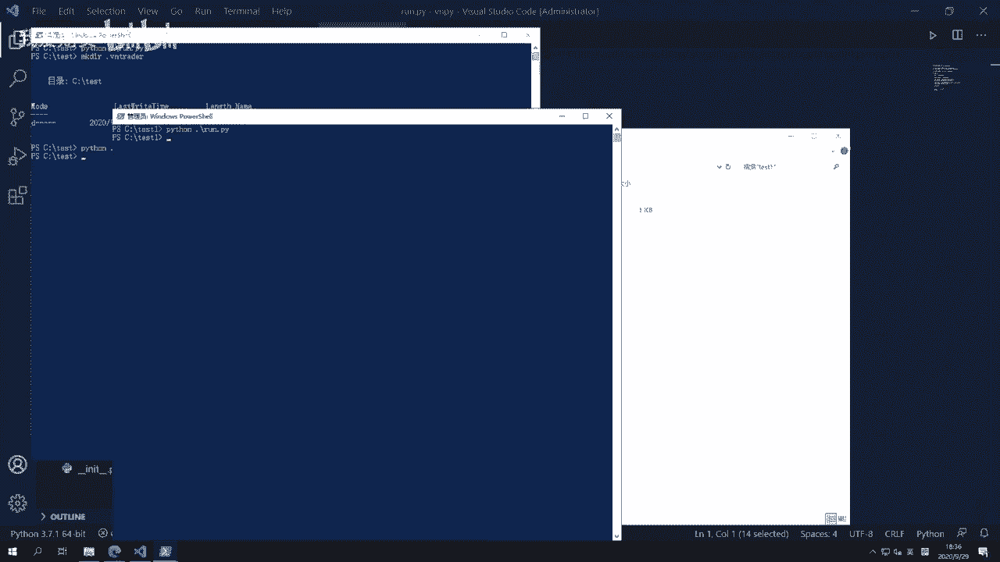

## 路径管理函数


有了运行时目录和临时文件目录的基础，VN.PY围绕它们提供了一系列便捷的路径管理函数。以下是四个核心函数及其作用：

*   **`get_file_path`**：获取临时文件目录中某个文件的完整路径。
    ```python
    file_path = get_file_path("config.json")
    ```
*   **`get_folder_path`**：获取临时文件目录中某个子文件夹的路径。如果该文件夹不存在，函数会自动创建它。
    ```python
    folder_path = get_folder_path("log")
    ```
*   **`get_icon_path`**：获取UI界面中图标文件的路径（通常用于应用模块内部）。
*   **`save_json`**：将字典数据保存为JSON文件到临时文件目录。
    ```python
    data = {"key": "value"}
    save_json("settings.json", data)
    ```
*   **`load_json`**：从临时文件目录加载JSON文件并返回字典数据。如果文件不存在，则会自动创建一个空的JSON文件并返回空字典。
    ```python
    config = load_json("settings.json")
    ```

其中，`save_json`和`load_json`函数内部使用了Python标准库的`json`模块，并确保了文件编码（UTF-8）和非ASCII字符（如中文）的正确处理。

## 总结

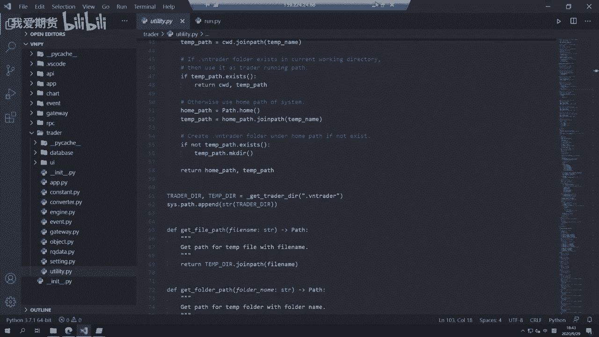

本节课中，我们一起学习了VN.PY框架如何管理配置存储。我们首先理解了运行时目录和临时文件目录的确定机制，它依赖于一个名为`.vntrader`的标记文件夹。接着，我们探讨了VN.PY基于这些目录提供的几个核心工具函数，特别是用于JSON配置读写`save_json`和`load_json`函数，它们将路径管理与数据序列化完美结合，为上层应用提供了简单可靠的配置存储方案。整个机制代码精炼，是模块化设计的一个良好范例。