# Python基础：3：函数和模块 🐍

在本节课中，我们将要学习Python中两个核心概念：**函数**和**模块**。函数能帮助我们组织代码，实现复用；模块则让我们能够利用他人编写好的强大功能。掌握它们，是编写高效、清晰Python代码的关键。

## 函数的概念与语法

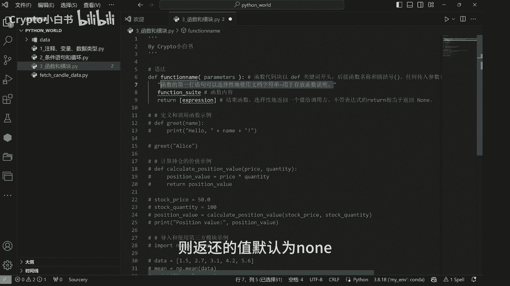

上一节我们介绍了代码的基本结构，本节中我们来看看如何将代码块封装成可重复使用的单元。

函数是一段可重复使用的代码块，用于执行特定的任务。通过使用函数，我们可以将复杂的问题分解为更小的部分，并通过调用函数来实现代码的重复利用。

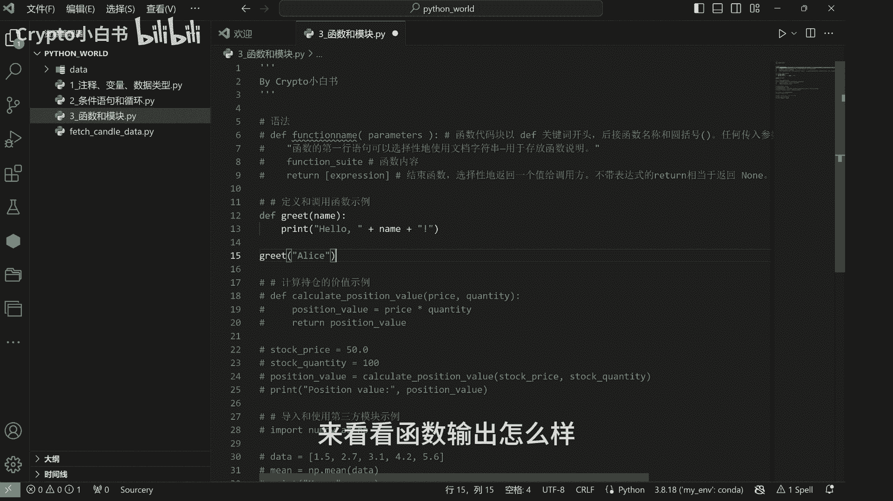

在Python中，函数代码以 `def` 关键词开头，后面接上函数的名称和一个圆括号。圆括号中放入传入的参数和自定义的变量后，接一个冒号，然后是缩进的代码块，也就是函数内容。另外，我们可以在函数的第一行，选择性地使用文档字符串用于存放函数说明。`return` 用来结束函数，并且可以选择性地返回一个值给调用方。如果不带有 `return`，则返还的值默认为 `None`。

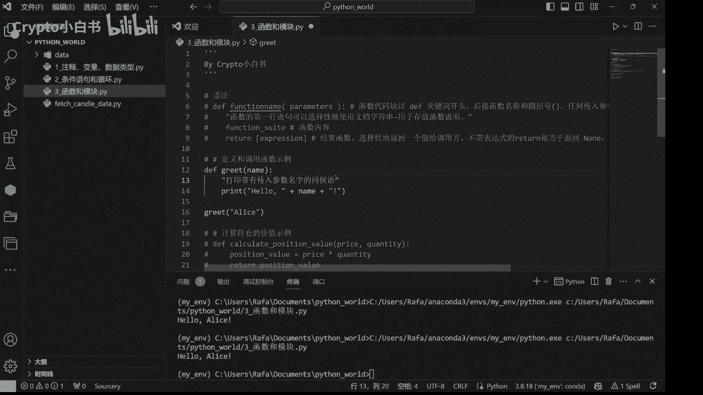

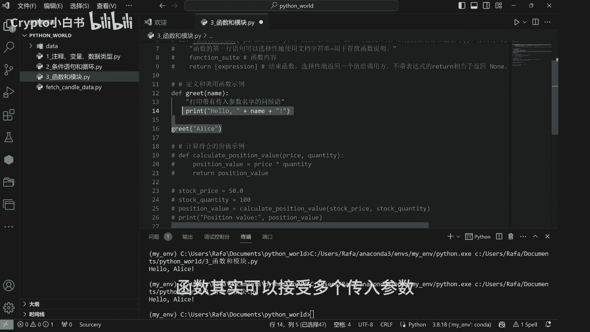

其基本语法结构如下：
```python
def 函数名(参数1, 参数2, ...):
    """函数的文档字符串（可选）"""
    # 函数体代码块
    return 返回值 # 可选
```

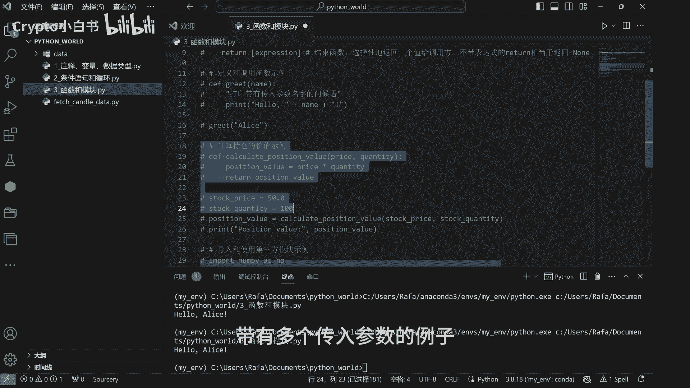

## 定义与调用函数

理解了函数的基本语法后，让我们通过一个简单的例子来学习如何定义和调用函数。

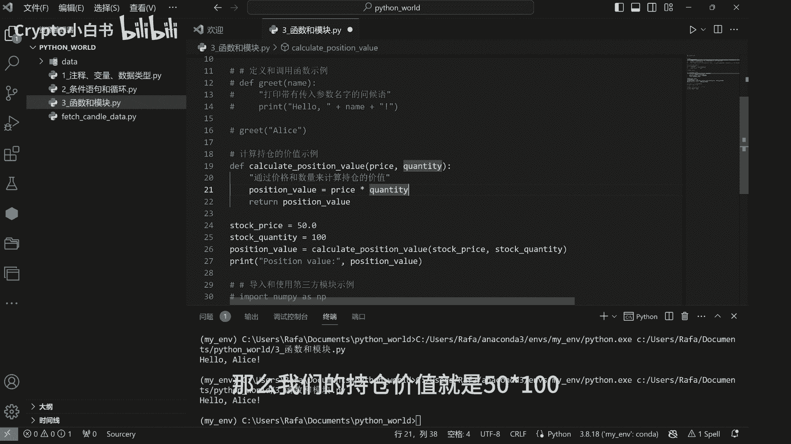

以下是一个定义名为 `greet` 的函数的例子。该函数接受一个参数 `name`，并打印出带有该名字的问候语。
```python
def greet(name):
    print("Hello, " + name + "!")
```
现在，我们调用一下 `greet` 函数，并传入一个参数 `"Alice"`。
```python
greet("Alice")
```
运行这段代码，函数会打印出带有传入参数名字的问候语：“Hello, Alice!”。

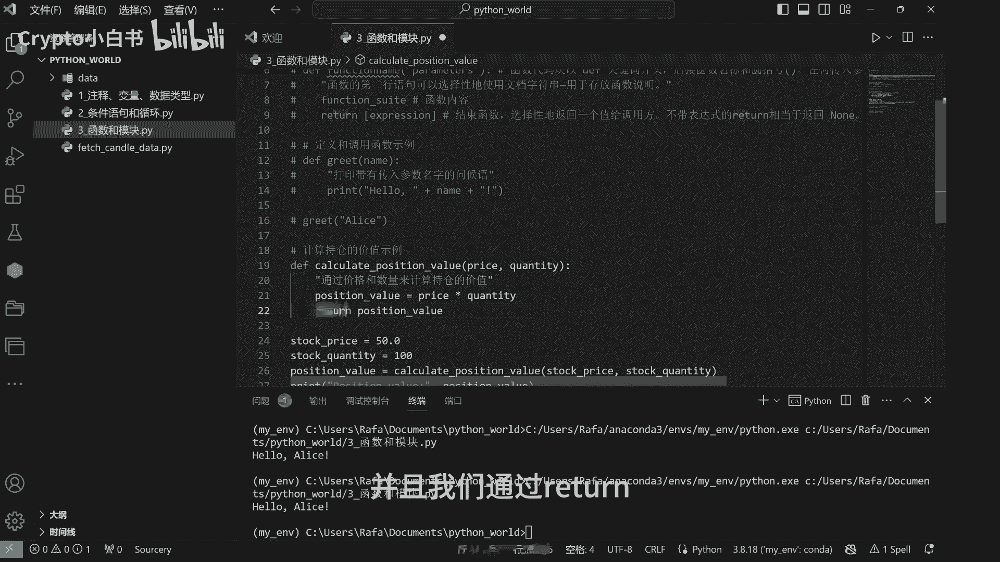

## 使用多个参数

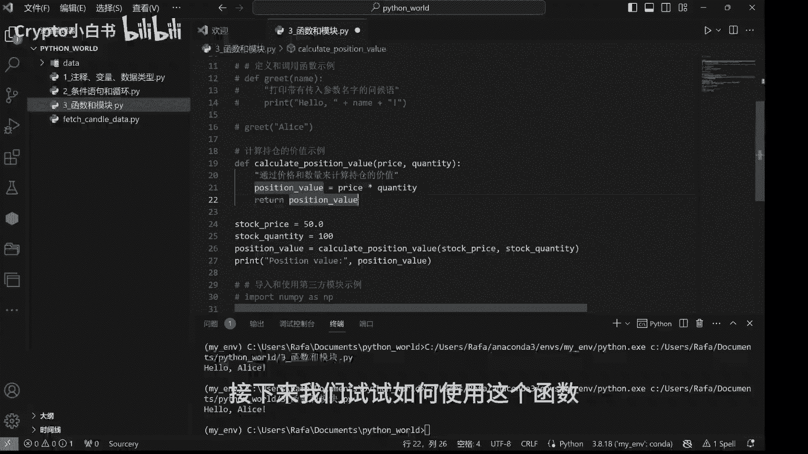

函数可以接受多个传入参数，这使得函数的功能更加强大和灵活。

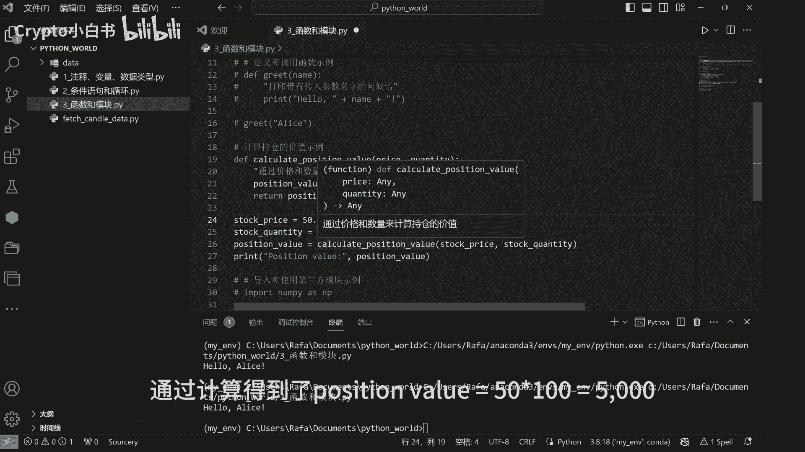

我们再来看一个带有多个传入参数的例子。这个例子定义了一个名为 `calculate_position_value` 的函数，它接受两个参数：`price` 和 `quantity`。函数的作用是计算持仓的价值。
```python
def calculate_position_value(price, quantity):
    """通过价格和数量来计算持仓的价值。"""
    position_value = price * quantity
    return position_value
```
函数的主体代码块通过 `price` 乘以 `quantity` 来计算 `position_value`（持仓的价值）。例如，如果一张数字货币期货的价格为50美元，我们持有100张，那么持仓价值就是 `50 * 100 = 5000`。函数通过 `return` 语句将这个值返还给调用方。

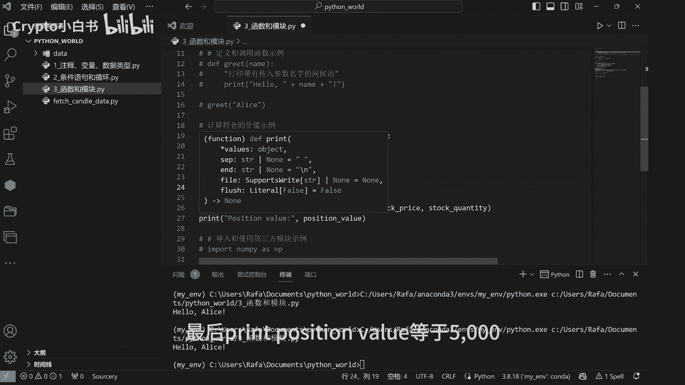

接下来我们试试如何使用这个函数。
```python
stock_price = 50
stock_quantity = 100
position_value = calculate_position_value(stock_price, stock_quantity)
print("Position value is:", position_value)
```
首先我们定义了传入的参数值，然后调用函数并将结果赋值给 `position_value` 变量，最后打印出来。运行后，输出结果为：“Position value is: 5000”。

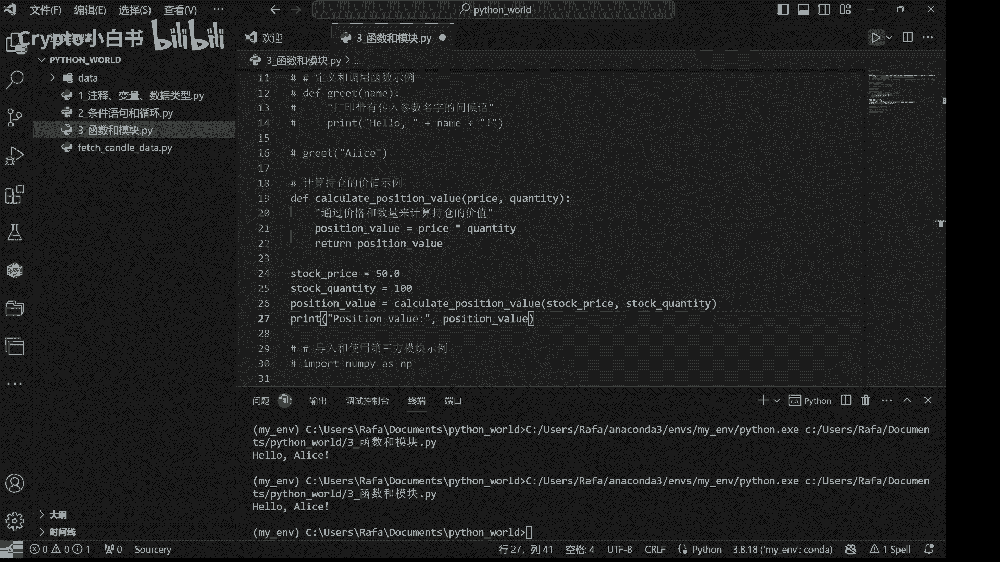

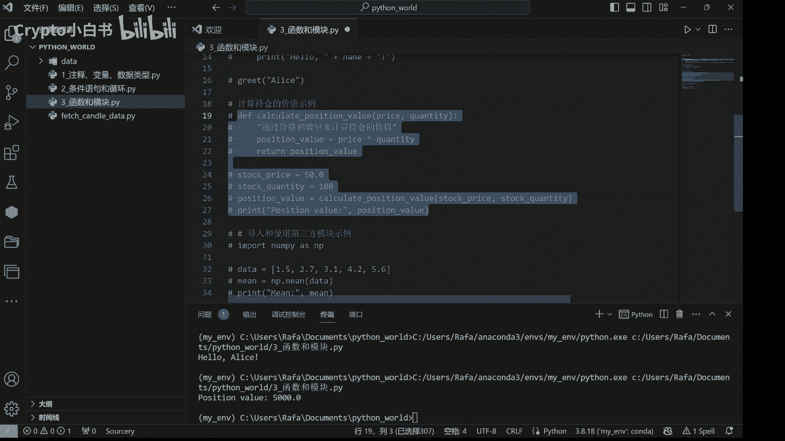

## 导入与使用第三方模块

学会了如何创建自己的函数后，本节中我们来看看如何利用他人编写好的、功能更强大的代码集合——模块。

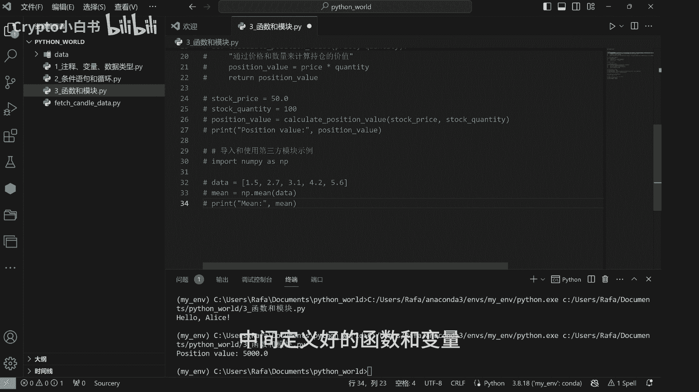

第三方模块可以简单理解为是别人写好的函数，我们可以直接拿来用。严谨来说，模块是包含一组函数、类和变量的文件，用于组织和重用代码。Python提供了非常多的内置模块，同时我们也可以自己编写模块。通过导入这些模块，我们可以直接使用其中定义好的函数和变量，方便我们进行编程。

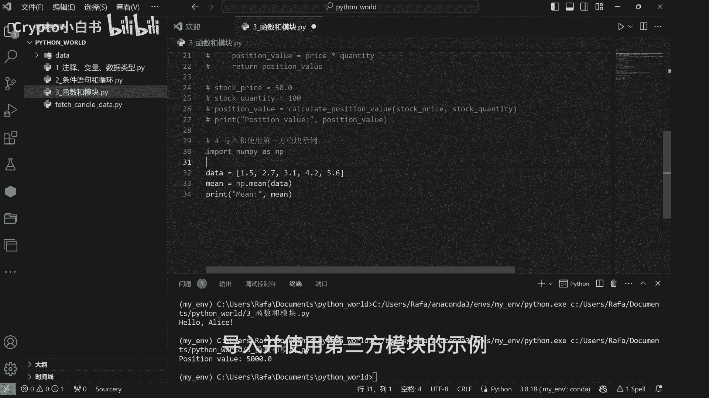

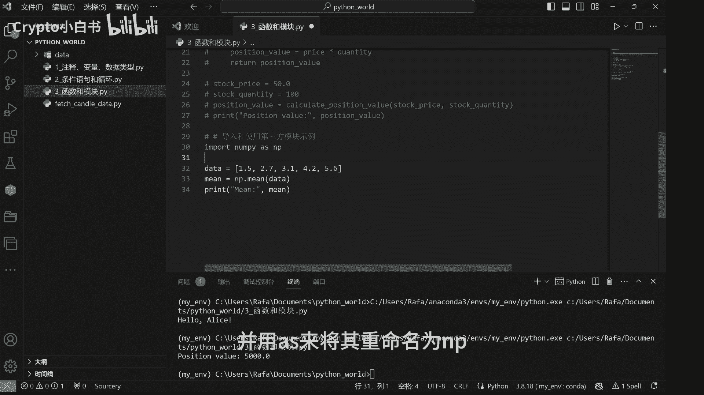

让我们来看一个导入并使用第三方模块的示例。我们通过 `import` 关键词导入名为 `numpy` 的第三方模块，并用 `as` 将其重命名为 `np`。
```python
import numpy as np
```
这样在后续的使用中，我们可以使用简写 `np` 来调用 `numpy` 模块中的功能。我们通过 `np.mean()` 函数来计算一组数据的算术平均值。
```python
data = [1, 2, 3, 4, 5]
mean_value = np.mean(data)
print("The mean is:", mean_value)
```
我们定义了一个包含五个数据的列表 `data`，将其作为参数传入 `np.mean()` 函数。函数计算结果后返还给 `mean_value` 变量，我们再将其打印出来。运行这段代码，会输出数据的平均值：“The mean is: 3.0”。

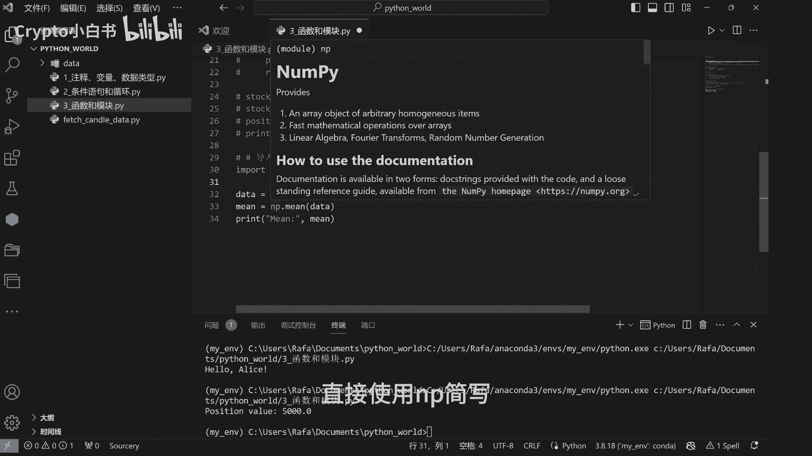

## 总结

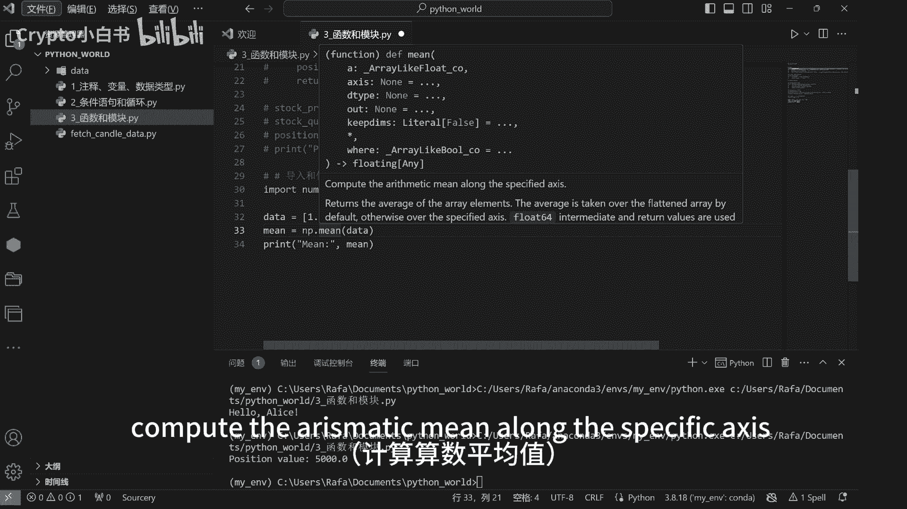

本节课中我们一起学习了Python中函数和模块的核心知识。

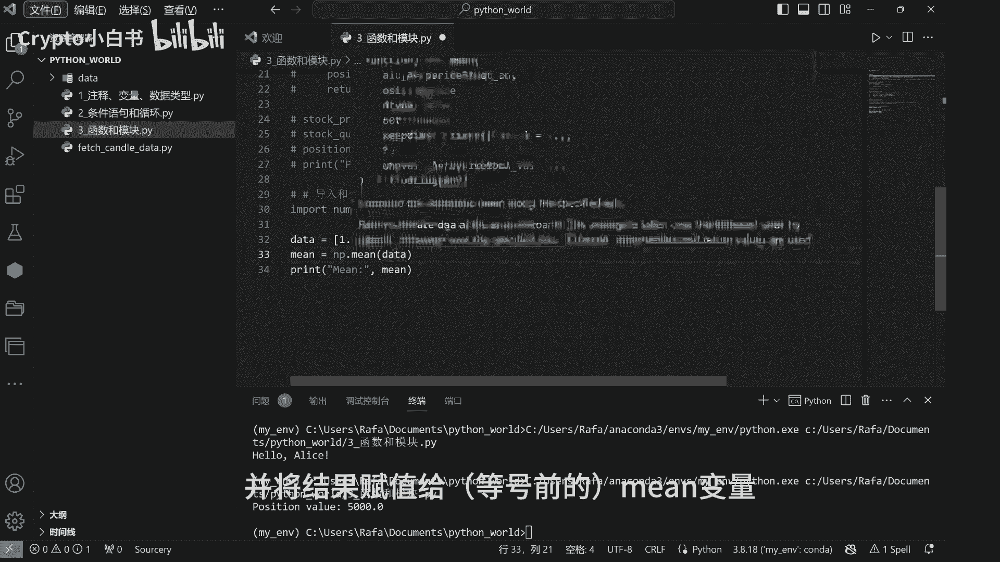

我们首先了解了**函数**的概念和基本语法，学会了如何定义和调用一个函数，包括如何处理单个和多个参数，以及如何使用 `return` 语句返回值。接着，我们探索了**模块**的用途，学习了如何通过 `import` 语句导入第三方模块（如 `numpy`），并调用其中现成的函数来完成特定任务（如计算平均值）。

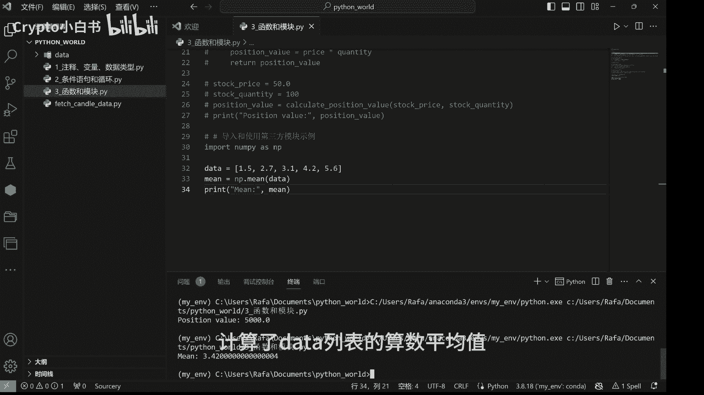

掌握函数和模块，是构建复杂、可维护Python程序的基础。通过将代码模块化，我们不仅能提高开发效率，还能让代码结构更加清晰。