# Python金融分析与量化交易实战教程：P33：因子选股策略实战 - 股票数据获取

## 📋 概述
在本节课程中，我们将学习如何为因子选股策略获取和准备股票数据。我们将从获取所有股票列表开始，然后进行必要的筛选和初始化设置，为后续的因子预处理和策略构建打下基础。

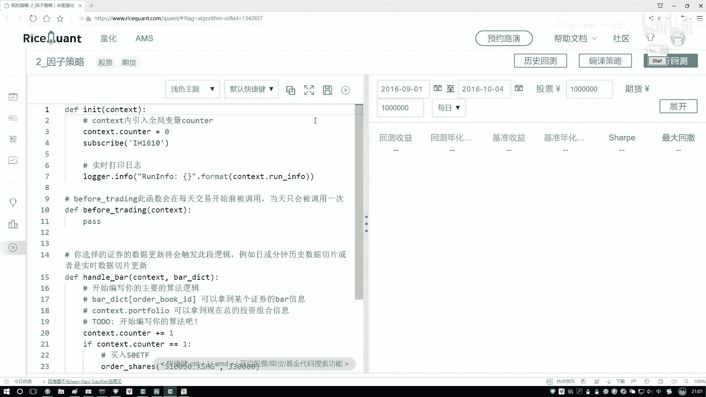

## 🚀 初始化与数据获取

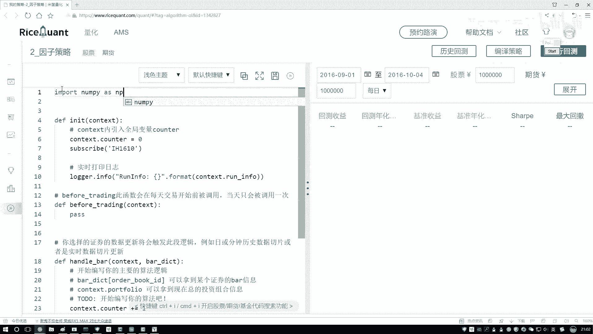

上一节我们介绍了因子选股策略的基本概念，本节中我们来看看如何获取并初始化股票数据。

首先，我们需要导入必要的Python工具包。以下是构建策略所需的核心库。

```python
import numpy as np
import pandas as pd
from statsmodels.api import OLS
```

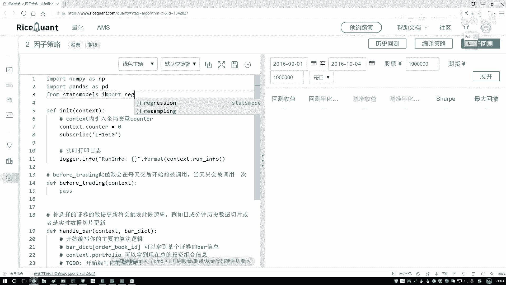

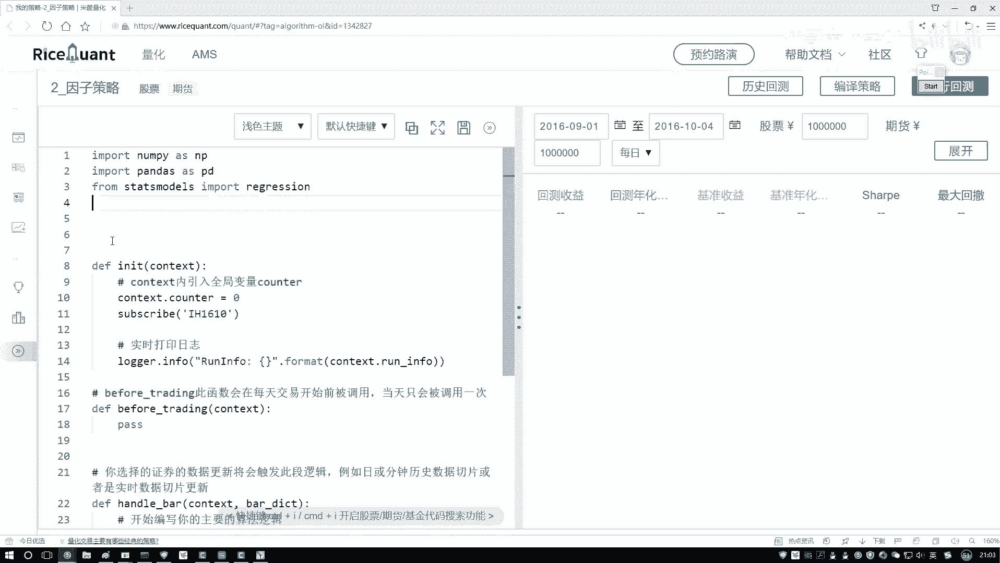

接下来，我们开始构建策略的初始化模块。在这个模块中，我们需要设定策略的运行周期，例如按月调仓，并定义数据获取的逻辑。

在构造函数中，我们需要设置一个定时器来指定调仓频率。按月调仓是一个常见的选择。

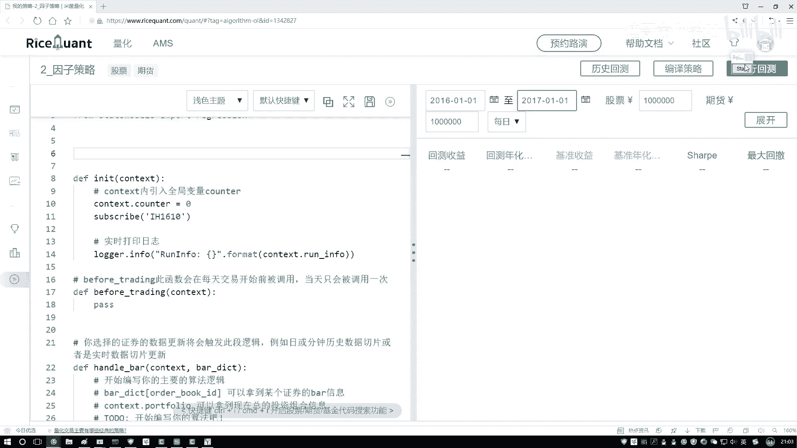

```python
# 示例：设置按月调仓的定时器
self.schedule_timer(func=self.rebalance, frequency=‘monthly’)
```

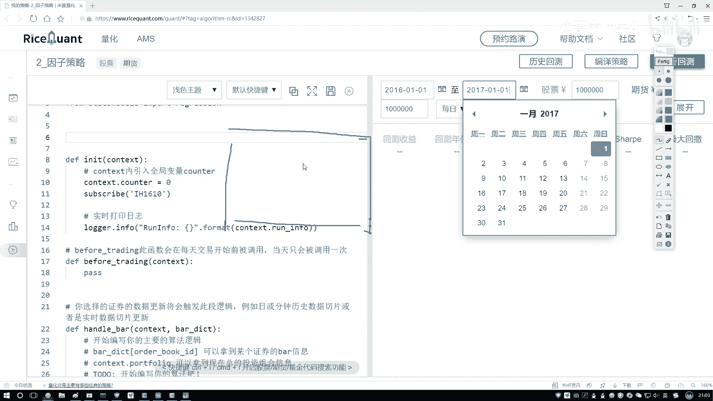

这里的 `rebalance` 函数是我们即将定义的核心函数，它负责在每个调仓日执行选股操作。

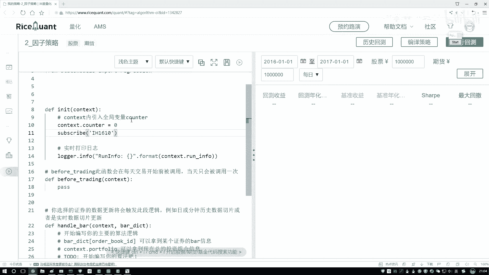

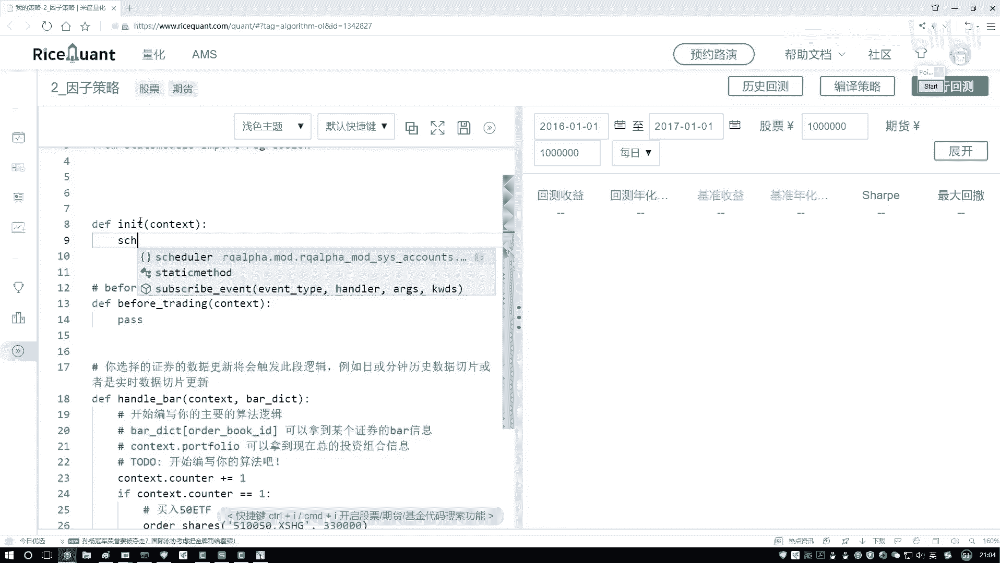

## 📈 获取股票池数据

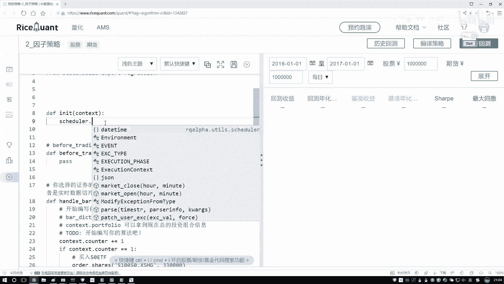

初始化设置完成后，下一步是获取可供选择的股票数据。我们需要一个包含所有候选股票的“股票池”。

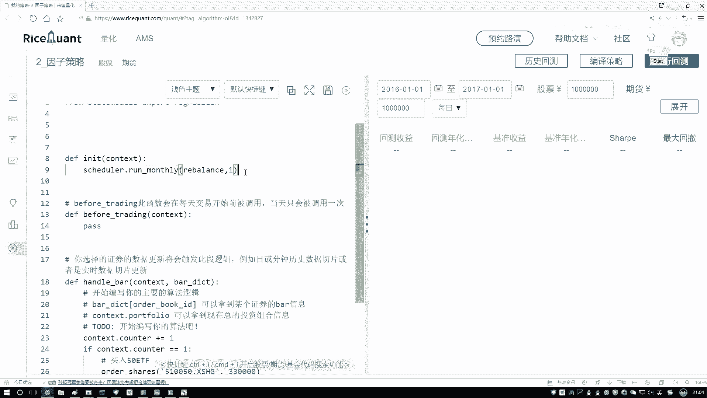

我们将使用API来获取某个市场（例如中国A股市场）的所有股票信息。对应的参数 `type` 通常设置为 `‘cs’` 来代表股票。

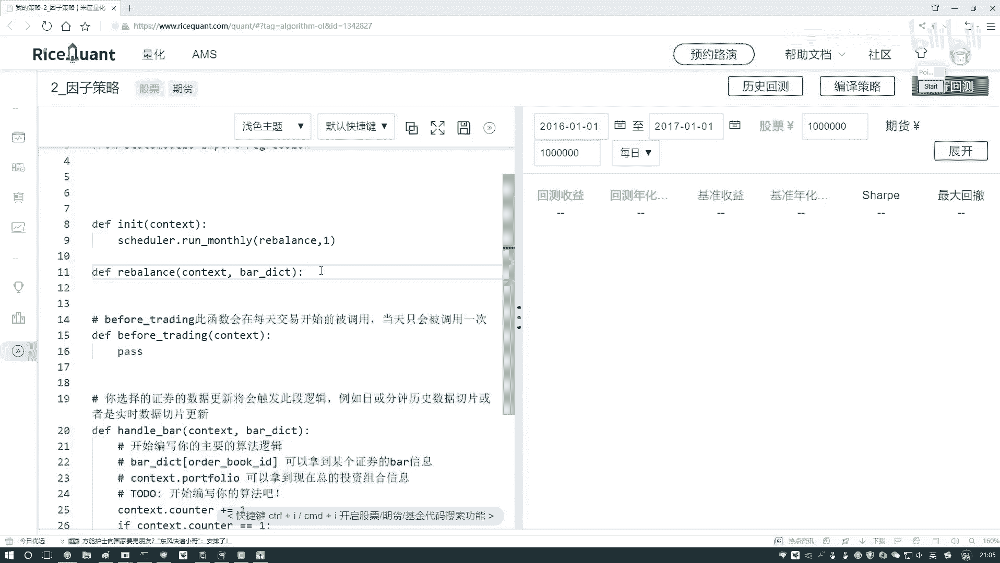

```python
# 获取所有股票数据
all_stocks = get_all_securities(types=[‘cs’])
```

执行上述代码后，`all_stocks` 变量将包含市场上所有股票的基本信息。

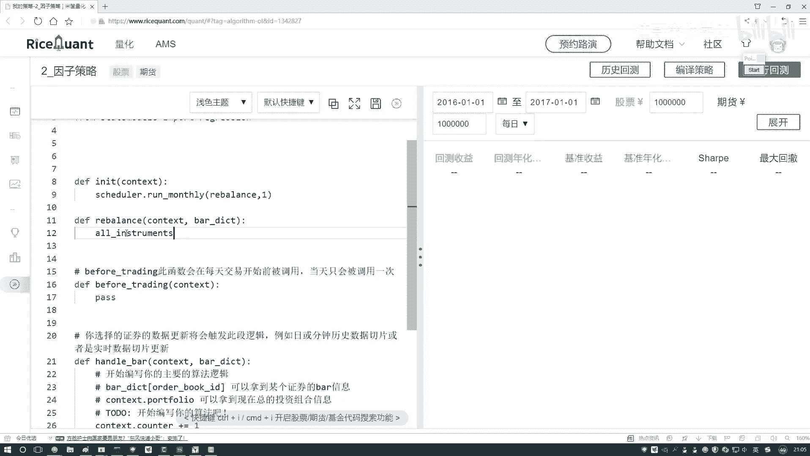

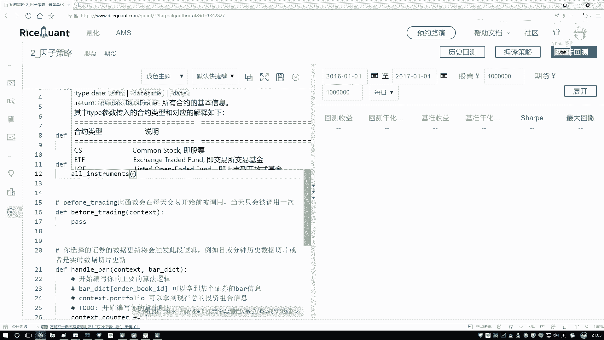

## 🎯 股票数据筛选

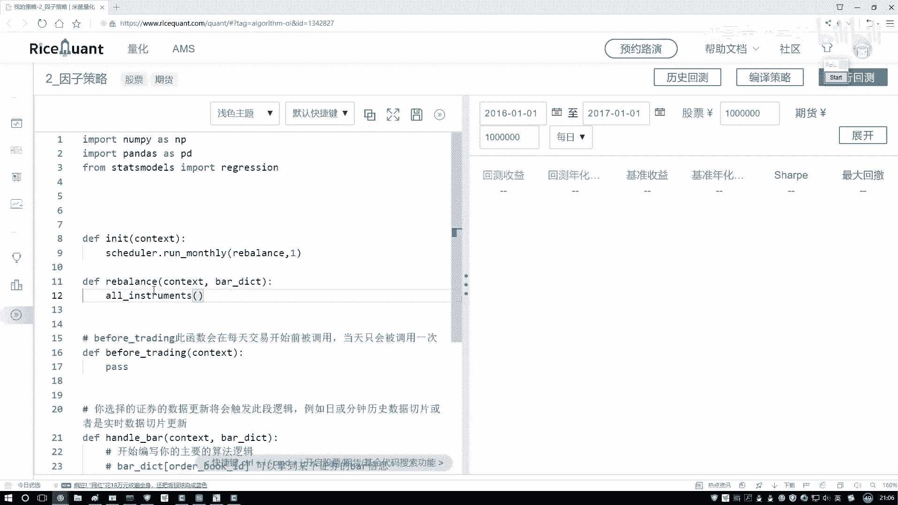

然而，我们通常不会使用市场上所有的股票。在实际策略中，需要对初始股票池进行筛选，剔除不符合条件的股票（例如ST股、次新股或流动性不足的股票），以构建一个更高质量的基础股票池。

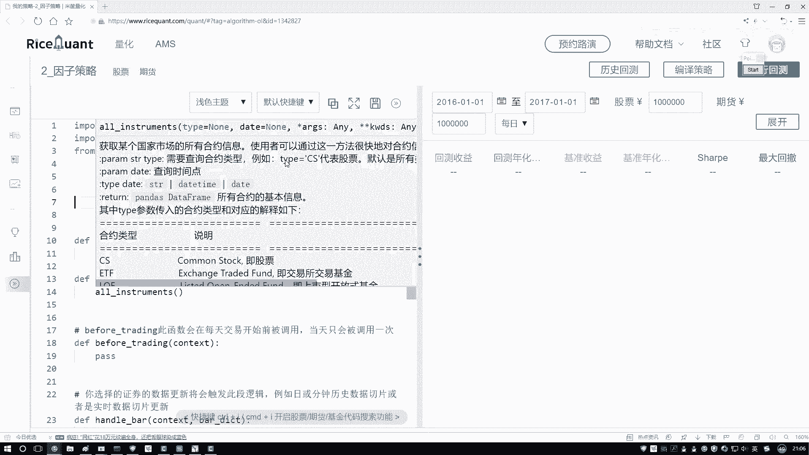

因此，在获取全量股票列表后，我们还需要编写过滤逻辑。这些逻辑可以基于市值、上市时间、交易状态等因子。

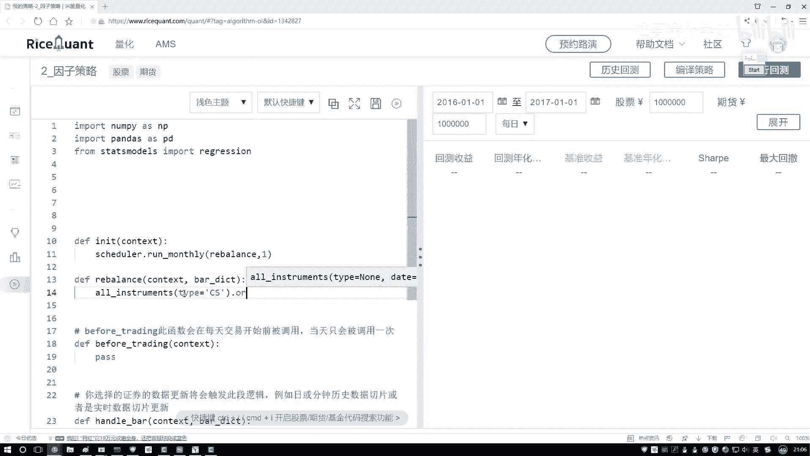

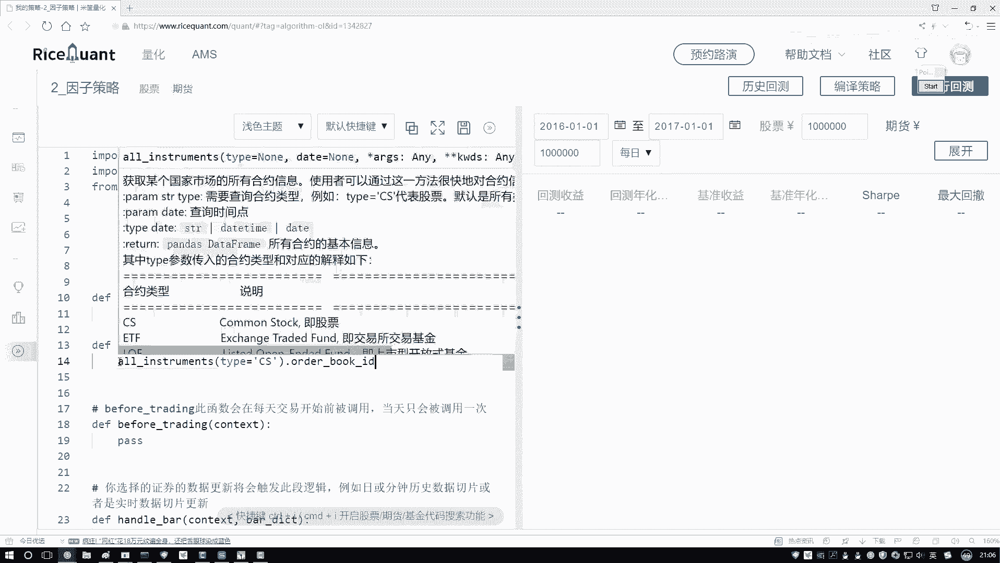

```python
# 对股票ID列表进行筛选，例如过滤掉ST股票
filtered_stock_list = filter_stocks(all_stocks)
```

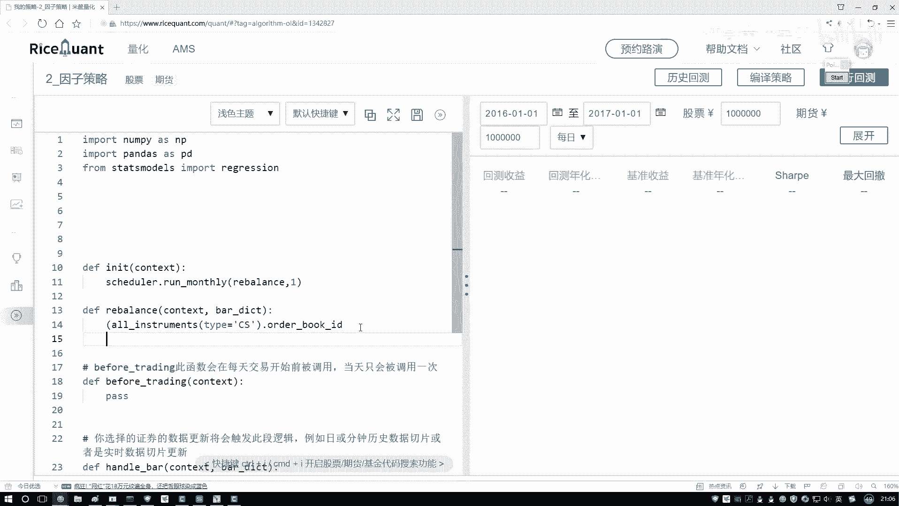

本节课中我们一起学习了因子选股策略实战的第一步：**股票数据获取与初始化**。我们完成了环境配置，设置了策略的调仓频率，并通过API获取了全市场的股票列表，为后续的因子计算和选股操作准备好了数据基础。下一节，我们将在此股票池的基础上，进行因子的预处理工作。