# Python量化交易：3.3.2：时间序列分析 📈

在本节课程中，我们将学习如何使用Python进行时间序列分析，并以微软（MSFT）的股票数据为例，演示如何读取、可视化数据，并进行简单的收益计算。我们将使用`yfinance`、`pandas`和`matplotlib`等库来完成这些任务。

## 数据读取与初步探索

首先，我们需要读取股票数据。我们选择微软（MSFT）的股票作为分析对象。以下是读取数据并查看其结构的步骤。

```python
import yfinance as yf
import pandas as pd
import matplotlib.pyplot as plt

# 读取微软股票数据
msft = yf.Ticker("MSFT")
hist = msft.history(period="max")
print(hist.head())
```

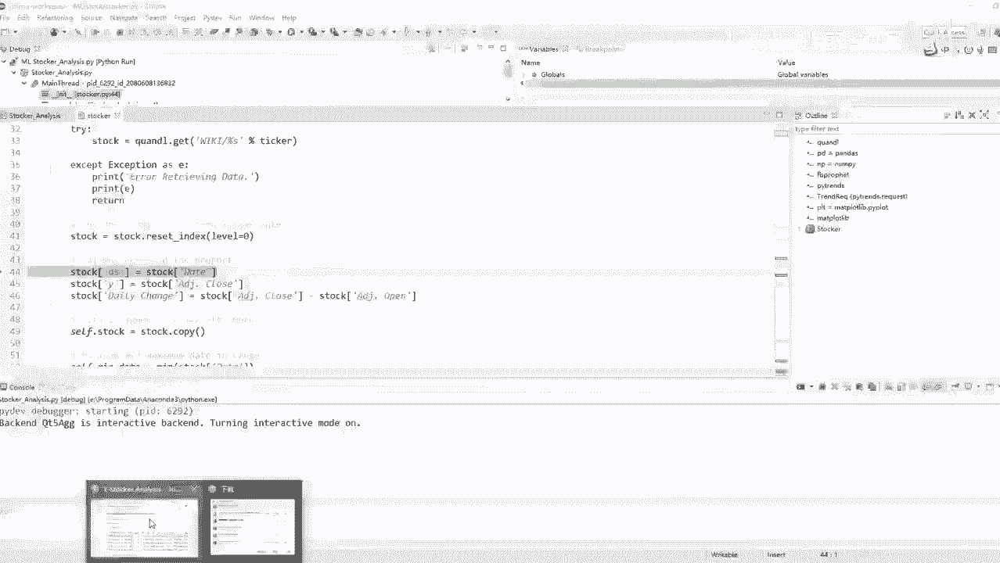

执行上述代码后，我们将获得一个包含日期、开盘价、最高价、最低价、收盘价、交易量等指标的`DataFrame`。我们主要关注的是`Close`（收盘价）这一列，它将作为我们预测的目标变量。

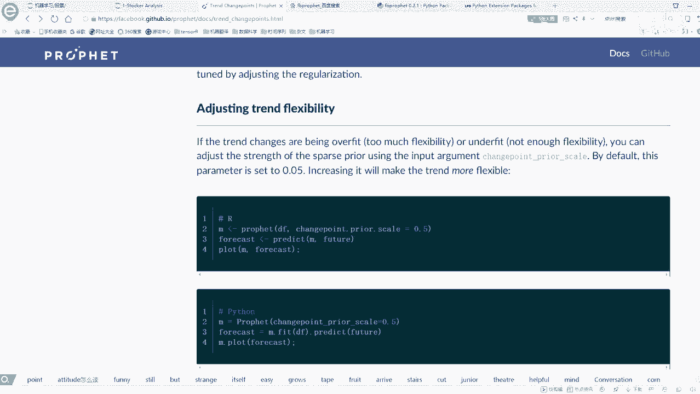

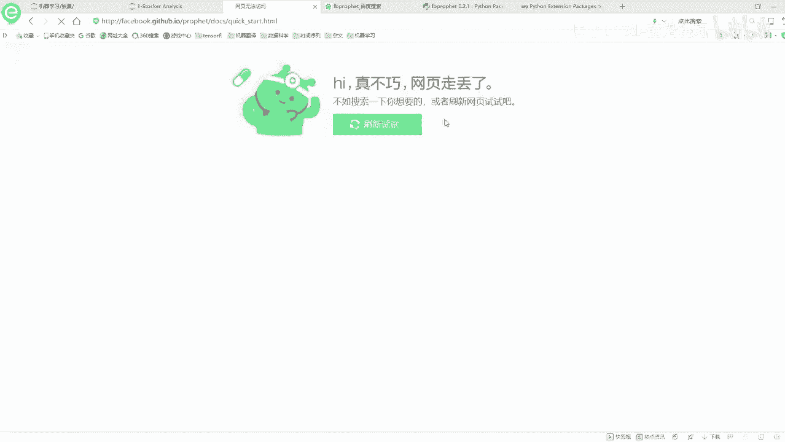

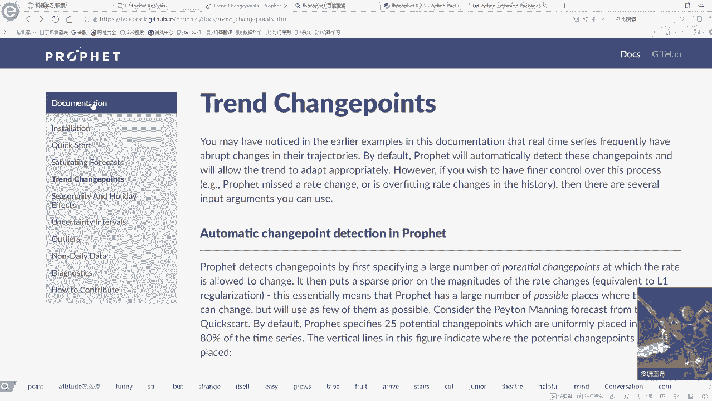

## 数据预处理与关键指标提取

在获得原始数据后，我们需要进行一些预处理，并提取关键的时间序列指标，如起始日期、结束日期、最高/最低价格及其发生日期。

以下是数据预处理和指标提取的关键步骤：

```python
# 重置索引，将日期列变为普通列
df = hist.reset_index()

# 指定时间序列的日期（X）和目标变量（Y）
df['ds'] = df['Date']
df['y'] = df['Close']

# 计算每日价格变化
df['daily_change'] = df['Close'] - df['Open']

# 提取关键时间点
start_date = df['ds'].min()
end_date = df['ds'].max()
max_price = df['y'].max()
min_price = df['y'].min()
max_price_date = df.loc[df['y'].idxmax(), 'ds']
min_price_date = df.loc[df['y'].idxmin(), 'ds']

print(f"数据时间范围: {start_date} 至 {end_date}")
print(f"最高价: {max_price} (日期: {max_price_date})")
print(f"最低价: {min_price} (日期: {min_price_date})")
```

## 时间序列可视化

上一节我们介绍了如何提取关键指标，本节中我们来看看如何将时间序列数据可视化。可视化能帮助我们直观地理解数据的趋势和波动。

我们首先绘制微软股票从1986年至今的收盘价走势图。

```python
def plot_stock_data(data, start_date=None, end_date=None, columns=['Close']):
    """
    绘制股票数据指定列的时间序列图。
    :param data: 包含股票数据的DataFrame
    :param start_date: 起始日期（字符串或datetime）
    :param end_date: 结束日期（字符串或datetime）
    :param columns: 需要绘制的列名列表
    """
    # 筛选指定日期范围的数据
    if start_date is not None:
        data = data[data['ds'] >= pd.to_datetime(start_date)]
    if end_date is not None:
        data = data[data['ds'] <= pd.to_datetime(end_date)]

    plt.figure(figsize=(12, 6))
    colors = ['red', 'blue', 'green', 'orange', 'purple']
    for idx, col in enumerate(columns):
        plt.plot(data['ds'], data[col], color=colors[idx % len(colors)], linewidth=2, label=col, alpha=0.8)

    plt.xlabel('Date')
    plt.ylabel('Price (USD)')
    plt.title('Microsoft Stock Price Over Time')
    plt.legend()
    plt.grid(True)
    plt.show()

# 绘制收盘价走势
plot_stock_data(df, columns=['Close'])
```

从图中可以看出，微软股价整体呈上升趋势，但在某些时期（如2000年左右）存在明显的下跌，这反映了市场的波动性。

## 多指标对比分析

除了收盘价，我们还可以同时分析多个指标，例如每日价格变动（`daily_change`）和交易量（`Volume`），以获取更全面的市场洞察。

以下是绘制两个指标对比图的示例：

```python
# 绘制每日价格变动和交易量
plot_stock_data(df, start_date='2016-01-01', end_date='2018-01-24', columns=['daily_change', 'Volume'])
```

在此图表中，蓝色线条代表交易量，红色线条代表每日价格变动。我们可以观察到在某些交易日（例如2016年中旬），交易量突然激增，这可能与特定市场事件相关。

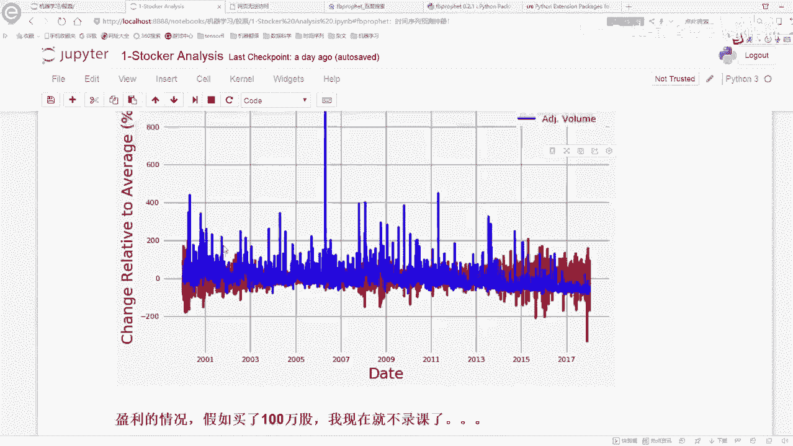

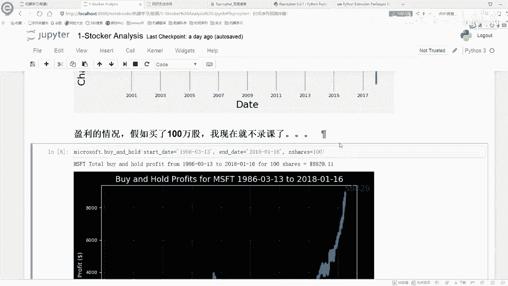

## 模拟投资收益计算

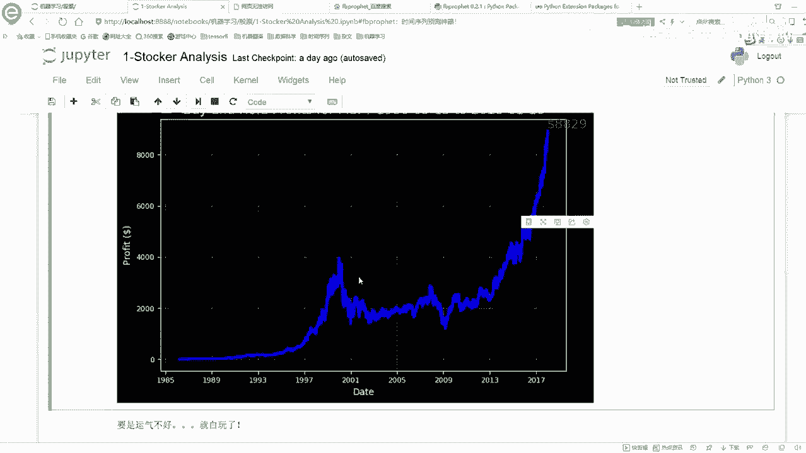

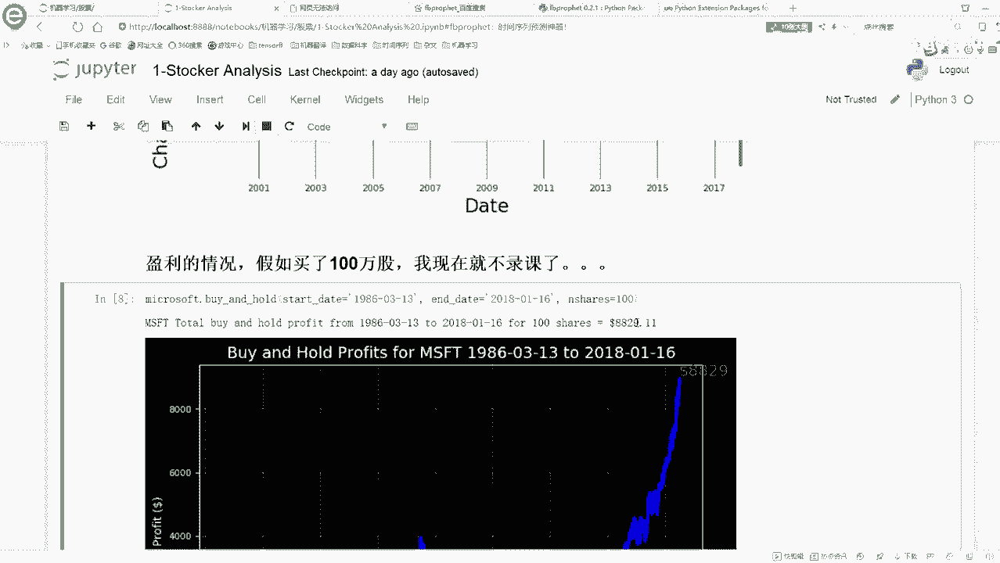

在分析了历史趋势后，我们可以进行一个简单的模拟：如果我们在某个时间点买入股票，并在另一个时间点卖出，我们的收益会是多少？这有助于理解长期投资与短期投资的风险和回报。

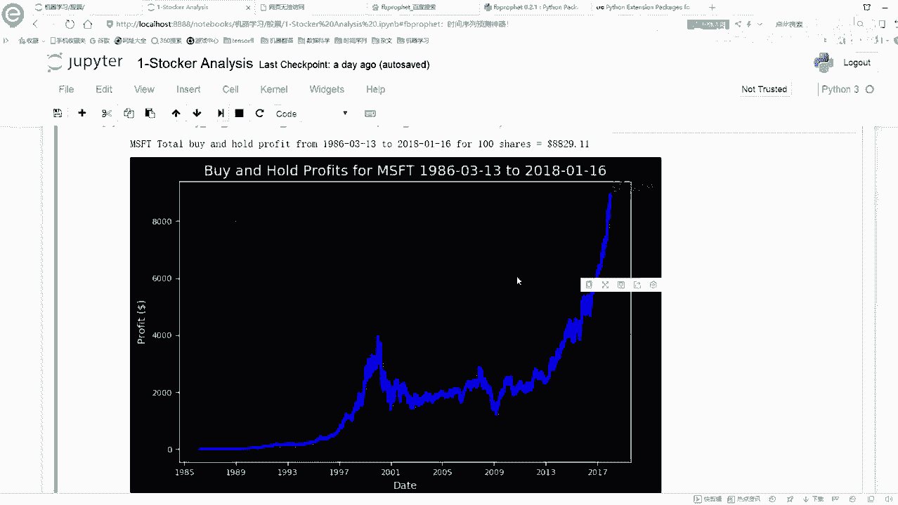

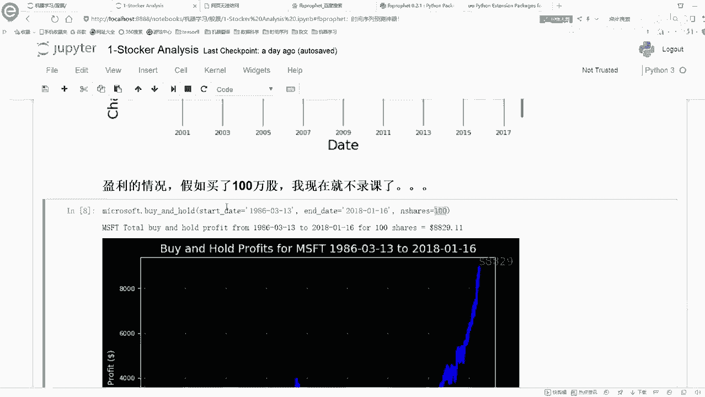

以下是一个计算并可视化模拟收益的函数：

```python
def calculate_profit(data, start_date, end_date, shares=100):
    """
    计算在指定日期买入和卖出股票的收益。
    :param data: 包含股票数据的DataFrame
    :param start_date: 买入日期
    :param end_date: 卖出日期
    :param shares: 购买的股数
    :return: 总收益
    """
    buy_price = data.loc[data['ds'] == pd.to_datetime(start_date), 'Close'].values[0]
    sell_price = data.loc[data['ds'] == pd.to_datetime(end_date), 'Close'].values[0]

    profit_per_share = sell_price - buy_price
    total_profit = profit_per_share * shares

    # 可视化
    plt.figure(figsize=(10, 5))
    plt.plot(data['ds'], data['Close'], color='gray', alpha=0.5, label='Stock Price')
    plt.axvline(pd.to_datetime(start_date), color='green', linestyle='--', label=f'Buy: {start_date}')
    plt.axvline(pd.to_datetime(end_date), color='red', linestyle='--', label=f'Sell: {end_date}')
    plt.fill_between(data['ds'], buy_price, data['Close'], where=(data['ds'] >= pd.to_datetime(start_date)) & (data['ds'] <= pd.to_datetime(end_date)), color='yellow', alpha=0.3, label='Profit/Loss Area')
    plt.xlabel('Date')
    plt.ylabel('Price (USD)')
    plt.title(f'Simulated Investment Profit/Loss\nTotal Profit: ${total_profit:.2f} for {shares} shares')
    plt.legend()
    plt.grid(True)
    plt.show()

    return total_profit

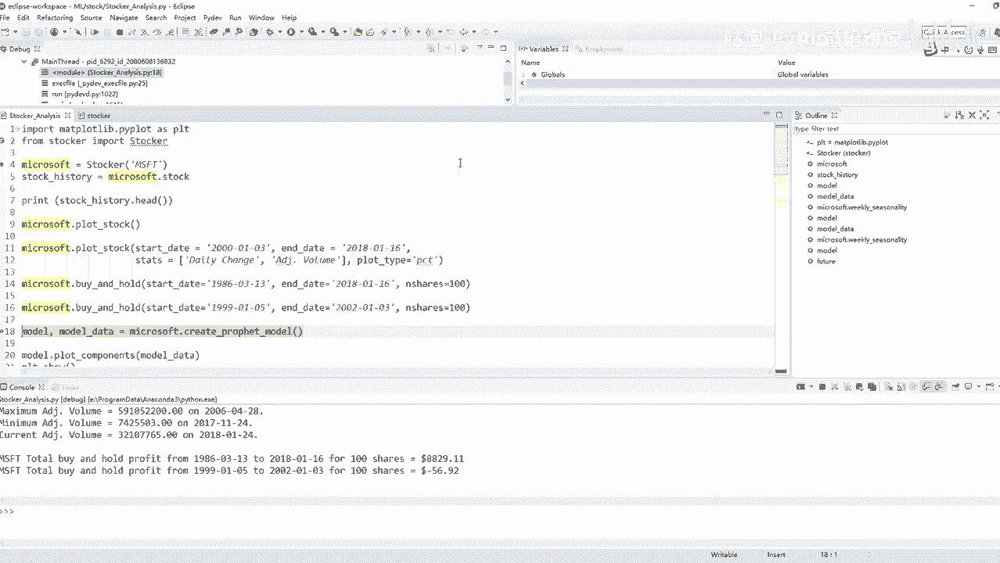

# 示例：计算从1986-03-13买入，2018-01-24卖出的收益
profit = calculate_profit(df, start_date='1986-03-13', end_date='2018-01-24', shares=100)
print(f"总收益: ${profit:.2f}")
```

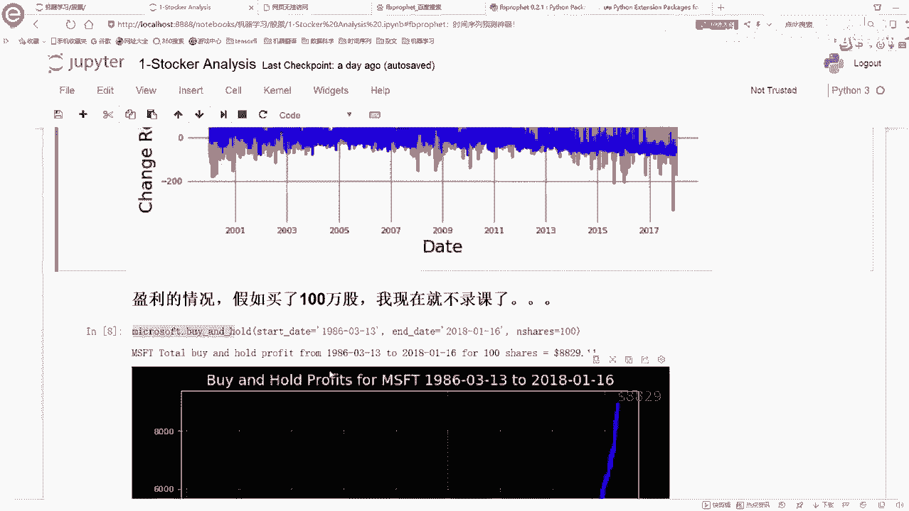

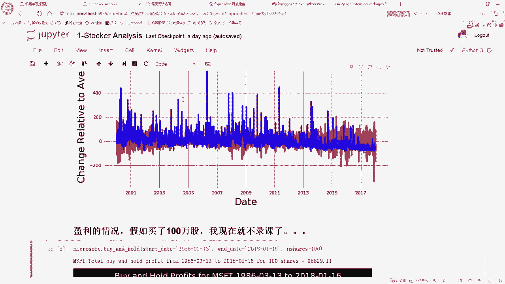

通过调整`start_date`和`end_date`，我们可以模拟不同投资区间的收益情况。例如，如果在1999年高点买入，2002年低点卖出，则可能面临亏损。

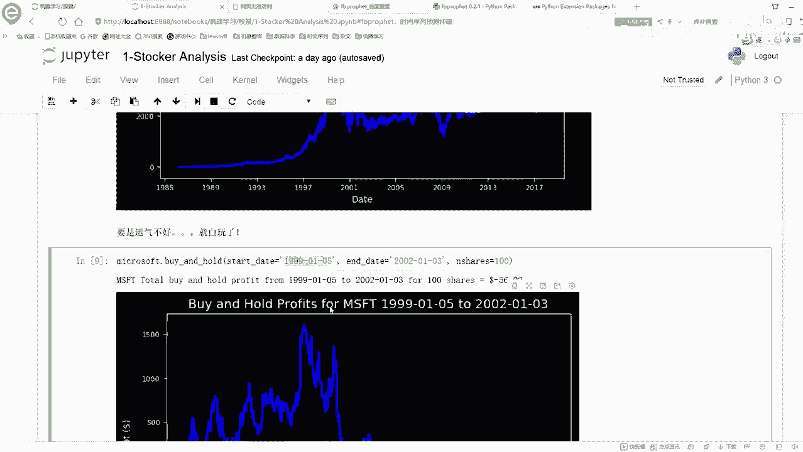

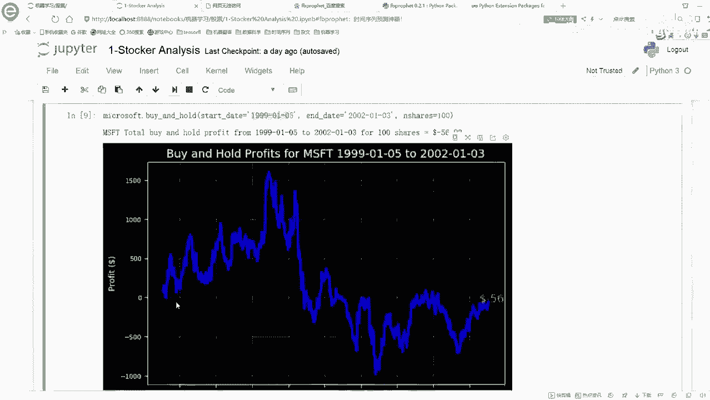

## 总结

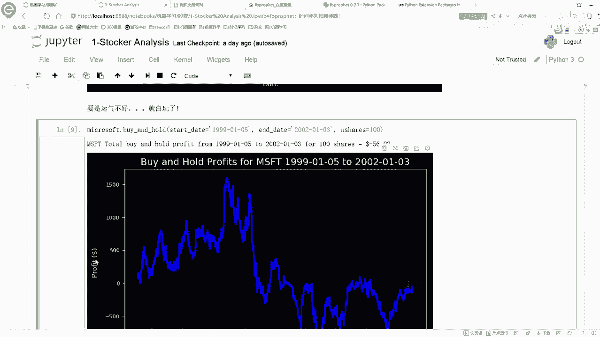

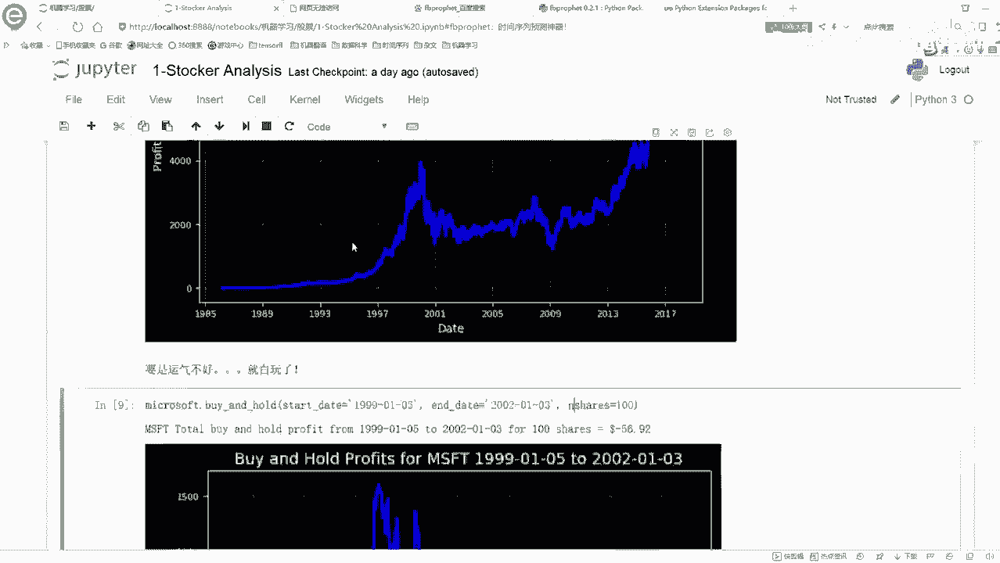

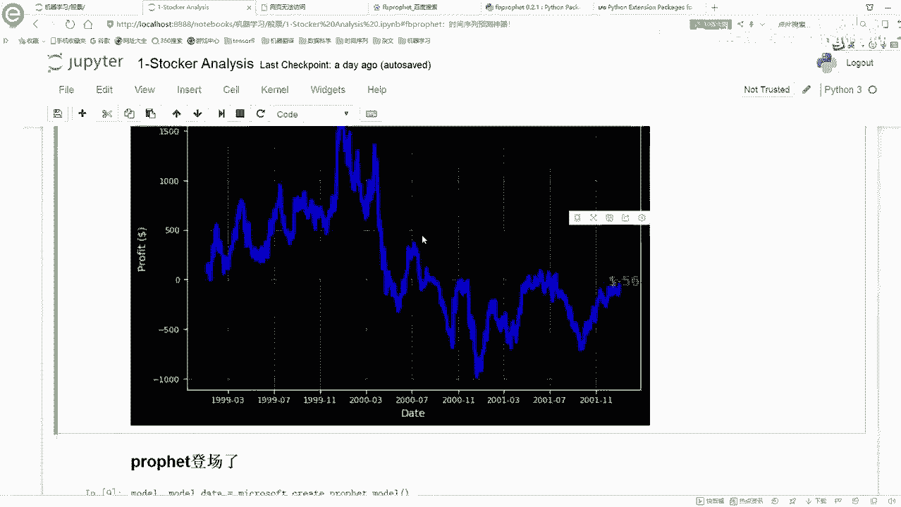

本节课中我们一起学习了时间序列分析的基础操作。我们首先使用`yfinance`库读取了微软的股票数据，并进行了数据预处理和关键指标提取。接着，我们使用`matplotlib`将收盘价走势可视化，并对比分析了多个指标（如价格变动和交易量）。最后，我们模拟了在不同时间点买入和卖出股票的收益情况，直观地展示了投资的时间选择对回报的影响。

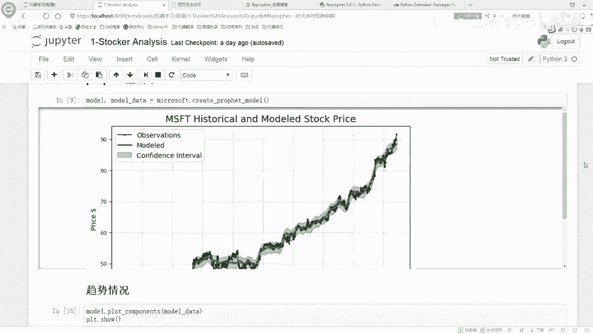

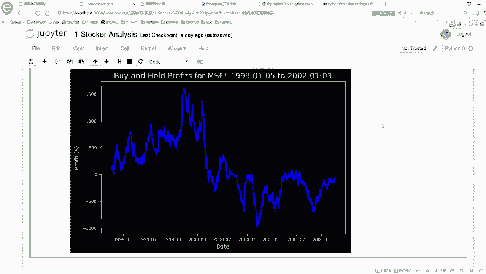

这些技能是进行更复杂量化交易分析的基础。在后续课程中，我们将基于这些时间序列数据，构建预测模型来尝试预测未来的股价走势。