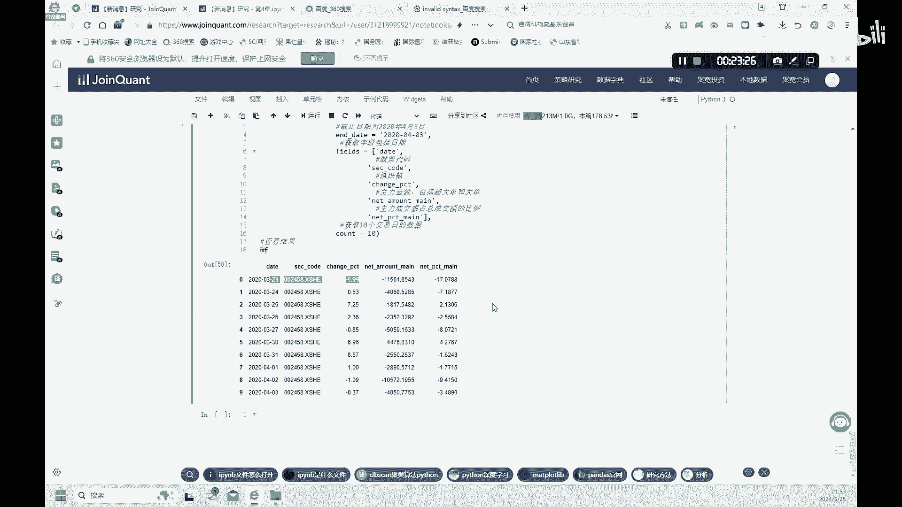

# 金融科技：4.1：聚宽交易平台入门指南 🚀


在本节课中，我们将学习如何使用聚宽（JoinQuant）这一Python量化交易平台。我们将从注册平台开始，逐步介绍如何获取股票数据、财务数据，并利用这些数据进行简单的选股分析。通过本教程，你将掌握聚宽平台的基本操作，为后续更复杂的量化策略打下基础。

## 注册与界面介绍

市面上量化交易平台众多，例如聚宽、米筐、BigQuant等，它们都属于编程类交易平台，主要使用Python编写代码。此外，还有非编程类平台，如果仁网。本节课重点介绍聚宽平台，掌握其基础后，使用其他编程交易平台也会得心应手。

首先，需要注册一个聚宽平台账户。注册完成后，进入“策略研究”板块下的“研究环境”。这个环境的界面与我们之前使用的Python Notebook非常相似。在这里，可以上传文件并进行操作。

以下是操作步骤：
1.  注册聚宽平台账户。
2.  登录后，进入“策略研究” -> “研究环境”。
3.  在环境中，可以上传课件或代码文件进行后续学习。

本节课使用的教材是《深入浅出Python量化交易实战》，其中第四章内容与本课对应，专门介绍聚宽量化交易平台。后续课程可以继续上传第五、第六等章节的课件，在此环境中进行操作。

## 获取股票数据

上一节我们熟悉了平台界面，本节中我们来看看如何在聚宽中获取股票数据。首先需要导入必要的库，然后使用平台特定的函数来获取数据。

```python
import pandas as pd
```

导入pandas库的方法与之前相同。接下来，使用聚宽平台的 `get_price` 函数来获取数据。每个平台获取数据的基础函数可能不同，但核心思想一致。

以下是获取单只股票数据的示例：
```python
df = get_price('601318.XSHG', start_date='2020-01-01', end_date='2020-12-31', frequency='daily')
```

*   `get_price`：聚宽平台中获取行情数据的函数。
*   `‘601318.XSHG’`：股票代码，`601318`代表中国平安，后缀`.XSHG`表示上海证券交易所（上交所）。深圳证券交易所（深交所）的后缀为`.XSHE`。这与Tushare等库中使用`SH`和`SZ`的表示方法不同。
*   `start_date` 和 `end_date`：设置获取数据的起止时间。
*   `frequency`：数据频率，可以是`daily`（日线）、`weekly`（周线）、`monthly`（月线）等。

获取数据后，可以查看其前几行：
```python
print(df.head())
```

数据框中会包含开盘价（`open`）、收盘价（`close`）、最高价（`high`）、最低价（`low`）、成交量（`volume`）和成交额（`money`）等字段。这里的`money`字段在Tushare中可能使用其他名称，但含义相同。

## 获取股票与证券信息

除了行情数据，我们还可以获取股票的基本信息。聚宽提供了 `get_security_info` 函数来获取单只股票的概况。

```python
info = get_security_info('601318.XSHG')
print(info.display_name)  # 股票中文名，例如“中国平安”
print(info.name)          # 股票简称，例如“ZGPA”
print(info.start_date)    # 上市日期
print(info.end_date)      # 退市日期（若未退市，通常为None或一个假定值）
print(info.type)          # 产品类型，例如‘stock’（股票）
print(info.parent)        # 母基金（通常为None）
```

产品类型（`type`）可以是股票（`stock`）、ETF基金、指数等。此外，还可以使用 `get_all_securities` 函数获取平台上所有证券的信息。

```python
all_stocks = get_all_securities()
print(all_stocks.head())
```

该函数会列出所有证券的代码、起止时间、类型等信息。我们还可以通过指定 `types` 参数来筛选特定类型的证券，例如只获取所有ETF基金：

```python
all_etf = get_all_securities(types=['etf'])
print(all_etf.head())
```

## 获取财务数据

在掌握了获取基础信息的方法后，本节我们深入一步，学习如何获取公司的财务数据。这需要使用 `get_fundamentals` 函数，它用于获取基本面（财务）数据。

首先，需要定义一个查询对象 `q`。例如，从估值（`valuation`）数据表中查询股票`601318`（中国平安）的数据：

```python
q = query(valuation).filter(valuation.code == '601318.XSHG')
```

然后，将这个查询对象和指定日期传入 `get_fundamentals` 函数来获取数据：

```python
df_fin = get_fundamentals(q, '2020-04-01')
print(df_fin)
```

获取的数据框中会包含股票代码以及市盈率（`pe_ratio`）、市净率（`pb_ratio`）、市销率（`ps_ratio`）、换手率（`turnover_ratio`）等财务指标。这里是从`valuation`（估值）表中获取的财务比率数据。同样，也可以从`income_statement`（利润表）、`balance_sheet`（资产负债表）等其他表中获取不同的财务数据。

## 利用财务指标选股

获取财务数据后，一个常见的应用就是基于财务指标进行选股。本节我们将通过一个具体案例，学习如何在聚宽平台上实现这一过程。

首先，我们定义一个查询 `q`，它从`valuation`表中选取市盈率（`pe_ratio`）、市现率（`pcf_ratio`）和换手率（`turnover_ratio`）这三个指标。

```python
q = query(valuation.pe_ratio, valuation.pcf_ratio, valuation.turnover_ratio)
```

接着，我们对这三个指标设置筛选条件：
*   市盈率 (`pe_ratio`) 大于0且小于20。
*   市现率 (`pcf_ratio`) 大于0且小于20。
*   换手率 (`turnover_ratio`) 大于4。

然后，按照换手率从高到低（降序）进行排序。完整的查询定义如下：

```python
q = query(valuation.pe_ratio, valuation.pcf_ratio, valuation.turnover_ratio).filter(
    valuation.pe_ratio > 0,
    valuation.pe_ratio < 20,
    valuation.pcf_ratio > 0,
    valuation.pcf_ratio < 20,
    valuation.turnover_ratio > 4
).order_by(valuation.turnover_ratio.desc())
```

最后，在指定日期执行查询，得到一个满足所有条件的股票组合（`portfolio`）：

```python
portfolio = get_fundamentals(q, '2020-04-03')
print(portfolio)
```

这个组合中的股票，其市盈率和市现率都处于相对合理的区间，并且换手率较高，表明交易较为活跃。这三个指标可能构成一个有效的选股策略。但需要注意的是，高换手率（交易活跃）并不等同于股价一定上涨。有时大股东减持套现也会导致交易活跃，但股价可能下跌。

## 分析股东与资金流向

为了更深入地分析股票，我们需要考察股东行为和资金动向。本节我们将学习如何获取前十大股东数据、股东持股变动以及主力资金流向。

首先，导入 `finance` 库，并使用 `stock_holder_top_10` 函数获取指定股票的前十大股东数据。

```python
from jqdata import *
q = query(finance.STK_SHAREHOLDER_TOP10).filter(finance.STK_SHAREHOLDER_TOP10.code == ‘002458.XSHE’)
shareholders = finance.run_query(q)
print(shareholders)
```

数据中会包含股东排名、股东名称、股东类型（如个人、机构）以及持股比例等信息。接下来，我们查看这些股东近期的持股变动情况，使用 `stock_holder_change` 函数。

```python
q_change = query(finance.STK_SHAREHOLDER_CHANGE).filter(
    finance.STK_SHAREHOLDER_CHANGE.code == ‘002458.XSHE’,
    finance.STK_SHAREHOLDER_CHANGE.change_date >= ‘2019-09-01’
)
changes = finance.run_query(q_change)
print(changes)
```

数据中包含变动日期、股东姓名、变动类型（增持为1，减持为0）、变动数量、变动比例以及变动后的持股比例。分析这些数据有助于判断大股东对公司的信心。

最后，我们考察主力资金的流向，使用 `get_money_flow` 函数。

```python
mf = get_money_flow([‘002458.XSHE’], ‘2020-03-23’, ‘2020-03-31’, fields=[‘change_pct’, ‘net_amount_main’, ‘net_pct_main’])
print(mf)
```

该函数可以获取股票的涨跌幅、主力净额、主力净占比等数据。例如，如果在某一天出现大额主力资金净流出，我们可以观察随后几天股价是否下跌。如果存在明显的相关性，就可以将“主力资金流向”作为一个有效的因子，在后续章节中进一步检验和利用。

## 总结



本节课中，我们一起学习了聚宽量化交易平台的基本使用方法。我们从平台注册和界面介绍开始，逐步掌握了如何获取股票行情数据、基本面财务数据。接着，我们利用财务指标（市盈率、市现率、换手率）构建了一个简单的选股策略。最后，为了更全面地评估股票，我们还学习了如何分析股东持股变动和主力资金流向。这些基础操作是构建更复杂量化策略的基石，希望你能通过实践加深理解。