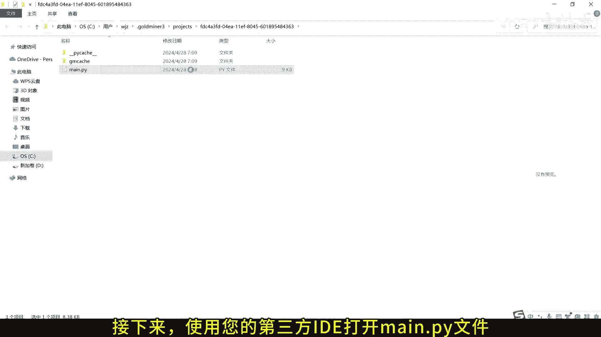
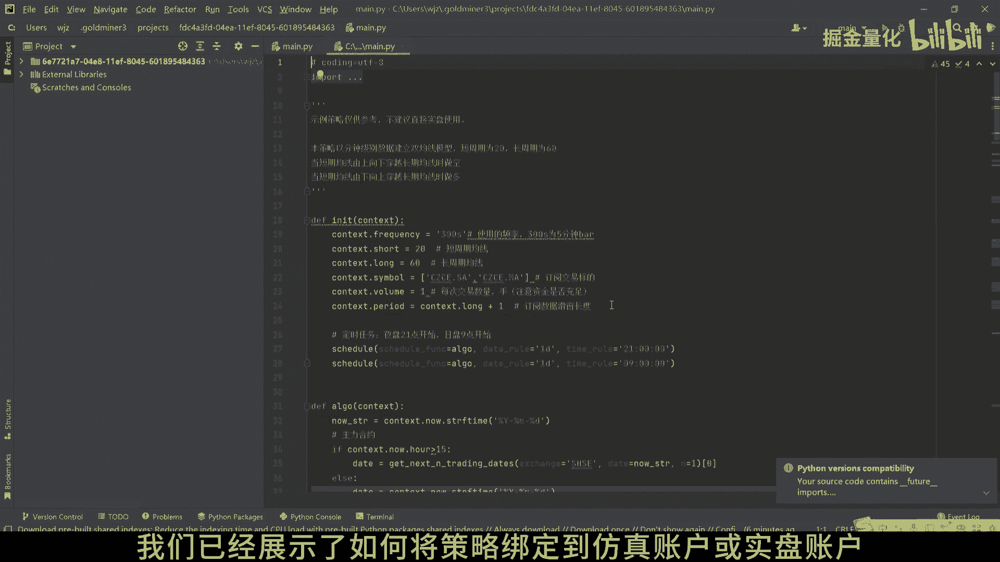
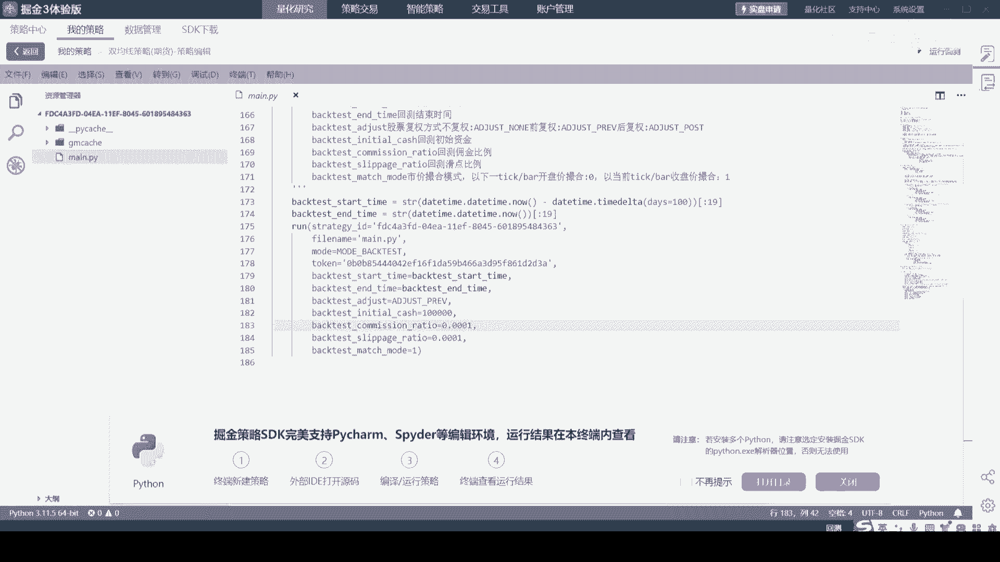
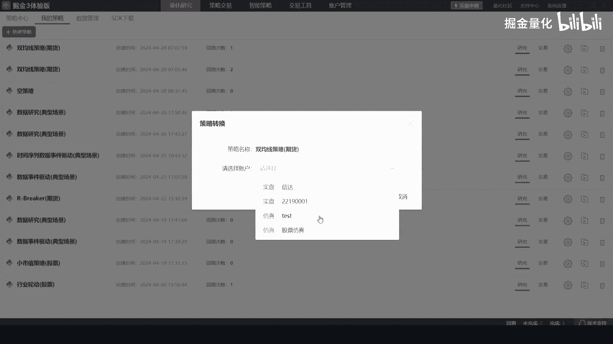
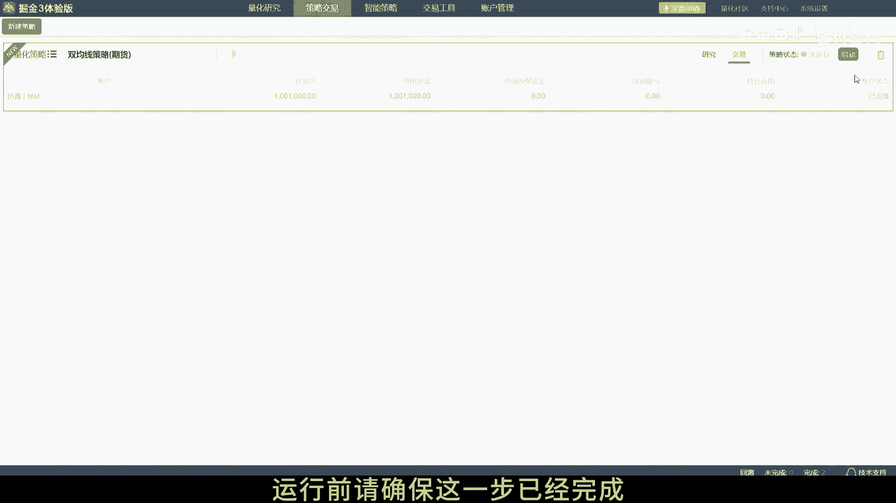
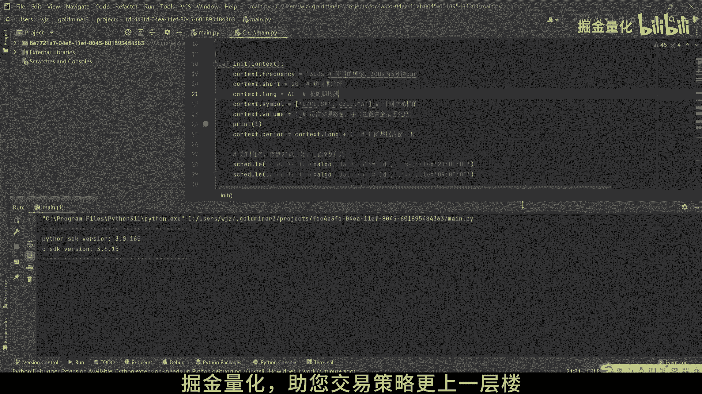

# 掘金量化策略开发：4.2：在第三方IDE中调试和运行策略 🚀

在本节课中，我们将学习如何在第三方集成开发环境（IDE）中编辑、调试并运行您的掘金量化策略。我们将以PyCharm为例，演示从打开策略文件到启动策略的完整流程。

## 概述

首先，您需要定位到包含掘金量化策略的目录，即存放策略主文件 `main.py` 的文件夹。

## 打开策略文件

接下来，使用您选择的第三方IDE（例如PyCharm）打开该目录下的 `main.py` 文件。





## 配置Python环境

在IDE中，您需要配置Python解释器，并确保该环境中已安装掘金量化所需的 `gmssdk` 库。这是策略能够正常运行的前提。





## 绑定交易账户

在之前的课程中，我们介绍了如何将策略绑定到仿真或实盘账户。为了确保流程完整，这里我们重新演示将策略绑定到仿真账户的操作。








**重要提示**：在运行策略前，请务必确认账户绑定步骤已完成。





## 设置运行参数并启动策略

现在，我们需要在IDE中设置 `run` 函数的参数。将 `mod` 参数设置为 `MODE_LIVE`，这允许您的策略在仿真或实盘环境中运行。

核心参数设置代码如下：
```python
run(backtest=False, mod=MODE_LIVE)
```

设置完成后，在IDE中运行 `main.py` 文件。您的策略将启动，并连接到之前绑定的仿真或实盘账户。

## 调试策略

在IDE中，您可以充分利用其调试功能来优化策略。以下是您可以进行的操作：

*   **设置断点**：在代码行号旁点击，添加断点以暂停执行。
*   **单步执行**：逐行执行代码，观察程序流程。
*   **查看变量**：在调试过程中，实时检查变量的值。

## 总结

本节课中，我们一起学习了在第三方IDE中编辑、调试和运行掘金量化策略的完整步骤。通过利用IDE强大的编辑和调试功能，您可以更高效地开发和优化您的交易策略。



感谢您观看本教程。如果您在使用过程中遇到任何问题，欢迎随时联系掘金量化的技术支持团队。


