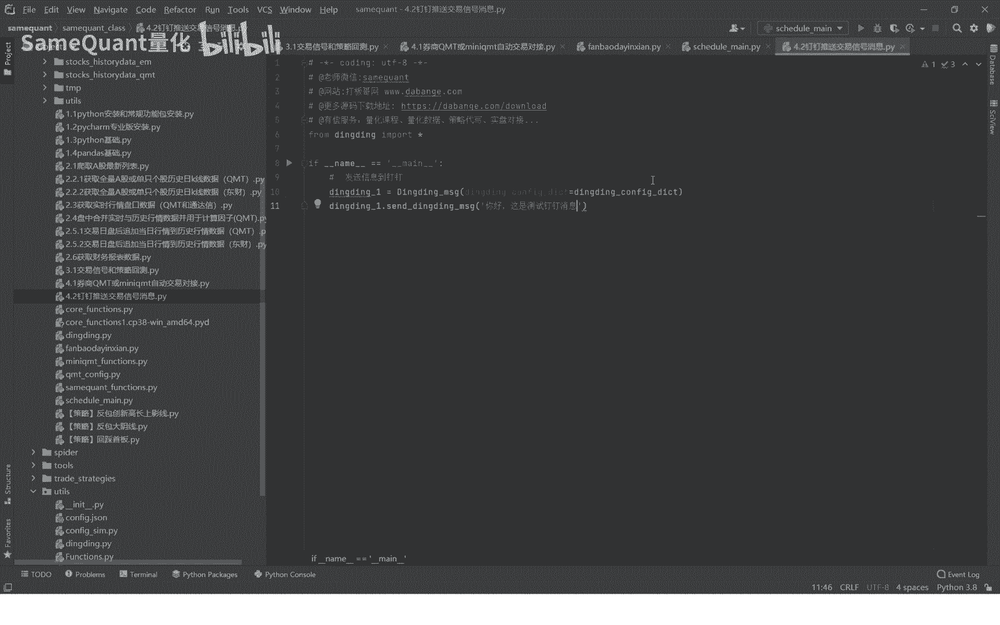
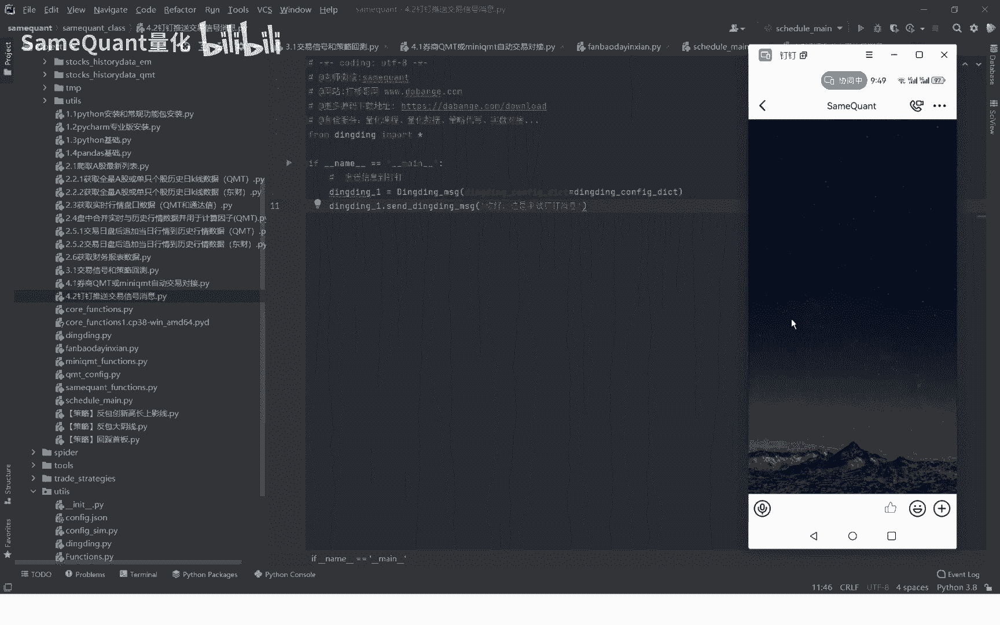
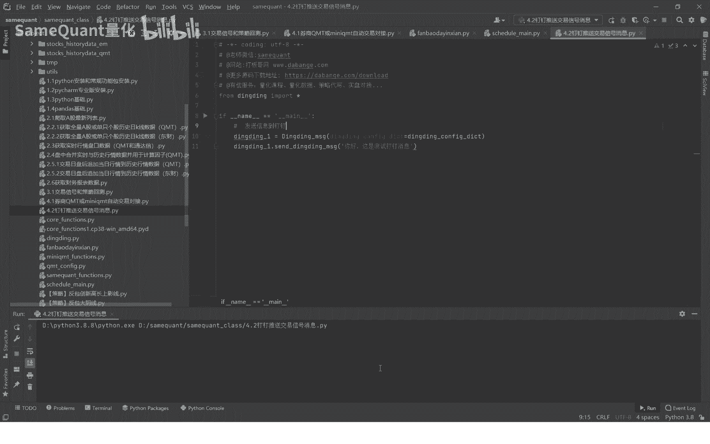
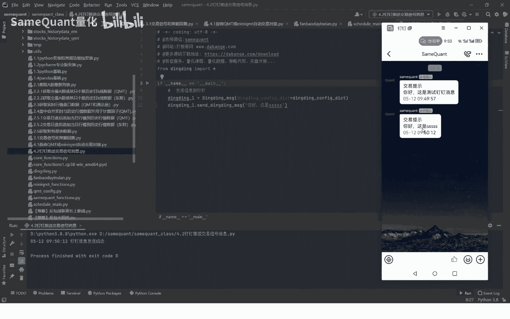
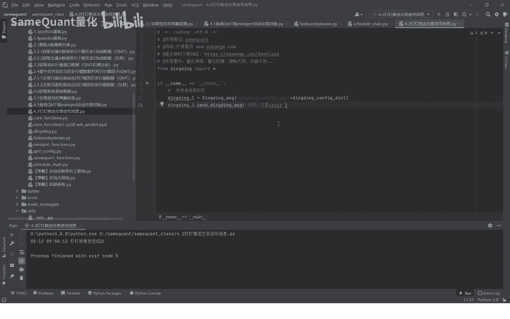

# 量化交易实战：4.2：钉钉推送策略交易提醒 📈



在本节课中，我们将学习如何将量化策略生成的交易信号，通过钉钉机器人实时推送到你的手机上，实现交易提醒的自动化。

上一节我们介绍了策略交易下单的基本流程，本节中我们来看看如何将交易结果及时通知到个人。



## 配置与发送钉钉消息



要实现钉钉消息推送，首先需要在钉钉群中配置一个自定义机器人，并获取其Webhook地址。这个过程是免费的，只需在手机钉钉应用内简单设置即可完成。

配置完成后，你可以在Python代码中通过发送HTTP请求来推送消息。以下是发送钉钉消息的核心代码片段：

```python
import requests
import json



def send_dingtalk_message(webhook_url, message):
    headers = {'Content-Type': 'application/json'}
    data = {
        "msgtype": "text",
        "text": {
            "content": message
        }
    }
    response = requests.post(webhook_url, headers=headers, data=json.dumps(data))
    return response.json()
```

运行上述代码，消息会立即发送到配置的钉钉群中，你的手机钉钉会实时收到通知。

## 在策略交易中集成提醒

在实盘交易中，你可以将此功能与交易策略无缝集成。例如，当策略触发买入或卖出信号时，除了执行订单，还可以同时推送一条钉钉消息。

以下是集成到交易策略中的关键步骤：

1.  在策略逻辑中，确定需要发送消息的节点（如下单后）。
2.  调用消息发送函数，并传入具体的交易信息（如股票代码、买卖方向、价格等）。
3.  确保钉钉机器人的Webhook地址已正确配置在代码中。

具体操作时，你只需在获取的课程源码中找到对应的代码位置，取消相关发送消息代码行的注释，并根据你的钉钉机器人信息修改Webhook地址即可。



## 总结

本节课中我们一起学习了如何利用钉钉机器人实现策略交易提醒。你掌握了配置钉钉机器人的方法，了解了通过Python代码发送消息的核心逻辑，并学会了如何将消息推送功能集成到你的量化交易策略中。这样，无论何时策略产生交易信号，你都能第一时间在手机上收到通知，极大地提升了交易的及时性和便捷性。