# 加密小白书：4-1：API账户准备 🧙‍♂️

在本节课中，我们将学习API的基本概念，并完成在OKX交易平台创建API账户的准备工作。这是后续进行自动化交易或获取市场数据的关键一步。

## 什么是API？

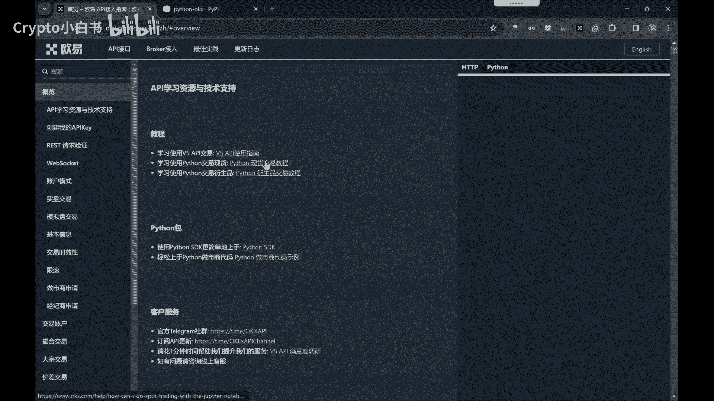

上一节我们介绍了课程目标，本节中我们来看看API是什么。

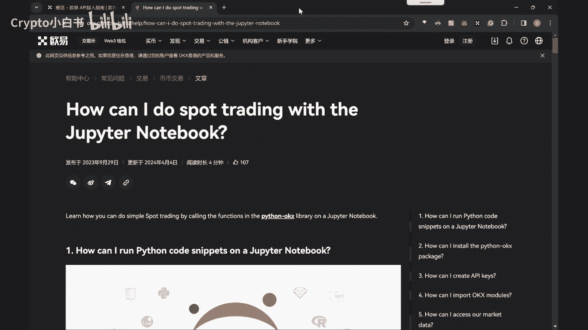

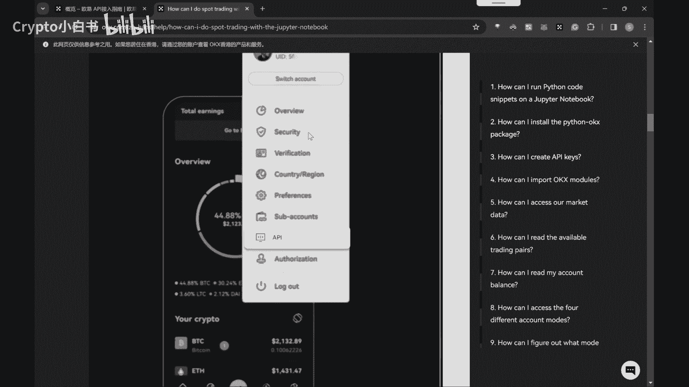

API，全称是**Application Programming Interface**（应用程序编程接口）。对于没有编程基础的学习者，可以将API想象成一个魔法盒子。你只需要按照特定的方式，也就是遵循API的规则，向这个盒子里放入一些东西（即发送**请求**），盒子就会根据你的请求给出**回应**。你无需了解这个魔法盒子内部如何工作，只需知道如何使用它即可。

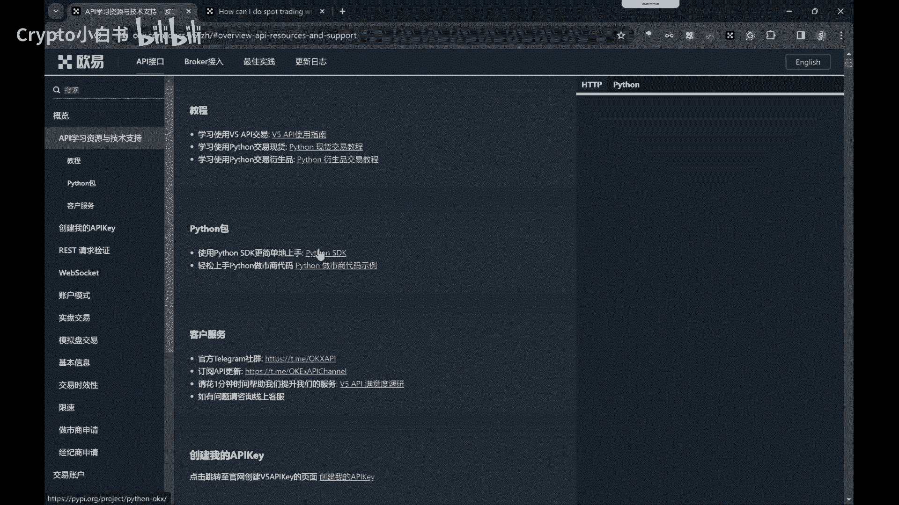

例如，你想知道当前的比特币价格。你可以通过OKX的API发送一个请求，这相当于你对魔法盒子说：“请问现在的比特币价格是多少？”。随后，OKX API就会回应你，告诉你当前的比特币价格。

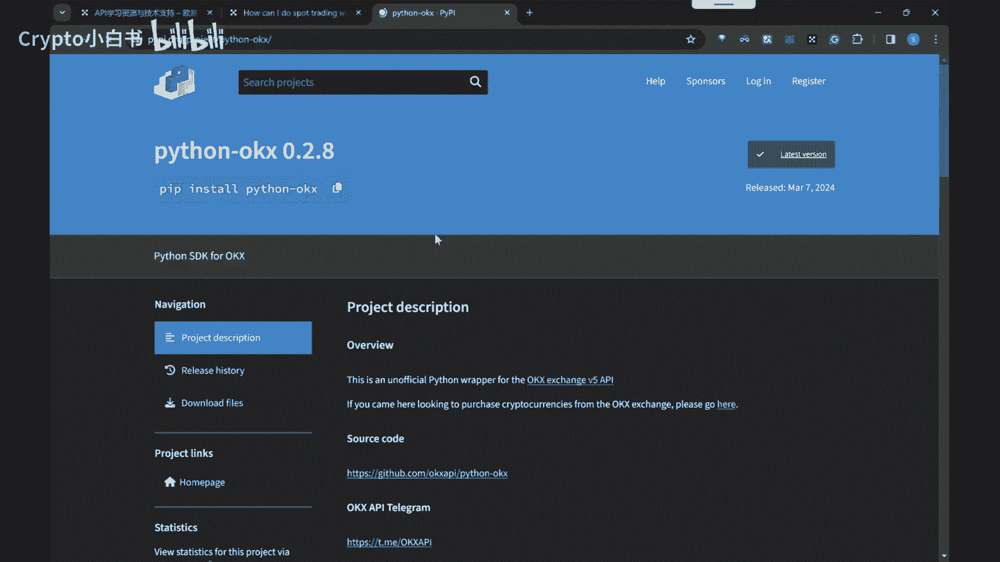

## 为什么使用OKX API？

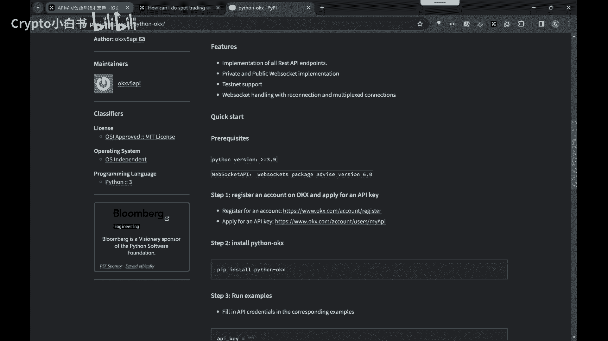

在未来的课程中，我们将使用OKX的API。OKX是一个提供加密货币交易的平台，其API允许用户获取市场数据并执行交易操作。

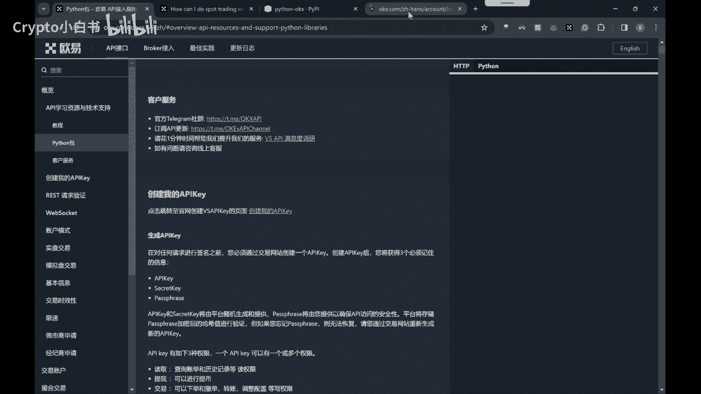

## 如何准备API账户？

理解了API的概念后，接下来我们进入实操环节，学习如何准备一个可用的API账户。

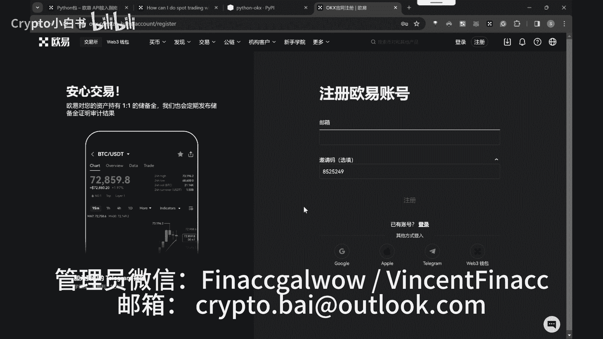

以下是创建OKX API账户的具体步骤：

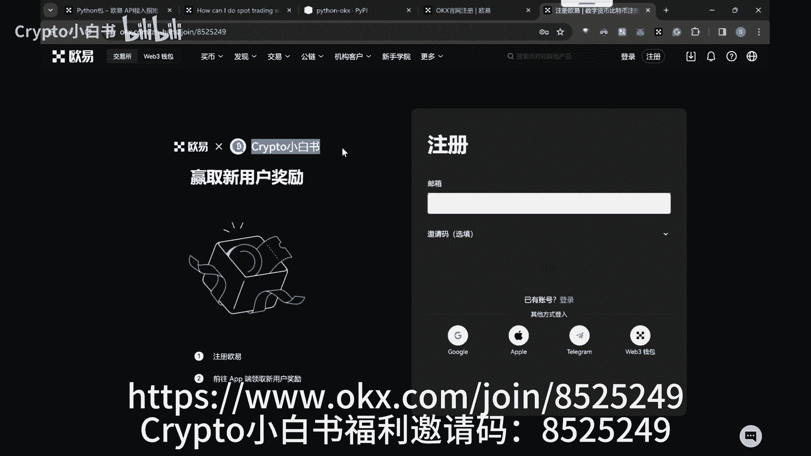

1.  **注册OKX账户**
    *   对于无法直接访问官网的用户，可以通过微信或邮箱联系课程管理员，获取最新的注册链接。
    *   对于可以访问的用户，可以直接访问OKX官网或使用课程提供的邀请链接进行注册。填写邀请码可以获取新人福利并参与后续活动。

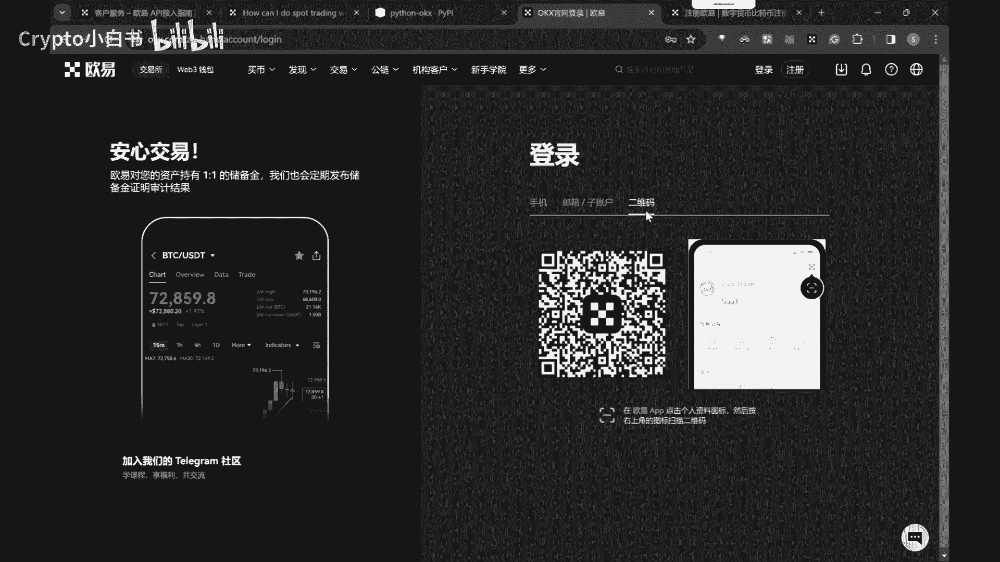

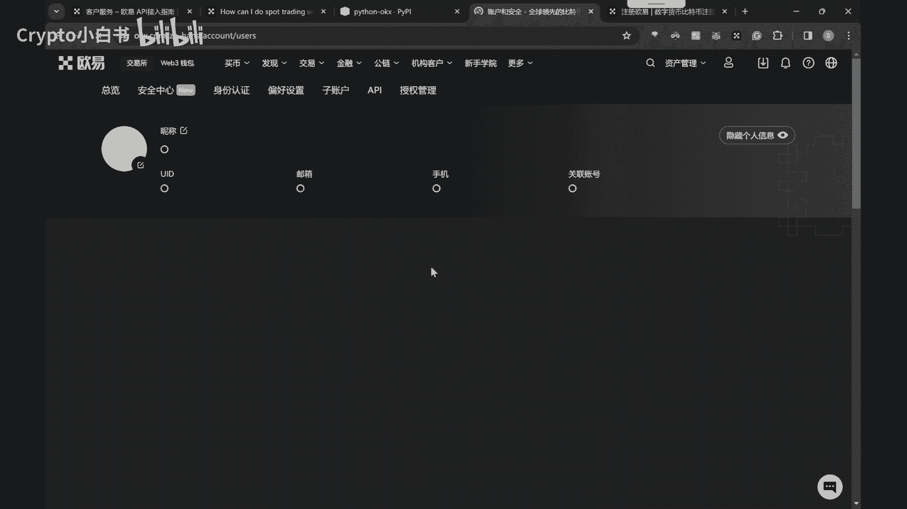

2.  **登录并创建API**
    *   注册完成后，登录OKX网页版。
    *   在用户界面中找到并点击“API管理”或类似选项。
    *   根据页面提示，创建一个新的API。
    *   创建成功后，系统会生成一对密钥：**API Key** 和 **Secret Key**。请务必立即妥善记录并保存它们。

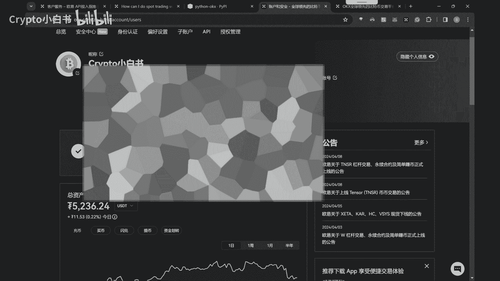

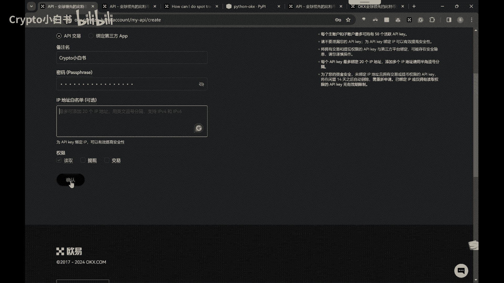

**重要提示**：课程中遇到任何问题，都欢迎添加管理员寻求帮助。

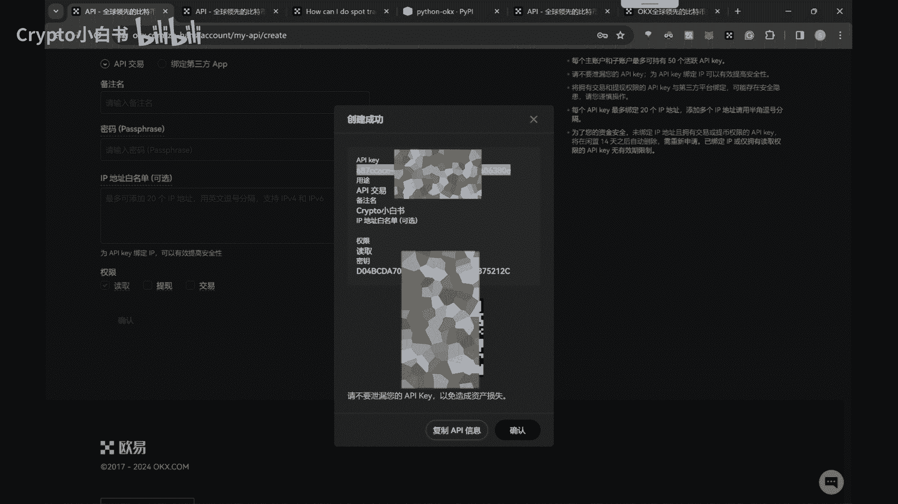

## 总结

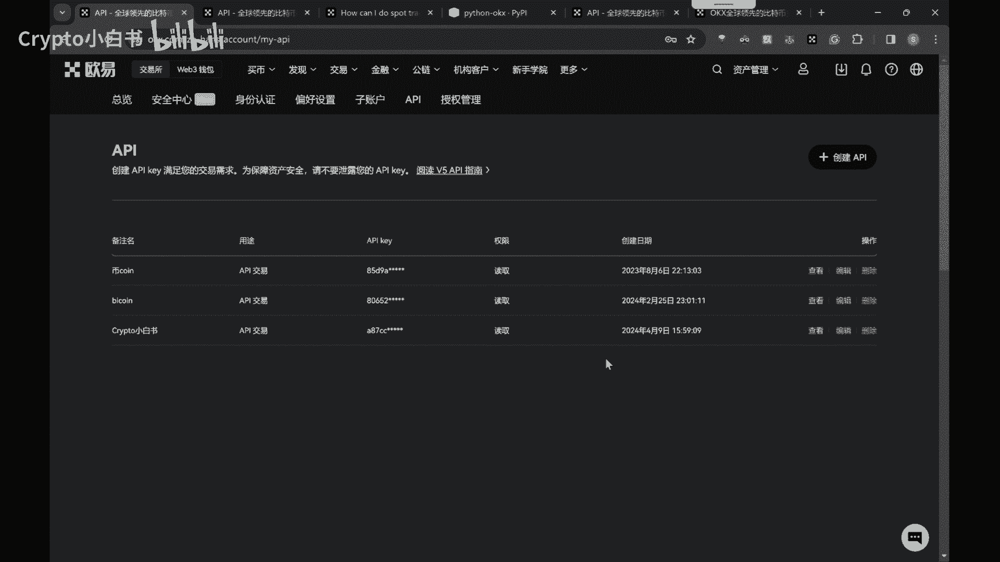

本节课中，我们一起学习了API的核心概念——它就像一个按规则响应的“魔法盒子”。我们明确了将在课程中使用OKX平台的API，并一步步完成了在OKX上注册账户和创建API Key的整个过程。请务必保管好你的API Key和Secret Key，它们是后续操作的重要凭证。