# 加密小白书：4-1：生成交易信号

在本节课中，我们将学习如何为策略回测生成交易信号。我们将以布林线策略为例，从数据准备开始，逐步讲解如何通过代码计算技术指标并生成具体的买入和卖出信号。

---

## 数据准备与处理

上一节我们介绍了策略回测的基本框架，本节中我们来看看如何准备和处理数据。

首先，我们需要导入必要的库并进行设置。

```python
import pandas as pd
pd.set_option('display.max_rows', None)
pd.set_option('display.max_columns', None)
```

接下来，读取数据文件。本例使用上一节课下载的BTCUSDT一分钟交易对数据。

```python
file_path = ‘你的数据文件绝对地址’
df = pd.read_csv(file_path)
```

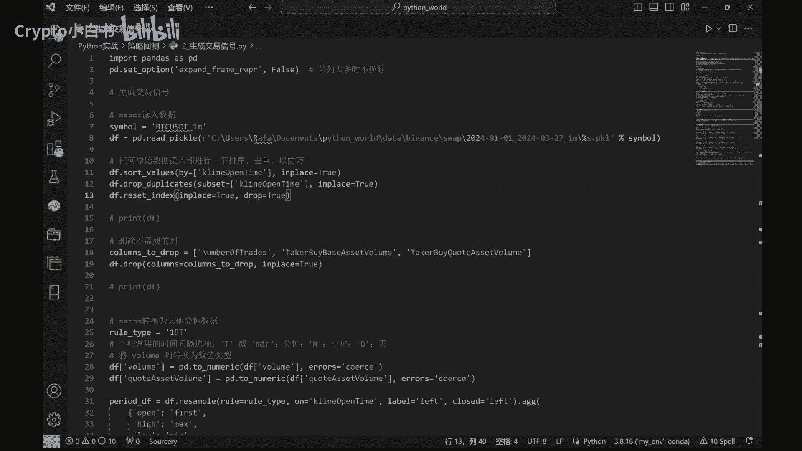

为了确保数据的一致性，我们需要对数据进行排序、去重，并删除不需要的列。

```python
df = df.sort_values(by=‘open_time’).drop_duplicates()
df = df.drop(columns=[‘ignore’])
```

---

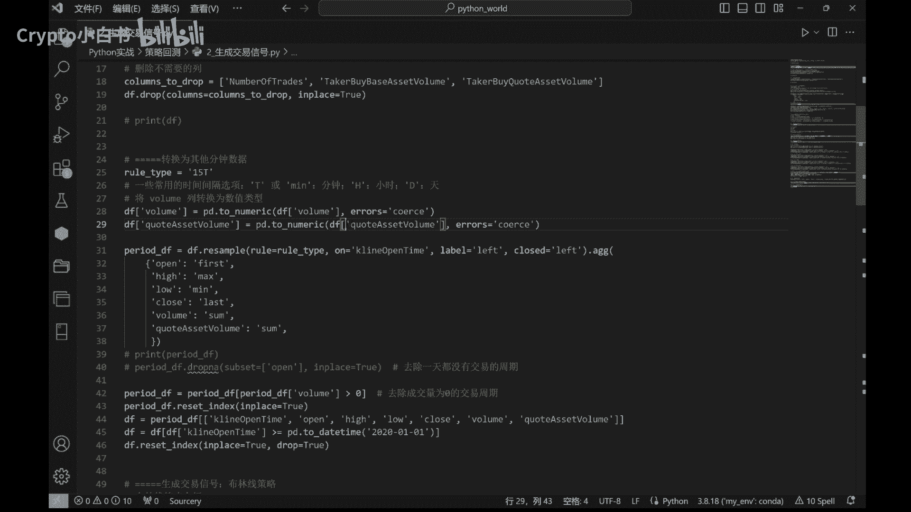

## 转换数据时间间隔

原始数据是一分钟K线，为了适应不同的策略分析，我们将其转换为15分钟K线数据。

以下是转换时间间隔的代码：

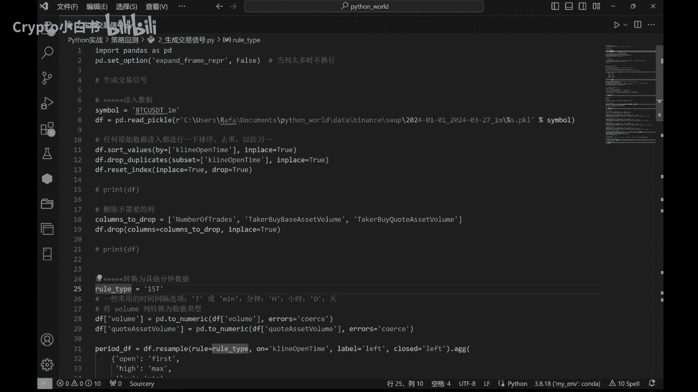

```python
df[‘open_time’] = pd.to_datetime(df[‘open_time’], unit=‘ms’)
df_15m = df.resample(‘15T’, on=‘open_time’).agg({
    ‘open’: ‘first’,
    ‘high’: ‘max’,
    ‘low’: ‘min’,
    ‘close’: ‘last’,
    ‘volume’: ‘sum’,
    ‘quote_asset_volume’: ‘sum’,
    ‘number_of_trades’: ‘sum’,
    ‘taker_buy_base_asset_volume’: ‘sum’,
    ‘taker_buy_quote_asset_volume’: ‘sum’
})
df_15m = df_15m.dropna()
```

为了方便后续计算，我们将相关列的数据类型转换为数值类型。

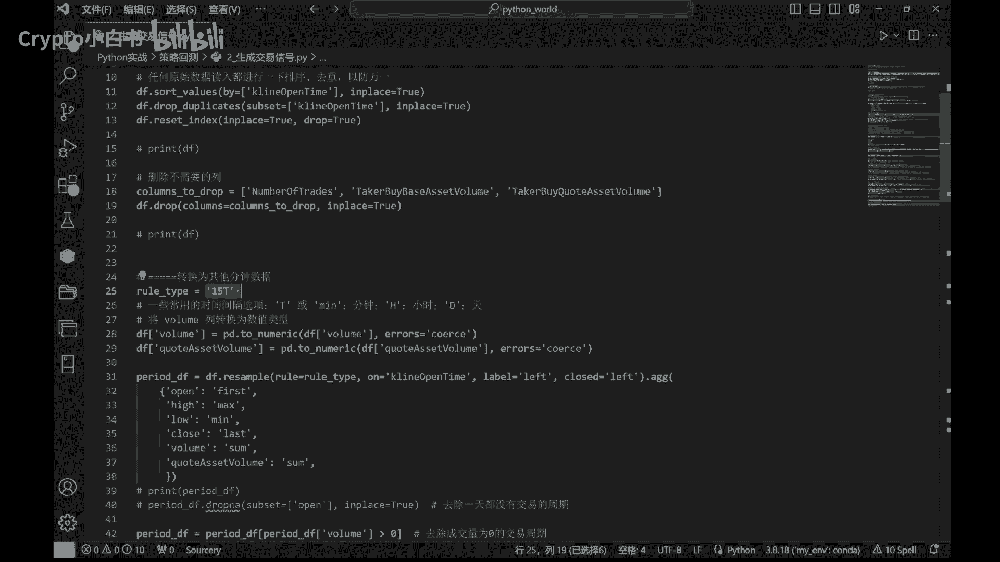

```python
numeric_columns = [‘open’, ‘high’, ‘low’, ‘close’, ‘volume’, ‘quote_asset_volume’, ‘number_of_trades’, ‘taker_buy_base_asset_volume’, ‘taker_buy_quote_asset_volume’]
df_15m[numeric_columns] = df_15m[numeric_columns].apply(pd.to_numeric)
```

---

## 应用布林线策略生成信号

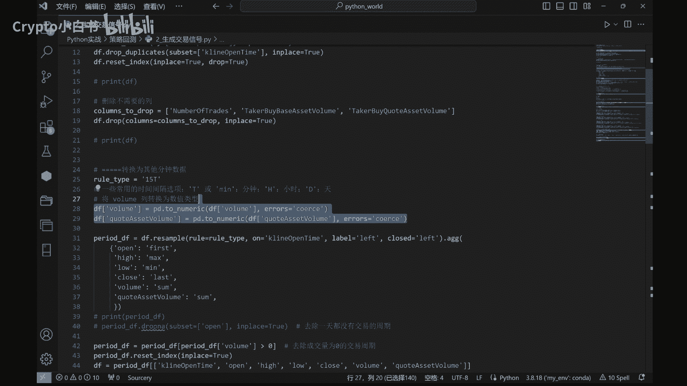

数据准备就绪后，现在我们来应用布林线策略生成交易信号。布林线是一种常见的技术分析工具，用于判断价格走势。

### 策略原理

布林线基于移动平均线（中轨）和其标准差计算上轨与下轨。其核心公式如下：

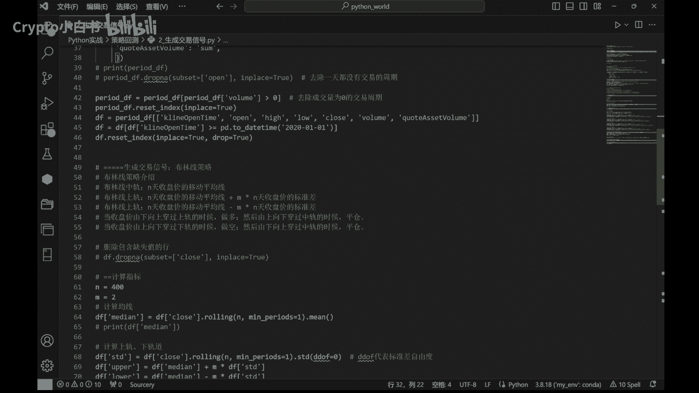

*   **中轨 (MB)** = `收盘价的N周期简单移动平均线 (SMA)`
*   **标准差 (SD)** = `收盘价在N周期内的标准差`
*   **上轨 (UB)** = `MB + (k * SD)`
*   **下轨 (LB)** = `MB - (k * SD)`

其中，`N`是周期数（常用20），`k`是标准差乘数（常用2）。

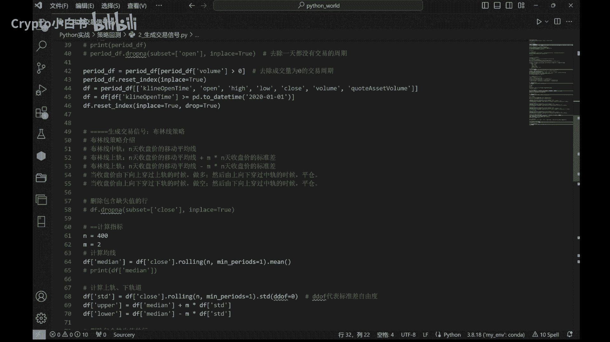

### 交易逻辑

该策略的交易规则如下：

1.  **做多开仓**：当收盘价由下向上突破上轨时。
2.  **做多平仓**：当收盘价由上向下跌破中轨时。
3.  **做空开仓**：当收盘价由上向下跌破下轨时。
4.  **做空平仓**：当收盘价由下向上突破中轨时。

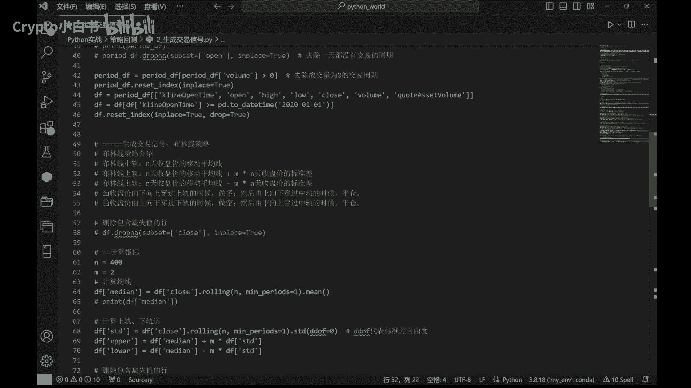

### 代码实现

以下是使用Python实现该逻辑并生成信号的步骤。

首先，计算布林线的中轨、上轨和下轨。

```python
period = 20
multiplier = 2

df_15m[‘middle_band’] = df_15m[‘close’].rolling(window=period).mean()
std = df_15m[‘close’].rolling(window=period).std()
df_15m[‘upper_band’] = df_15m[‘middle_band’] + (std * multiplier)
df_15m[‘lower_band’] = df_15m[‘middle_band’] - (std * multiplier)
```

接下来，根据交易逻辑定位各类信号点。

以下是识别做多开仓与平仓信号的代码：

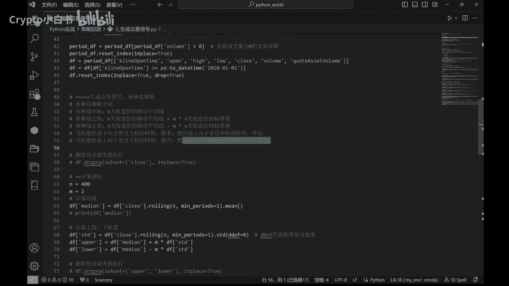

```python
# 做多开仓信号：收盘价上穿上轨
df_15m[‘long_signal’] = (df_15m[‘close’] > df_15m[‘upper_band’]) & (df_15m[‘close’].shift(1) <= df_15m[‘upper_band’].shift(1))
# 做多平仓信号：收盘价下穿中轨
df_15m[‘long_exit_signal’] = (df_15m[‘close’] < df_15m[‘middle_band’]) & (df_15m[‘close’].shift(1) >= df_15m[‘middle_band’].shift(1))
```

以下是识别做空开仓与平仓信号的代码：

```python
# 做空开仓信号：收盘价下穿下轨
df_15m[‘short_signal’] = (df_15m[‘close’] < df_15m[‘lower_band’]) & (df_15m[‘close’].shift(1) >= df_15m[‘lower_band’].shift(1))
# 做空平仓信号：收盘价上穿中轨
df_15m[‘short_exit_signal’] = (df_15m[‘close’] > df_15m[‘middle_band’]) & (df_15m[‘close’].shift(1) <= df_15m[‘middle_band’].shift(1))
```

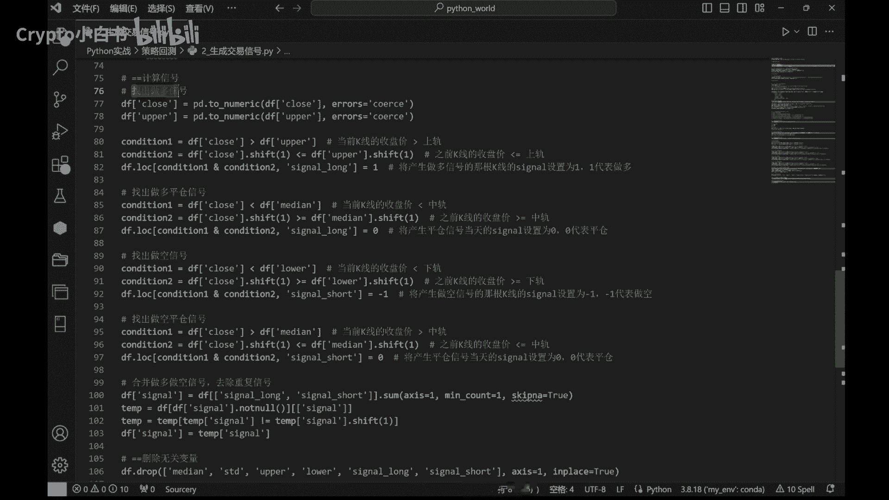

最后，合并所有信号，并去除可能在同一时间点产生的重复信号。

```python
# 合并信号列
signals = df_15m[[‘long_signal’, ‘long_exit_signal’, ‘short_signal’, ‘short_exit_signal’]]
# 去除重复的时间戳（如果有）
signals = signals[signals.any(axis=1)]
```

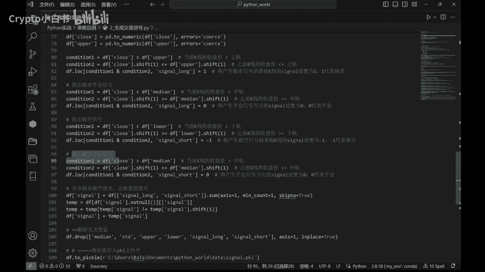

---

## 保存结果

信号生成完成后，我们可以将包含信号的数据框保存起来，供后续回测使用。

```python
output_path = ‘交易信号结果.pkl’
df_15m.to_pickle(output_path)
```

---

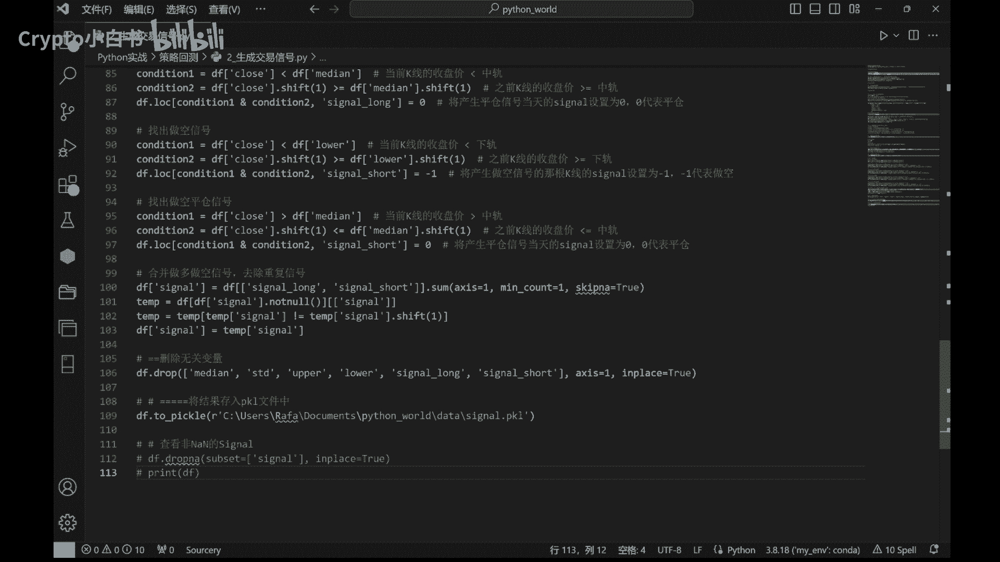

## 总结

本节课中，我们一起学习了生成交易信号的完整流程。我们从数据导入和预处理开始，将一分钟K线数据转换为15分钟数据。接着，我们详细介绍了布林线策略的原理与交易逻辑，并使用代码计算了布林带指标，最终根据价格与布林带的相对位置关系，生成了做多、做空及其对应的平仓信号。通过这种方法，我们可以将市场的价格走势转化为具体的、可执行的交易指令，为下一步的策略回测打下基础。