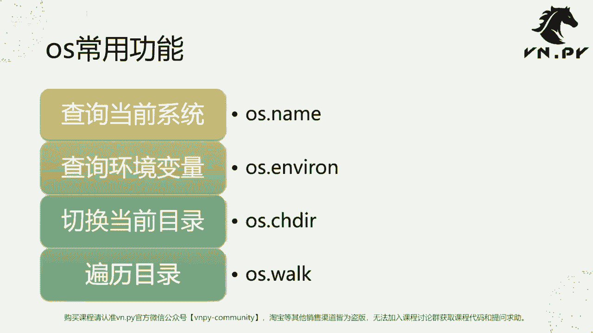
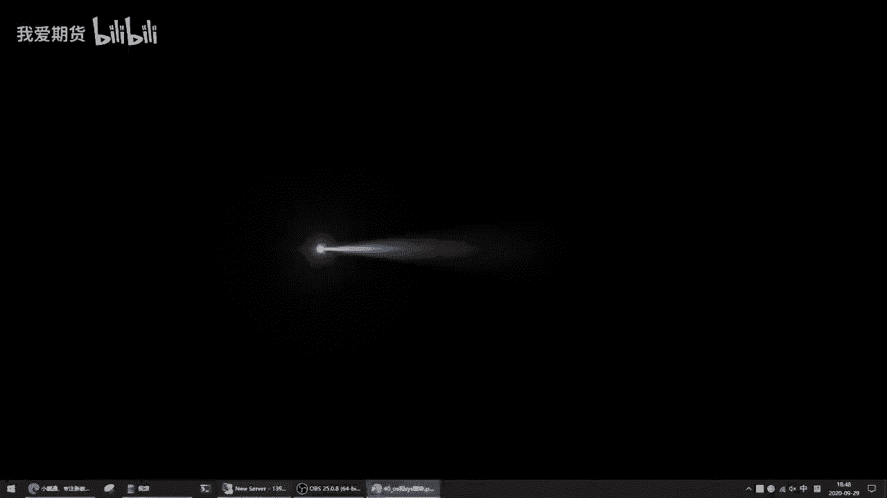
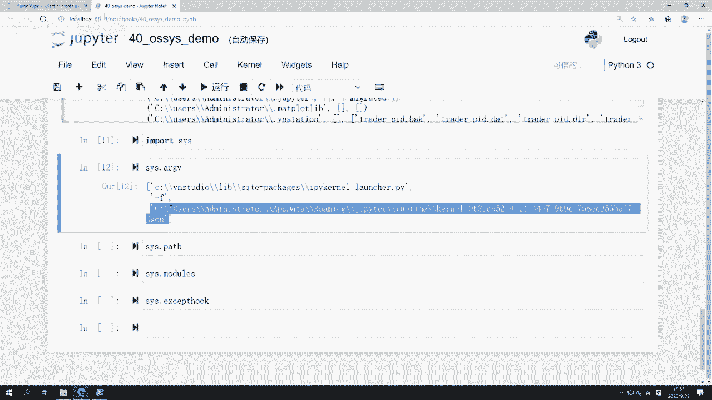
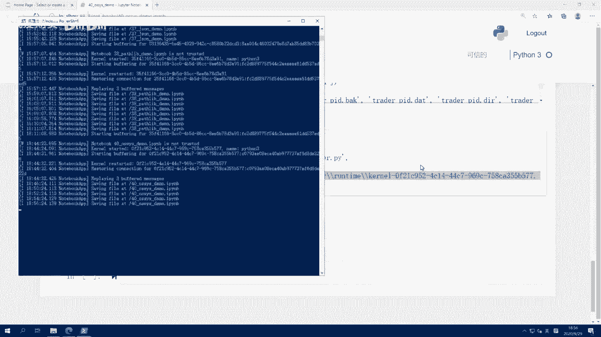
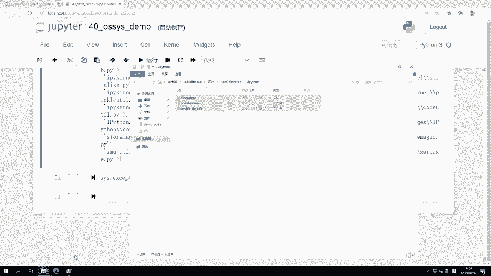
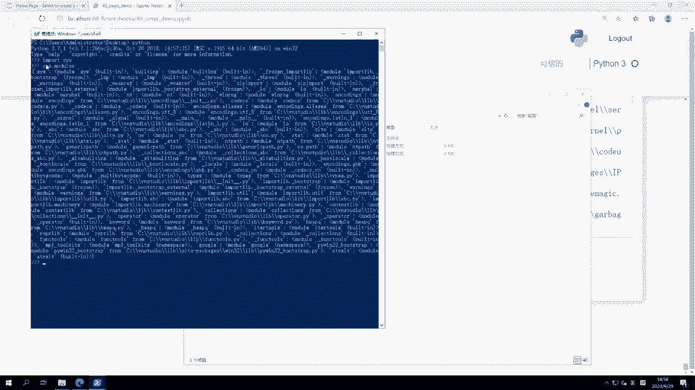
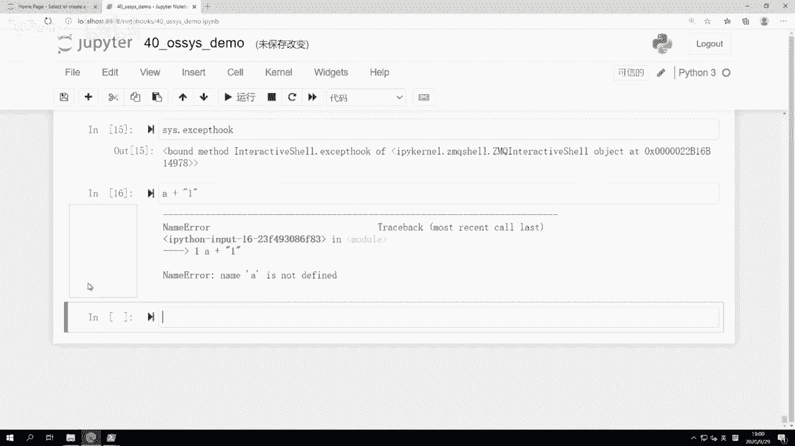
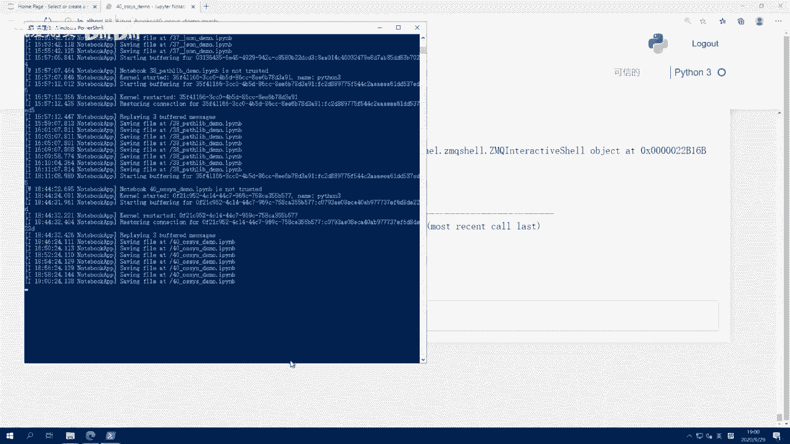
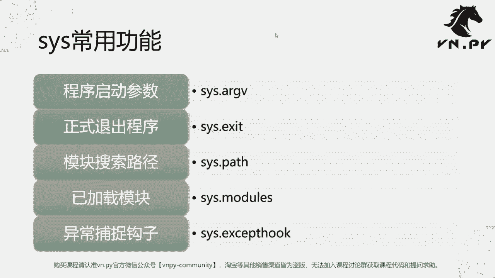
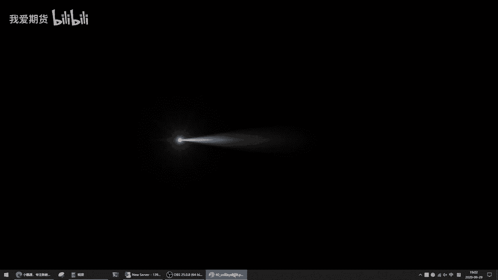

# Python量化开发：40：OS与SYS模块详解 🖥️

在本节课中，我们将学习Python中两个与操作系统交互的核心内置模块：`os`模块和`sys`模块。`os`模块主要用于调用操作系统本身提供的功能，而`sys`模块则用于管理Python解释器自身的运行时状态。掌握它们对于开发复杂的系统级应用（如量化交易平台）至关重要。

## OS模块：与操作系统交互 🔧





上一节我们介绍了本课程的目标，本节中我们来看看`os`模块。`os`模块是Python与底层操作系统（如Windows、Linux）进行交互的桥梁，它允许你的Python程序执行文件操作、读取环境变量等系统级任务。

以下是`os`模块最常用的四个功能：

1.  **查询当前操作系统**
    通过`os.name`可以获取当前运行的操作系统名称。这在需要针对不同系统（如Windows和Linux）编写不同逻辑时非常有用。
    ```python
    import os
    system_name = os.name  # 例如在Windows上返回 'nt'
    ```

2.  **访问系统环境变量**
    系统环境变量存储了操作系统和应用程序的配置信息。`os.environ`对象（类似字典）提供了对这些变量的访问。
    ```python
    import os
    # 获取所有环境变量
    all_env_vars = os.environ
    # 获取特定环境变量，如PATH
    path_var = os.environ.get('PATH')
    ```

3.  **切换当前工作目录**
    程序运行时有一个“当前工作目录”。使用`os.chdir()`可以改变它，而`os.getcwd()`则用于获取当前目录路径。
    ```python
    import os
    current_dir = os.getcwd()  # 获取当前目录
    os.chdir('C:\\')           # 切换到C盘根目录
    new_dir = os.getcwd()      # 再次获取，确认已切换
    ```

4.  **遍历目录**
    当你需要扫描某个文件夹下的所有文件和子文件夹时，可以使用`os.walk()`函数。它会生成一个三元组 `(dirpath, dirnames, filenames)`。
    ```python
    import os
    for root, dirs, files in os.walk('C:\\Users\\Administrator'):
        print(f"当前路径: {root}")
        print(f"子目录: {dirs}")
        print(f"文件: {files}")
    ```
    这个功能常用于批量处理文件，例如在量化开发中扫描策略文件目录。

## SYS模块：管理Python解释器 ⚙️

了解了如何与外部操作系统交互后，本节我们来看看如何管理Python解释器自身。`sys`模块提供了大量函数和变量，用于访问和修改Python运行时的环境。





以下是`sys`模块五个核心功能：

1.  **获取命令行参数**
    程序启动时可以通过命令行传递参数。`sys.argv`是一个列表，其中包含了这些参数。
    ```python
    import sys
    # sys.argv[0] 通常是脚本名称
    # sys.argv[1:] 是后续传递的参数
    script_name = sys.argv[0]
    arguments = sys.argv[1:]
    ```

2.  **退出Python程序**
    使用`sys.exit()`可以立即终止Python程序的运行。可以传递一个退出码，通常`0`表示正常退出，非零值表示异常退出。
    ```python
    import sys
    sys.exit(0)  # 正常退出程序
    ```





3.  **查看模块搜索路径**
    Python解释器根据`sys.path`列表中的路径来查找和导入模块。你可以修改这个列表来添加自定义的模块搜索目录。
    ```python
    import sys
    # 打印当前所有模块搜索路径
    for path in sys.path:
        print(path)
    # 添加新的搜索路径
    sys.path.append('/my/custom/module/path')
    ```



4.  **查看已加载的模块**
    `sys.modules`是一个字典，它包含了当前Python解释器中所有已导入（加载）的模块。这有助于了解程序的内存占用和模块依赖。
    ```python
    import sys
    # 检查某个模块是否已加载
    if 'numpy' in sys.modules:
        print("NumPy模块已加载")
    ```



5.  **异常处理钩子**
    `sys.excepthook`是一个函数，当程序发生未捕获的异常时，解释器会调用它。你可以重写这个函数来自定义异常发生时的行为（例如将错误日志写入文件或发送到网络）。
    ```python
    import sys
    def my_excepthook(exc_type, exc_value, exc_traceback):
        # 自定义异常处理逻辑，例如记录日志
        print(f"捕获到异常: {exc_type.__name__}: {exc_value}")
        # 也可以调用默认处理
        sys.__excepthook__(exc_type, exc_value, exc_traceback)
    # 绑定自定义的异常钩子
    sys.excepthook = my_excepthook
    ```



## 总结 📝

本节课中我们一起学习了Python中两个强大的系统模块。
*   **`os`模块** 主要负责**对外**与操作系统交互，例如操作文件目录、读取环境变量。
*   **`sys`模块** 则主要负责**对内**管理Python解释器自身的状态，例如获取启动参数、管理模块路径和异常处理。



对于初学者，可能暂时想不到这些功能的具体应用场景，这很正常。它们更多是在进行系统级开发、构建复杂应用平台（如VN.PY）时才会大显身手。现在，你只需将它们作为重要的基础知识储备起来，未来在需要时再回来查阅即可。