# Python量化开发：41：环境变量与模块加载 📚

在本节课中，我们将学习操作系统环境变量的概念，并深入探讨它与Python模块加载机制之间的紧密联系。理解这两者如何协同工作，是管理项目依赖和配置开发环境的关键一步。

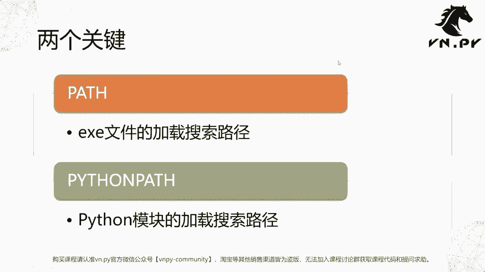

## 环境变量概述 🔍

上一节我们介绍了`os`和`sys`模块，其中提到了环境变量。本节中，我们来看看它的具体定义和作用。

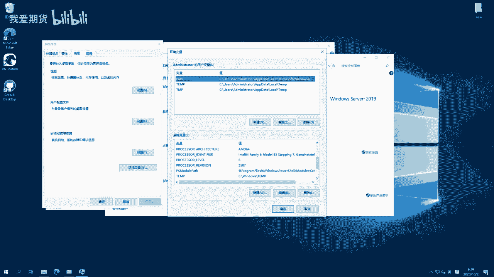

环境变量的英文是`environment variables`。它主要用于保存操作系统的配置信息。你可以将其视为一个类似Python字典的键值对数据结构。但环境变量的数据并非仅存在于内存中，而是会持久化保存到硬盘上。

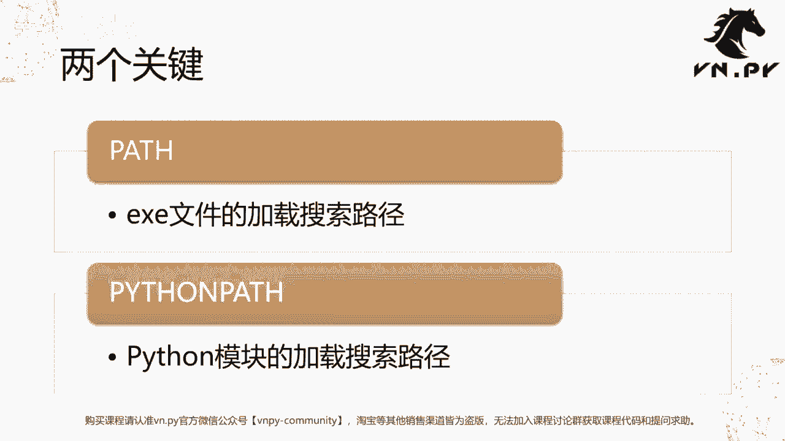

环境变量主要分为两类：
*   **系统变量**：对所有用户都可见且通用。
*   **用户变量**：仅对当前登录的用户可见和使用，与其他用户的变量是隔离的。

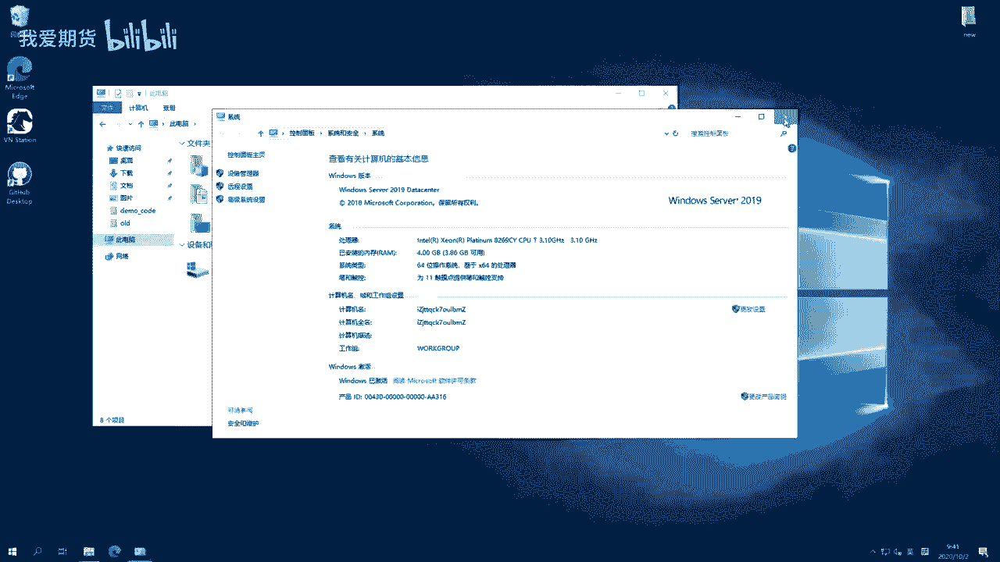

## 查看与修改环境变量 🖥️

接下来，我们学习如何在Windows系统中查看和区分这两类变量。

以下是查看环境变量的步骤：
1.  打开“此电脑”或“文件资源管理器”。
2.  右键点击“此电脑”，选择“属性”。
3.  在系统信息页面，点击“高级系统设置”。
4.  在弹出的系统属性窗口中，点击底部的“环境变量”按钮。

打开环境变量窗口后，可以看到上下两个区域：
*   **上半部分（用户变量）**：例如“Administrator的用户变量”，仅对当前用户生效。
*   **下半部分（系统变量）**：对所有用户生效，通常需要管理员权限才能修改。

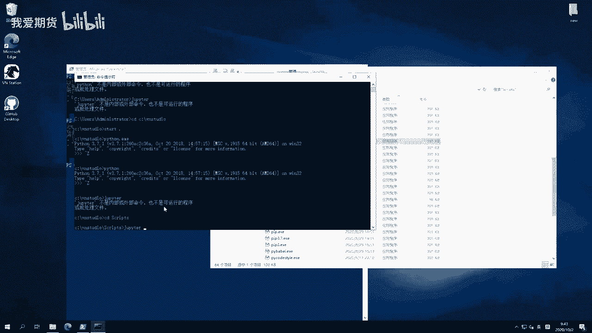

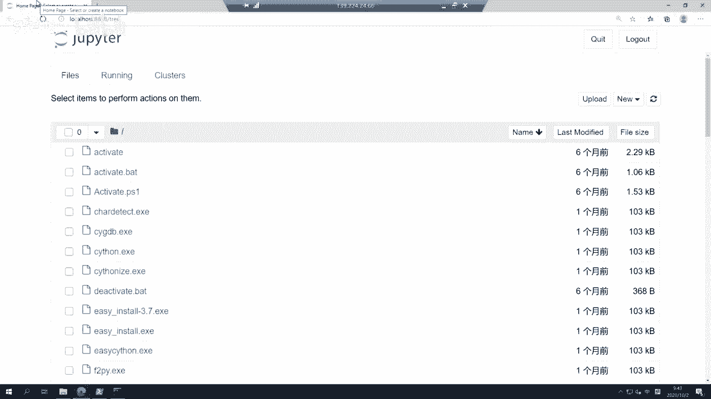

## PATH环境变量 🛤️

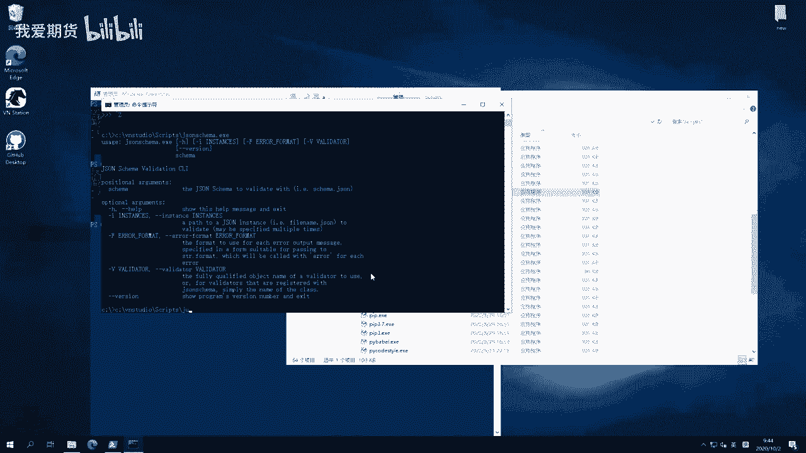

现在，我们来关注两个关键的环境变量。首先是`PATH`变量，它决定了系统如何查找可执行文件。

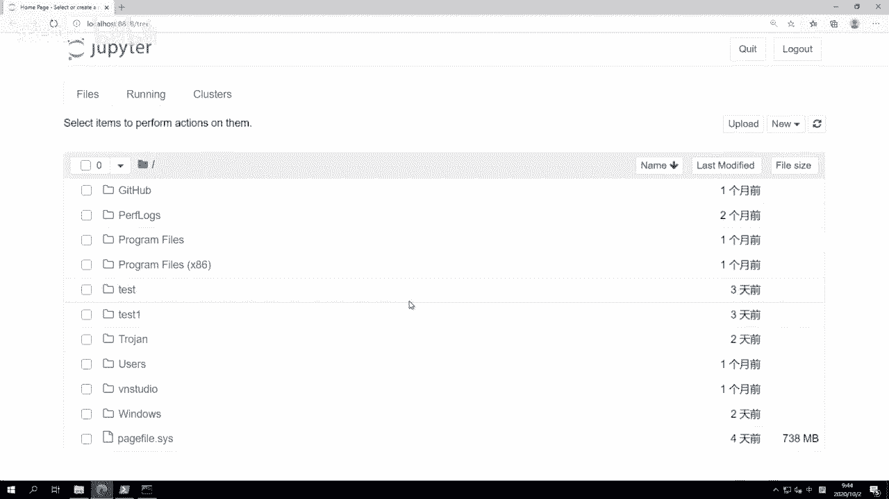

`PATH`变量保存了操作系统搜索可执行文件（`.exe`）的路径列表。当你在命令行输入一个命令（如`python`或`jupyter`）时，系统会按照`PATH`中列出的目录顺序去查找对应的可执行文件。

如果`PATH`变量中没有包含某个程序的安装目录，系统将无法识别该命令。此时，你有两种临时解决方案：
1.  **切换到程序所在目录**：使用`cd`命令切换到可执行文件所在的目录，然后直接运行。
2.  **输入完整文件路径**：在命令行中输入可执行文件的完整绝对路径来运行。

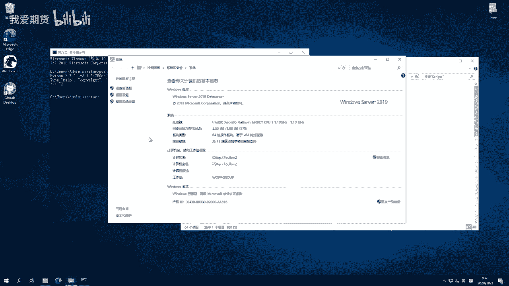

显然，这两种方式都不够便捷。因此，通常的做法是将常用程序的安装目录添加到`PATH`环境变量中。添加后，无论你在任何目录下，都可以直接通过命令名来启动程序。


**注意**：修改`PATH`变量（尤其是系统变量）后，必须**关闭并重新打开**命令行终端（如CMD或PowerShell），新的设置才会生效。

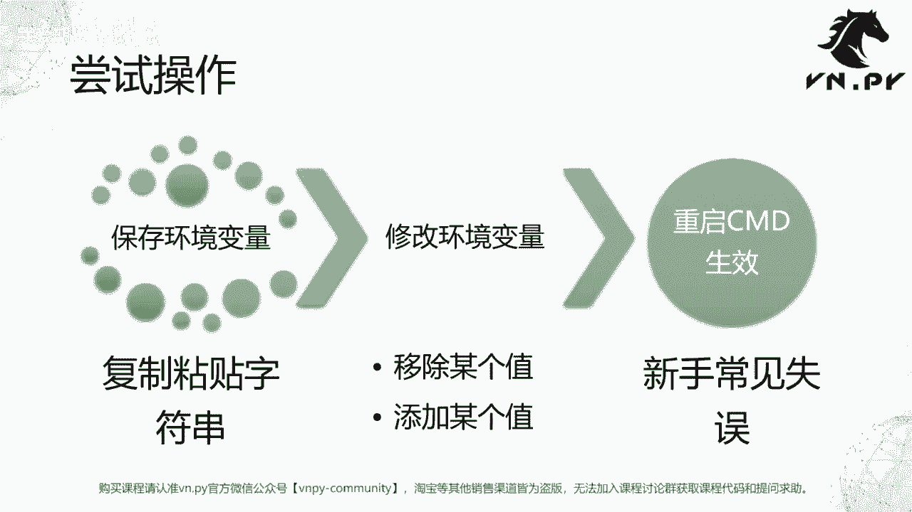

## PYTHONPATH环境变量 🐍

理解了`PATH`用于查找可执行文件后，与之对应的`PYTHONPATH`变量则用于指导Python解释器查找模块。

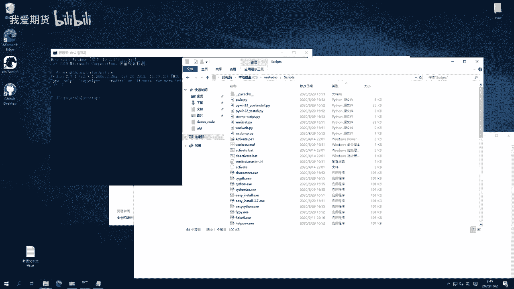


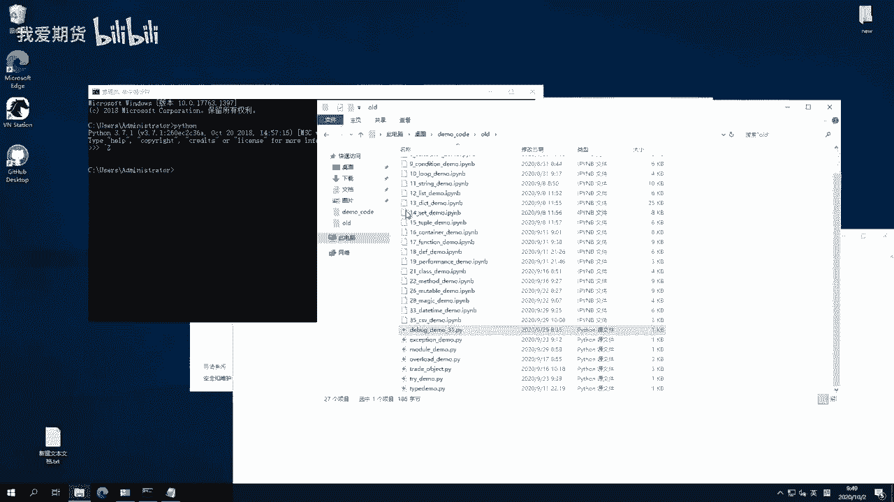

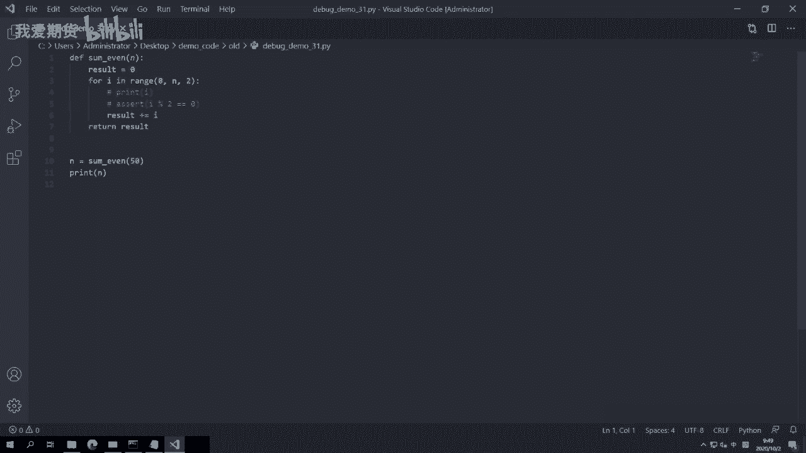

`PYTHONPATH`环境变量定义了Python在导入（`import`）模块时，除了默认路径外，额外需要搜索的目录列表。

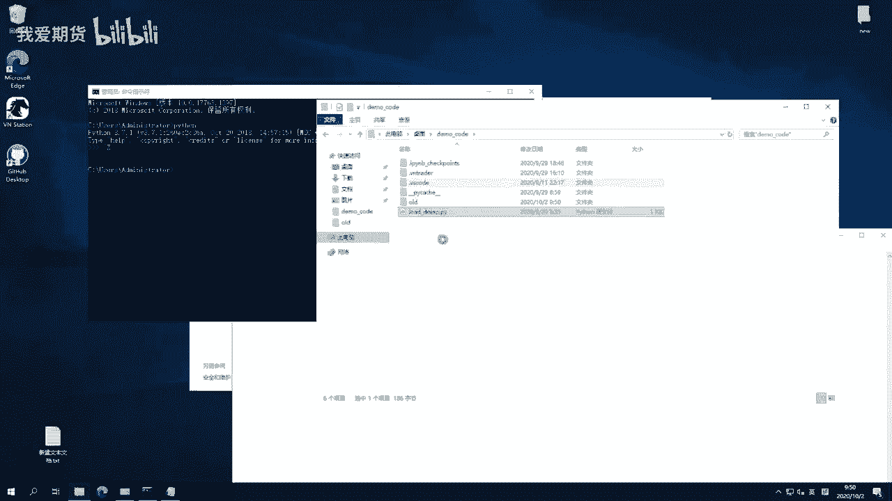

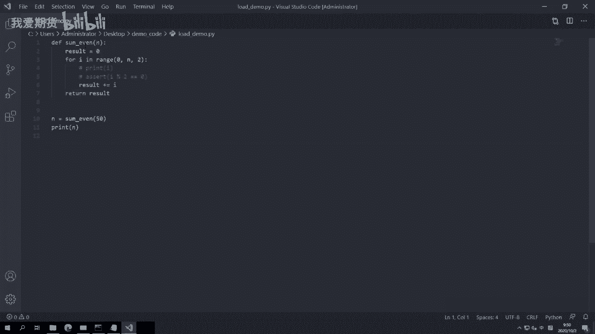

当你的自定义模块不在Python的默认搜索路径（如当前目录、标准库目录等）时，直接`import`会引发`ModuleNotFoundError`。解决方法之一是将模块文件复制到当前工作目录，但这不利于项目管理。

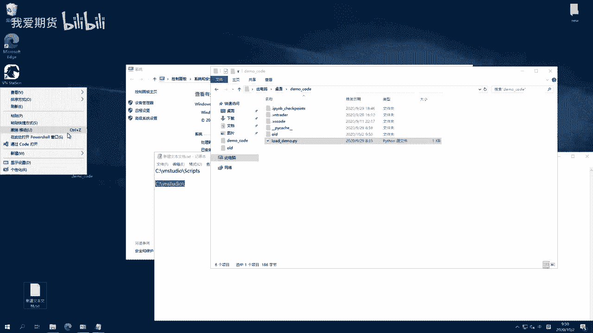

更优雅的解决方案是将存放自定义模块的目录添加到`PYTHONPATH`环境变量中。添加方法与修改`PATH`变量类似。添加并重启终端后，Python解释器就能在指定目录中找到你的模块了。

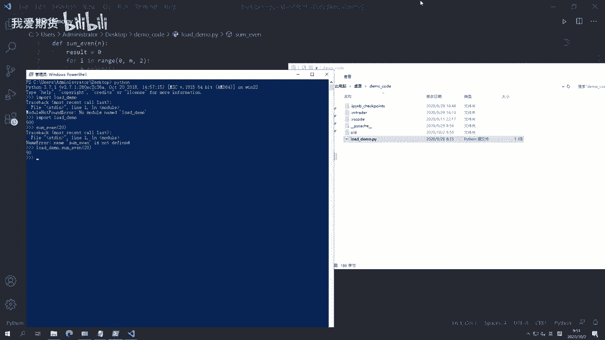

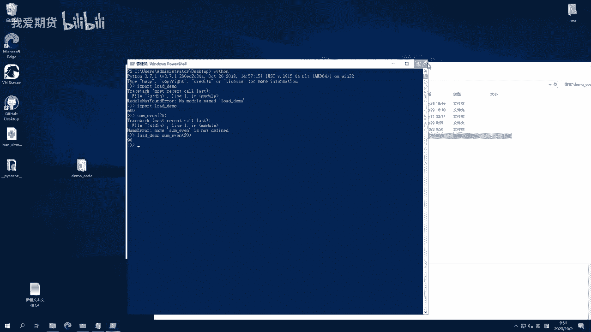

你可以通过以下代码查看当前Python解释器的模块搜索路径：
```python
import sys
for path in sys.path:
    print(path)
```
列表中的路径就是Python在`import`时会去查找的所有位置。

## 动态修改模块搜索路径 ⚙️

除了修改环境变量这种持久化的方法，Python还允许在运行时动态地修改模块搜索路径。

你可以在Python脚本或交互式环境中，直接修改`sys.path`列表来临时添加搜索路径：
```python
import sys
sys.path.append(‘C:/Your/Module/Directory‘)
```
这种方法更加灵活，适用于临时测试或脚本内配置。但对于长期稳定的项目，仍然推荐使用设置`PYTHONPATH`环境变量的方式。

## 操作环境变量的注意事项 ⚠️

在操作环境变量时，请务必遵循以下准则，以避免系统配置出错。

以下是操作环境变量的关键步骤和注意事项：
1.  **修改前先备份**：在修改（尤其是删除）任何环境变量值之前，建议先将原有内容复制保存到文本文件中。这样在出错时可以快速恢复。
2.  **谨慎修改系统变量**：修改系统变量会影响所有用户，且通常需要管理员权限。在个人开发环境中，优先考虑修改用户变量。
3.  **修改后必须重启**：环境变量的更改只在**新启动**的程序中生效。修改后，必须关闭所有相关的命令行窗口、IDE或应用程序，然后重新打开，更改才会被读取。

## 总结 📝

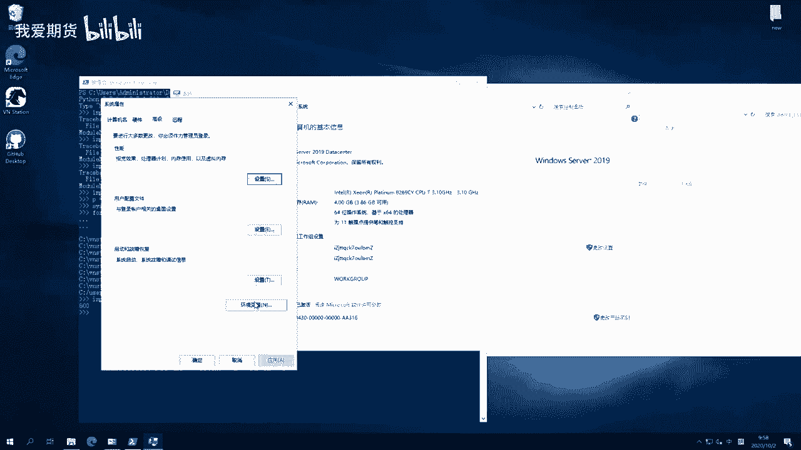


本节课中我们一起学习了环境变量与Python模块加载的核心知识。


我们首先了解了环境变量的概念与分类。然后，我们深入探讨了`PATH`环境变量如何帮助系统定位可执行文件，以及`PYTHONPATH`环境变量如何指导Python查找模块。我们还学习了动态修改`sys.path`的方法。最后，强调了操作环境变量时的备份和重启原则。掌握这些知识，将帮助你更自如地配置Python开发环境和管理项目依赖。