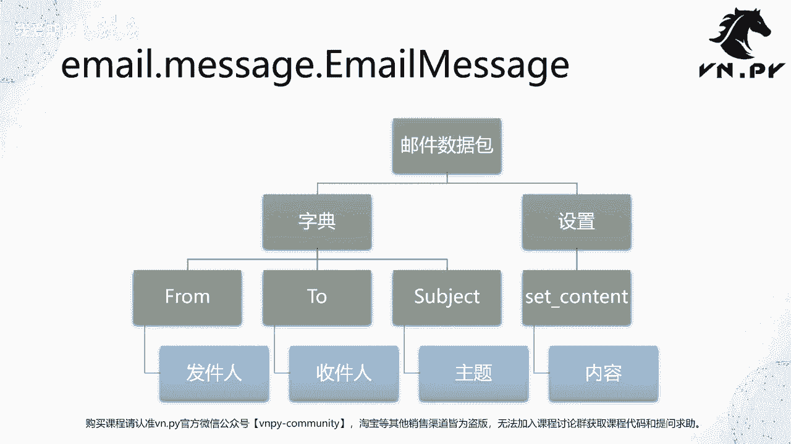
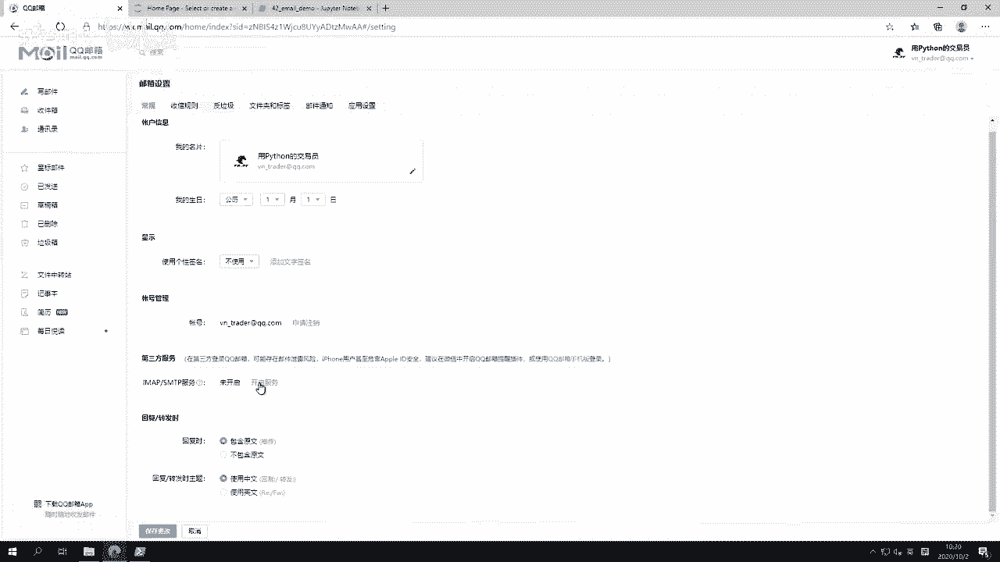
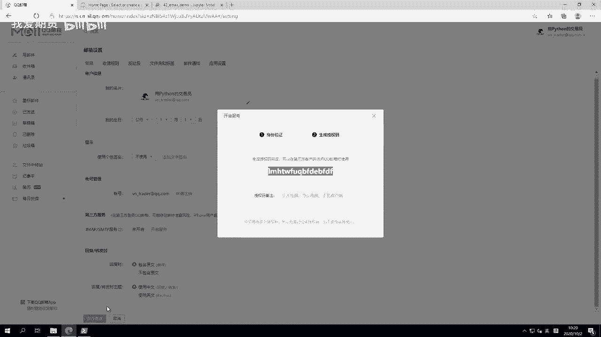
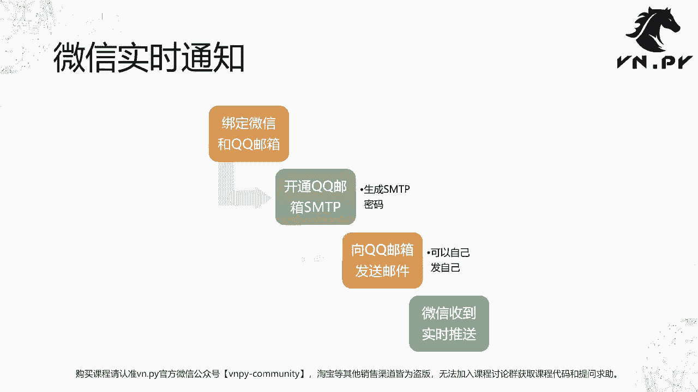

# Python量化开发：42：使用smtplib和email模块发送邮件 📧

## 概述
在本节课中，我们将学习如何使用Python的`smtplib`和`email`模块来发送电子邮件。我们将了解如何构建邮件数据包，并通过SMTP服务器将其发送出去。整个过程分为两个核心步骤：打包邮件和传输邮件。

## 邮件发送原理
发送邮件的过程类似于寄送快递。首先，你需要将内容（如文件或信息）放入一个“信封”中，并填写收件人和发件人信息。这个“打包”过程由`email`模块完成。接着，你需要将打包好的邮件交给“快递员”，即通过`smtplib`模块连接到SMTP服务器，由服务器负责将邮件投递到目的地。

## 核心模块与类
我们将使用以下模块和类：
- `smtplib`：用于建立SMTP连接并发送邮件。
- `email.message.EmailMessage`：用于构建邮件数据包。
- `datetime.datetime`：用于生成邮件发送的时间戳。



以下是导入这些模块的代码：
```python
import smtplib
from email.message import EmailMessage
from datetime import datetime
```

## 构建邮件数据包
上一节我们介绍了邮件发送的基本原理，本节中我们来看看如何具体构建一封邮件。

我们使用`EmailMessage`类来创建邮件对象。需要设置三个基本字段：发件人(`From`)、收件人(`To`)和邮件主题(`Subject`)。邮件正文内容则通过`set_content`方法单独设置。

以下是创建邮件数据包的步骤代码：
```python
# 创建邮件对象
msg = EmailMessage()

# 设置邮件头信息
msg['From'] = 'your_email@qq.com'  # 发件人邮箱
msg['To'] = 'recipient@qq.com'     # 收件人邮箱
msg['Subject'] = '测试邮件'         # 邮件主题

# 设置邮件正文内容
content = f"发送邮件的本地时间为：{datetime.now()}"
msg.set_content(content)



# 打印邮件对象查看结构
print(msg)
```
运行上述代码后，你会看到邮件对象的结构，其中正文部分可能经过Base64编码，并非直接可读。



## 配置QQ邮箱SMTP服务
在发送邮件之前，需要对QQ邮箱进行一些配置，主要是获取SMTP服务器的授权码（密码）。

以下是需要完成的配置步骤：
1.  登录QQ邮箱网页版 (`mail.qq.com`)。
2.  点击右上角设置图标，进入“设置”页面。
3.  找到“账户”选项卡，向下滚动到“POP3/IMAP/SMTP/Exchange/CardDAV/CalDAV服务”部分。
4.  开启“POP3/SMTP服务”，系统会提示你扫码验证身份。
5.  验证成功后，会获得一个**授权码**。**请务必保存好这个授权码，它就是你在程序中登录SMTP服务器所需的密码，而非你的QQ或微信密码。**

同时，我们需要知道QQ邮箱SMTP服务器的地址和端口：
-   **服务器地址**：`smtp.qq.com`
-   **端口**：`465` (使用SSL加密)

## 发送邮件
邮件打包完成后，接下来就是通过SMTP服务器将其发送出去。

我们使用`smtplib.SMTP_SSL`类来建立一个安全的SMTP连接。这里使用`with`语句可以确保连接在使用后被正确关闭。

以下是发送邮件的完整代码：
```python
# QQ邮箱SMTP服务器信息
smtp_server = 'smtp.qq.com'
smtp_port = 465
from_addr = 'your_email@qq.com'  # 你的QQ邮箱
password = '你的授权码'           # 上一步获取的授权码

# 建立连接并发送邮件
with smtplib.SMTP_SSL(smtp_server, smtp_port) as smtp:
    smtp.login(from_addr, password)  # 登录邮箱
    smtp.send_message(msg)           # 发送邮件
print("邮件发送成功！")
```
执行这段代码后，邮件几乎会被瞬间发送到收件箱。

## 实现微信实时通知
一个非常实用的技巧是将QQ邮箱与微信绑定，这样当收到邮件时，微信会立即收到通知，无需频繁查看邮箱。

以下是实现此功能的步骤：
1.  在手机微信中，依次点击“我” -> “设置” -> “通用” -> “辅助功能”。
2.  找到“QQ邮箱提醒”功能并启用它。
3.  启用后，当你通过Python程序向绑定的QQ邮箱发送邮件时，微信会立刻收到推送通知，点击即可查看邮件内容。

这为实现程序运行状态通知、报警提醒等功能提供了极大的便利。在VN Trader等量化框架中，此类功能通常已被封装成更简单的函数供直接调用。

## 总结
本节课中我们一起学习了如何使用Python发送电子邮件。
1.  我们了解了邮件发送的两个核心步骤：**使用`email`模块打包邮件**和**使用`smtplib`模块传输邮件**。
2.  我们掌握了使用`EmailMessage`类构建包含发件人、收件人、主题和正文的邮件数据包。
3.  我们学会了如何配置QQ邮箱的SMTP服务，获取授权码，并使用`smtplib.SMTP_SSL`建立安全连接来发送邮件。
4.  最后，我们介绍了一个提升体验的技巧：通过绑定QQ邮箱与微信，实现邮件到达的实时微信通知。



通过掌握这些知识，你可以让Python程序在完成特定任务（如策略触发、程序报错、定时报告生成）时，自动发送邮件通知，极大地提升了程序的交互性和实用性。