# Python量化开发：43：logging模块入门教程 📝

## 概述

在本节课中，我们将要学习Python的`logging`模块。这个模块的主要功能是进行日志记录，它比简单的`print`语句功能更丰富。通过`logging`模块，我们可以将程序运行过程中的信息记录到文件或输出到屏幕，甚至通过网络发送到其他机器。这对于监控程序运行状态、调试错误至关重要。

上一节我们学习了如何用Python发送邮件，本节中我们来看看如何系统地记录程序运行的“足迹”。

---

## 日志模块的核心功能

`logging`模块提供了多种输出方式。你可以选择将日志内容记录到一个文件中，程序运行结束后可以随时查看。也可以选择将日志信息实时输出到屏幕上，类似于使用`print`函数。

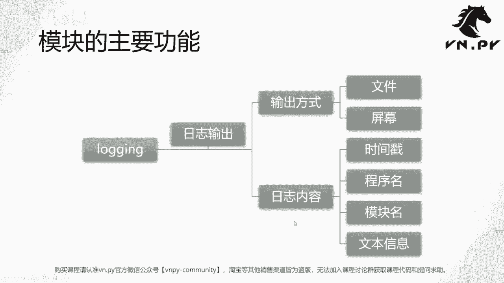

此外，`logging`模块还支持通过网络（如`socket`端口）将日志发送到局域网内的其他机器进行集中记录。不过，作为基础学习，本节课我们主要聚焦于**文件**和**屏幕**这两种最常用的输出方式。

在日志内容方面，`logging`模块可以自动记录多种信息，以下是几个最常用的部分：

*   **时间戳**：记录日志输出的具体时间。
*   **程序名/模块名**：记录是哪个程序或哪个模块输出的日志，这在多模块程序中定位问题非常有用。
*   **文本信息**：日志的主体内容，描述具体发生了什么事情。

---

## 日志的级别

日志分级是`logging`模块与`print`的核心区别之一。不同级别的日志代表不同的重要性，用于描述程序运行中的不同状况。

以下是五个从低到高的标准日志级别：

1.  **DEBUG**：调试信息，记录程序运行的详细细节，通常用于开发阶段。
    *   **公式/常量**：`logging.DEBUG` (数值为10)
2.  **INFO**：一般信息，记录程序正常运行过程中的关键事件。
    *   **公式/常量**：`logging.INFO` (数值为20)
3.  **WARNING**：警告信息，表示可能有问题或风险，但程序仍能运行。
    *   **公式/常量**：`logging.WARNING` (数值为30)
4.  **ERROR**：错误信息，表示程序运行中发生了错误，可能通过异常处理进行了捕获，但程序已处于非正常状态。
    *   **公式/常量**：`logging.ERROR` (数值为40)
5.  **CRITICAL**：严重错误信息，表示发生了导致程序无法继续运行的严重错误。
    *   **公式/常量**：`logging.CRITICAL` (数值为50)

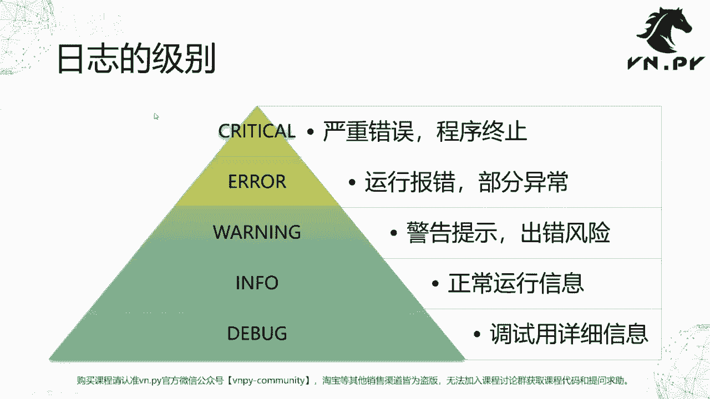

**设置规则**：当你为日志记录器或处理器设置一个级别（例如`INFO`）时，它只会处理**等于或高于**该级别的日志信息。例如，设置为`INFO`级别，则会记录`INFO`、`WARNING`、`ERROR`和`CRITICAL`级别的日志，而忽略`DEBUG`级别的日志。

---

## 实践操作：五步使用logging

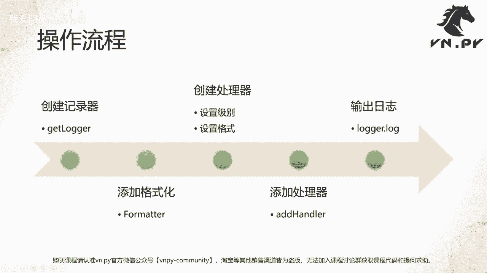

了解了核心概念后，我们通过Jupyter Notebook来实际操作。使用`logging`模块的基本流程可以分为以下五步：

1.  **创建记录器** (`getLogger`)
2.  **设置格式化器** (`Formatter`)
3.  **创建处理器** (`Handler`)，并为其设置级别和格式
4.  **将处理器添加到记录器** (`addHandler`)
5.  **使用记录器输出日志** (如 `logger.debug()`, `logger.info()`)

以下是每一步的详细操作和代码示例。

### 第一步：导入模块与简单示例

首先，我们导入`logging`模块，并体验一下最简单的日志输出。

```python
import logging

# 最简单的方式：直接使用logging模块的顶级函数输出一条严重错误日志
logging.critical(“这是一条CRITICAL级别的测试信息”)
print(“这是一条普通的print信息”)
```
运行后，你会看到`critical`日志通常以醒目的红色（在终端中）输出，而`print`输出则是普通样式。这体现了日志级别在视觉上的区分。

### 第二步：创建记录器与设置级别

正规的做法是创建一个专属的日志记录器对象。

```python
# 1. 创建一个日志记录器，’my_logger‘是它的名字
logger = logging.getLogger(‘my_logger’)

# 2. 设置记录器的处理级别。这里设置为DEBUG，意味着会处理所有级别的日志
logger.setLevel(logging.DEBUG)

# 查看各个日志级别对应的数值
print(‘DEBUG:’, logging.DEBUG)
print(‘INFO:’, logging.INFO)
print(‘WARNING:’, logging.WARNING)
print(‘ERROR:’, logging.ERROR)
print(‘CRITICAL:’, logging.CRITICAL)
```

**注意**：`getLogger`方法如果传入相同的名字，返回的是同一个记录器对象。这便于在程序的不同模块中共享同一个日志记录器。

### 第三步：创建格式化器与处理器（控制台输出）

接下来，我们创建格式化器来定义日志的输出格式，并创建处理器来决定日志输出到哪里。

以下是创建**控制台（屏幕）输出**的示例：

```python
# 3. 创建一个格式化器，定义日志的输出格式
# %(asctime)s – 时间
# %(levelname)s – 级别名称
# %(message)s – 日志内容
formatter = logging.Formatter(‘%(asctime)s – [%(levelname)s] – %(message)s’)

# 4. 创建一个流处理器（用于输出到控制台）
console_handler = logging.StreamHandler()
# 设置该处理器的处理级别
console_handler.setLevel(logging.DEBUG)
# 为该处理器设置格式
console_handler.setFormatter(formatter)

# 5. 将处理器添加到我们之前创建好的记录器上
logger.addHandler(console_handler)

# 测试：使用我们自己的记录器输出一条DEBUG日志
logger.debug(‘这是一条DEBUG级别的测试日志’)
```
现在，输出的日志就包含了我们定义的时间、级别和消息，格式清晰。

### 第四步：添加文件处理器

除了输出到屏幕，我们更常需要将日志保存到文件中。以下是创建**文件输出**的示例：

```python
# 创建一个文件处理器
# 参数：filename=文件名， mode=’a’表示追加模式， encoding=编码格式
file_handler = logging.FileHandler(‘test.log’, mode=’a’, encoding=’utf-8’)

# 设置文件处理器的级别为INFO（高于INFO的才会被记录到文件）
file_handler.setLevel(logging.INFO)
# 使用同一个格式化器（当然你也可以为文件创建不同的格式）
file_handler.setFormatter(formatter)

# 将文件处理器也添加到记录器
logger.addHandler(file_handler)
```

**关键点**：文件处理器模式使用`’a’`（append，追加），可以保证每次运行程序时，新的日志会添加在旧日志之后，而不是覆盖掉。

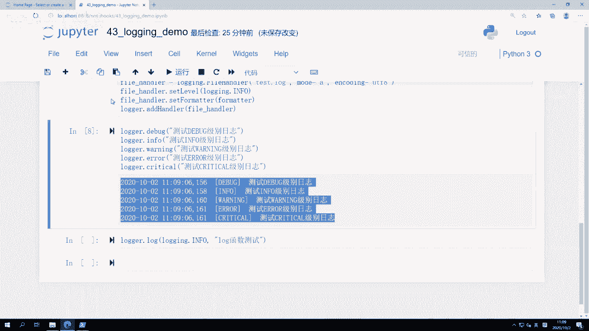

### 第五步：输出不同级别的日志并验证

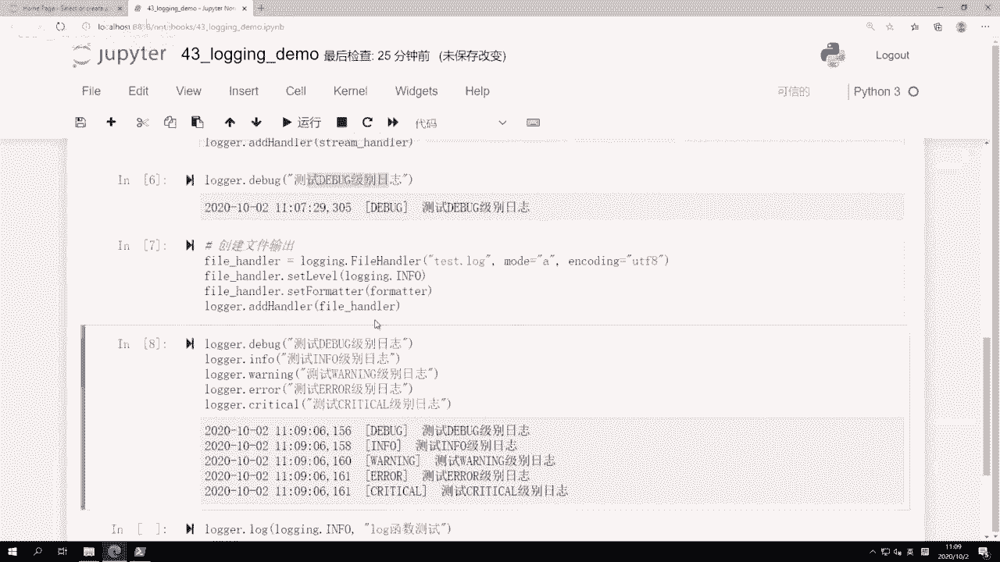

现在，我们的记录器同时连接了控制台和文件两个处理器。让我们输出所有级别的日志，看看效果。

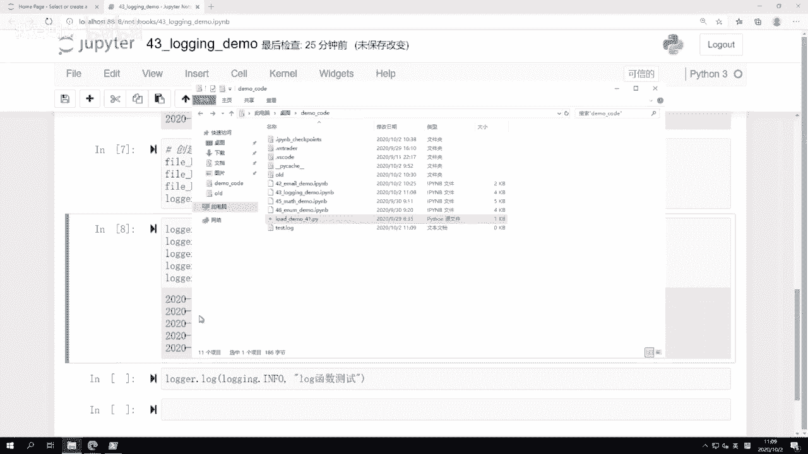

```python
# 输出不同级别的日志
logger.debug(‘Debug级别信息’)
logger.info(‘Info级别信息’)
logger.warning(‘Warning级别信息’)
logger.error(‘Error级别信息’)
logger.critical(‘Critical级别信息’)
```

**运行结果分析**：
*   **控制台**：由于控制台处理器级别为`DEBUG`，所以所有5条日志都会显示。
*   **文件 (test.log)**：由于文件处理器级别为`INFO`，所以只记录`INFO`、`WARNING`、`ERROR`、`CRITICAL`这4条日志，`DEBUG`日志被过滤掉了。

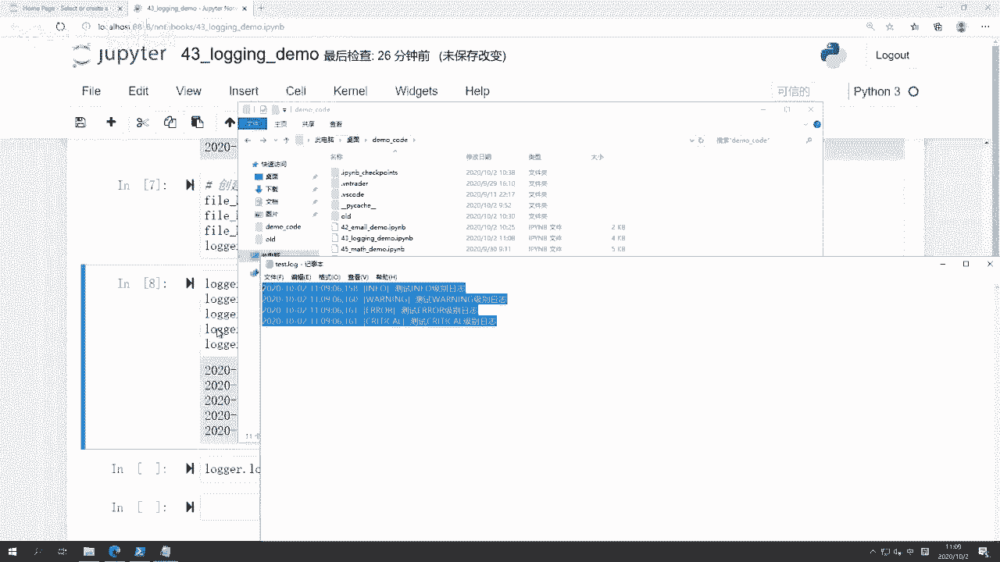

你可以打开当前目录下生成的`test.log`文件进行验证。

### 补充：使用通用的log方法

除了调用`logger.debug()`, `logger.info()`等具体级别的方法，还可以使用一个通用的`logger.log()`方法，通过参数指定级别。

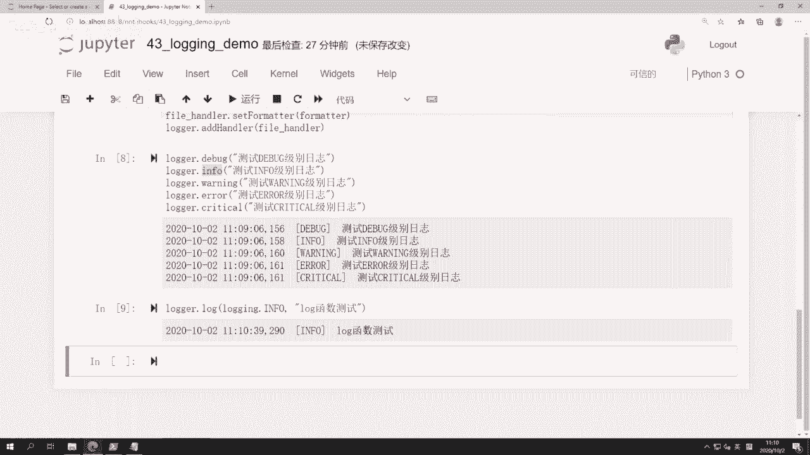

```python
# 使用log方法输出INFO级别日志，等价于 logger.info(…)
logger.log(logging.INFO, ‘使用log函数测试INFO信息’)
```

---

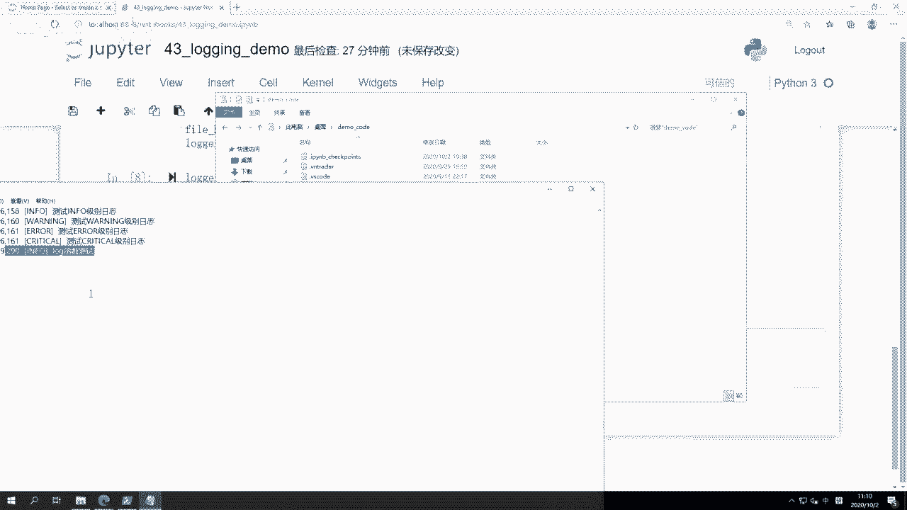

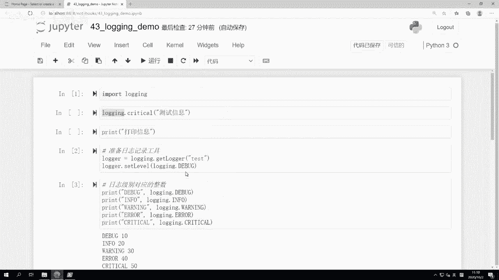

## 总结

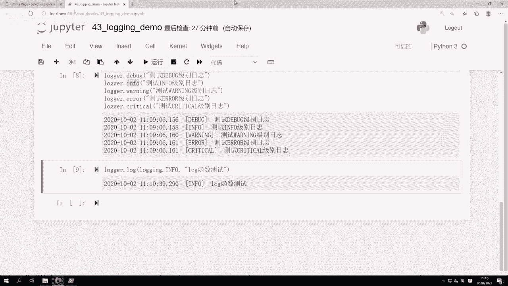

本节课中我们一起学习了Python `logging`模块的基础知识。我们了解了：
1.  `logging`模块相比`print`的优势在于**结构化输出**和**分级过滤**。
2.  日志的五个标准级别：**DEBUG、INFO、WARNING、ERROR、CRITICAL**及其含义。
3.  使用`logging`模块的**标准五步流程**：获取记录器、设置格式、创建处理器、绑定处理器、记录日志。
4.  如何将日志同时输出到**控制台**和**文件**，并为它们设置不同的记录级别。

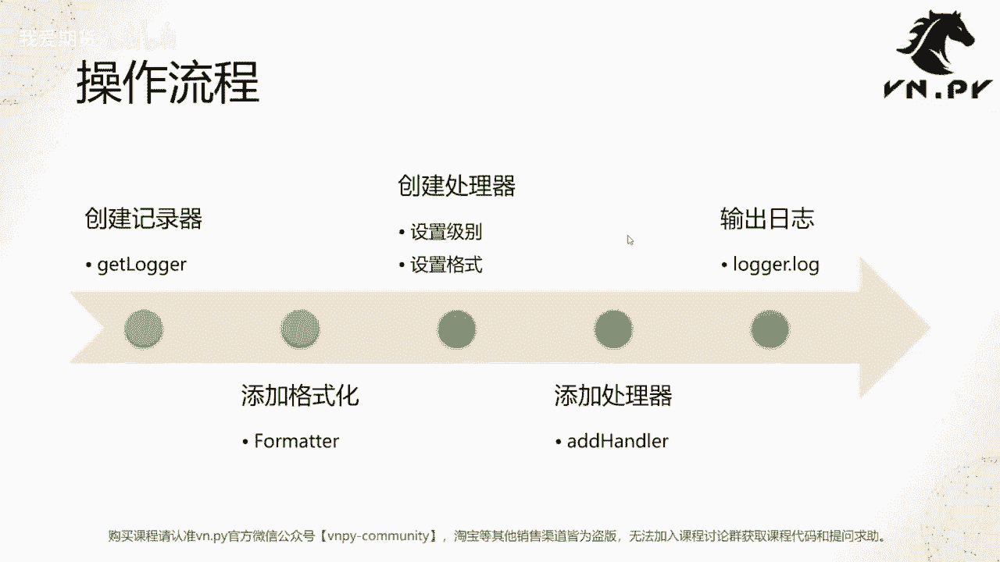

`logging`模块是构建健壮程序的重要组成部分。掌握它之后，你就可以在量化交易程序或其他项目中，有效地追踪和诊断代码的运行情况了。在后续的实践中，我们会更深入地应用这些知识。