# 量化交易零基础入门：44：日志记录引擎 🔧

在本节课中，我们将学习 VeighNa 框架内部基于 Python `logging` 模块开发的日志记录引擎。我们将了解其工作流程、配置方法以及如何扩展它以记录不同模块的日志。

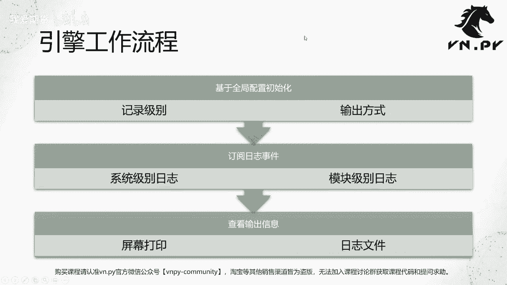

## 概述 📋

上一节我们介绍了如何使用 Python 的 `logging` 模块记录日志。本节中，我们将深入 VeighNa 框架内部，学习其内置的日志记录引擎 `LogEngine`。这个引擎封装了 `logging` 模块，提供了更便捷的配置和全局日志管理功能。

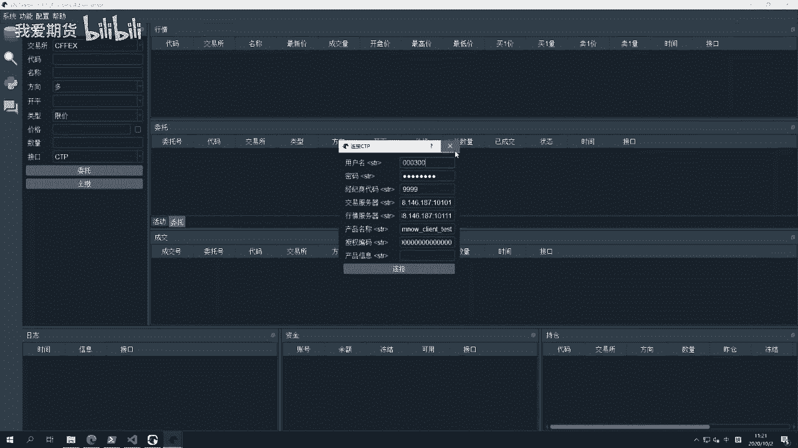

## 日志引擎工作流程

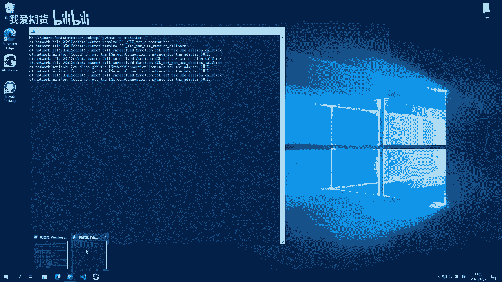

日志引擎的工作流程主要分为三步。

### 1. 初始化

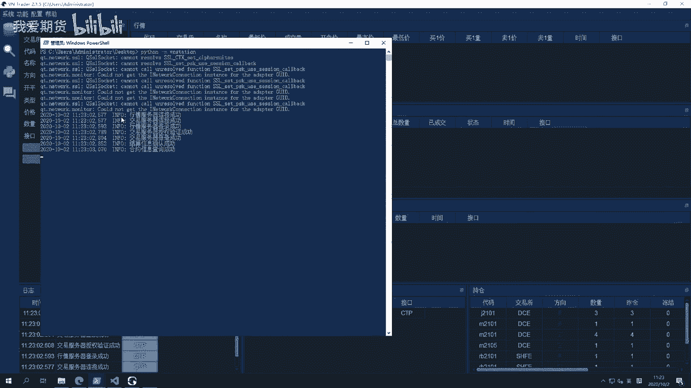

初始化基于 VeighNa 内部的全局配置实现。初始化时主要用到两个参数：
*   **记录级别**：决定什么级别及以上的日志才会被记录。
*   **输出方式**：决定日志是输出到终端（Console）、文件（File），还是两者都不输出。

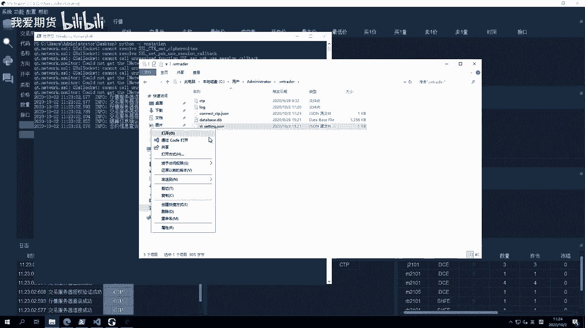

### 2. 订阅日志事件

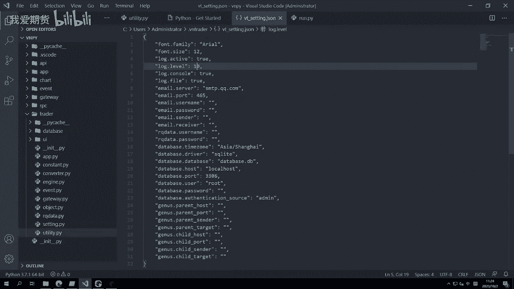

默认情况下，VeighNa 的日志引擎只处理系统级别的日志（即底层核心模块的日志）。你也可以手动添加对其他模块级别日志的处理。

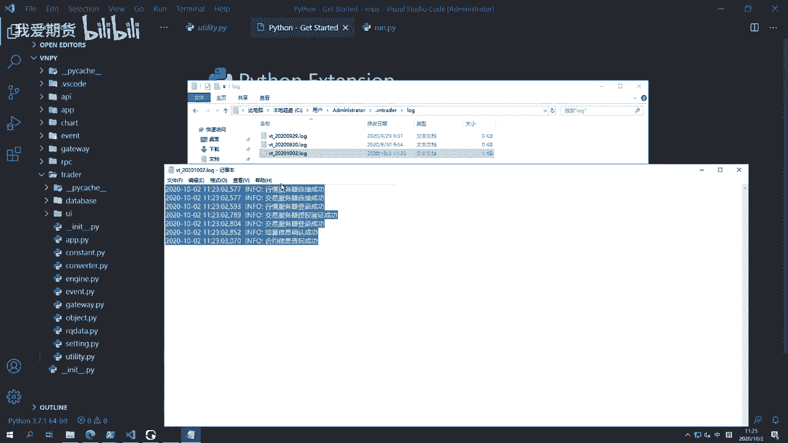

### 3. 查看输出信息

初始化并订阅事件后，即可查看日志。你可以在屏幕上看到实时打印的日志信息，也可以在指定的日志文件中查看历史记录。

## 配置与使用演示

接下来，我们通过代码来实际查看和配置日志引擎。

### 启动与配置

首先，启动 VeighNa Trader。在图形界面中，点击配置按钮，可以找到与日志相关的几个选项：
*   `log.active`：是否启动日志功能。
*   `log.level`：当前记录的日志级别（例如，50 对应 `CRITICAL`，10 对应 `DEBUG`）。
*   `log.console`：是否在终端输出信息。
*   `log.file`：是否将日志记录到文件。

修改配置（例如将 `log.level` 改为 10 以记录 `DEBUG` 级别日志）后需要重启 VeighNa Trader 才能生效。

### 查看日志输出

为了在终端看到日志输出，需要通过命令行启动 VeighNa Station：
```bash
python -m vnstation
```
登录并启动 VeighNa Trader Pro 后，连接一个交易接口（如 CTP）。此时，在命令行终端和日志文件中都能看到相应的日志输出。

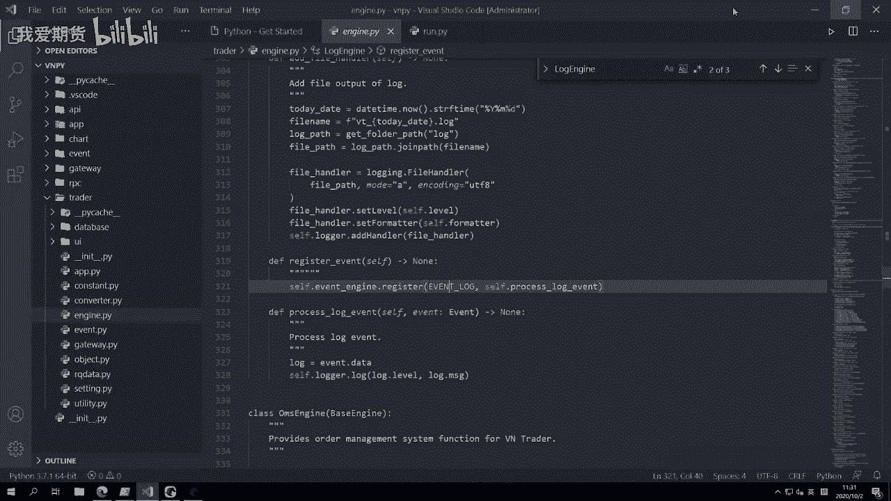

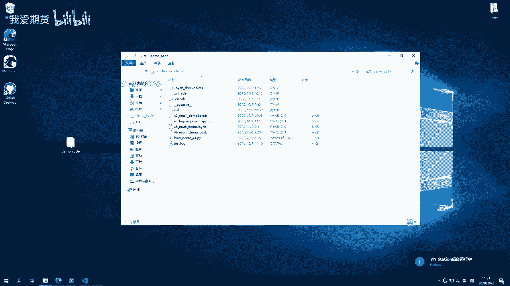

日志文件默认存储在用户目录下的 `.vntrader/log/` 文件夹中，按日期命名（例如 `vt_20241002.log`）。该目录还会存放数据库、全局配置等 VeighNa 运行时的相关文件。

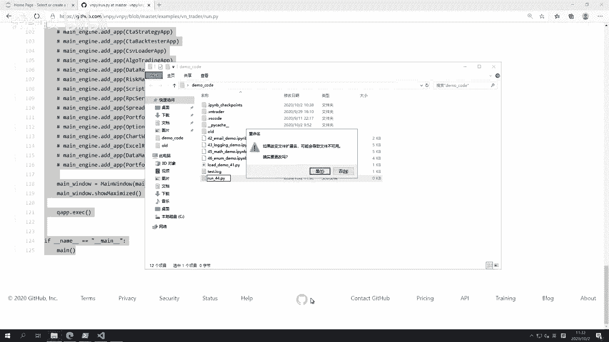

## 代码解析：LogEngine 类

现在，我们深入 `veighna/trader/engine.py` 文件，查看 `LogEngine` 类的核心逻辑。

### 初始化逻辑

`LogEngine` 的初始化方法首先检查全局配置 `settings[“log.active”]`。如果为 `False`，则跳过初始化；如果为 `True`，则进行以下操作：
1.  读取配置的日志级别 `log.level`。
2.  创建一个全局的 `logging.Logger` 对象，命名为 `“vnpy”`。
3.  设置该 `logger` 的级别和格式。
4.  **关键步骤**：先添加一个 `NullHandler`。这是为了避免出现 “No handlers could be found” 的错误，确保 `logger` 至少有一个处理器。
5.  根据 `log.console` 和 `log.file` 的配置，决定是否创建并添加 `StreamHandler`（控制台输出）和 `FileHandler`（文件输出）。文件处理器会按日期生成日志文件，路径通过 `get_folder_path(“log”)` 函数构建。

### 注册事件监听

VeighNa 内部使用事件驱动机制来异步传递信息（如行情、日志、策略状态）。`LogEngine` 通过以下代码注册对系统日志事件的监听：
```python
self.event_engine.register(EVENT_LOG, self.process_log_event)
```
这行代码告诉事件引擎：当类型为 `EVENT_LOG` 的事件发生时，就调用 `self.process_log_event` 函数进行处理。在该函数中，引擎从事件数据中提取日志信息，并调用 `logger.log` 方法进行记录。

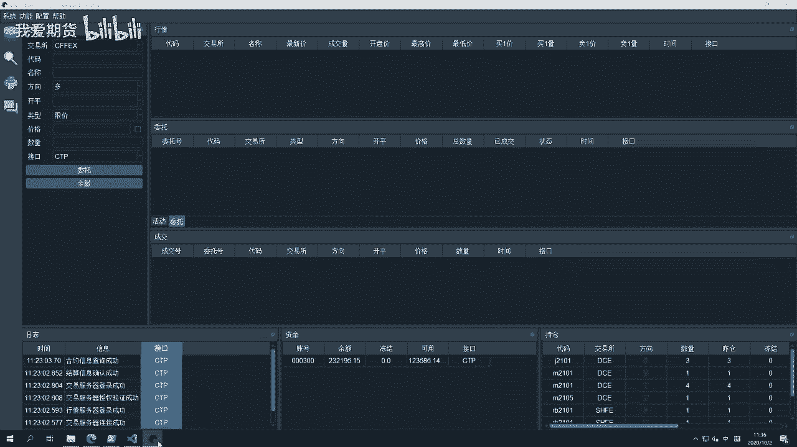

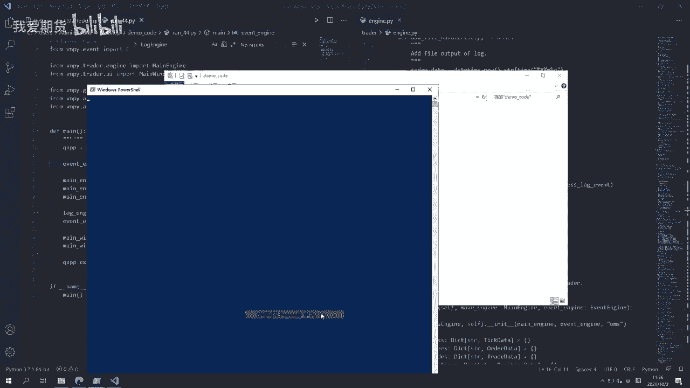

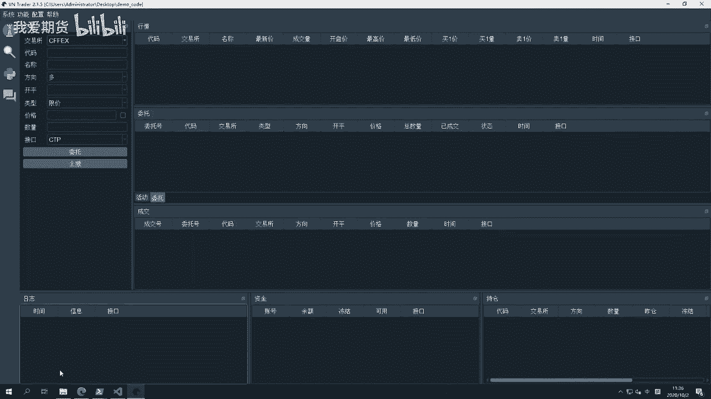

## 扩展：记录模块日志

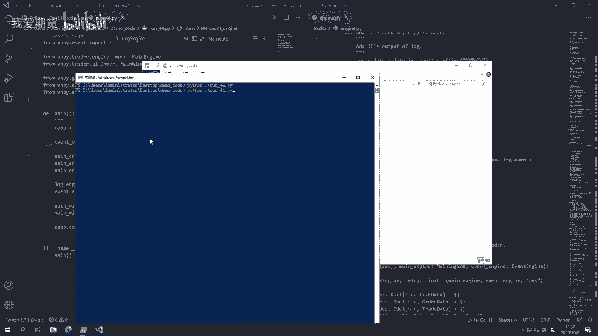

默认的 `LogEngine` 只处理系统事件 `EVENT_LOG`。要记录特定模块（如 CTA 策略模块）的日志，需要额外注册对该模块特定日志事件的监听。

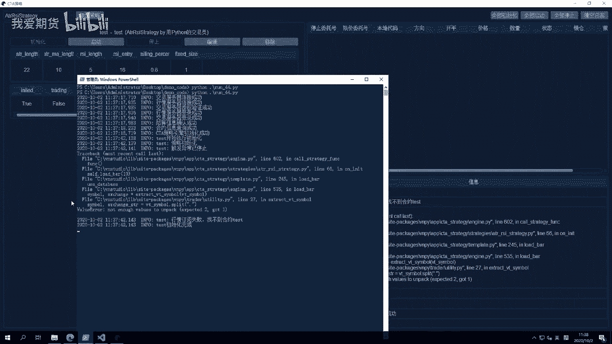

以下是实现方法：
1.  在启动脚本中，获取主引擎中的 `LogEngine` 实例。
2.  通过该引擎的事件引擎，注册对模块日志事件（如 `EVENT_CTA_LOG`）的监听，并指定处理函数为 `LogEngine` 的 `process_log_event` 方法。

示例代码如下：
```python
# 获取日志引擎实例
log_engine = main_engine.get_engine(“log”)
# 注册对CTA策略模块日志事件的监听
main_engine.event_engine.register(EVENT_CTA_LOG, log_engine.process_log_event)
```
完成上述操作后，CTA 策略模块产生的日志也会被统一记录到控制台和日志文件中。VeighNa 内部大部分模块的日志都使用相同的 `LogData` 数据结构，因此可以方便地扩展以监听更多模块的日志事件。

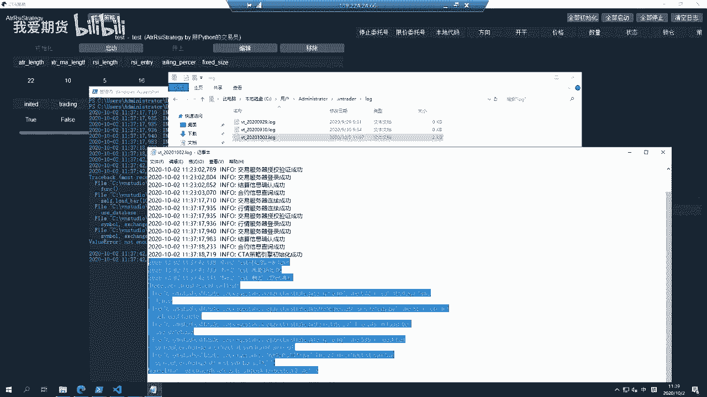

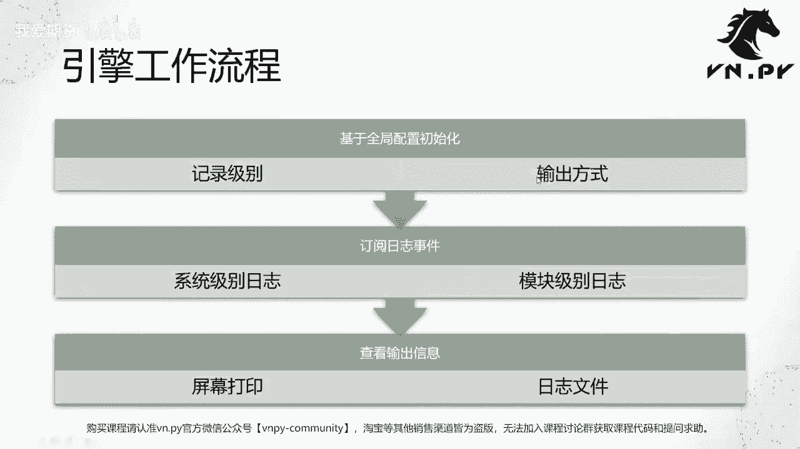

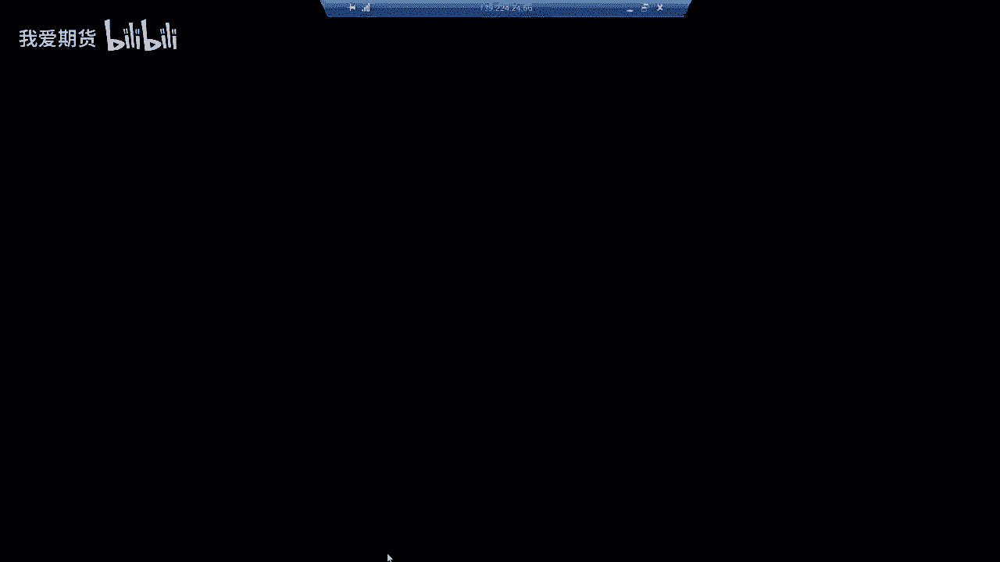

## 总结 🎯

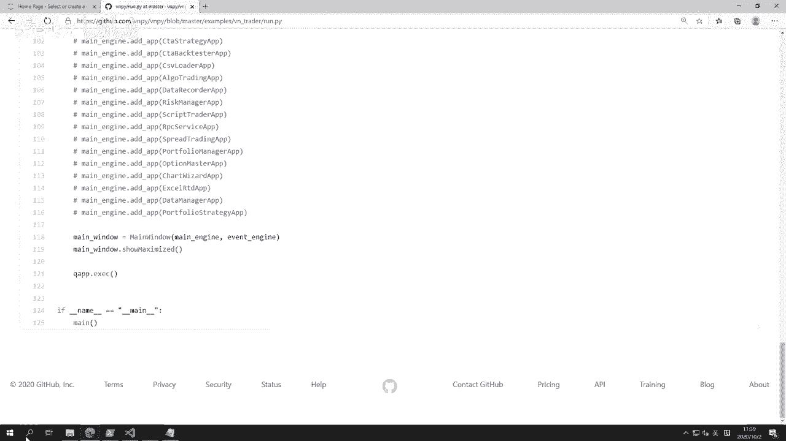

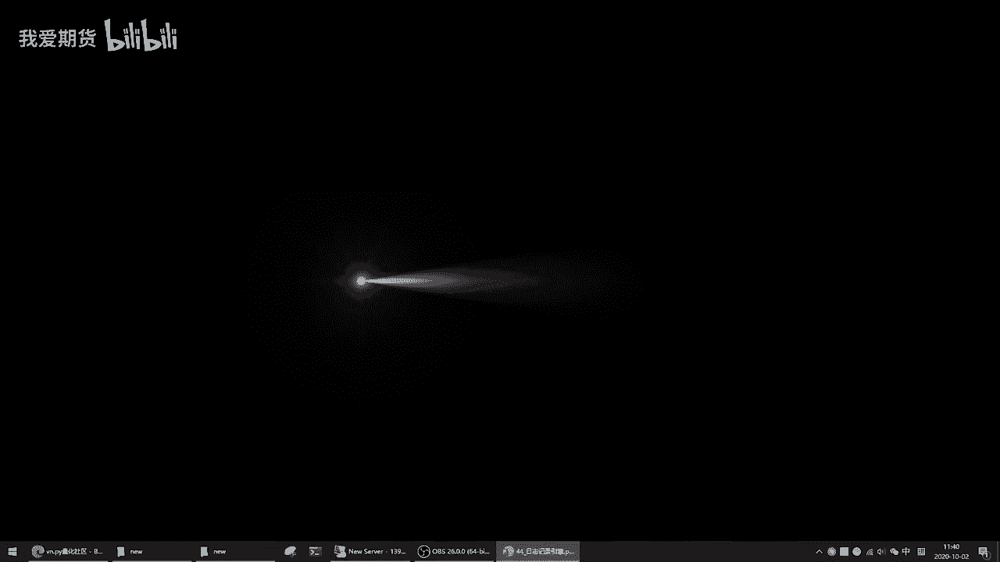

本节课我们一起学习了 VeighNa 框架的日志记录引擎。我们了解了它的三步工作流程：初始化、订阅事件和查看输出。通过图形界面和配置文件，我们可以灵活地设置日志级别和输出目的地。通过分析 `LogEngine` 的源代码，我们理解了其初始化和事件监听的内部机制。最后，我们还学习了如何通过注册额外的事件监听，来扩展日志引擎以记录更多模块的日志信息。掌握日志引擎的使用，对于开发和调试复杂的量化交易程序至关重要。