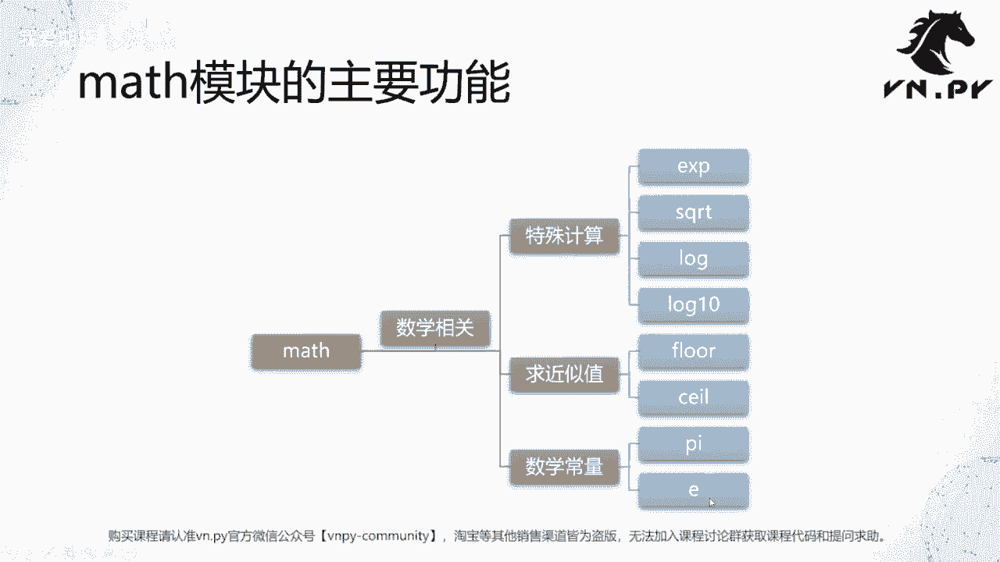
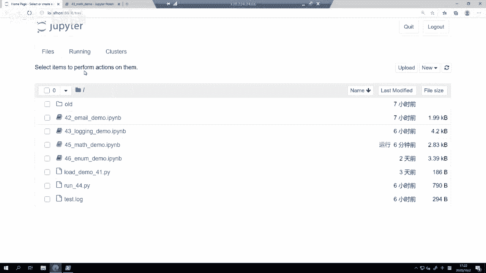
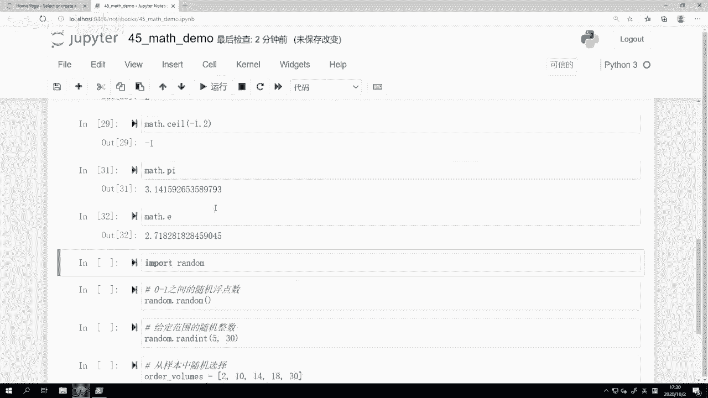
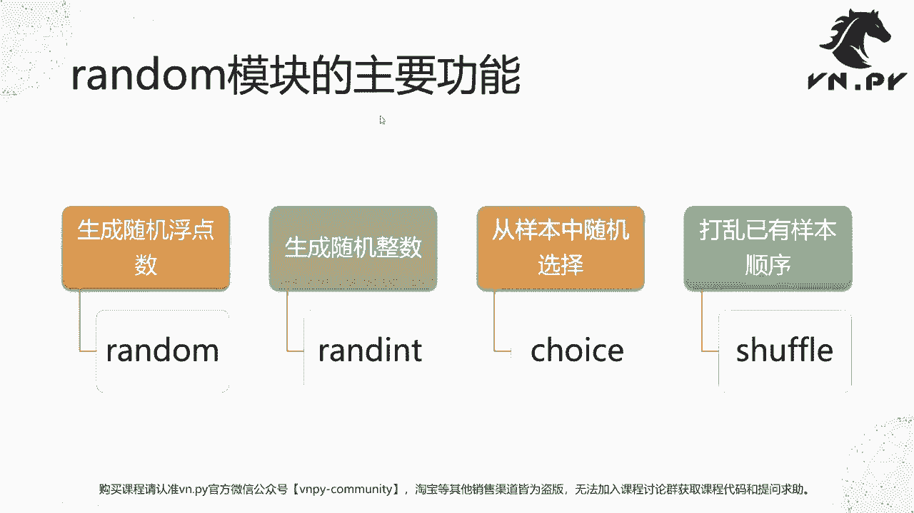
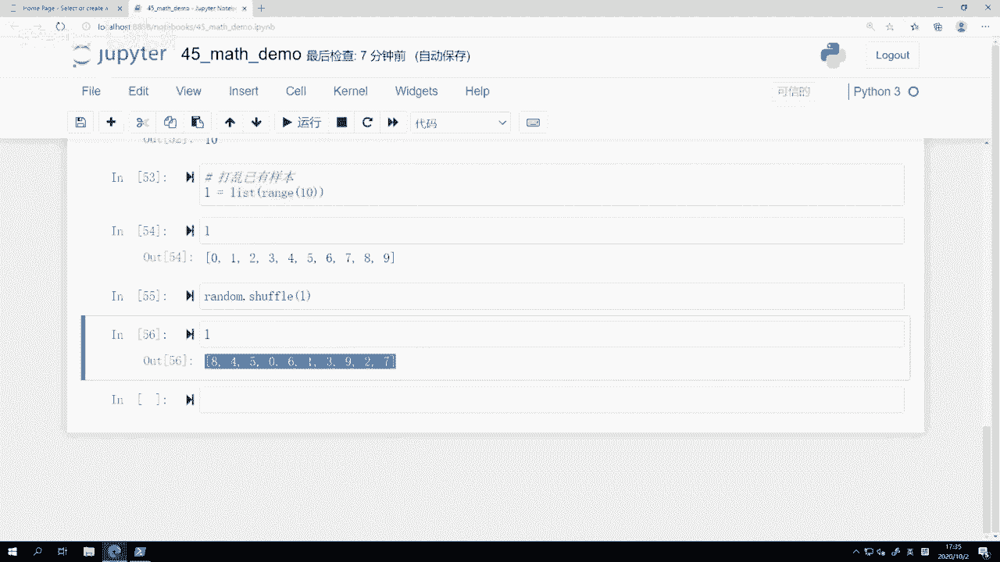

# Python量化开发：45：math与random模块详解 📚

在本节课中，我们将学习Python中两个与数学计算相关的内置模块：`math`和`random`。`math`模块提供了丰富的数学函数和常量，而`random`模块则用于生成各种随机数。掌握这两个模块对于量化开发中的数值计算和模拟至关重要。

## 45.1：math模块的核心功能 🔢

上一节我们介绍了日志引擎，本节中我们来看看`math`模块。顾名思义，`math`模块主要提供与数学计算相关的功能。该模块下的函数大体可分为三类：特殊数学计算函数、近似值计算函数以及数学常量。



以下是`math`模块中一些核心函数的分类介绍：



*   **特殊计算函数**：例如求指数的`exp`、求平方根的`sqrt`、求对数的`log`和`log10`。
*   **近似值计算函数**：例如向下取整的`floor`和向上取整的`ceil`。
*   **数学常量**：例如圆周率 **`math.pi`** 和自然常数 **`math.e`**。

接下来，我们将在Jupyter环境中逐一演示这些函数的具体用法。


```python
import math
```

### 指数与平方根

首先，我们来看指数函数`math.exp`。该函数用于计算自然常数e的x次方。

```python
# 计算 e 的 1 次方，即 e 本身
print(math.exp(1))
# 输出：2.718281828459045

# 计算 e 的 2 次方
print(math.exp(2))
# 输出：7.38905609893065
```

其次，平方根函数`math.sqrt`用于计算一个数的平方根。需要注意的是，返回值始终是浮点数类型。

```python
# 计算 4 的平方根
print(math.sqrt(4))
# 输出：2.0

# 计算 8 的平方根
print(math.sqrt(8))
# 输出：2.8284271247461903
```

### 对数计算

`math`模块提供了两种对数函数。`math.log`默认以自然常数e为底，而`math.log10`则以10为底。

```python
# 计算 e 的自然对数，结果应为 1
print(math.log(math.e))
# 输出：1.0

# 计算 1000 的以10为底的对数，结果应为 3
print(math.log10(1000))
# 输出：3.0
```

### 向上与向下取整

在量化交易中，计算委托数量时经常需要处理非整数。`math.floor`（向下取整）和`math.ceil`（向上取整）函数在此非常有用。

以下是这两个函数的使用示例和注意事项：

```python
# 向下取整 floor
print(math.floor(4.5))  # 输出：4
print(math.floor(-4.5)) # 输出：-5 (注意：是向数值更小的方向取整)

# 向上取整 ceil
print(math.ceil(1.2))   # 输出：2
print(math.ceil(-1.2))  # 输出：-1 (注意：是向数值更大的方向取整)

# 对于本身就是整数的浮点数，取整后得到其本身
print(math.floor(4.0))  # 输出：4
print(math.ceil(4.0))   # 输出：4
```

**应用场景**：例如在价差交易中，计算出的对冲腿数量可能是3.8手，但交易接口要求整数手数。此时，可以选择使用`floor(3.8)=3`先对冲3手，剩余部分等待后续交易机会，这比简单四舍五入能更好地控制风险敞口。

### 数学常量

最后，`math`模块提供了两个常用的数学常量，直接使用它们能获得更精确和高效的计算结果。

```python
# 圆周率 π
print(math.pi)
# 输出：3.141592653589793

# 自然常数 e
print(math.e)
# 输出：2.718281828459045
```



## 45.2：random模块的随机操作 🎲

了解了`math`模块的确定性计算后，本节我们转向`random`模块，它用于生成各种随机结果，在模拟测试和算法交易中应用广泛。

`random`模块主要提供四类功能：生成随机浮点数、生成范围内随机整数、从样本中随机选择以及打乱序列顺序。



以下是`random`模块四个核心函数的介绍：

*   **`random()`**：生成一个[0.0, 1.0)范围内的随机浮点数。
*   **`randint(a, b)`**：生成一个[a, b]范围内的随机整数（包含两端）。
*   **`choice(seq)`**：从非空序列`seq`中随机选择一个元素。
*   **`shuffle(x)`**：将序列`x`的元素顺序随机打乱（原地修改）。

现在，让我们在代码中看看它们的具体表现。


```python
import random
```

### 生成随机浮点数

`random.random()`是最基础的函数，用于生成0到1之间的随机小数。

```python
# 每次调用结果都不同
print(random.random())
# 可能输出：0.374448871756...
```

### 生成范围内随机整数

`random.randint(a, b)`在指定范围内生成随机整数，在算法下单中用于分散订单量，避免暴露交易意图。

```python
# 生成一个5到30之间（含5和30）的随机整数
print(random.randint(5, 30))
# 可能输出：21
```

### 从样本中随机选择

`random.choice(seq)`允许你从一个预定义的列表中随机选取一个值，而不是从一个连续区间中选取。

```python
# 从给定列表中随机选择一个手数
hand_list = [2, 10, 14, 18, 30]
print(random.choice(hand_list))
# 可能输出：14
```

### 打乱序列顺序

`random.shuffle(x)`会将一个列表的元素顺序随机打乱。这在遗传算法优化参数等场景中非常有用。



```python
# 创建一个列表并打乱它
my_list = list(range(10))
print("原始列表:", my_list)

random.shuffle(my_list)
print("打乱后列表:", my_list)
# 输出示例：
# 原始列表: [0, 1, 2, 3, 4, 5, 6, 7, 8, 9]
# 打乱后列表: [7, 2, 9, 0, 3, 5, 1, 8, 4, 6]
```

## 总结 📝

本节课中我们一起学习了Python中两个重要的内置模块。
*   **`math`模块**：我们掌握了用于指数、平方根、对数计算的函数，理解了向上(`ceil`)和向下(`floor`)取整的区别及应用场景，并学会了使用圆周率(`pi`)和自然常数(`e`)这两个常量。
*   **`random`模块**：我们学习了生成随机浮点数(`random`)、指定范围随机整数(`randint`)、从样本中随机选择(`choice`)以及打乱列表顺序(`shuffle`)的方法，了解了它们在量化交易（如算法下单）和策略优化中的实际用途。

这两个模块虽然功能直观，但却是构建复杂量化模型的基础工具。建议大家在VN Trader的源码中搜索相关关键词，观察它们在实际项目中的具体应用，以加深理解。