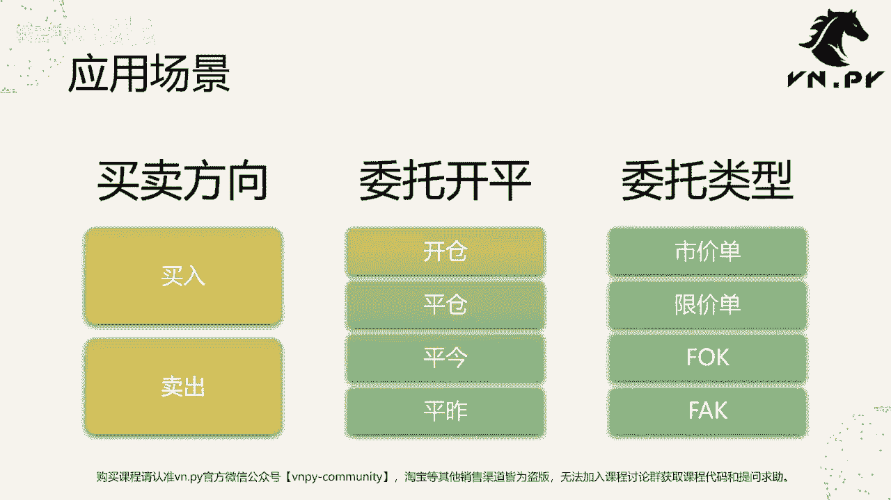
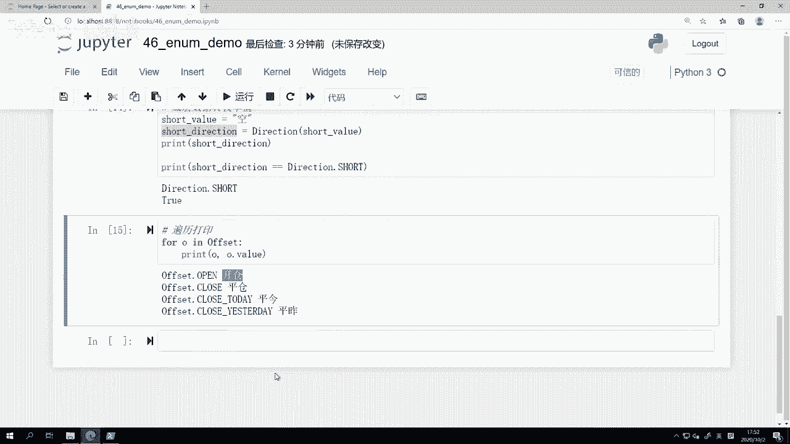

# 量化交易零基础入门：46：枚举和数据常量 📊

在本节课中，我们将学习Python中的`enum`（枚举）模块，了解如何使用它来定义和管理程序中的常量数据。枚举在量化交易开发中非常有用，常用于表示买卖方向、开平仓类型等固定不变的业务概念。

上一节我们介绍了用于数学计算的`math`和`random`模块。本节中，我们来看看如何用枚举优雅地表示数据常量。

## 什么是枚举？

枚举的英文是`enumerator`，缩写为`ENUM`。在Python中，枚举是一个类，必须继承自`enum`模块中的`Enum`类。它用于表示一组相关的、在程序运行过程中**不会改变**的常量数据。

这些常量通常代表某种业务功能。例如：
*   买卖方向：`买` 和 `卖`。
*   开平仓操作：`开仓`、`平仓`、`平今`、`平昨`。
*   委托类型：`限价单`、`市价单`、`FAK`、`FOK`等。

使用枚举不仅能使代码含义更清晰（用`Direction.LONG`代替魔数`1`），在某些情况下还能带来性能优势，因为枚举值之间的比较可能比直接比较整数或字符串更快。




接下来，我们将通过三个应用场景来学习枚举的使用：买卖方向、委托开平和委托类型。

## 枚举的基本操作

我们将分五步学习枚举的核心操作：
1.  **定义枚举**
2.  **用于类型提示**
3.  **枚举值转原始数据**
4.  **原始数据转枚举值**
5.  **遍历所有枚举值**

以下是具体实现：

### 1. 定义枚举

首先，从`enum`模块导入`Enum`类。

```python
from enum import Enum
```

然后，定义一个表示买卖方向的枚举类。Python中常量的命名惯例是使用全大写字母。

```python
class Direction(Enum):
    LONG = "多"
    SHORT = "空"
```

现在，我们可以使用这个枚举：

```python
order_direction = Direction.LONG
print(order_direction)  # 输出: Direction.LONG
```

如果不使用枚举，直接定义常量，打印的结果将是原始字符串`"多"`，而不是一个具有明确类型的枚举对象。

我们再定义一个更复杂的开平仓枚举：

```python
class Offset(Enum):
    OPEN = "开仓"
    CLOSE = "平仓"
    CLOSETODAY = "平今"
    CLOSEYESTERDAY = "平昨"
```

### 2. 用于类型提示

枚举类可以很好地用于函数参数和类属性的类型声明，这能让代码编辑器提供智能提示，并使代码更易读。

以下是一个使用枚举类型提示的发单函数：

```python
def send_order(
    vt_symbol: str,
    price: float,
    volume: int,
    direction: Direction,  # 使用Direction枚举作为类型提示
    offset: Offset         # 使用Offset枚举作为类型提示
) -> None:
    pass  # 函数具体逻辑
```

在定义一个成交数据类时，也可以使用枚举作为属性的类型提示，并为其设置合理的默认值（通常为`None`）。

```python
class TradeData:
    def __init__(self):
        self.vt_symbol: str = ""
        self.price: float = 0.0
        self.volume: int = 0
        self.direction: Direction = None  # 枚举类型默认设为None
```

### 3. 枚举值转原始数据

有时我们需要获取枚举值底层存储的原始数据（字符串或整数），例如为了将数据保存到JSON文件。

```python
# 创建一个枚举实例
direction = Direction.LONG
print(direction)        # 输出: Direction.LONG

# 获取其底层值
value = direction.value
print(value)            # 输出: 多
```

每个枚举常量都有一个`.value`属性，用于访问定义时传入的原始数据。

### 4. 原始数据转枚举值

当从文件（如JSON）中读取数据后，我们需要将字符串转换回程序中的枚举对象。

```python
# 假设我们从文件读到一个字符串 “空”
short_value = "空"

# 将其转换为枚举值
short_direction = Direction(short_value)
print(short_direction)  # 输出: Direction.SHORT

# 验证转换结果
print(short_direction == Direction.SHORT)  # 输出: True
```

通过调用枚举类`Direction(原始值)`，即可根据原始值构造出对应的枚举实例。

### 5. 遍历所有枚举值

枚举类是可迭代的，可以像遍历列表一样遍历其所有成员。这在需要生成下拉菜单选项等场景中非常有用。

```python
# 遍历Offset枚举的所有值
for o in Offset:
    print(f"枚举常量: {o}, 对应值: {o.value}")
```
输出结果类似于：
```
枚举常量: Offset.OPEN, 对应值: 开仓
枚举常量: Offset.CLOSE, 对应值: 平仓
...
```

通过`for`循环，我们可以方便地获取一个枚举类型下所有的常量及其对应的业务含义。

## 总结



本节课中我们一起学习了Python `enum`模块的核心用法。我们了解到枚举是定义程序常量的强大工具，它通过继承`Enum`类实现，能使代码更清晰、更安全。我们掌握了定义枚举、利用枚举进行类型提示、在枚举值与原始数据间相互转换以及遍历枚举成员这五项基本操作。在量化交易开发中，合理使用枚举来管理买卖方向、订单类型等固定数据，是编写高质量、可维护代码的重要一步。