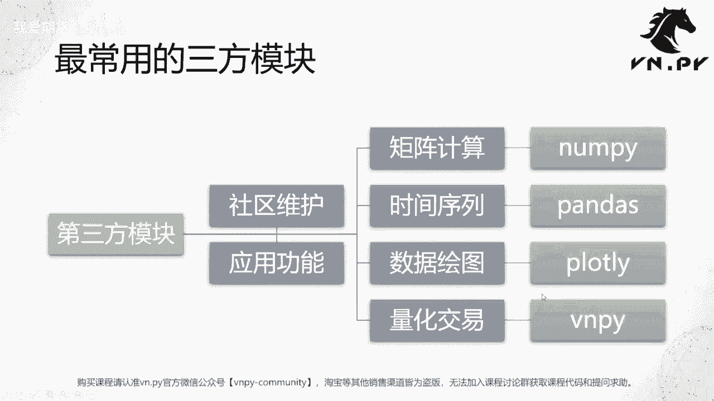
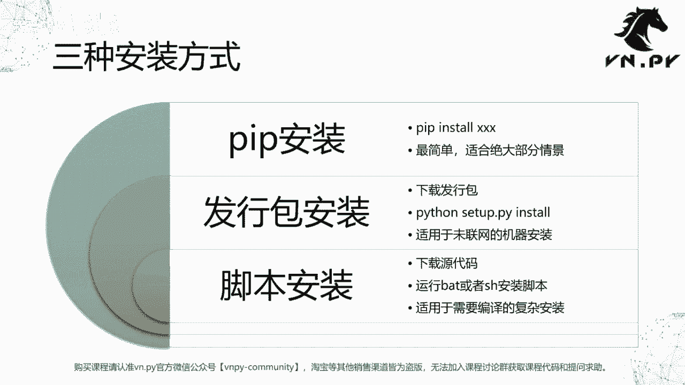
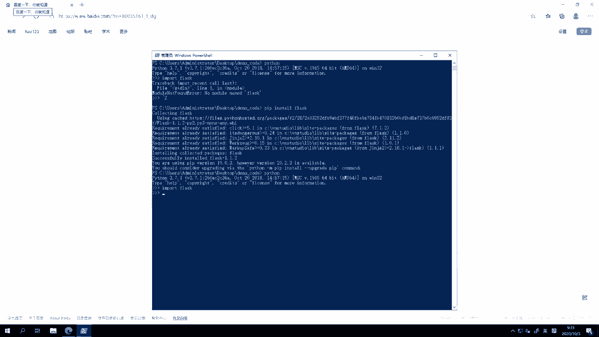
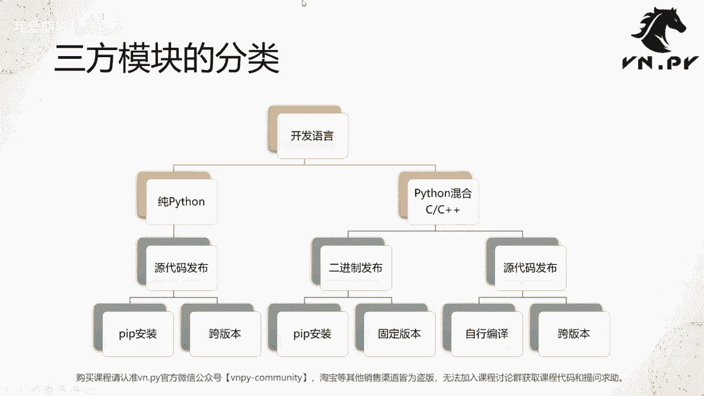

# 量化交易零基础入门：47：安装第三方模块 📦

在本节课中，我们将要学习如何安装Python的第三方模块。这是使用Python社区强大生态资源的第一步，对于后续的量化交易开发至关重要。

在之前我们花了十几节课的时间，学习了常用的Python内置模块的用法。从这节课开始，我们要来接触由Python社区所提供的第三方模块了。

## 什么是第三方模块？

第三方模块，也可简称为三方模块，整体上是由Python社区来维护的。与之对比的是Python内置模块，后者由Python官方团队维护。它们的主要区别是发行方不同。此外，三方模块通常更针对具体的应用功能领域。



例如，Python内置的`datetime`模块用于获取日期时间，其用途非常广泛。而三方模块则更有针对性。

以下是几个在量化交易领域特别常用的第三方模块：
*   **NumPy**：用于高效的矩阵计算。
*   **pandas**：专注于时间序列和表格数据的处理。
*   **Plotly**：用于数据可视化绘图（较老的版本中常用Matplotlib，现在我们更推荐Plotly）。
*   **VN.PY**：用于量化交易开发的框架（我们的模块名称为`vnpy`）。

## 主要的安装方式

整体上，安装第三方模块主要采用以下三种方式。有的模块支持多种方式，但通常会有一个最推荐的方法。

### 1. Pip安装 🚀
这是最简单的方式。在命令行（CMD或PowerShell）中直接运行 `pip install [模块名]` 即可。它适合绝大部分情景。

### 2. 发行包安装 📁
这种方式适合于没有联网的机器（例如券商内部的托管服务器）。你需要手动下载模块的发行包（安装包），传输到目标机器上，然后运行 `python setup.py install` 命令进行安装。

### 3. 脚本安装 ⚙️
这种方式相对复杂，适用于需要编译的复杂安装。你需要下载模块的所有源代码，然后运行其自带的安装脚本（Windows上是`.bat`文件，Linux上是`.sh`文件）来执行安装。



其中，**VN.PY就需要通过这种脚本安装的模式安装**。因为`vnpy`依赖的库较多，其中一些（如`TA-Lib`）需要C++编译，所以不支持简单的pip安装。官方提供了脚本安装方式，以及我们在课程一开始就安装好的**VN Studio完整发行版**（使用它则无需额外安装任何东西）。

今天，我们先重点看一下最常用的pip安装模式。

## Pip安装实战演示

上一节我们介绍了三种安装方式，本节中我们来看看如何使用Pip进行安装。

我们以安装一个名为`Flask`的模块为例。`Flask`是Python领域一个非常常用的Web开发框架。

首先，我们尝试在Python中导入它，会收到“ModuleNotFoundError”的错误，这表明该模块尚未安装。

```python
import flask  # 会报错：ModuleNotFoundError: No module named 'flask'
```



此时，我们退出Python环境，在命令行中直接运行安装命令。

```bash
pip install flask
```

命令执行后，pip会自动从网络下载`Flask`及其依赖包并完成安装。安装成功后，会显示“Successfully installed flask-x.x.x”的信息。此时，我们再回到Python中导入`Flask`，就可以成功加载了。

```python
import flask  # 现在可以成功导入
print(flask.__version__)  # 可以打印出版本号
```

## 模块类型与安装方式的关系

了解了基本安装方法后，我们进一步探讨不同模块类型与安装方式的关系。这有助于你在未来安装其他模块时做出正确选择。

Python的第三方模块，基于其开发语言，可以分为两大类：

1.  **纯Python模块**：全部由Python代码编写。
2.  **混合语言模块**：包含Python代码以及C或C++代码。

对于**纯Python模块**，安装通常非常简单。因为它们可以直接以源代码形式发布，几乎都支持通过`pip install`命令一键安装。这类模块通常也具有较好的跨Python版本兼容性。

对于**混合语言模块**，安装则复杂一些，主要分为两种发布形式：
*   **二进制发布**：模块开发者已预先将C/C++代码编译好，并打包发布。用户可以通过`pip install`直接安装编译好的二进制文件。但这种方式通常绑定特定的Python版本。
*   **源代码发布**：模块提供C/C++的源代码，需要用户在本地结合自己的Python环境进行编译。这种方式可以实现跨版本，但要求用户具备编译C/C++的能力，对初学者有一定门槛。

以下是安装方式选择的简单匹配：
*   对于纯Python模块和二进制发布的混合模块，**首选`pip install`**。
*   对于源代码发布的混合模块，可能需要使用`python setup.py install`或运行其提供的**安装脚本**。
*   像`vnpy`这样依赖复杂的模块，官方推荐使用**脚本安装**或直接使用**VN Studio集成环境**。

## 课程总结



本节课中我们一起学习了Python第三方模块的安装。我们首先了解了什么是第三方模块及其与内置模块的区别，并认识了量化交易中常用的几个三方模块。接着，我们详细介绍了三种主要的安装方式：Pip安装、发行包安装和脚本安装，并通过实战演示了最常用的Pip安装流程。最后，我们探讨了不同模块类型（纯Python与混合语言）与安装方式之间的关系，为你未来自主安装模块提供了清晰的指引。掌握这些是使用Python强大生态进行量化开发的基础。