# 量化交易零基础入门：48：手动安装vn.py

在本节课中，我们将学习如何手动安装vn.py量化交易框架。我们将对比集成环境与手动安装两种方案，并详细演示手动安装的完整流程，包括准备Python环境、下载源代码以及执行安装脚本。

## 方案对比

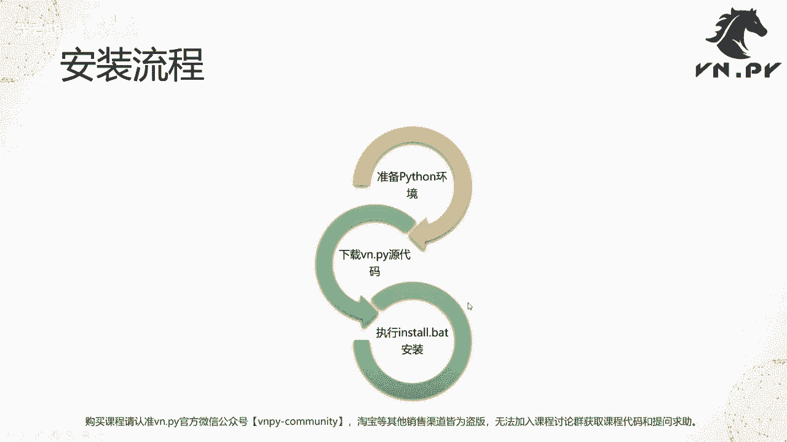

上一节我们介绍了第三方模块的安装，本节中我们来看看如何手动安装vn.py。首先，我们需要了解两种主要的安装方案。

以下是两种安装方案的对比：

*   **集成环境 (VN Studio)**
    *   **优点**：预装了vn.py运行所需的所有依赖库，由官方团队维护和更新，环境配置简单，适合初学者。
    *   **适用人群**：量化交易初学者，希望快速上手、避免环境配置问题的用户。

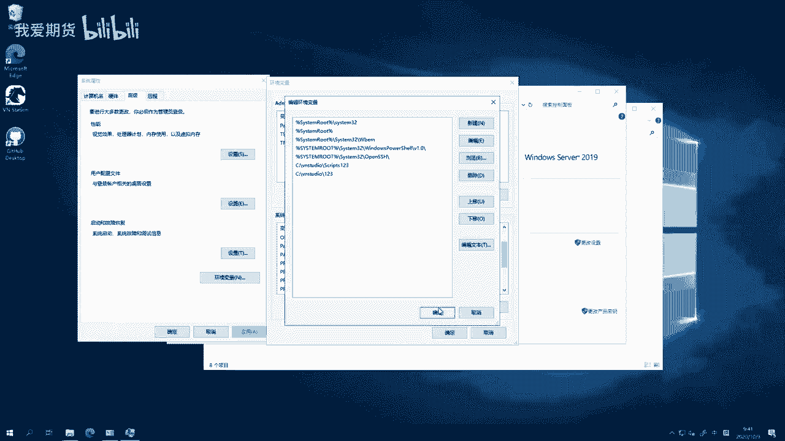

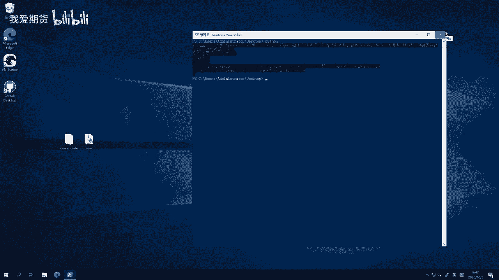

*   **手动安装**
    *   **优点**：用户可完全自主管理Python环境和所有模块的版本，灵活性高。
    *   **适用人群**：对Python有较多使用经验，希望精细控制开发环境的用户。

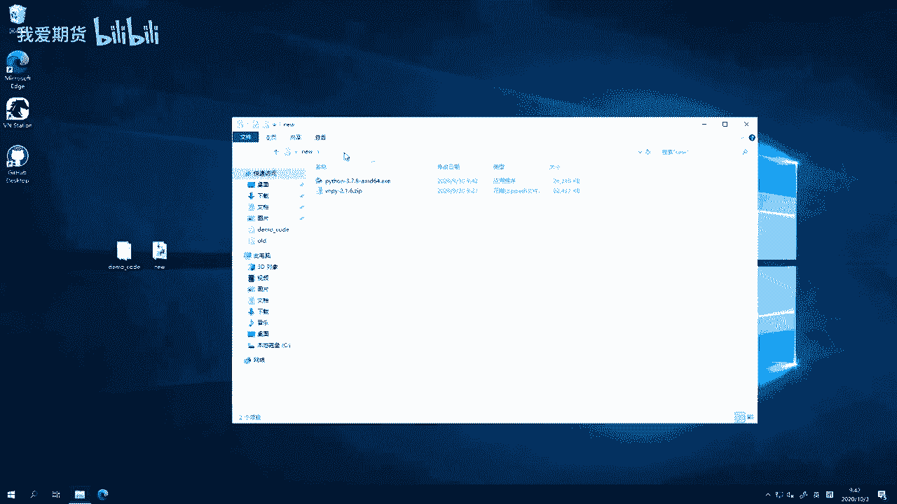

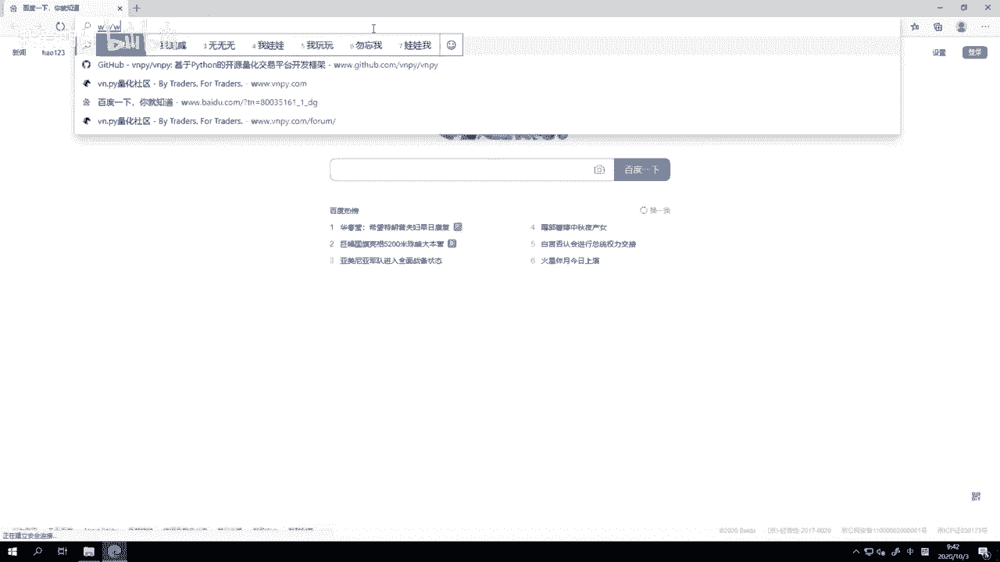

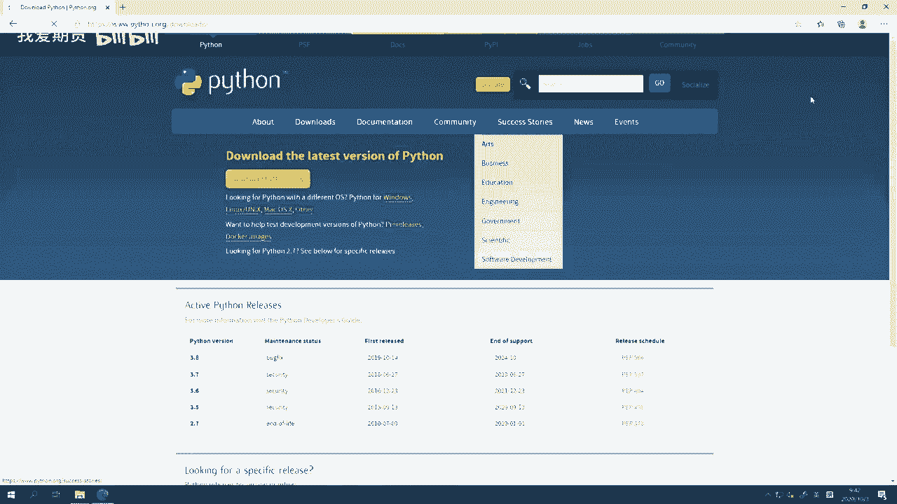

## 手动安装流程

手动安装vn.py主要分为三个步骤：准备Python环境、下载vn.py源代码、执行安装脚本。

### 第一步：准备Python环境

首先，你需要一个纯净的Python环境。vn.py官方基于Python 3.7版本进行开发和维护。

**操作要点**：
1.  访问Python官网 (`https://www.python.org/downloads/`)。
2.  下载 **Python 3.7.9** 的 **Windows x86-64 executable installer**（64位安装程序）。
3.  安装时，务必勾选 **“Add Python 3.7 to PATH”** 选项，以便将Python添加到系统环境变量。

**注意**：为避免环境变量冲突，不建议在同一台电脑上安装多个Python环境。如果已安装VN Studio，可以暂时修改其环境变量路径使其失效。

### 第二步：下载vn.py源代码

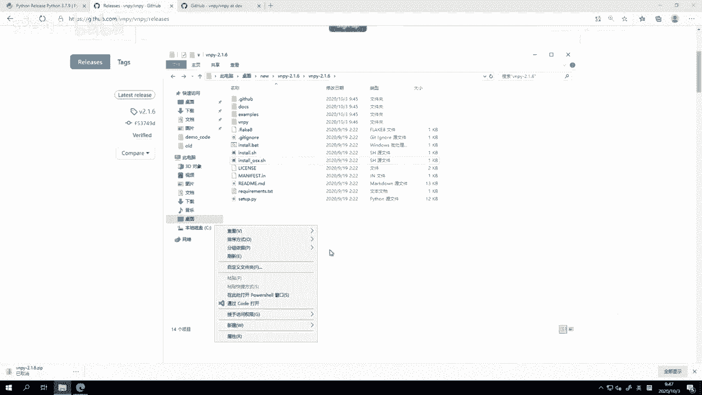

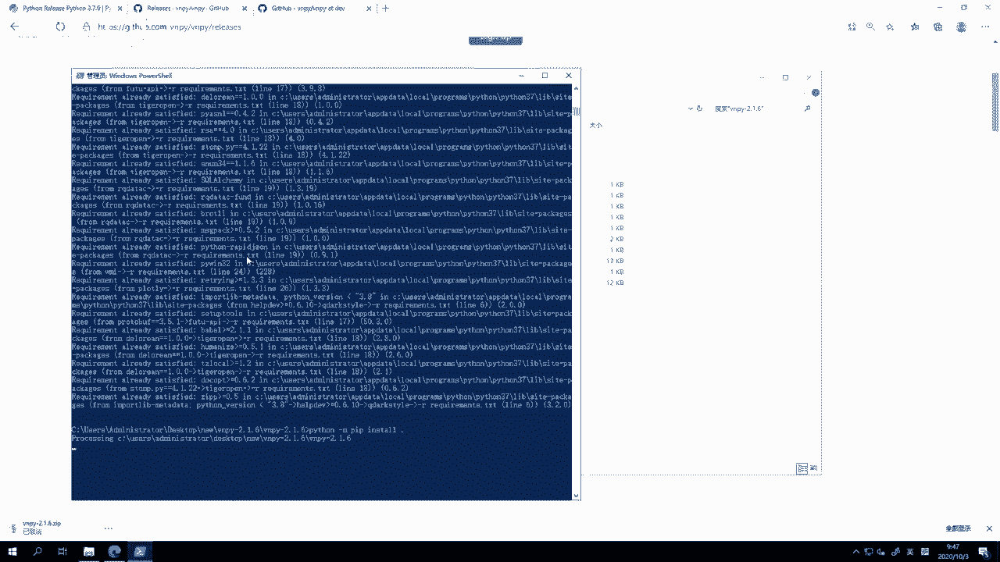

准备好Python环境后，需要获取vn.py的源代码。

**操作要点**：
1.  访问vn.py的GitHub发布页面 (`https://github.com/vnpy/vnpy/releases`)。
2.  找到最新的稳定发布版（例如 `v2.1.6`），点击 **“Source code (zip)”** 进行下载。
3.  将下载的ZIP文件解压到本地目录。

### 第三步：执行安装脚本

进入解压后的vn.py源代码目录，执行对应的安装脚本。

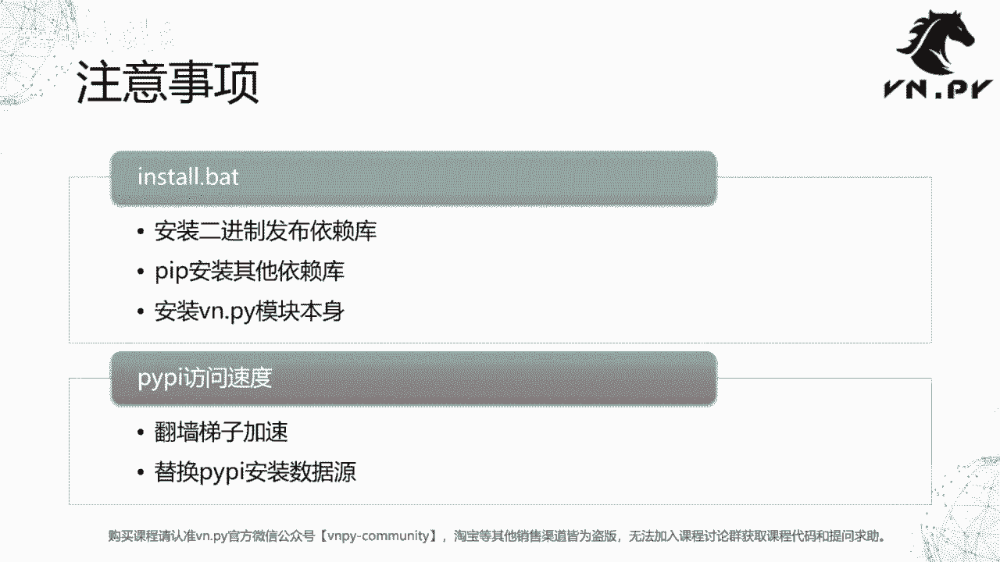

**操作要点**：
1.  在解压目录中，根据操作系统选择安装脚本：
    *   Windows: `install.bat`
    *   Linux: `install.sh`
    *   macOS: `install-osx.sh`
2.  以Windows为例，在文件资源管理器中进入该目录，按住 **Shift** 键并点击鼠标右键，选择 **“在此处打开 PowerShell 窗口”**。
3.  在打开的终端中输入命令并执行：
    ```bash
    .\install.bat
    ```
4.  脚本将自动安装所有依赖库及vn.py本身。此过程耗时较长，请耐心等待。

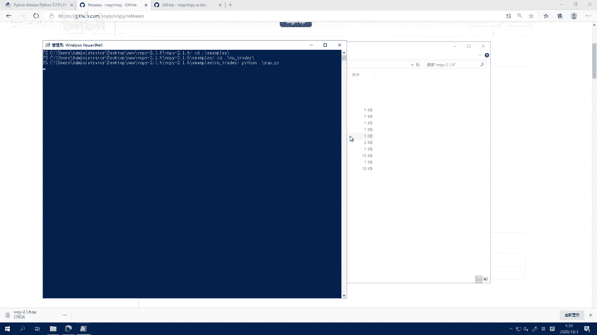

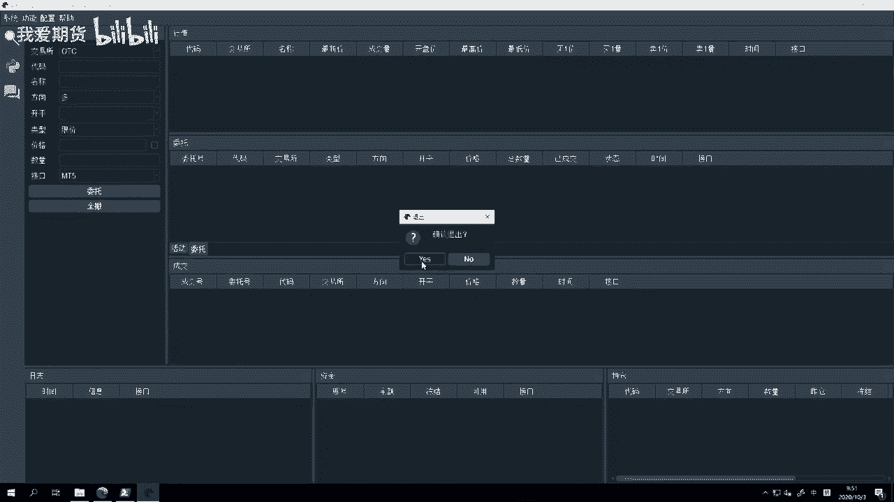

## 注意事项与技巧

安装过程中可能会遇到网络速度慢的问题，以下是两个加速技巧：

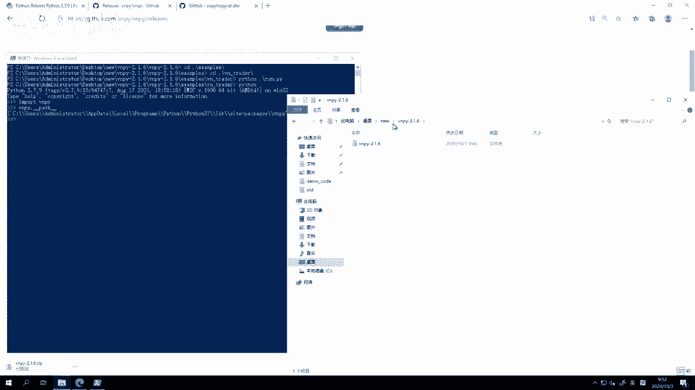

**1. 使用代理加速**
如果拥有稳定的网络代理，开启全局代理可以显著提升从PyPI服务器下载包的速度。

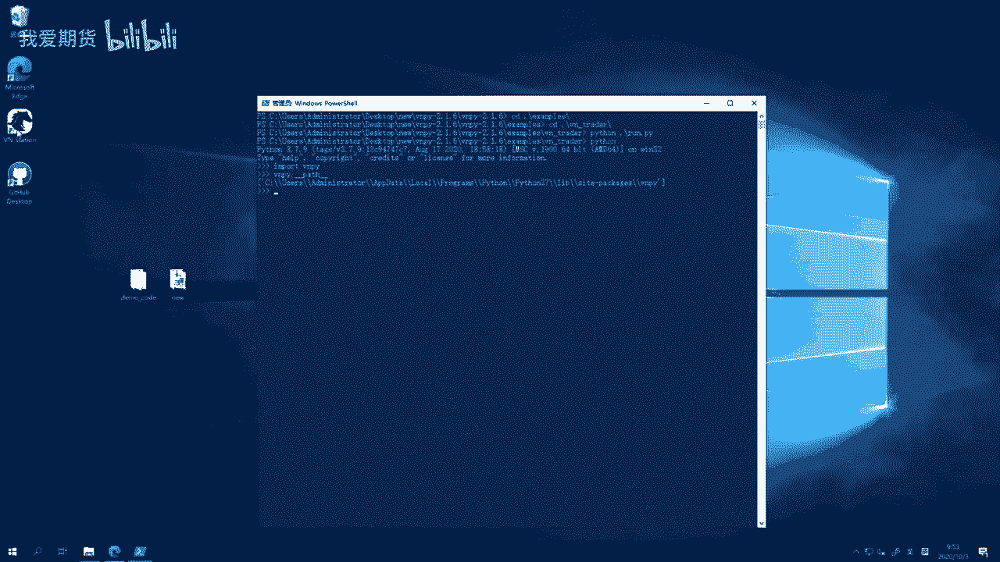

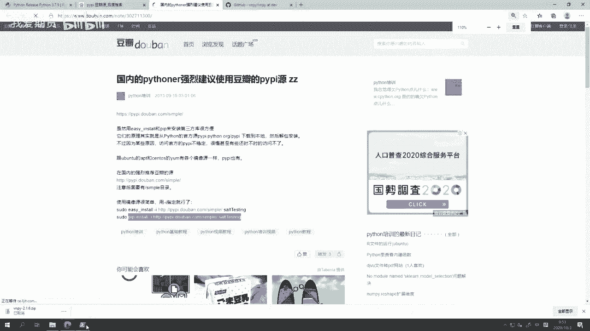

**2. 更换PyPI镜像源**
将pip的下载源更换为国内镜像（如清华源、阿里云源），可以避免网络延迟。

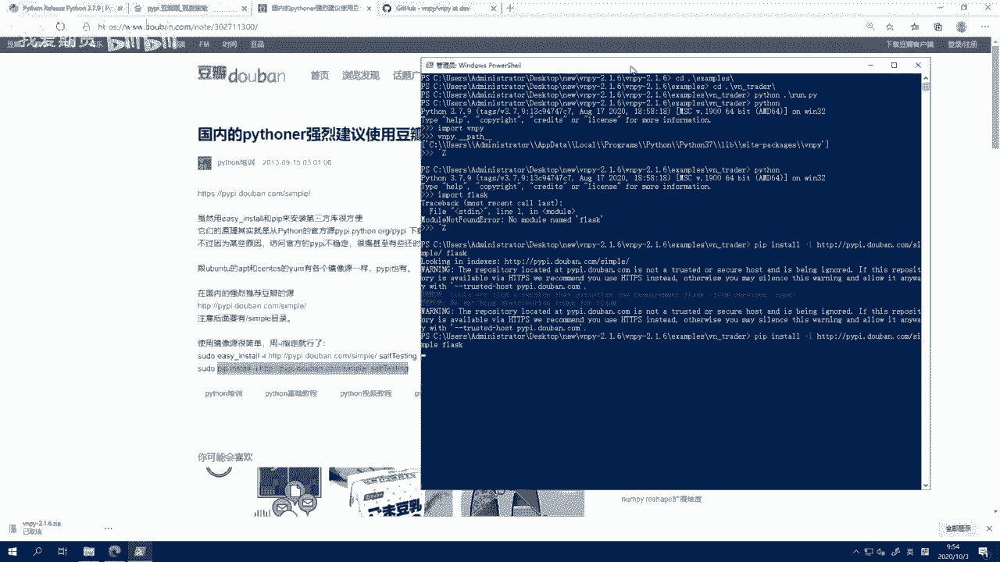

以下是更换为清华源的临时使用方法：
```bash
pip install -i https://pypi.tuna.tsinghua.edu.cn/simple 模块名
```
若要设置为默认源，可参考相关教程配置pip的配置文件。

**重要提示**：
*   手动安装的vn.py **不包含** VN Station图形化客户端，你需要通过 `examples` 目录下的示例脚本来启动各种功能。
*   若需修改vn.py源代码，请修改Python环境 `site-packages` 目录下的安装文件，而非最初解压的源代码目录。

## 总结


本节课中我们一起学习了如何手动安装vn.py。我们比较了集成环境与手动安装的优劣，并逐步演示了从准备Python 3.7环境、下载源代码到执行安装脚本的完整过程。同时，我们也介绍了解决安装过程中网络速度慢的实用技巧。手动安装能让你更深入地理解Python环境管理，为后续的个性化开发打下基础。