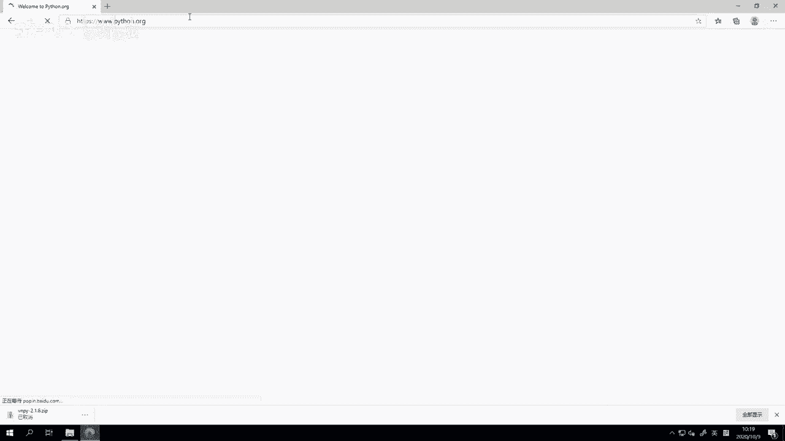
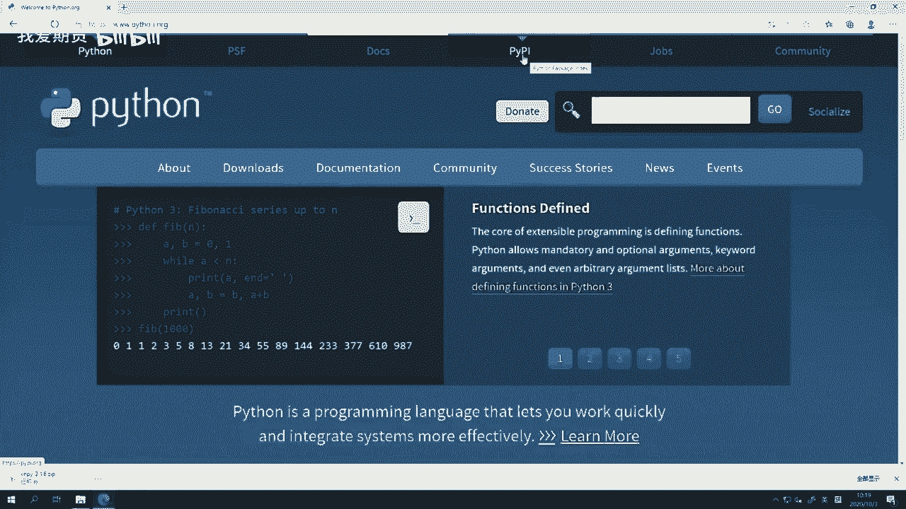
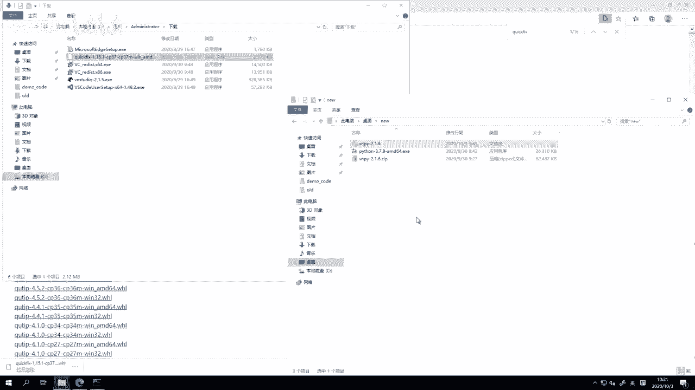
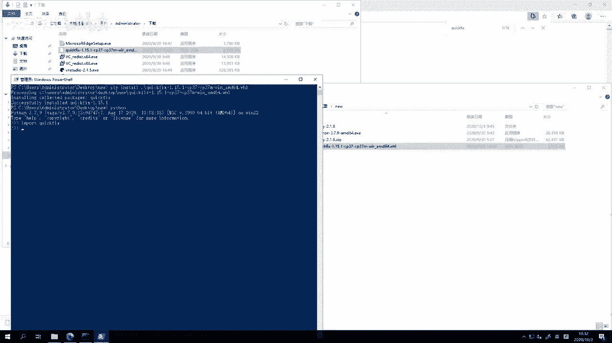
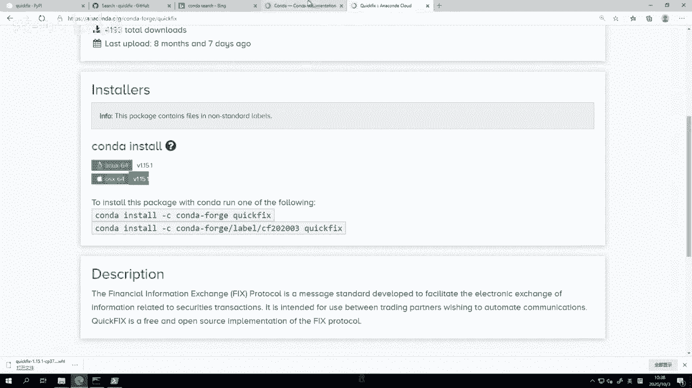
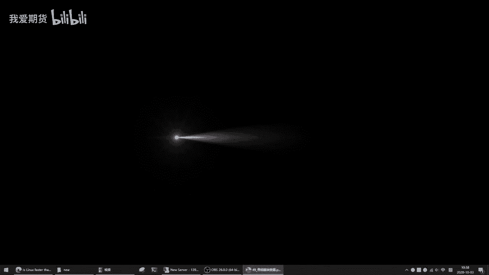
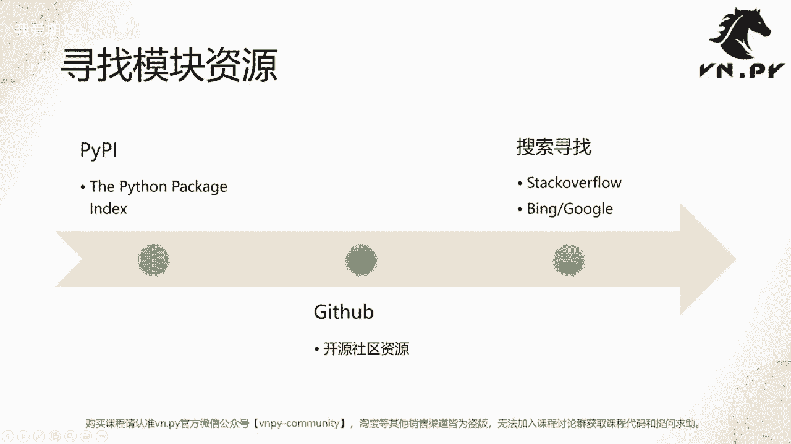

# 量化交易零基础入门：49：寻找模块资源 🔍

在本节课中，我们将学习如何为Python项目寻找和使用第三方模块资源。掌握高效的资源搜索方法是提升开发效率的关键。

## 概述

当我们使用Python解决问题时，通常会遵循一个工作流程。首先，我们会遇到一个具体的问题，例如需要对接外部服务（如数据库或交易柜台）、实现特定算法（如期权定价或策略回测）或进行数据可视化。

如果问题超出我们现有的知识范围，就需要寻找外部资源来帮助解决。绝大多数问题可以通过网络搜索找到答案。对于更深入或更专业的问题，查阅经典书籍（如《Python Cookbook》、《Fluent Python》）是很好的选择。



找到资源后，第三步就是应用这些资源来解决问题。资源可能是可以直接调用的模块（如用于期权定价的模块），也可能是需要基于其进行二次开发的框架（如用于网站开发的Flask框架）。



## 寻找资源的推荐流程

寻找模块资源时，我们推荐按照以下三步流程进行，这能有效提高成功率。

### 第一步：搜索PyPI

PyPI（Python Package Index）是由Python官方维护的包索引社区，是寻找Python模块的首选之地。开发者可以将自己开源的项目发布到PyPI，供他人使用。你可以直接通过`pip`命令安装在这里找到的包。

**安装命令示例：**
```bash
pip install 包名
```

### 第二步：搜索GitHub

如果在PyPI上没有找到合适的包，可以转向GitHub等开源社区平台进行搜索。在GitHub上，建议按“Most stars”（星标数最多）进行排序，这通常意味着项目更受欢迎、更可靠。

### 第三步：使用搜索引擎

如果前两步都没有结果，最后的手段是使用搜索引擎（如Bing、Google）或访问Stack Overflow等技术问答社区。很多时候，你遇到的问题可能已经被其他人解决并分享了方案。

## 实战演练：安装QuickFIX模块

上一节我们介绍了寻找资源的一般流程，本节中我们通过一个具体案例——安装QuickFIX模块，来演示如何应对复杂情况。

假设我们需要使用FIX（金融信息交换协议）引擎。首先，我们在PyPI官网搜索“quickfix”。



1.  **尝试直接安装**：根据搜索结果，我们尝试使用`pip install quickfix`命令进行安装。
2.  **遇到编译错误**：安装过程报错，提示需要Microsoft Visual C++ 14.0或更高版本的编译器。这是因为QuickFIX是一个包含C++源代码的包，需要本地编译环境。
3.  **寻找替代方案**：既然直接安装失败，我们转向搜索引擎。在Bing搜索“install python quickfix”，找到了Stack Overflow上的相关问答。
4.  **采纳已验证方案**：在Stack Overflow上，一个被提问者采纳且获得高赞的回答提供了一个解决方案：从加州大学欧文分校（UCI）维护的网站下载预编译的`.whl`文件。
5.  **安装.whl文件**：根据我们Python版本（如3.7）和系统位数（64位），下载对应的`quickfix‑*.‑cp37‑cp37m‑win_amd64.whl`文件，然后使用pip安装。

**安装.whl文件命令：**
```bash
pip install 下载的.whl文件路径
```
通过此方法，我们成功绕过了复杂的本地编译过程，完成了模块安装。



## 针对C/C++扩展模块的特别说明

对于包含C或C++代码的Python模块，如果从PyPI安装失败，除了上述UCI的预编译资源库，还有另一个重要选择：Conda包管理器。

Conda由Anaconda公司维护，提供了大量预编译好的科学计算包。需要注意的是，要使用Conda安装包，你必须安装Anaconda或Miniconda发行版，而不是官方的Python发行版。

**搜索Conda包的地址：** `https://anaconda.org/conda-forge`

不同操作系统的最佳资源可能不同。例如，QuickFIX在Windows上可以通过UCI的`.whl`文件安装，而在macOS或Linux上，则可能通过Conda来安装更为方便。Stack Overflow通常是找到这些特定平台解决方案的最佳起点。

## 总结







本节课我们一起学习了为Python项目寻找第三方模块资源的系统方法。核心流程是：优先搜索PyPI，其次查找GitHub，最后利用搜索引擎和Stack Overflow。对于需要编译的C/C++扩展模块，可以寻求UCI预编译资源或Conda仓库的帮助。掌握这些方法，能让你在开发过程中更高效地解决问题，避免重复造轮子。

---
*更多精华内容，请扫码关注我们的社区公众号。*