# Python机器学习与量化交易：P10：09 金融量化分析-iPython高级功能 🚀

在本节课中，我们将学习iPython的几个高级功能，包括调试命令、历史记录、输入输出获取、目录标签系统以及Notebook。这些工具能显著提升你在交互式环境下的开发效率。

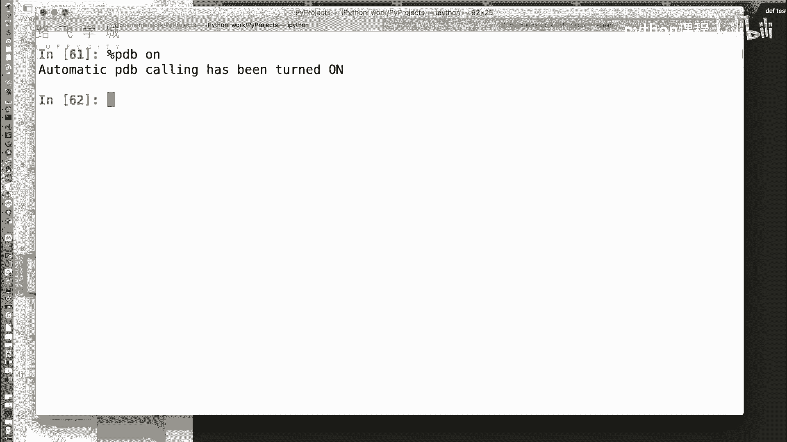

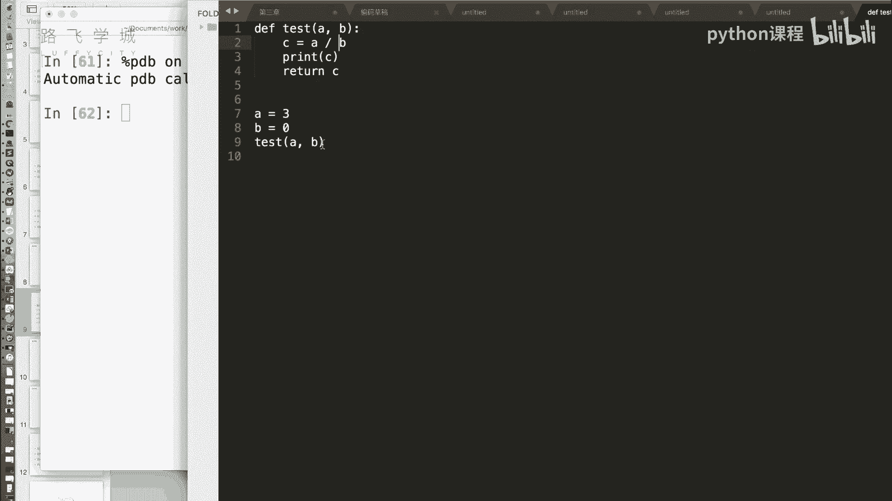

上一节我们介绍了iPython的基础魔术命令，本节中我们来看看更高级的调试和效率工具。

## 调试利器：%pdb命令 🔧

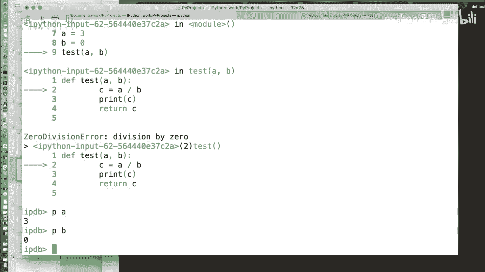

在编写代码时，经常会遇到报错但不确定具体是哪一行出错的情况。手动添加断点调试比较繁琐。iPython提供了一个开关性质的魔术命令 `%pdb`，可以自动进入调试模式。

*   **用法**：`%pdb on` 开启自动调试；`%pdb off` 关闭。
*   **效果**：当一段代码中的某行即将报错时，`%pdb` 会在报错前自动暂停执行，并进入交互式调试器（pdb）。此时，你可以检查当前变量的状态。

以下是使用示例：
```python
def test(a, b):
    c = a / b  # 如果b为0，此行会报错
    return c


# 开启pdb后执行会报错的函数调用
test(3, 0)
```
执行后，调试器会停在 `c = a / b` 这一行。此时，可以使用pdb命令查看变量：

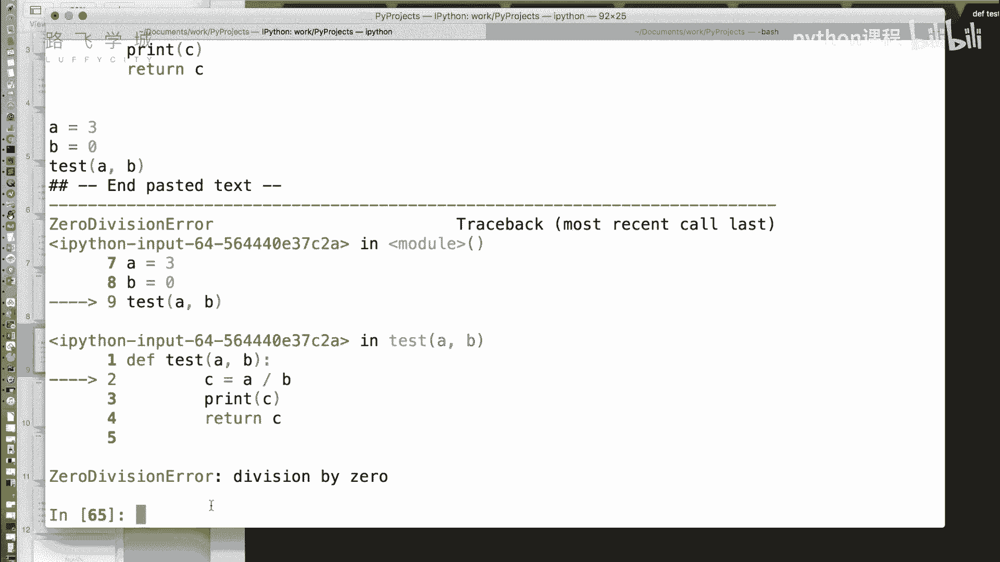

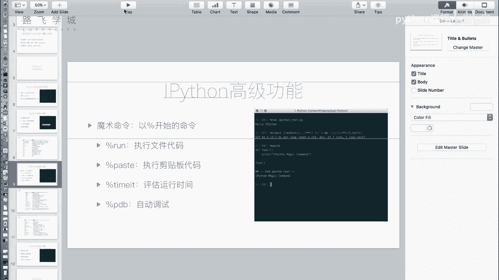

*   `p a`：打印变量 `a` 的值（输出：3）。
*   `p b`：打印变量 `b` 的值（输出：0）。

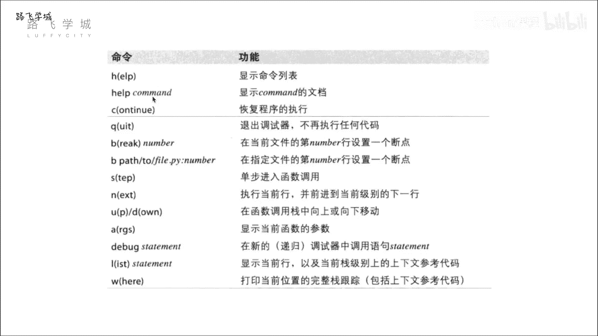

通过检查变量，可以快速定位到除零错误。


以下是pdb调试器的常用命令：
*   `h`：查看帮助文档。
*   `q`：退出调试器。
*   `n`：执行下一行代码。
*   `break`：设置断点。

对于简单的错误检查，通常使用 `p` 命令查看变量即可。更复杂的调试可以使用专门的IDE（如PyCharm），但 `%pdb` 在快速定位简单错误时非常方便。

## 提升效率：命令历史与输入输出获取 ⚡

上一节我们介绍了调试，本节中我们来看看如何利用历史记录和快捷方式提升编码效率。

### 使用命令历史

与Linux命令行类似，iPython支持使用上下箭头键浏览历史命令。此外，它还支持前缀搜索。

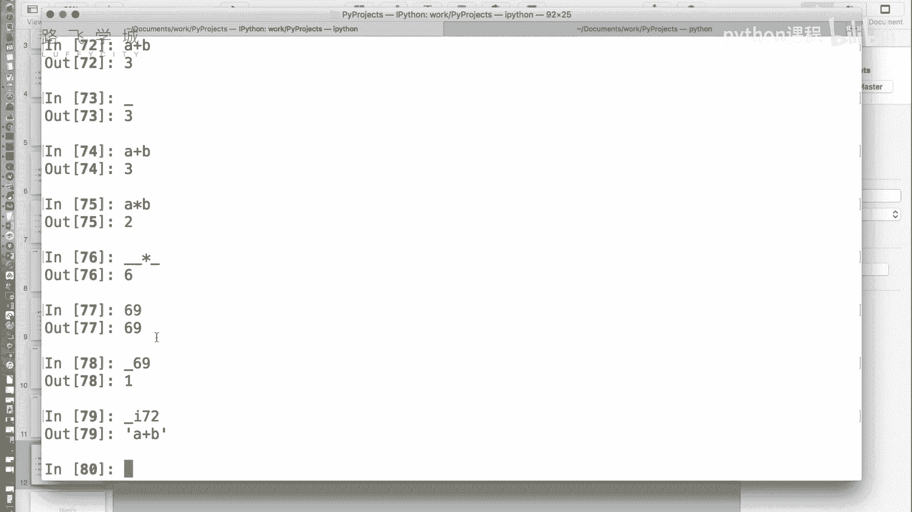

*   **操作**：输入命令的开头几个字符（例如 `a`），然后按上箭头，iPython会筛选出历史上以 `a` 开头的命令供你选择。

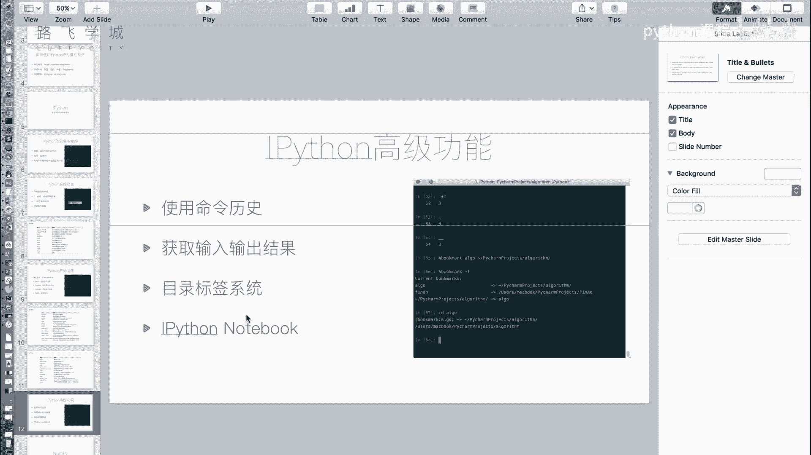

### 获取输入输出结果

在交互式环境中，有时执行了计算却忘了保存结果。iPython提供了快捷方式获取之前的输入和输出。

*   **获取上一个输出**：使用单个下划线 `_`。
    ```python
    a = 1
    b = 2
    a + b  # 输出：3
    result = _  # result 的值现在是 3
    ```
*   **获取上两个输出**：使用两个下划线 `__`（不常用）。
*   **获取特定行的输出**：使用 `_行号`，例如 `_69` 获取第69行的输出。
*   **获取输入**：使用 `_i行号` 可以获取指定行输入的代码字符串。例如 `_i72` 获取第72行输入的代码。

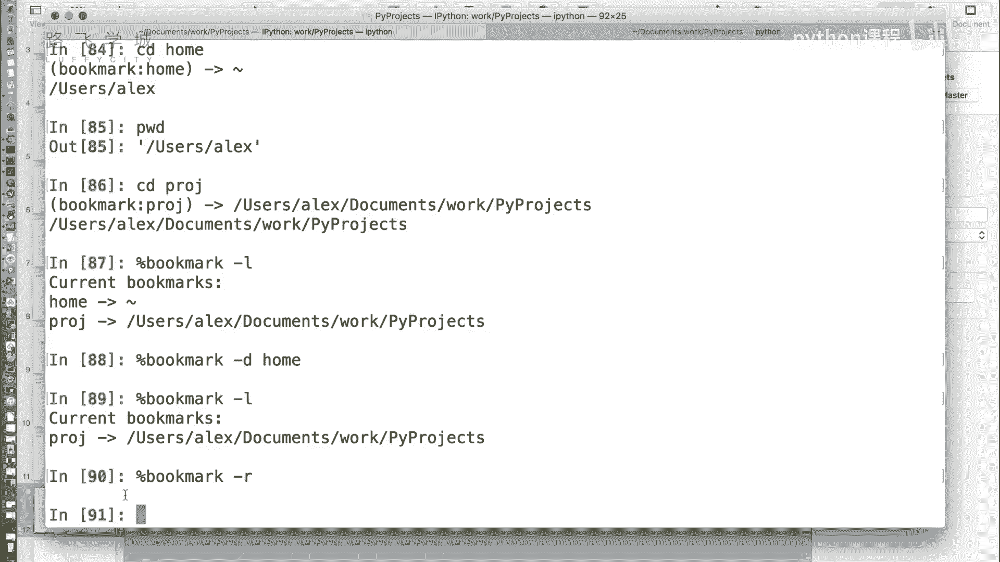

## 目录管理：书签系统 📂

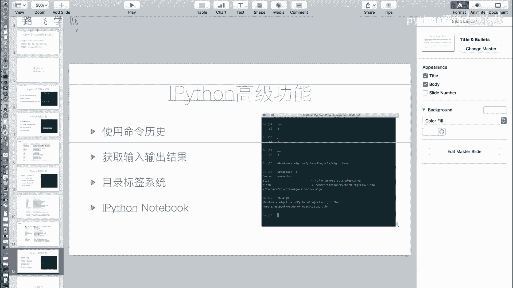

在不同项目目录间频繁切换时，反复输入长路径很麻烦。iPython的 `%bookmark` 魔术命令可以创建目录书签。

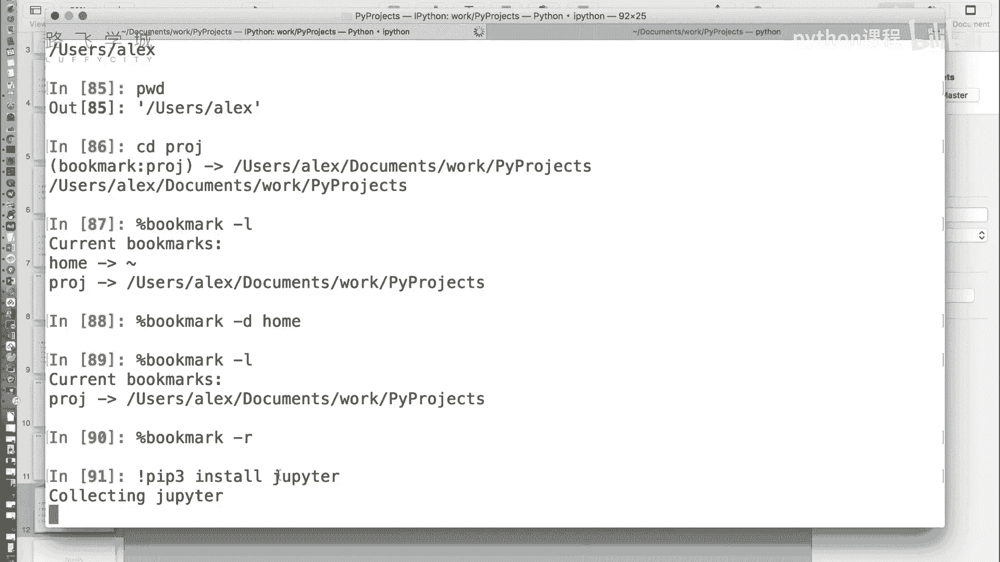


以下是书签系统的常用操作：
*   `%bookmark 书签名 目录路径`：创建书签。
*   `%bookmark -l`：列出所有书签。
*   `cd 书签名`：快速跳转到书签对应的目录。
*   `%bookmark -d 书签名`：删除指定书签。
*   `%bookmark -r`：删除所有书签。

例如：
```python
%bookmark proj /home/user/my_project
%bookmark -l  # 查看书签列表
cd proj  # 快速切换到项目目录
```

## 交互式笔记本：Jupyter Notebook 📓

对于数据分析和科学计算，iPython有一个更强大的衍生工具——Jupyter Notebook。它是一个基于Web的交互式计算环境。

首先需要安装：
```bash
pip install jupyter
```
安装后，在系统命令行输入 `jupyter notebook`，它会在浏览器中打开一个文件管理界面。

在Notebook中，你可以：
1.  创建新的Notebook文件（.ipynb后缀）。
2.  在“单元格”中编写并运行Python代码，结果（包括图表）会直接显示在下方。
3.  将单元格类型切换为Markdown，用于编写带格式的文本说明，非常适合制作技术博客、教程或数据分析报告。
4.  将Notebook导出为Python脚本、HTML、PDF等多种格式。

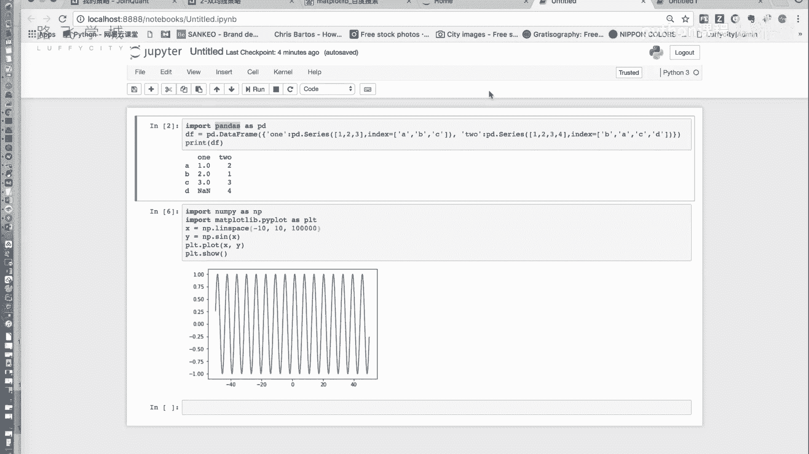

它继承了iPython的所有魔术命令和交互特性，并将代码、结果、文档完美整合，是进行探索性数据分析和展示工作流的理想工具。

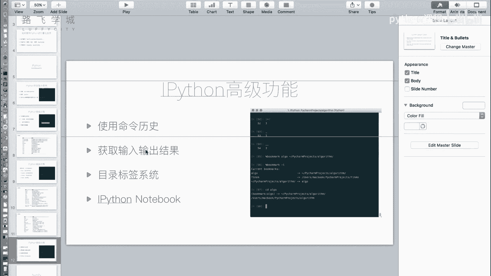

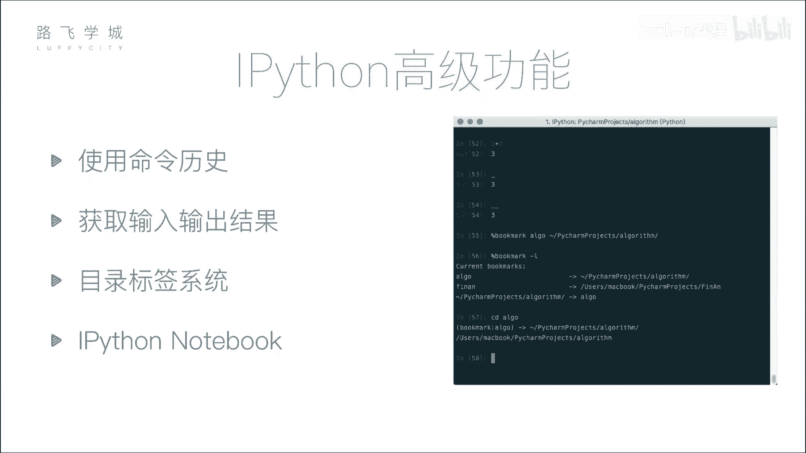


本节课中我们一起学习了iPython的几个高级功能。我们掌握了使用 `%pdb` 进行快速调试，利用命令历史和 `_` 符号提升操作效率，通过 `%bookmark` 管理目录，并初步了解了强大的Jupyter Notebook。这些工具共同构成了一个高效、便捷的Python交互式开发环境，尤其适合数据分析、机器学习等需要频繁尝试和验证的场景。