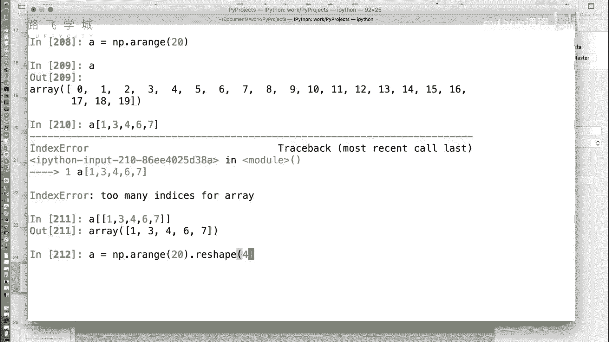
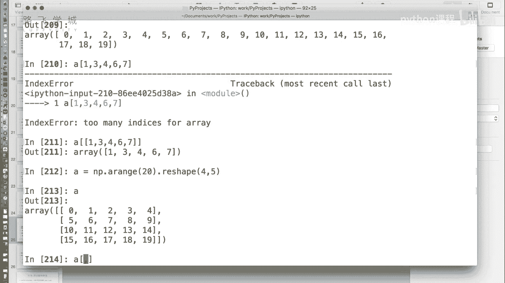
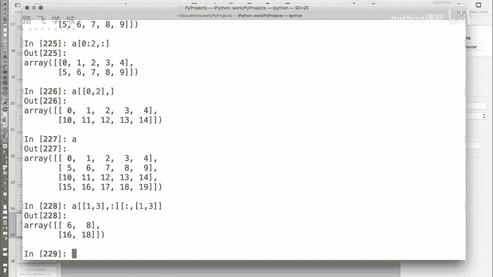

# 4天学会Python机器学习与量化交易：P15：14 金融量化分析-NumPy-Array花式索引


在本节课中，我们将要学习NumPy数组的“花式索引”。这是一种非常灵活的数据选取方式，允许我们根据一个整数索引数组来选取数据，即使这些索引没有规律。


上一节我们介绍了布尔型索引，本节中我们来看看花式索引如何工作。

## 什么是花式索引？🤔

花式索引是指使用一个整数数组（或列表）作为索引，来选取原数组中对应位置的数据，从而构成一个新的数组。

例如，对于一个一维数组，我们想选取第1、3、4、6、7号元素。这些索引位置没有规律，无法用简单的切片完成。

```python
import numpy as np
a = np.arange(20)  # 创建一个0到19的数组
indices = [1, 3, 4, 6, 7]  # 指定要选取的索引
result = a[indices]  # 使用花式索引
print(result)  # 输出：[1 3 4 6 7]
```



代码 `a[[1, 3, 4, 6, 7]]` 就是花式索引的典型应用。它将索引列表 `[1, 3, 4, 6, 7]` 放在一个方括号内传递给数组 `a`。

## 二维数组的花式索引 📊



对于二维数组，花式索引的规则同样适用，并且可以和逗号分隔的行列索引方式结合使用。

假设我们有一个4行5列的二维数组：

```python
A = np.arange(20).reshape(4, 5)
print(A)
# 输出：
# [[ 0  1  2  3  4]
#  [ 5  6  7  8  9]
#  [10 11 12 13 14]
#  [15 16 17 18 19]]
```

在二维索引 `A[row_index, col_index]` 中，逗号左右两侧可以灵活组合使用普通索引、切片、布尔索引或花式索引。

以下是几种组合示例：

*   **普通索引 + 切片**：选取第0行，第2到第4列（不包含第4列）。
    ```python
    print(A[0, 2:4])  # 输出：[2 3]
    ```

*   **普通索引 + 布尔索引**：选取第0行中所有大于2的元素。
    ```python
    print(A[0, A[0] > 2])  # 输出：[3 4]
    ```

## 一个重要限制与解决方法 🚫

需要注意的是，**花式索引不能同时用于逗号的两侧**，否则会产生意想不到的结果。它会被解释为选取坐标 `(row[0], col[0])`、`(row[1], col[1])`…… 位置上的值，而不是选取所有行与列的组合。

例如，我们想选取第1行&第3行 与 第1列&第3列 交叉位置的四个值（即6, 8, 16, 18）。

```python
# 错误的写法：这不会得到我们想要的四个值
print(A[[1, 3], [1, 3]])
# 输出：[ 6 18] (它选取的是(1,1)和(3,3)位置的值)
```

那么，如何正确选取这四块数据呢？我们需要分步操作：

以下是分步选取的步骤：




1.  首先，使用花式索引选取需要的行（第1行和第3行），同时用冒号 `:` 选取所有列。
    ```python
    rows = A[[1, 3], :]
    print(rows)
    # 输出：
    # [[ 5  6  7  8  9]
    #  [15 16 17 18 19]]
    ```
2.  然后，在上一步的结果上，再选取需要的列（第1列和第3列），同时用冒号 `:` 选取所有行。
    ```python
    final_result = rows[:, [1, 3]]
    print(final_result)
    # 输出：
    # [[ 6  8]
    #  [16 18]]
    ```
当然，这两步可以合并为一行代码：
```python
result = A[[1, 3], :][:, [1, 3]]
```


本节课中我们一起学习了NumPy的花式索引。这是一种强大的数据选取工具，允许我们通过一个整数列表无规律地访问数组元素。我们了解了它在一维和二维数组中的应用，并特别学习了在二维数组中如何通过分步操作来组合行列的花式索引，以避开其使用限制。掌握普通索引、切片、布尔索引和花式索引，能让你在数据处理中更加游刃有余。