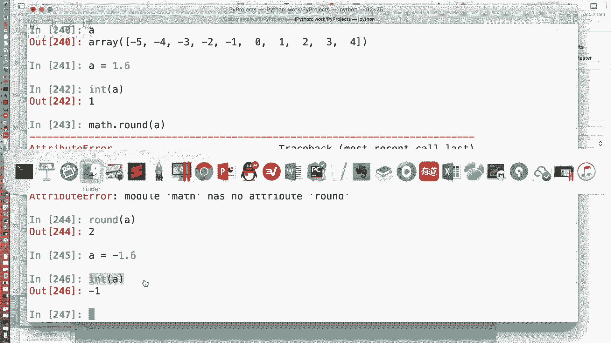
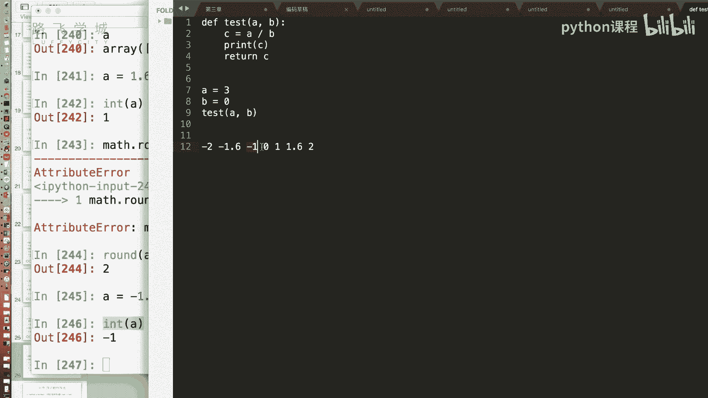
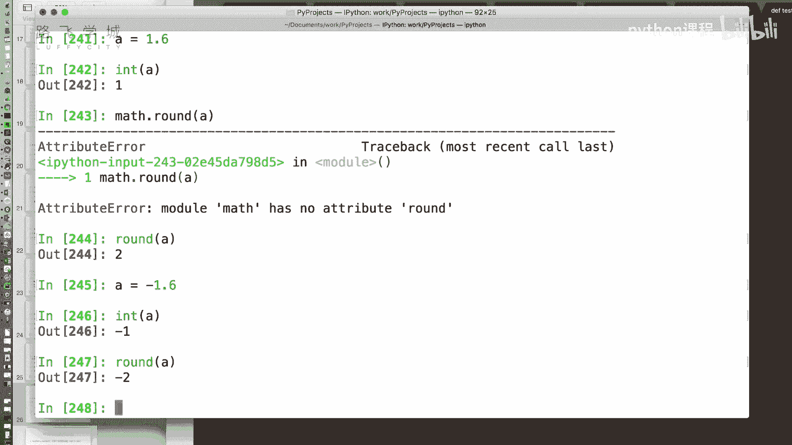
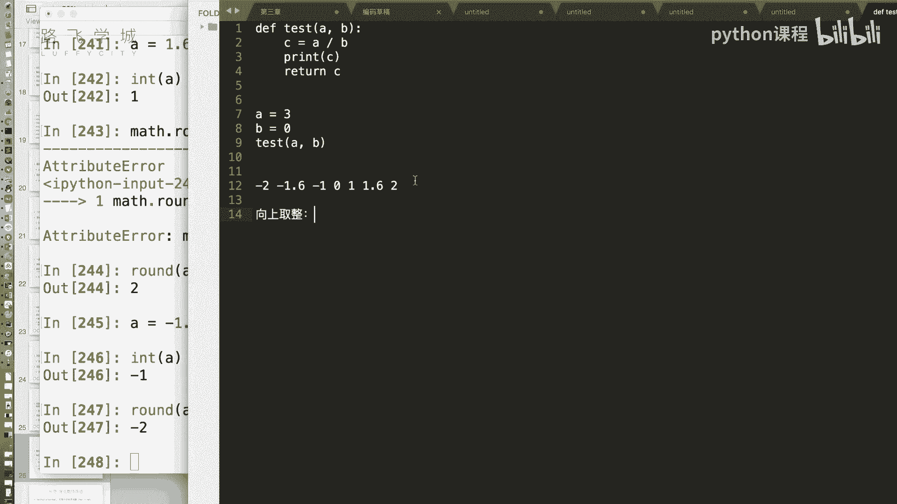
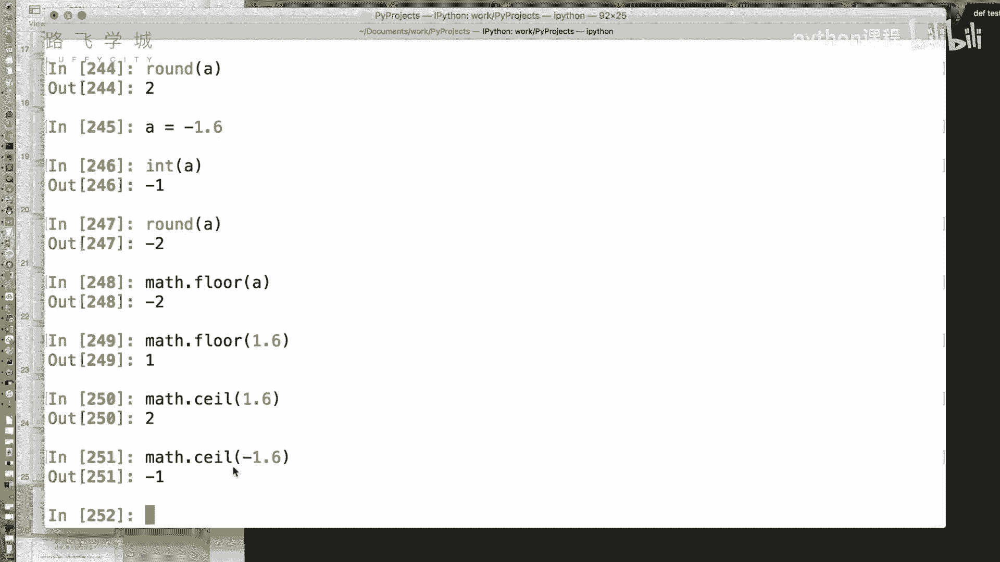
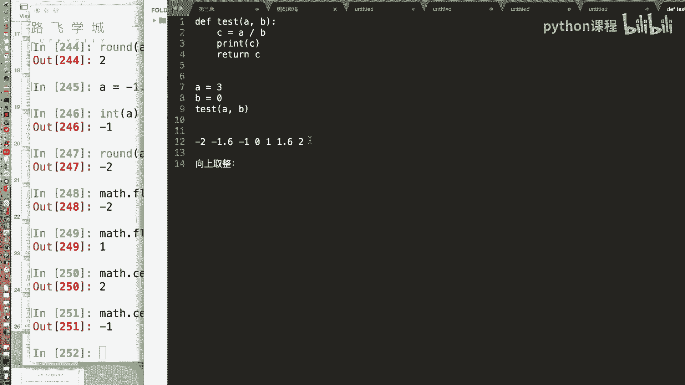

# Python机器学习与量化交易：P16：15 金融量化分析-NumPy数组通用函数

在本节课中，我们将要学习NumPy库中一个非常强大的功能——通用函数。通用函数允许我们对整个数组进行快速的元素级运算，而无需编写循环。这对于处理金融数据等大规模数值计算至关重要。

上一节我们介绍了NumPy数组的索引功能，本节中我们来看看NumPy提供的通用函数。

## 通用函数简介

NumPy的通用函数是对数组进行元素级运算的函数。例如，数组的加减乘除运算可以批量进行。对于更复杂的数学运算，NumPy也提供了相应的通用函数。

## 一元通用函数



一元通用函数是指只接受一个数组作为输入的通用函数。以下是一些常用的一元函数示例。



### 绝对值运算



标准库中的`abs`函数用于取绝对值。在NumPy中，我们可以使用`np.abs`对整个数组进行绝对值运算。



```python
import numpy as np
A = np.array([-5, -2, 0, 3, 5])
result = np.abs(A)
# 或直接使用 abs(A) 也可行
```



### 平方根运算



对数组中的每个元素进行开方运算，可以使用`np.sqrt`函数。注意，负数开方会得到`nan`（非数字）值。

```python
A = np.array([-5, -2, 0, 3, 5])
result = np.sqrt(A)
```

### 取整函数

将小数转换为整数有多种方法，NumPy提供了不同的取整函数。

以下是四种主要的取整方式：
*   **向零取整**：使用`np.trunc`函数。它直接去掉小数部分。
*   **向下取整**：使用`np.floor`函数。它取不大于原数的最大整数。
*   **向上取整**：使用`np.ceil`函数。它取不小于原数的最小整数。
*   **四舍五入**：使用`np.round`函数。小数部分小于0.5时向零取整，大于等于0.5时向远离零的方向取整。

```python
A = np.array([-1.6, -0.5, 0.5, 1.6])
print(np.trunc(A))  # 向零取整
print(np.floor(A))  # 向下取整
print(np.ceil(A))   # 向上取整
print(np.round(A))  # 四舍五入
```

### 分离整数与小数部分

`np.modf`函数可以将数组中每个元素的整数部分和小数部分分开，并返回两个数组。

```python
A = np.array([-1.6, -0.5, 0.5, 1.6])
integer_part, fractional_part = np.modf(A)
```

### 特殊值判断：nan与inf

在数值计算中，有时会遇到两个特殊的浮点数值：
*   **`nan`**：表示“非数字”，例如`0.0 / 0.0`或对负数开方。
*   **`inf`**：表示“无穷大”，例如一个非零数除以`0.0`。

判断数组中是否存在这些特殊值，不能直接用等号比较（因为`nan != nan`），而应使用专门的判断函数。

以下是判断方法：
*   判断是否为`nan`：使用`np.isnan`函数。
*   判断是否为`inf`：使用`np.isinf`函数。

```python
A = np.array([0, 1, 2, 3, 4])
B = np.array([0, 2, 0, 1, 2])
C = A / B  # 可能出现 inf 和 nan
print(C)

# 判断并过滤 nan
print(np.isnan(C))
valid_C = C[~np.isnan(C)]

# 判断并过滤 inf
print(np.isinf(C))
valid_C_no_inf = C[~np.isinf(C)]
```

## 二元通用函数

二元通用函数是指接受两个数组作为输入的通用函数。除了基本的加减乘除、乘方、取模运算外，还有两个非常有用的函数。

### 元素级最大值与最小值

`np.maximum`和`np.minimum`函数用于逐元素比较两个数组，返回每个位置上两个元素的最大值或最小值。

```python
A = np.array([3, 4, 2, 6])
B = np.array([2, 5, 1, 3])
print(np.maximum(A, B))  # 逐元素取最大值
print(np.minimum(A, B))  # 逐元素取最小值
```

## 总结


本节课中我们一起学习了NumPy的通用函数。我们首先了解了一元通用函数，如`np.abs`、`np.sqrt`和各种取整函数，并学习了如何处理特殊的`nan`和`inf`值。接着，我们介绍了二元通用函数，特别是逐元素比较的`np.maximum`和`np.minimum`。掌握这些通用函数能极大地提升我们处理数组数据的效率和代码的简洁性。