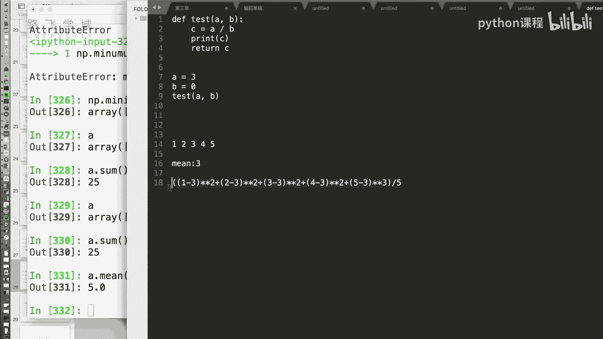
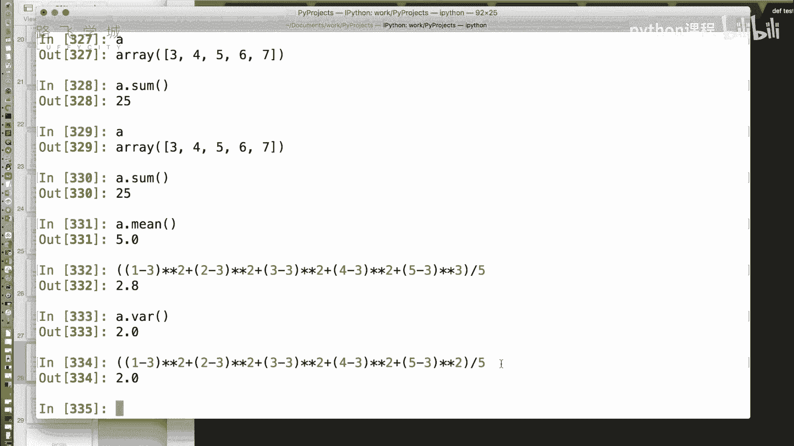
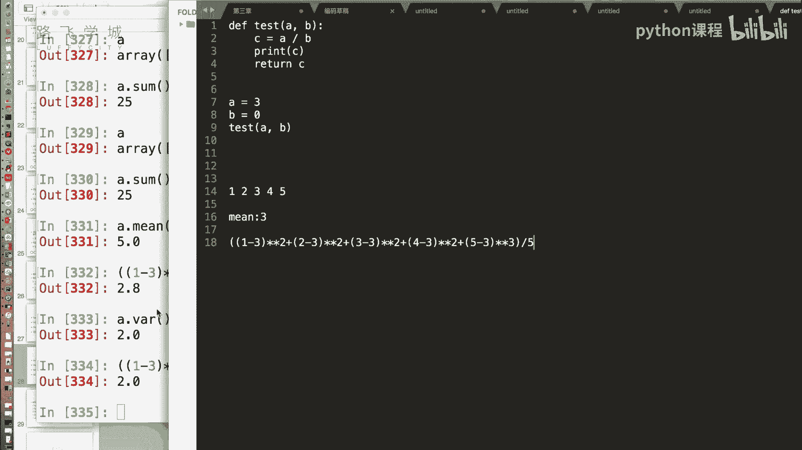
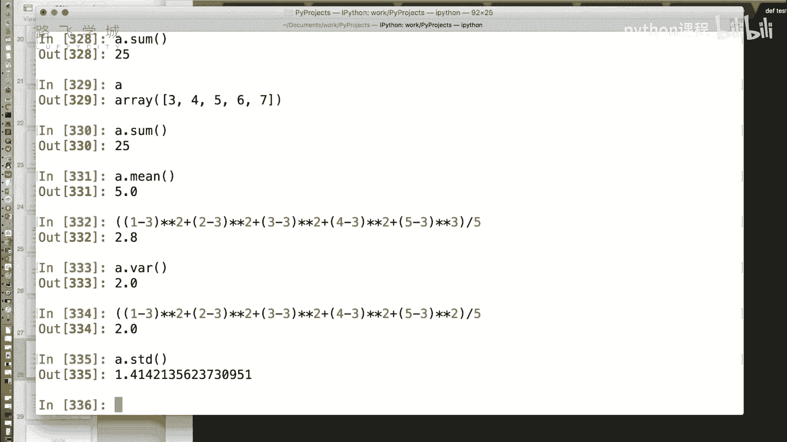
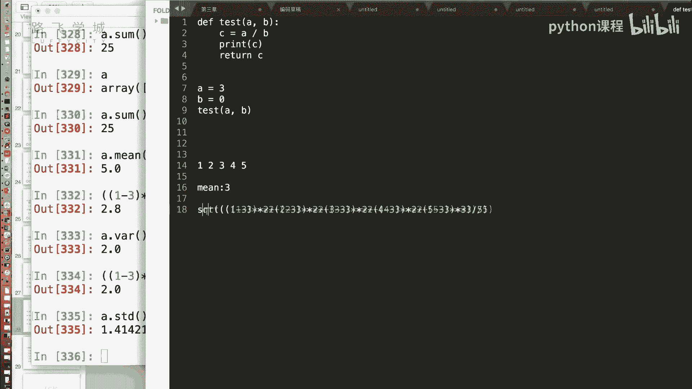

# Python机器学习与量化交易：P17：NumPy统计方法与随机数生成 📊🎲


在本节课中，我们将学习NumPy模块提供的数学统计方法，以及如何生成随机数。这些功能是数据分析，特别是金融量化分析中的重要基础。



## 概述



上一节我们介绍了NumPy数组的索引和切片操作。本节中，我们来看看NumPy提供的核心数学统计函数，以及如何高效地生成随机数数组。

## 统计方法







NumPy提供了一系列用于计算数组统计量的方法。

以下是常用的统计函数：

*   **求和**：`A.sum()` 方法对数组 `A` 中的所有值进行求和。其功能与Python内置的 `sum()` 函数类似。
*   **平均值**：`A.mean()` 方法用于计算数组 `A` 中所有元素的平均值。
*   **方差**：`A.var()` 方法用于计算方差。方差衡量一组数据的离散程度。其计算公式为：**方差 = Σ(每个数据 - 平均值)² / 数据个数**。
*   **标准差**：`A.std()` 方法用于计算标准差。标准差是方差的平方根，同样用于衡量数据的波动性。其计算公式为：**标准差 = sqrt(方差)**。
*   **最大值与最小值**：
    *   `A.max()` 返回数组中的最大值。
    *   `A.min()` 返回数组中的最小值。
*   **最大值与最小值的索引**：
    *   `A.argmax()` 返回数组中最大值所在位置的索引。
    *   `A.argmin()` 返回数组中最小值所在位置的索引。

在金融分析中，方差和标准差常用来衡量资产价格的波动率（风险）。例如，计算一组股票日收益率的标准差，可以评估该股票的风险水平。

```python
import numpy as np
# 假设有一组收盘价数据
prices = np.array([100, 102, 101, 105, 107])
# 计算收益率（简化版）
returns = np.diff(prices) / prices[:-1]
print(f"收益率: {returns}")
print(f"收益率均值: {returns.mean():.4f}")
print(f"收益率标准差（波动率）: {returns.std():.4f}")
```

## 随机数生成

除了统计，NumPy还提供了强大的随机数生成功能，位于 `np.random` 子模块下。它扩展了Python内置 `random` 模块的功能，支持直接生成指定形状的随机数数组。

以下是 `np.random` 中常用的函数：

*   **生成随机浮点数**：`np.random.rand(10)` 生成一个包含10个在 `[0, 1)` 区间内均匀分布的随机数的数组。你可以通过传入元组来指定多维数组的形状，例如 `np.random.rand(3, 5)` 生成一个3行5列的数组。
*   **生成随机整数**：`np.random.randint(0, 10, size=(3,5))` 生成一个3行5列、元素值在 `[0, 10)` 区间内的随机整数数组。
*   **均匀分布随机数**：`np.random.uniform(2.0, 4.0, 10)` 生成10个在 `[2.0, 4.0)` 区间内均匀分布的随机浮点数。
*   **从给定序列中随机选择**：`np.random.choice([1,3,4,5], size=10)` 从序列 `[1,3,4,5]` 中随机抽取10次（有放回），生成一个长度为10的数组。
*   **打乱数组顺序**：`np.random.shuffle(arr)` 将数组 `arr` 的元素顺序随机打乱（原地修改）。

在量化交易中，随机数生成常用于蒙特卡洛模拟、初始化模型参数（如神经网络权重）以及生成模拟交易数据。


```python
# 生成模拟的股票价格路径（简化版蒙特卡洛模拟）
initial_price = 100
days = 252
# 生成每日随机收益率（假设服从正态分布）
mu = 0.0005  # 日均收益率
sigma = 0.02 # 日波动率
random_returns = np.random.normal(mu, sigma, days)
# 计算价格路径
price_path = initial_price * (1 + random_returns).cumprod()
```

## 总结

本节课中我们一起学习了NumPy的两个核心高级功能：统计方法和随机数生成。我们掌握了如何计算数组的均值、方差、标准差等关键统计指标，并学会了使用 `np.random` 模块高效地生成各种分布的随机数数组。这些工具为后续进行数据分析和构建量化模型打下了坚实的数学基础。NumPy作为科学计算的基石，其高效性和便捷性将在我们后续学习Pandas和机器学习算法时得到充分体现。