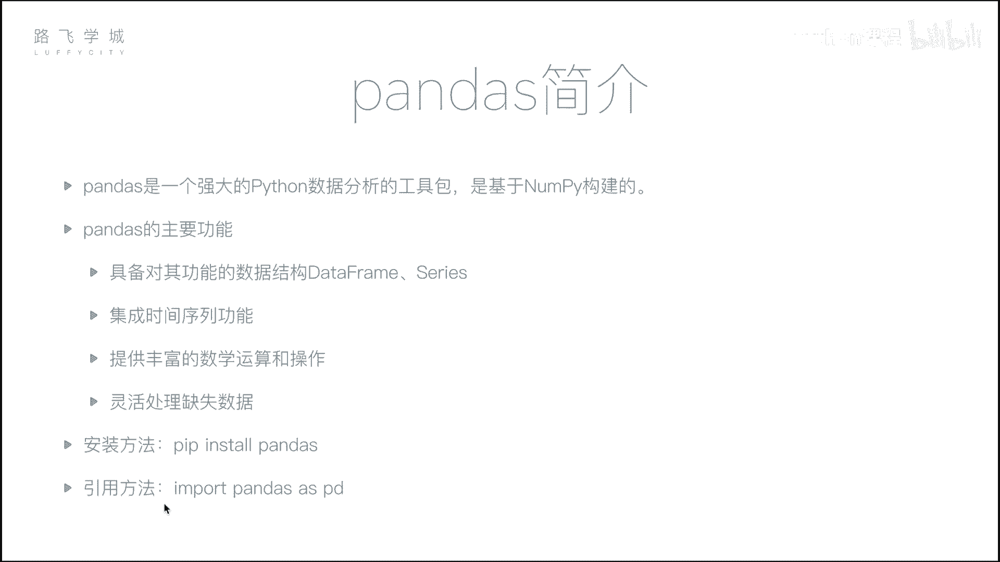
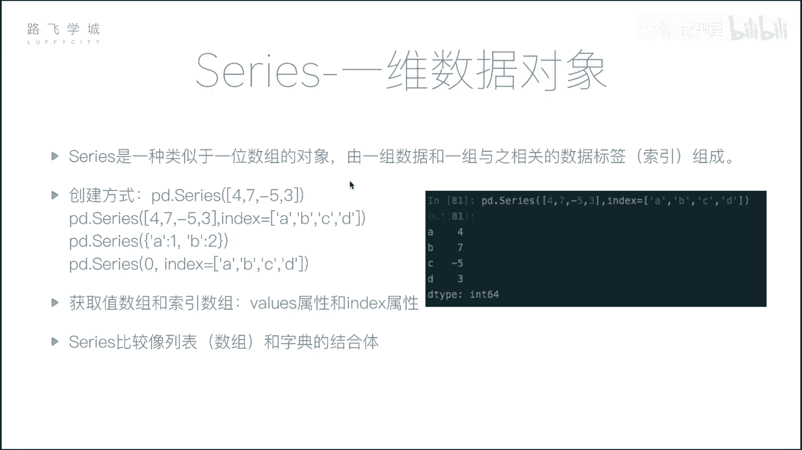
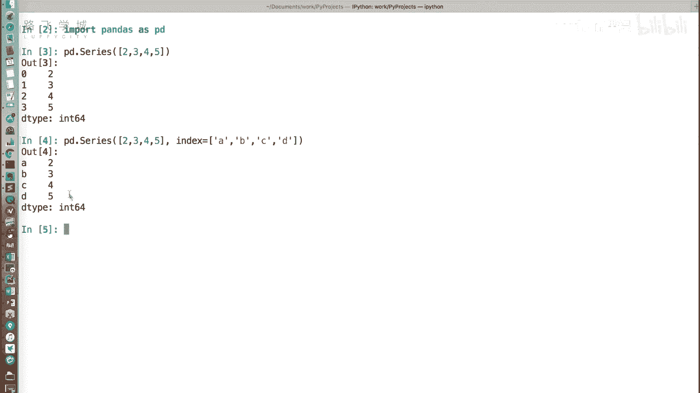
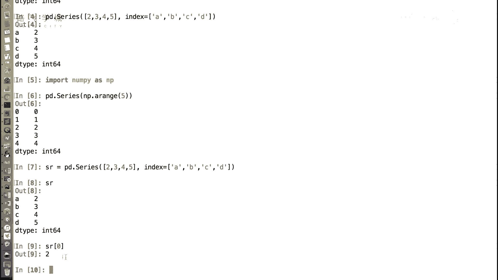
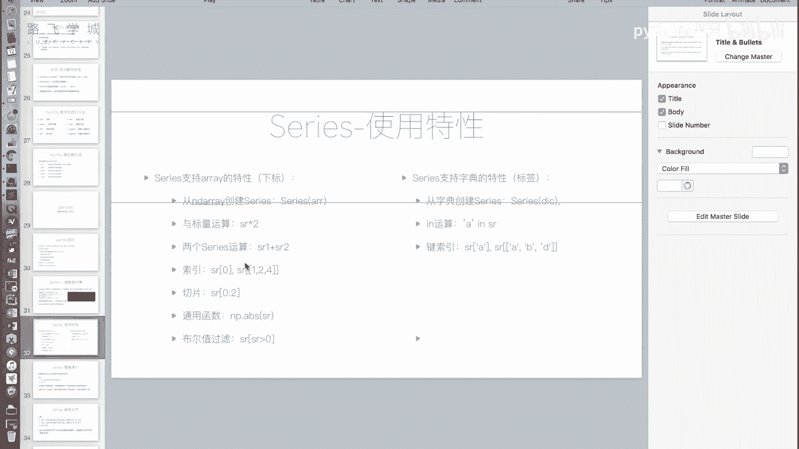
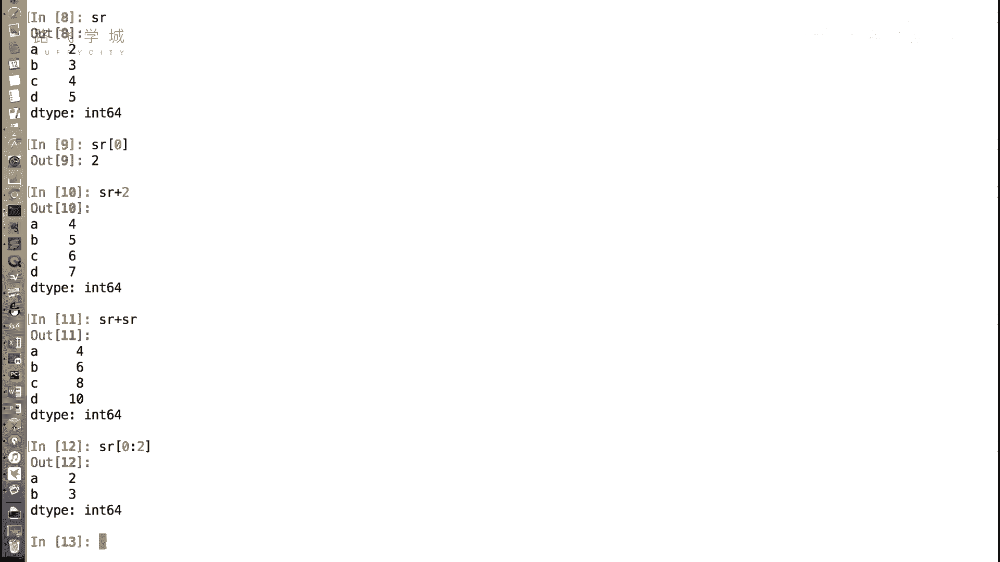
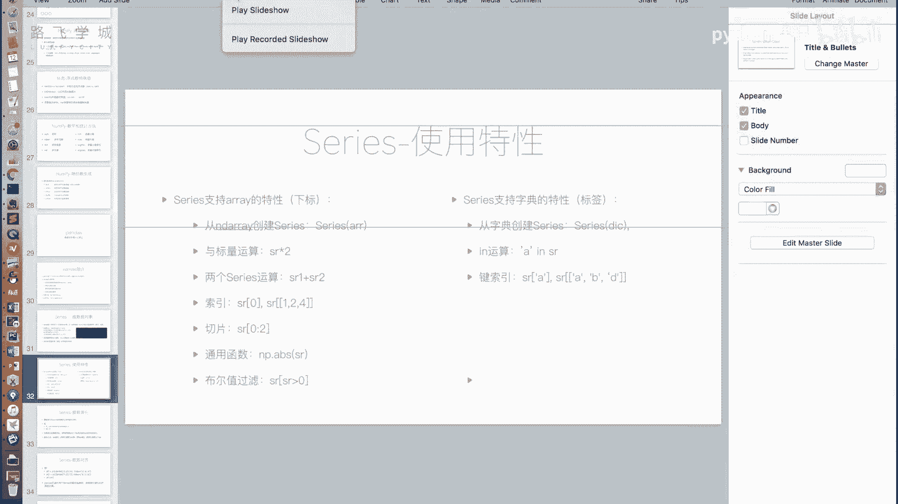
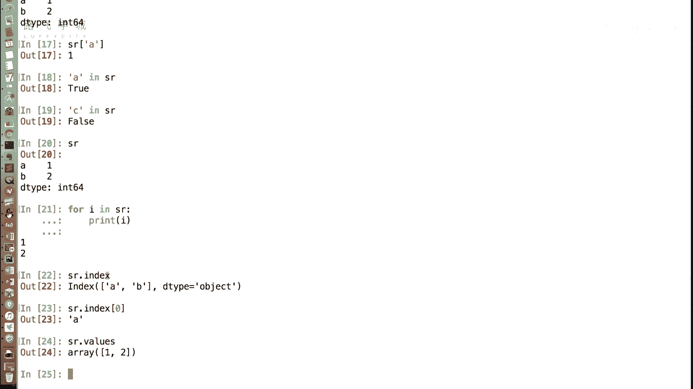
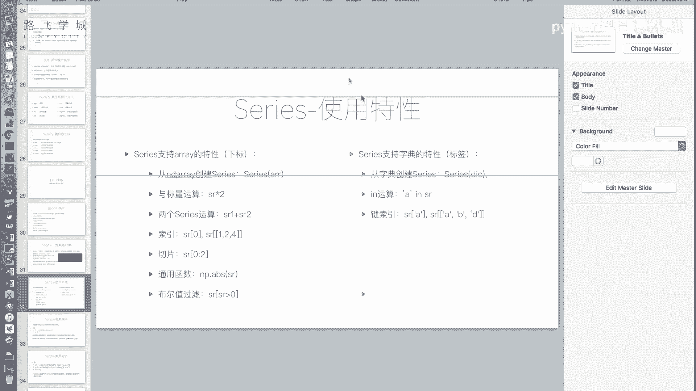
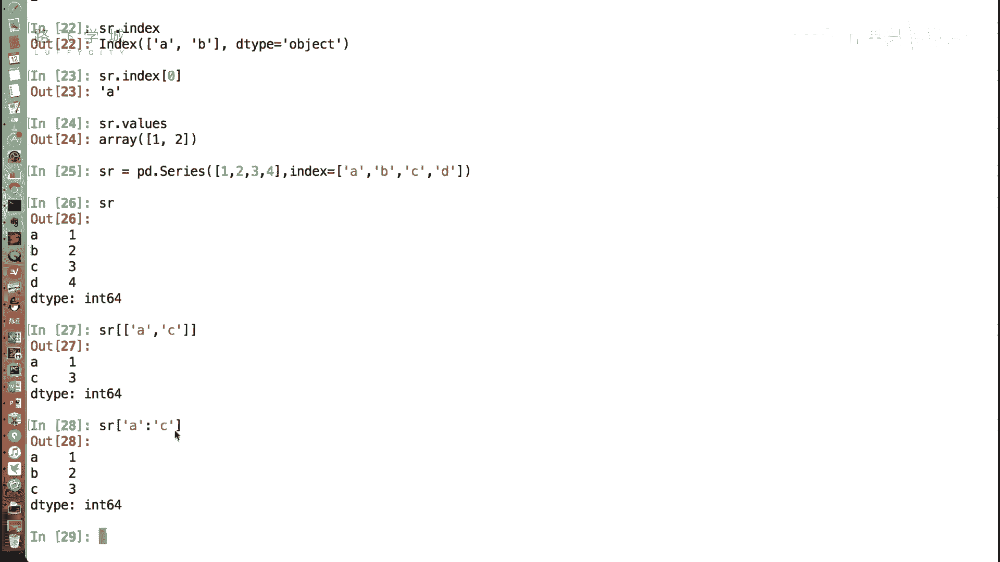

# Python机器学习与量化交易：P18：Series介绍 📊

在本节课中，我们将要学习Pandas库中的第一个核心数据结构——Series。我们将了解它是什么，如何创建它，以及它如何结合了列表（数组）和字典的特性，从而成为数据分析中一个强大且灵活的工具。

## 概述

上一节我们介绍了NumPy，它是数据分析的基础包。本节中，我们来看看Pandas。Pandas是基于NumPy构建的更高层封装，是数据分析领域不可或缺的工具。它的主要功能包括提供两种核心数据结构（DataFrame和Series）、集成时间序列功能、提供丰富的数学运算以及灵活处理缺失数据等。



安装Pandas非常简单，使用`pip install pandas`即可。官方建议的导入方式是`import pandas as pd`，我们也将遵循此约定。

## Series：列表与字典的结合体



Series是Pandas中的一种一维数组对象。你可以把它想象成列表（或NumPy数组）和字典的结合体。它既有类似列表的按位置（下标）访问的特性，也有类似字典的按键（标签）访问的特性。

### 创建Series

以下是创建Series对象的几种方法。




**从列表创建**
```python
import pandas as pd
s = pd.Series([2, 3, 4, 5])
```
输出结果左边是默认的整数索引（0, 1, 2, 3），右边是列表的值。

**从列表创建并指定索引（标签）**
```python
s = pd.Series([2, 3, 4, 5], index=[‘A‘, ‘B‘, ‘C‘, ‘D‘])
```
此时，左边的索引列变成了我们指定的‘A‘, ‘B‘, ‘C‘, ‘D‘，就像一个字典的键。

**从NumPy数组创建**
```python
import numpy as np
arr = np.array([1, 2, 3])
s = pd.Series(arr)
```
从NumPy数组创建Series同样可行。

**从字典创建**
```python
s = pd.Series({‘A‘: 10, ‘B‘: 20, ‘C‘: 30})
```
字典的键（Key）会自动成为Series的索引（标签），值（Value）成为Series的数据。这直观地体现了Series的“字典”特性。





## 继承自列表/数组的特性

Series继承了列表和NumPy数组的许多有用操作，使其在处理一维数据时非常强大。

以下是Series支持的一些类似数组的操作：

1.  **通过下标访问**：即使指定了字符串索引，依然可以通过整数下标（位置）访问数据。
    ```python
    s = pd.Series([2, 3, 4, 5], index=[‘A‘, ‘B‘, ‘C‘, ‘D‘])
    print(s[0])  # 输出：2
    ```



2.  **与标量运算**：Series可以与单个数字进行运算，结果会作用到每个元素上。
    ```python
    print(s + 10)  # 每个元素加10
    ```



3.  **相同大小的Series间运算**：两个长度相同的Series可以进行逐元素的加减乘除等运算。
    ```python
    s1 = pd.Series([1, 2, 3])
    s2 = pd.Series([4, 5, 6])
    print(s1 + s2)  # 输出：[5, 7, 9]
    ```

4.  **切片操作**：可以使用整数位置进行切片。
    ```python
    print(s[0:2])  # 输出索引0和1对应的元素
    ```

5.  **支持NumPy通用函数**：例如取绝对值、最大值、最小值等。
    ```python
    print(s.abs())
    print(s.max())
    ```

6.  **布尔型索引**：通过条件表达式筛选数据。
    ```python
    print(s[s > 4])  # 输出所有大于4的元素
    ```

## 继承自字典的特性

Series也融合了字典的一些关键特性，使其能通过标签灵活地组织数据。

以下是Series支持的一些类似字典的操作：



1.  **通过标签访问**：这是Series区别于普通数组的核心功能。
    ```python
    s = pd.Series({‘A‘: 10, ‘B‘: 20, ‘C‘: 30})
    print(s[‘A‘])  # 输出：10
    ```



2.  **`in`操作**：判断一个标签是否存在于Series的索引中。
    ```python
    print(‘A‘ in s)  # 输出：True
    print(‘Z‘ in s)  # 输出：False
    ```
    *注意：对Series使用`for`循环时，遍历的是值（values），而不是键（index）。这与遍历字典不同。*

3.  **通过标签进行花式索引和切片**：
    *   **花式索引**：传入一个标签列表，获取多个元素。
        ```python
        print(s[[‘A‘, ‘C‘]])  # 输出标签‘A‘和‘C‘对应的值
        ```
    *   **标签切片**：使用标签进行切片时，切片范围是“前包后也包”的。
        ```python
        print(s[‘A‘:‘C‘])  # 输出标签‘A‘, ‘B‘, ‘C‘对应的值
        ```

## 获取索引与值

我们经常需要分别获取Series的索引（标签）和值（数据）。

*   **获取索引**：使用`.index`属性。
    ```python
    print(s.index)  # 输出索引对象，例如 Index([‘A‘, ‘B‘, ‘C‘], dtype=‘object‘)
    ```
*   **获取值**：使用`.values`属性。返回的是一个NumPy数组。
    ```python
    print(s.values)  # 输出：array([10, 20, 30])
    ```

## Series的实际应用场景

Series结合了有序列表和键值对字典的优点，使其非常适合表示带标签的一维数据序列。例如：

*   **时间序列数据**：记录一支股票每日的收盘价。索引是日期（标签），值是价格。这样既可以通过日期（`s[‘2023-10-27‘]`）快速查询某天价格，也可以通过位置（`s[0:5]`）获取前五天的数据。
*   **有序的键值对集合**：在需要保持顺序的映射关系中，如果用字典存储，遍历时顺序是不确定的；如果用列表存储元组`(key, value)`，按key查找效率低。Series完美解决了这个问题：它按插入顺序（或指定顺序）存储，并支持高效的按键访问。



## 总结

本节课中我们一起学习了Pandas库的核心数据结构之一——Series。我们了解到：
1.  Series是一个一维的、带标签的数组，融合了列表和字典的特性。
2.  可以通过列表、NumPy数组或字典来创建Series，并可以自定义索引。
3.  它支持类似数组的下标访问、运算、切片和布尔索引。
4.  它也支持类似字典的标签访问、`in`操作和标签切片。
5.  通过`.index`和`.values`属性可以分别获取其索引和值。
6.  Series非常适合处理像时间序列这类需要同时通过位置和标签进行访问的数据。

理解了Series，就为学习Pandas中更强大的二维表格结构DataFrame打下了坚实的基础。下一节，我们将介绍DataFrame。