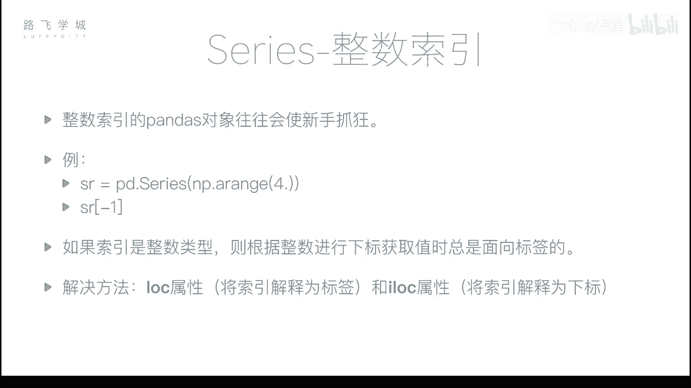
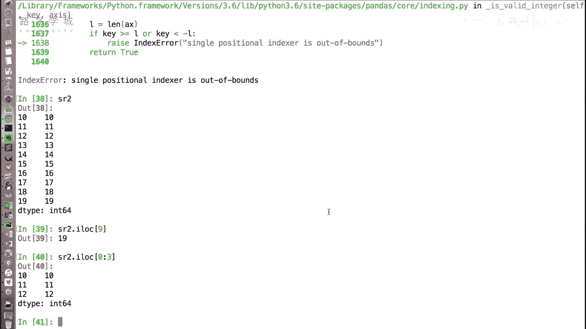
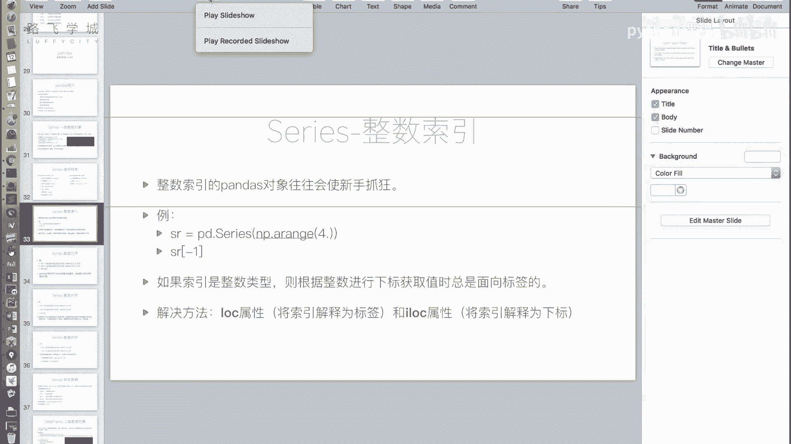

# Python机器学习与量化交易：P19：Series整数索引问题

在本节课中，我们将要学习Pandas Series对象在使用整数索引时可能遇到的歧义问题，以及如何通过`.loc`和`.iloc`属性来明确指定索引方式，从而避免混淆。



上一节我们介绍了Series的一些基本特性，本节中我们来看看一个使用Series时非常重要的注意事项：当Series的索引是整数时，可能会让新手感到困惑。


## 整数索引的歧义问题

整数索引指的是Series的索引标签本身就是整数。这在使用中括号`[]`进行数据选取时会产生歧义：程序无法确定你传入的整数是代表“标签”还是代表“位置下标”。

以下是理解该问题的步骤：

1.  **创建示例Series**：首先，我们创建一个没有指定索引的Series，Pandas会自动生成从0开始的整数索引。
    ```python
    import pandas as pd
    import numpy as np
    sr = pd.Series(np.arange(20))  # 索引为 0, 1, 2, ..., 19
    ```

2.  **通过切片创建新Series**：接着，我们对这个Series进行切片，创建一个新的Series对象。
    ```python
    sr2 = sr[10:].copy()  # 新Series的索引为 10, 11, 12, ..., 19
    ```

3.  **产生歧义的情景**：此时，如果我们想获取`sr2`的第一个值（标签为10）或最后一个值（标签为19），直接使用中括号会如何？
    *   输入`sr2[10]`：程序可能将其解释为“获取标签为10的那一行”，输出`10`；也可能解释为“获取下标位置为10的那一行”（即第11个元素），输出`20`。实际上，Pandas规定，**当索引是整数时，中括号内的值一律被解释为标签**。因此`sr2[10]`会输出`10`。
    *   输入`sr2[19]`：由于`sr2`的标签只到19，所以这会尝试获取标签为19的值，输出`29`。
    *   输入`sr2[20]`：这会尝试获取标签为20的值，但`sr2`中没有这个标签，因此会引发`KeyError`错误。如果你本意是想获取最后一个元素（位置下标为9），这种写法就会报错。

正是因为存在这种歧义，直接对整数索引的Series使用中括号进行选取操作很容易出错。

## 解决方案：使用 `.loc` 和 `.iloc`

为了解决整数索引的歧义问题，Pandas提供了两个明确的属性：`.loc`和`.iloc`。

*   **`.loc[]`**：**基于标签的索引**。中括号内的值**总是**被解释为索引标签。
*   **`.iloc[]`**：**基于整数位置的索引**。中括号内的值**总是**被解释为从0开始的位置下标。

以下是具体使用方法：

1.  **使用`.loc`获取特定标签的值**：明确告诉程序按标签查找。
    ```python
    value_by_label = sr2.loc[10]  # 获取索引标签为 10 的值，结果是 10
    ```

2.  **使用`.iloc`获取特定位置的值**：明确告诉程序按下标位置查找。
    ```python
    value_by_position = sr2.iloc[0]  # 获取第一个元素（下标0），结果是 10
    last_value = sr2.iloc[-1]       # 获取最后一个元素，结果是 29
    # sr2.iloc[10]  # 这会引发 IndexError，因为下标10超出了范围（总共只有10个元素）
    ```

3.  **支持多种索引方式**：`.loc`和`.iloc`不仅支持单个值选取，也完全支持切片、布尔索引和花式索引。
    ```python
    # 使用 .iloc 进行位置切片
    slice_by_iloc = sr2.iloc[0:3]  # 获取前三个元素（下标0,1,2）
    # 使用 .loc 进行标签切片 (注意：标签切片是包含结束标签的)
    slice_by_loc = sr2.loc[10:12] # 获取标签为10,11,12的元素
    ```

## 核心建议



只要涉及到整数索引的Pandas对象（Series或DataFrame），为了避免潜在的混淆和错误，**强烈建议使用`.loc`和`.iloc`来明确你的索引意图**。`.loc`用于标签，`.iloc`用于位置，这样可以保证代码清晰且行为可预测。



本节课中我们一起学习了Pandas Series整数索引的歧义性及其解决方案。关键在于理解当索引为整数时，直接索引会产生标签与位置的混淆。通过使用`.loc`（基于标签）和`.iloc`（基于位置）这两个属性，我们可以清晰、无歧义地访问Series中的数据。记住这个技巧，能让你在后续的数据处理中更加得心应手。