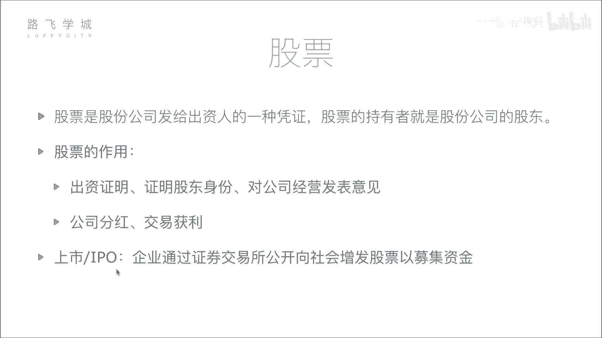
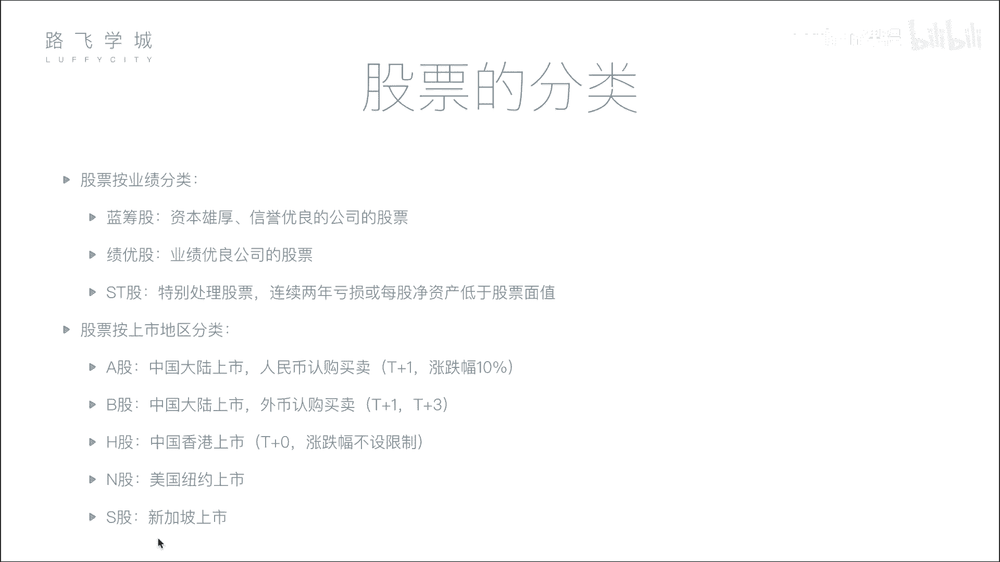

# 4天学会Python机器学习与量化交易：P2：02 金融量化分析-股票基本知识和股票分类

在本节课中，我们将要学习股票的基础知识，包括股票的定义、作用以及分类方式。理解这些概念是进行后续金融量化分析的基础。

## 股票的定义 📄

股票是股份公司发给出资人的一种凭证。股票的持有者就是股份公司的股东。

为了更形象地解释，我们可以设想一个场景：一位创业者需要资金来运营公司，但他自己资金不足。这时，投资者可以将资金投入该公司。作为交换，公司会向投资者发行股票。这张股票就是投资者出资的证明，也代表了投资者在公司中的所有权份额。

例如，假设一家公司初始由五方各出资1亿元，公司总市值即为5亿元。那么，每一方都将获得公司20%的股票，代表其拥有公司五分之一的权益。

## 股票的作用 💰

上一节我们介绍了股票是股东身份的凭证，本节中我们来看看持有股票的主要作用。

持有股票主要有两个作用：证明股东身份与获取收益。

以下是股票的两个核心作用：

1.  **证明股东身份与权利**：股票是投资者的出资证明，确立了其股东身份。作为股东，有权参与公司重大决策（如在股东大会上投票），并享有相应的法律权利。
2.  **获取收益**：投资者可以通过两种主要方式从股票中获利：
    *   **公司分红**：当公司盈利时，可能会将部分利润以现金形式分配给股东。分红金额与持股比例成正比。公式可表示为：`个人分红 = 公司总利润 × 个人持股比例`。
    *   **交易获利**：投资者可以在证券交易所买卖股票。通过以较低价格买入，再以较高价格卖出，赚取差价。例如，投资1亿元买入股票，当股票总价值升至10亿元时卖出，即获利9亿元。

对于广大普通股民而言，虽然持股比例较小，但同样可以通过上述两种方式参与公司成长并获取收益。

## 公司上市与IPO 🚀

了解了股票的基本作用后，一个关键问题是：普通投资者如何买卖股票？这就涉及到“上市”的概念。

所谓上市，是指企业通过证券交易所，首次公开向公众发行股票以募集资金的过程。

公司不能随意向公众募集资金。它需要达到一定标准，并向证监会等监管机构提交申请，经审核批准后，才能在证券交易所挂牌交易。上市后，公司的股票就可以被所有符合条件的投资者公开买卖。

公司寻求上市的主要目的是为了募集更多资金。相对于从少数私人投资者处融资，公开上市可以从庞大的公众投资者群体中汇集资金。

**IPO** 即首次公开募股，指的就是公司第一次向社会公众公开发行股票的行为。

## 股票的分类 📊

我们已经知道股票可以交易，接下来看看股票有哪些常见的分类方式。

股票主要有两种分类方式：按公司业绩分类和按上市地区分类。

### 按业绩分类

根据公司的经营业绩，股票通常分为以下三类：

*   **蓝筹股**：指资本雄厚、信誉优良的巨型公司发行的股票。例如中国的石油、银行等大型国有企业。类比而言，就像赌场中价值最高的蓝色筹码。
*   **绩优股**：指业绩长期稳定优良的公司发行的股票。这类公司可能规模不是最大，但盈利能力持续强劲。例如某些消费或科技行业的龙头公司。
*   **ST股**：中文为“特别处理股票”。如果公司连续两年亏损，或每股净资产低于股票面值，其股票名称前会被加上“ST”标记，以警示投资者该公司存在较高风险。

### 按上市地区分类

根据公司上市交易的地理位置和交易货币，股票可分为：

*   **A股**：在中国大陆（上海、深圳证券交易所）上市，以人民币认购和交易的股票。
*   **B股**：同样在中国大陆上市，但以外币（如美元、港币）认购和交易的股票。
*   **H股**：在中国香港上市的公司发行的股票。
*   **N股**：在美国纽约上市的公司发行的股票。
*   **S股**：在新加坡上市的公司发行的股票。

### 不同市场的交易规则

不同的股票市场有其特定的交易规则，其中两点对A股市场尤为重要：

1.  **涨跌幅限制**：A股设有每日涨跌幅限制，通常为10%（科创板、创业板等另有规定）。这意味着一只股票在单个交易日内的价格波动，不能超过前一个交易日收盘价的上下10%。此规则旨在平抑市场过度波动，保护投资者。
    *   例如：若某股票昨日收盘价为100元，则今日其最高价不得超过110元，最低价不得低于90元。
2.  **T+1交割制度**：在A股市场，当日买入的股票，需到下一个交易日才能卖出。这被称为“T+1”交割制度。与之相对，港股、美股等多实行“T+0”制度，即当日买入可当日卖出。T+1制度有助于减少市场中的过度投机行为。

本节课中我们一起学习了股票的核心概念：它是股东权的证明，可用于分红和交易获利。我们还探讨了公司通过IPO上市的过程，并了解了股票按业绩和上市地区的分类方法，以及A股市场的一些基本交易规则。掌握这些基础知识，是下一步利用Python进行量化分析的前提。