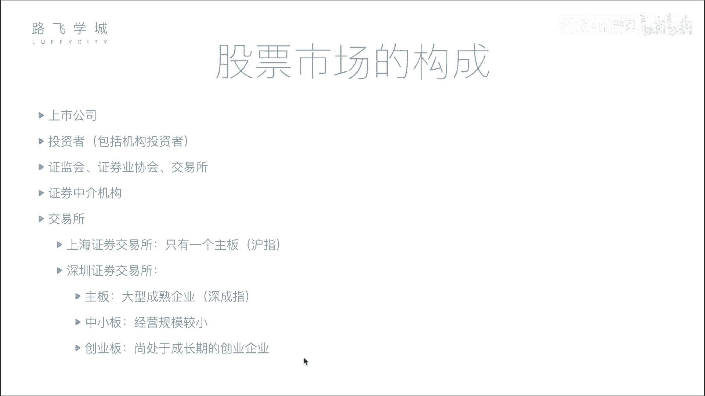
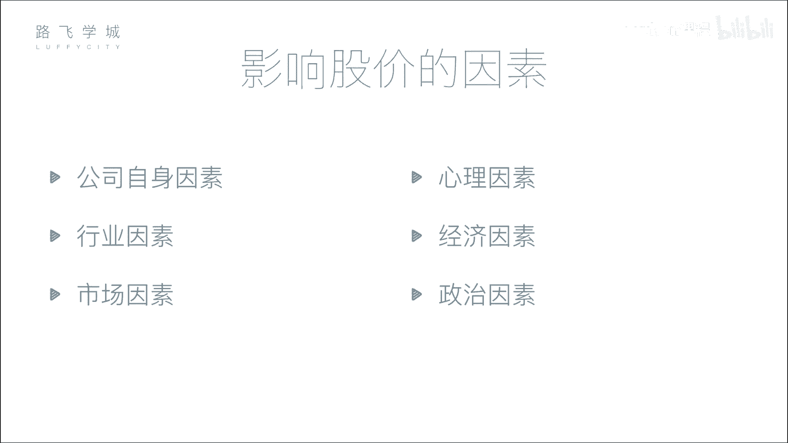

# 4天学会Python机器学习与量化交易：P3：03 金融量化分析-股票市场构成 📈

在本节课中，我们将要学习股票市场的基本构成。了解市场中有哪些参与者以及他们各自扮演的角色，是进行金融量化分析的重要基础。

上一节我们介绍了股票的分类，本节中我们来看看股票市场的构成，即市场中有哪些参与者。

## 公司与投资者 💼

股票市场最核心的参与者是公司和投资者。公司是融资方，需要资金来发展业务；投资者是出资方，提供资金以期望获得回报。公司通过发行股票向投资者募集资金。

## 监管与服务机构 🏛️

然而，股票交易并非直接在公司和投资者之间进行，这需要一系列监管和服务机构来确保市场的公平与秩序。

以下是主要的监管与服务机构：

*   **证监会**：全称中国证券监督管理委员会，是证券行业的最高监管机构。它负责审核公司上市申请、监督市场行为、打击违法违规活动（如欺诈、洗钱等），并拥有决定公司能否上市或强制其退市的行政权力。
*   **证券业协会**：这是一个行业自律组织，作用相对较弱。例如，证券从业资格考试通常由其主办。
*   **交易所**：交易所（如上海证券交易所和深圳证券交易所）为股票买卖提供集中的交易场所和设施。在电子化交易普及前，投资者需要到交易所现场进行交易；现在，所有交易都通过网络连接到交易所的系统进行处理。

## 证券中介机构（券商） 🏦

个人投资者通常不能直接进入交易所交易，这主要是由于历史原因和成本考量。早期，在交易所内交易需要购买昂贵的“席位”，个人投资者负担不起。于是，拥有席位的机构发展出代理业务，帮助小投资者买卖股票，并从中赚取佣金。

这个角色在现代就由**证券中介机构**（俗称券商或证券公司）承担，例如中信证券、中金公司等。

以下是券商的核心功能：
*   券商在交易所拥有交易席位。
*   个人投资者需要在券商处开户。
*   投资者通过券商提供的软件（如各券商APP或同花顺等第三方平台）下达买卖指令。
*   券商接收指令后，通过其在交易所的席位，代表投资者完成交易。

## 中国的交易所与板块 🇨🇳

中国内地有两个主要的证券交易所：上海证券交易所和深圳证券交易所。每个交易所内部又划分了不同的板块，以适应不同规模和发展阶段的企业。

以下是各交易所的板块划分：
*   **上海证券交易所**：主要包含**主板**。
*   **深圳证券交易所**：包含三个板块：
    *   **主板**：面向大型成熟企业。
    *   **中小板**：面向中型企业。
    *   **创业板**：面向成长型创新创业企业，上市门槛相对主板较低。例如，`净利润要求可能为连续2-3年达到3000万元`，而主板要求可能更高。

## 大盘指数 📊

我们常说的“大盘”走势，实际上是由**指数**来代表的。指数反映了某个市场或板块内一篮子股票价格的整体变动趋势，是衡量市场整体表现的重要指标。

以下是主要的A股指数：
*   **上证指数（沪指）**：代表上海证券交易所主板市场的整体走势。
*   **深证成指（深成指）**：代表深圳证券交易所主板市场的整体走势。
*   **中小板指**：代表深圳证券交易所中小板市场的整体走势。
*   **创业板指**：代表深圳证券交易所创业板市场的整体走势。

**指数**的运作原理可以简化为一个公式：`指数 = (一篮子股票的总市值 / 基期总市值) * 基点`。当大部分成分股上涨时，指数上涨，表明市场“向好”；反之则表明市场“向坏”。它提供了一个快速判断市场整体情绪的概括性工具。

---

本节课中我们一起学习了股票市场的核心构成。我们认识了市场的两大主体——公司与投资者，了解了确保市场运行的监管机构（证监会）、交易所，以及连接个人投资者与市场的桥梁——券商。同时，我们也熟悉了中国两大交易所及其不同板块，并明白了“大盘指数”是反映市场整体冷暖的关键指标。理解这些基本概念，将为后续学习量化交易策略打下坚实的基础。