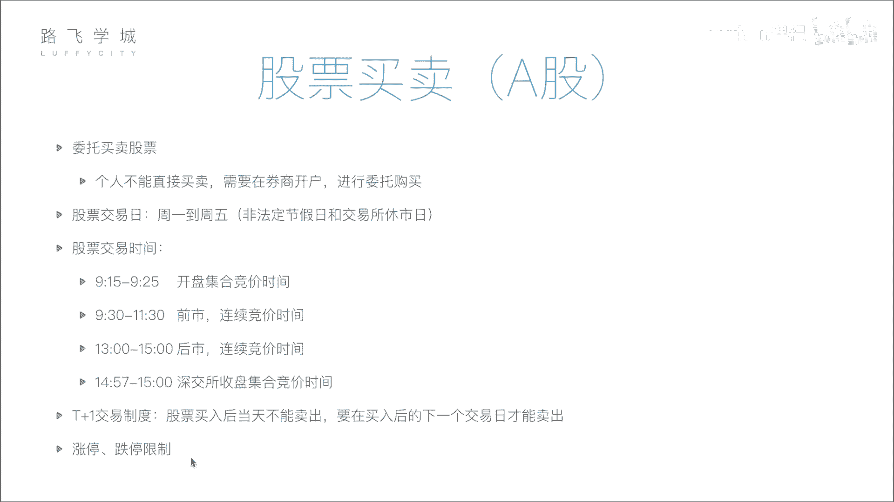

# Python机器学习与量化交易：P4：04 金融量化分析-影响股价因素与股票买卖知识 📈

在本节课中，我们将学习影响股票价格的主要因素，并了解股票买卖的基本流程与规则。理解这些基础知识是进行量化分析的前提。

## 影响股价的六大因素

上一节我们介绍了股票的基本概念，本节中我们来看看哪些因素会影响股票价格的波动。影响股价的因素可以归纳为以下六点。

### 1. 公司自身因素
这是影响股价最根本的因素。公司的经营状况、盈利能力、发展前景等直接决定了其内在价值。如果公司发展良好，市值增长，其股价通常会上涨；反之，若公司出现重大负面事件或经营不善，股价则会下跌。

### 2. 市场因素
这是影响股价最直接的因素。股价的短期波动由市场的供求关系决定。当买盘多于卖盘（供不应求）时，股价上涨；当卖盘多于买盘（供过于求）时，股价下跌。这与其他商品的定价原理一致。

### 3. 行业因素
整个行业的发展趋势会影响行业内所有公司的股价。例如，当某个行业（如人工智能）前景被看好时，相关公司的股票可能普遍上涨；反之，若某个行业（如传统IT）前景黯淡，相关股票则可能下跌。

### 4. 心理因素
投资者的情绪和心理预期会影响其买卖决策，从而影响股价。例如，从众心理可能导致非理性的“追涨杀跌”。历史上著名的“黑色星期五”股灾，部分原因就是恐慌性抛售引发的连锁反应。

### 5. 经济因素
国家层面的宏观经济状况和政策会影响股市。例如：
*   **利率**：存款利率上升可能吸引资金从股市流向银行，导致股市资金减少，股价承压。
*   **货币政策、外汇政策**等也会对市场流动性产生影响。

### 6. 政治因素
国际或国内的政治局势、军事冲突风险等会影响市场稳定性和投资者信心。例如，地缘政治紧张局势升级可能导致股市下跌，而相关军工类股票则可能因预期需求增加而上涨。

## 股票买卖的基本流程与规则

了解了影响股价的因素后，我们来看看实际操作中买卖股票的步骤和必须遵守的市场规则。

### 1. 开户与委托
个人投资者不能直接在交易所买卖股票，必须通过证券公司（券商）进行。首先需要在券商处开设证券账户和资金账户。开户后，投资者通过券商的系统（如交易软件）提交买卖指令，这个过程称为“委托”。

### 2. 交易日与交易时间
股票市场并非全天候开放。以下是A股市场的主要交易时间安排：

*   **交易日**：通常为每周一至周五（法定节假日除外）。
*   **交易时段**：
    *   **开盘集合竞价**：**9:15 - 9:25**。此期间接受委托申报，但不立即成交，交易所会在9:25一次性对全部申报按“最大成交量”原则进行撮合，产生当日的**开盘价**。
    *   **连续竞价**：**9:30 - 11:30, 13:00 - 14:57**。此期间系统对有效委托进行逐笔连续撮合，投资者提交的委托若符合条件可即时成交。
    *   **收盘集合竞价**（仅深圳交易所）：**14:57 - 15:00**。此期间接受申报但不撮合，在15:00一次性撮合产生**收盘价**。上海交易所的收盘价为当日最后一笔交易的成交价。

### 3. 重要交易制度
以下是两个核心的交易限制规则：

*   **T+1交易制度**：指当日（T日）买入的股票，必须到下一个交易日（T+1日）才能卖出。该制度旨在抑制过度投机。
*   **涨跌停板制度**：为控制股价过度波动，A股市场对普通股票设有每日价格涨跌幅限制。通常为前一交易日收盘价的 **±10%**（ST等特殊股票为±5%）。股价达到涨跌停板价格时，交易并未完全停止，但可能难以买入或卖出。

## 总结

本节课中我们一起学习了影响股票价格的六大因素（公司自身、市场、行业、心理、经济、政治），并掌握了股票买卖的基本流程，包括开户委托、交易时间安排以及T+1、涨跌停板等核心交易规则。这些知识是构建量化交易策略和理解市场行为的基础。