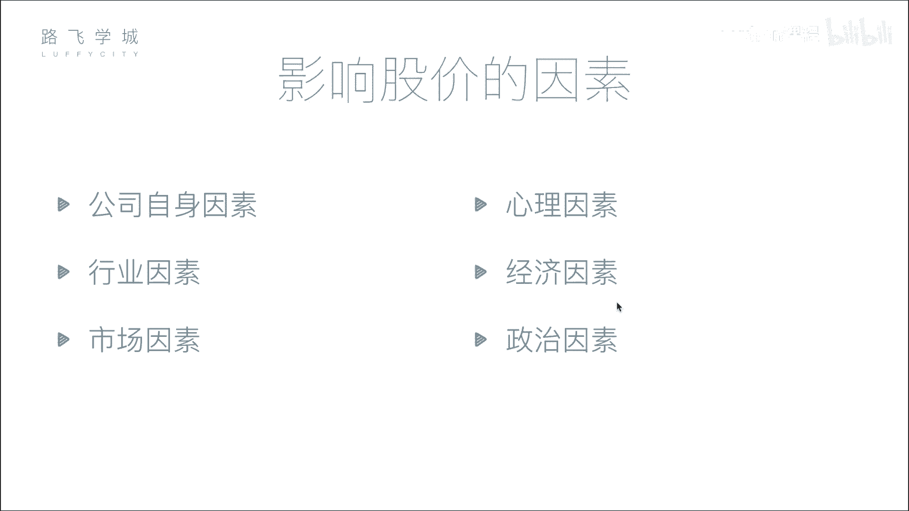

# Python机器学习与量化交易：P5：04 金融量化分析-影响股价因素&股票买卖知识 📈

在本节课中，我们将学习影响股票价格的主要因素，并了解股票买卖的基本流程与规则。理解这些基础知识是进行量化分析的前提。

## 影响股价的六大因素

上一节我们介绍了股票的基本概念，本节中我们来看看哪些因素会影响股票的价格。影响股价的因素可以归纳为以下六点。

### 1. 公司自身因素 🏢
这是影响股价最根本的因素。公司的经营状况、盈利能力、发展前景等直接决定了其内在价值。如果公司发展良好，市值增长，其股价通常会上涨；反之，若公司出现重大负面事件或经营不善，股价则会下跌。

### 2. 市场因素 📊
这是影响股价最直接的因素。股价的短期波动主要由市场供求关系决定。当买盘多于卖盘（供不应求）时，股价上涨；当卖盘多于买盘（供过于求）时，股价下跌。这与其他商品的定价原理一致。

### 3. 行业因素 🏭
整个行业的发展趋势会影响行业内所有公司的股价。例如，当某个行业（如人工智能）前景看好时，相关公司的股票可能普遍上涨；若某个行业（如传统制造业）面临衰退，相关股票则可能下跌。

### 4. 心理因素 😨
投资者的情绪和心理预期会影响其买卖决策，从而影响股价。例如，从众心理可能导致非理性的“追涨杀跌”。历史上多次股市崩盘（如“黑色星期一”）都与恐慌性抛售有关。

### 5. 经济因素 💹
宏观经济状况和国家政策会影响整体股市。例如，利率调整会影响市场资金流动性。存款利率上升可能促使资金从股市流向银行，导致股市资金减少，股价承压。

### 6. 政治因素 🏛️
国际关系、地缘政治事件等会引发市场不确定性，影响投资者信心。例如，当地区局势紧张时，投资者可能因避险情绪而抛售股票，导致股市下跌；而军工等特定板块的股票则可能上涨。

## 股票买卖流程与规则

了解了影响股价的因素后，我们来看看如何进行股票买卖。以下是股票交易的基本步骤和重要规则。

### 1. 开户与委托
个人投资者不能直接在交易所买卖股票，必须通过证券公司（券商）进行。首先需要在券商处开设账户，然后通过券商提供的系统（如交易软件）提交买卖指令，这个过程称为“委托”。

### 2. 交易日与交易时间
股票交易所并非全天候开放。交易日通常为非法定节假日的周一至周五。交易时间也有限制，以中国A股市场为例：

*   **开盘集合竞价**：09:15 - 09:25。在此期间提交的委托单不会立即成交，交易所会在09:25一次性集中撮合，以产生当日的**开盘价**。其核心原则是**最大化成交量**。
*   **连续竞价**：09:30 - 11:30, 13:00 - 14:57（沪市至15:00）。在此期间，交易所系统会高频（如每几秒）对买卖委托进行连续撮合成交。
*   **收盘集合竞价**（深市）：14:57 - 15:00。仅深圳交易所有此环节，用于产生**收盘价**。上海交易所的收盘价为当日最后一笔交易的成交价。

### 3. 交易制度：T+1与涨跌停板
这是A股市场两项重要的基础交易规则：

*   **T+1交易制度**：指当日（T日）买入的股票，必须到下一个交易日（T+1日）才能卖出。但当日卖出股票获得的资金，当日可以用于购买其他股票。
*   **涨跌停板限制**：为防止股价过度波动，A股设有每日价格涨跌幅限制。普通股票为**±10%**（ST股为±5%），即股价相对于前一个交易日的收盘价，单日上涨或下跌不能超过这个比例。

---

本节课中我们一起学习了影响股票价格的六大因素（公司自身、市场、行业、心理、经济、政治），并掌握了股票买卖的基本流程、交易时间划分以及T+1、涨跌停板等核心交易规则。这些知识是构建量化交易策略和理解市场行为的基础。