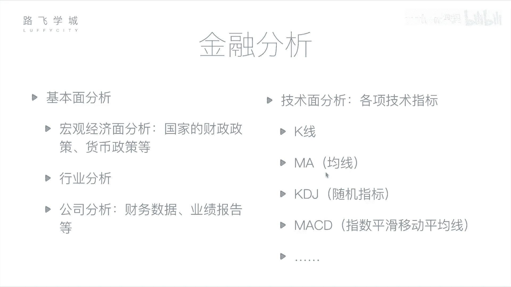
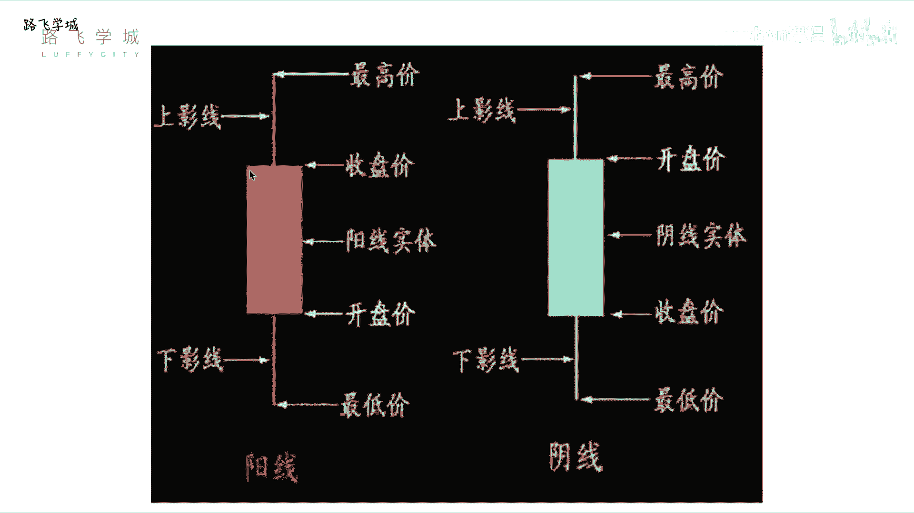
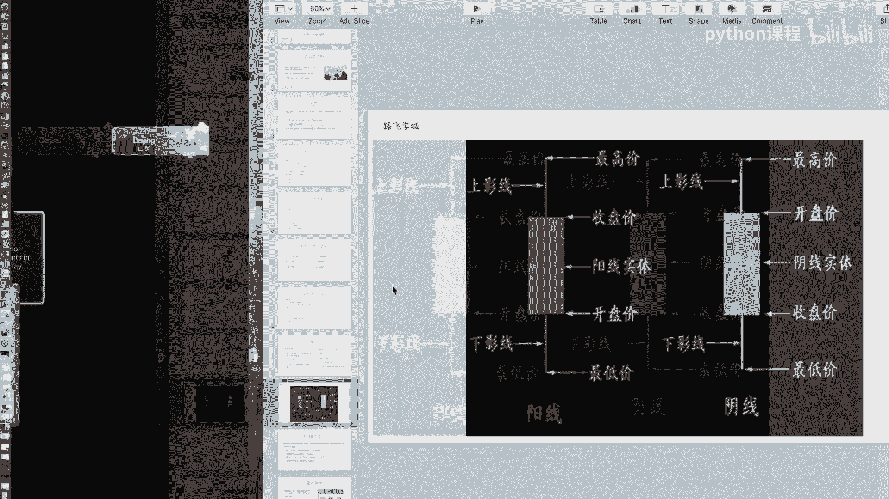
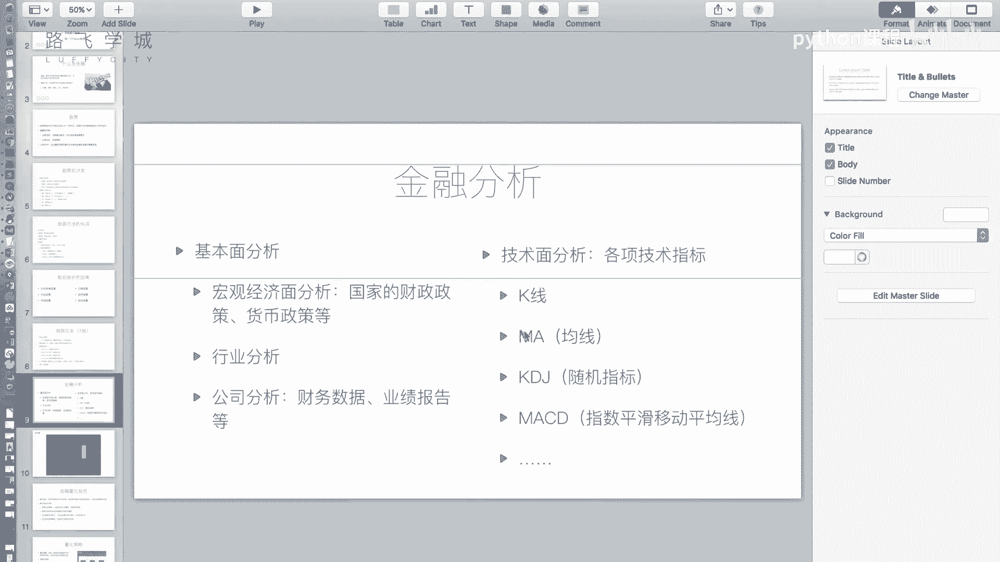
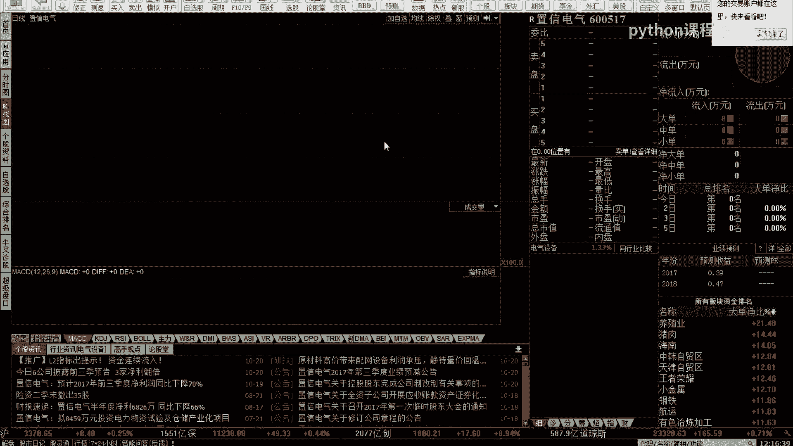
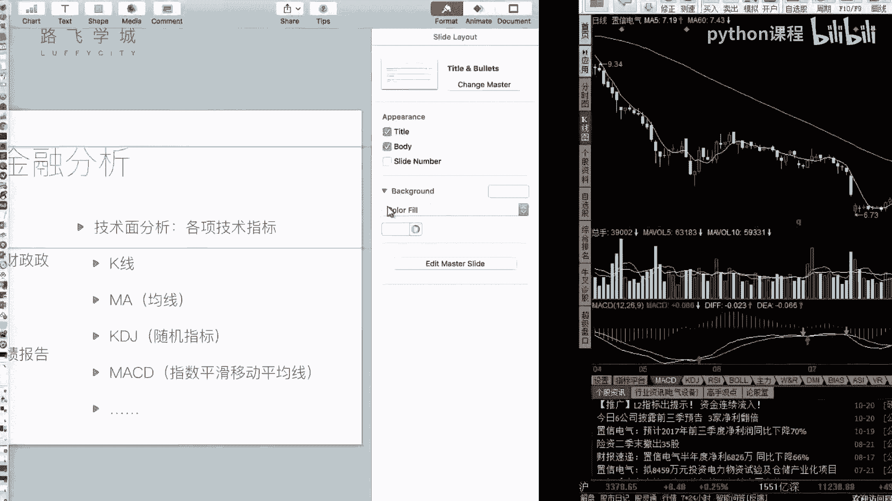

# Python机器学习与量化交易：P6：05 金融量化分析-金融分析 📈

在本节课中，我们将学习金融分析的基础知识。了解如何通过基本面分析和技术面分析来判断股票的投资价值，避免盲目买卖。我们将重点介绍两种核心的技术分析工具：K线和移动平均线（MA）。

上一节我们介绍了金融和股票的基础知识，本节中我们来看看如何进行具体的金融分析。

## 基本面分析

基本面分析的核心是评估公司的内在价值。它关注影响股价的公司自身因素、行业状况和宏观经济环境。通过分析这些信息，投资者可以判断一家公司是否运营良好、是否值得投资。

以下是基本面分析的三个主要方面：

1.  **宏观经济面分析**：分析国家的财政政策、货币政策等宏观因素，判断整体经济环境对股市资金流向的影响。
2.  **行业分析**：评估特定行业（如教育、IT、能源）的整体发展前景和趋势。
3.  **公司分析**：这是最具体的层面。投资者通过研究上市公司的公开财务报表（如年报、季报）、新闻以及实地考察等方式，判断其经营状况和盈利能力。公式上，常关注每股收益（EPS）等指标：`EPS = 公司净利润 / 总股本`。

## 技术面分析

技术面分析认为，所有影响市场的因素都已反映在价格和交易量等历史数据中。其核心是通过研究历史市场行为（主要是图表和指标）来预测未来的价格走势。

以下是两种常见的技术分析指标：

1.  **K线**：K线图是展示股票每日价格变动的图表。一根K线包含四个关键价格：开盘价、收盘价、最高价和最低价。
    *   **阳线**（通常为红色或空心）：表示当日收盘价高于开盘价，股价上涨。实体部分的下边缘是开盘价，上边缘是收盘价。
    *   **阴线**（通常为绿色或实心）：表示当日收盘价低于开盘价，股价下跌。实体部分的上边缘是开盘价，下边缘是收盘价。
    *   实体上下方的细线称为“影线”，分别代表最高价和最低价。

2.  **移动平均线（MA）**：移动平均线是通过计算过去一段时间内收盘价的平均值，来平滑价格数据、显示趋势的指标。例如：
    *   **MA5（5日均线）**：计算过去5个交易日收盘价的平均值。`MA5 = (P1 + P2 + P3 + P4 + P5) / 5`，其中P代表每日收盘价。
    *   **MA60（60日均线）**：计算过去60个交易日收盘价的平均值。它代表了更长期的价格趋势。

在股票软件中，将每日的移动平均值连接起来，就形成了均线。观察短期均线（如MA5）与长期均线（如MA60）的相对位置和交叉情况，是判断买卖时机的一种常见策略。

---

本节课中我们一起学习了金融分析的两大方法：基本面分析和技术面分析。基本面分析侧重于公司的内在价值，而技术面分析则通过研究历史价格图表和指标（如K线和移动平均线）来预测未来走势。理解这些基础概念是进行后续量化交易策略设计的重要前提。