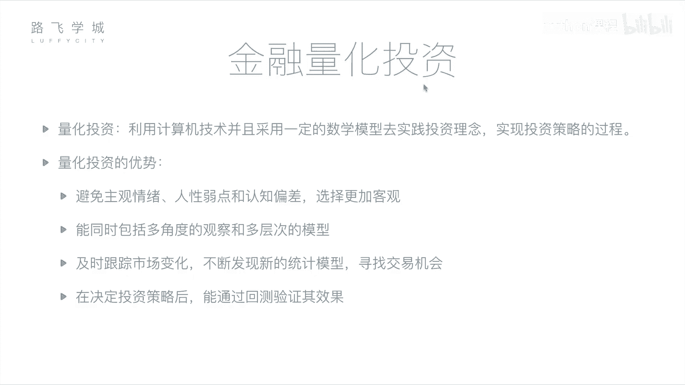
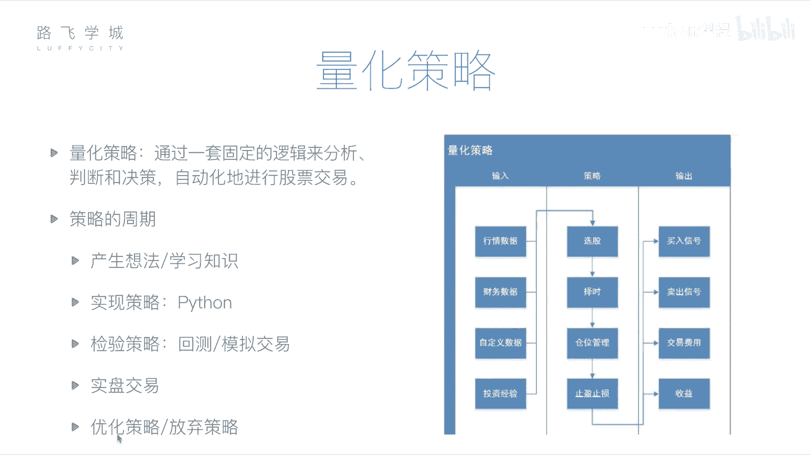

# 4天学会Python机器学习与量化交易：P7：06 金融量化分析-金融量化投资介绍

## 概述
在本节课中，我们将要学习金融量化投资的核心概念。我们将了解什么是量化投资，它与传统人工投资相比有哪些优势，并深入探讨量化策略的构成要素及其完整的生命周期。通过本节课的学习，你将建立起对量化交易的基本认知框架。

## 量化投资的概念
上一节我们介绍了金融分析的基本面与技术面方法。本节中我们来看看如何将这些分析过程自动化。

金融分析涉及对公司和股票的判断。这个判断过程可以交给计算机来完成。无论是基本面分析所需的财务报表，还是技术面分析所需的历史价格与交易记录，这些数据都可以被获取。利用计算机技术来完成这些分析的过程，就称为**量化投资**或**量化分析**。

所谓量化投资，是指利用计算机技术，并采用一定的数学模型，去实践投资理念、实现投资策略的过程。它包含三个重要部分：
1.  **计算机技术**：即使用计算机编程的方式。
2.  **数学模型**：即具体的策略或套路，例如均线就是一个数学模型，其公式可以表示为：`N日均线 = 过去N日收盘价之和 / N`。
3.  **实践**：用编写好的计算机程序去执行投资，或预先进行尝试以验证策略的可靠性。

## 量化投资的优势
了解了量化投资的定义后，我们来看看它相较于传统人工投资有哪些好处。

量化投资可以避免主观情绪、人性弱点和认知偏差，使选择更加客观。人类投资者容易受感情影响，例如持有某只股票后，即使各种迹象表明它将下跌，也可能因不舍而拒绝抛售；或者因股票连续几日下跌而产生恐慌，做出非理性抛售决策。这些都是认知偏差。

机器能够同时进行多角度观察和多层次分析。计算机可以快速处理大量信息，同时监控多只股票的多个维度，如均线、财报等。而人类投资者难以同时处理如此多的信息。

量化投资可以及时跟踪市场变化，不断发现新的统计套利和交易机会。股票价格瞬息万变，人工盯盘效率低下且容易疲劳。计算机程序可以持续监测，一旦发现符合策略的买卖点，便能立即执行，反应更为及时。此外，程序也便于尝试和集成新的投资方法。

在决定投资策略后，可以通过**回测**来验证其效果。回测是指用历史数据检验策略的盈利能力。例如，假设现在是2017年，可以用2012年至2017年的历史数据运行策略，观察其收益情况。通过在不同时间段进行回测和调整，可以在投入实盘前，从历史角度客观评估策略的有效性。

## 量化策略的核心构成
上一节我们介绍了量化投资的整体优势，本节中我们来深入看看其核心——量化策略的具体构成。

一个量化策略主要包括输入、处理逻辑和输出三部分。

以下是策略的**输入**，即程序进行分析所需的数据源：
*   **行情数据**：股票历史交易数据，如每日的开盘价、收盘价、交易量等。
*   **财务数据**：各公司的财务报表数据。
*   **自定义数据**：任何可获取并认为有价值的数据，例如通过自然语言处理分析的新闻舆情数据，甚至是个人总结的投资经验。

策略的**处理逻辑**主要完成以下四件事：
1.  **选股**：从数千只股票中筛选出目标股票。
2.  **择时**：决定买卖股票的具体时间点，旨在低买高卖。
3.  **仓位管理**：决定资金在不同股票间的分配比例。
4.  **止盈止损**：设置必要的风险控制手段。例如，亏损达到10%时强制卖出（止损），盈利达到30%时考虑卖出锁定利润（止盈）。

策略的**输出**是最终的行动指令或分析结果：
*   **买卖信号**：生成买入或卖出指令，可以提示给投资者或自动发送给券商系统执行。
*   **交易费用与收益**：计算本次交易涉及的手续费、佣金等成本，并核算最终的盈亏结果及各项收益指标。

## 量化策略的生命周期
一个完整的量化策略从构思到应用，会经历一个周期。以下是这个周期的主要阶段：

首先，**产生想法**。这可能源于多年的投资经验，或是学习到的新指标、新理论。

接着，**实现策略**。将想法通过编程转化为计算机程序。在本课程中，我们将使用Python来实现。

然后，**检验策略**。策略编写完成后，不直接用于实盘交易，而是先进行检验。检验主要有两种方式：
*   **回测**：使用历史数据验证策略在过去的表现。
*   **模拟交易**：使用当前开始的实时市场数据进行模拟交易，但不投入真实资金。这可以检验策略在近期市场环境下的表现。

如果检验结果良好，便可以进入**实盘交易**阶段，将策略投入真实市场运行，或者将已验证有效的策略进行商业化。

在整个周期中，可能根据回测或模拟交易的结果对策略进行**调整优化**，如果效果不佳，也可能选择**放弃**并开始构思新的策略。

## 总结
本节课中，我们一起学习了金融量化投资的基础知识。我们明确了量化投资是利用计算机程序和数学模型进行投资决策的过程，并分析了其客观、高效、可回测的优势。我们深入剖析了量化策略的三大构成部分：数据输入、处理逻辑（选股、择时、仓位管理、止盈止损）和结果输出。最后，我们了解了策略从构思、实现、检验到实盘应用（或优化放弃）的完整生命周期。接下来，我们将开始学习如何使用Python及相关工具库来具体实现这些量化策略。