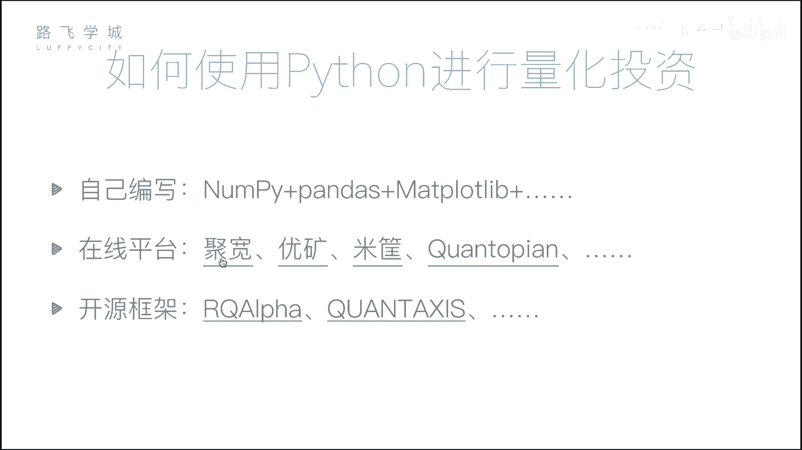
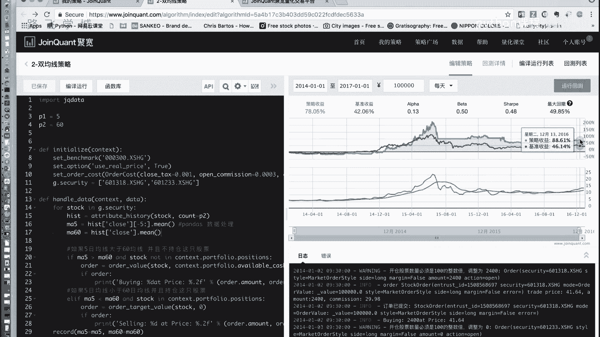
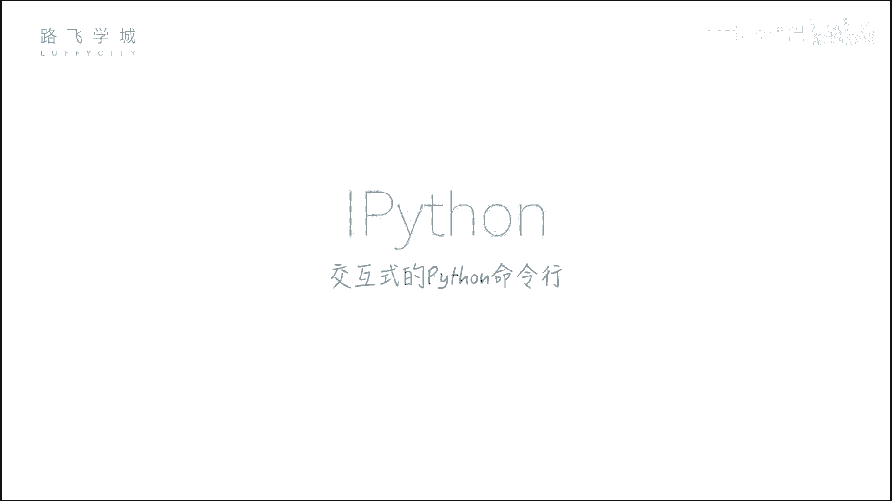
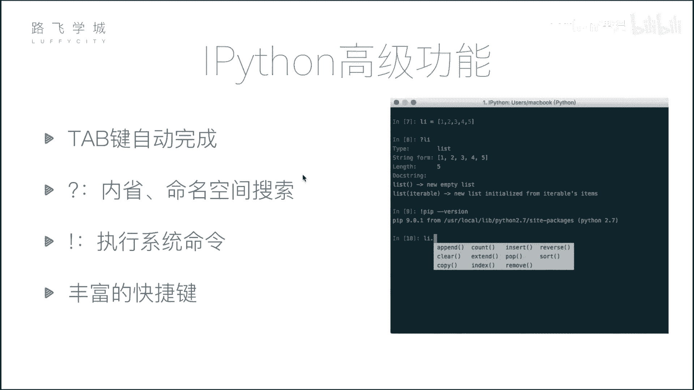
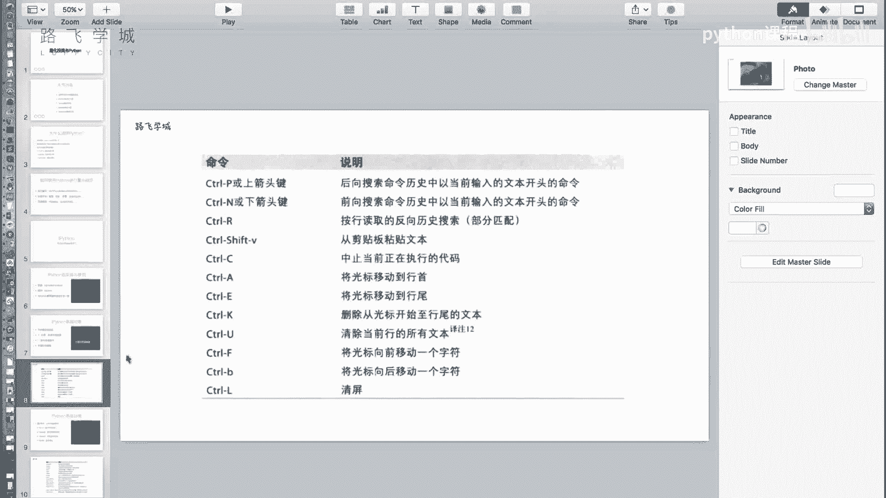

# 4天学会Python机器学习与量化交易：P8：07 金融量化分析-量化投资与Python&IPython初识

在本节课中，我们将要学习量化投资的基本概念，了解为何选择Python作为量化分析的工具，并初步认识一个强大的交互式Python环境——IPython。

## 量化投资与Python

上一节我们介绍了金融数据分析的基础，本节中我们来看看如何将数据分析应用于投资决策，即量化投资。量化投资的核心是**分析数据从而得出决策的过程**。无论是行情数据、财务数据还是其他信息，都是通过分析这些数据，并根据预设的指标来做出投资决策。

那么，为何选择Python进行量化投资呢？除了Python，市场上还有其他工具可供选择。以下是几种常见的工具：

*   **Excel**：主要用于手工操作，不具备程序化能力。
*   **SAS / SPSS**：统计软件，能进行标准化计算（如计算均值、生成图表），但同样不涉及编程。
*   **R语言**：一门专注于数据分析的编程语言，但在量化投资领域应用相对较少，因为其应用范围较窄。

相比之下，Python是一门通用语言，在数据分析、Web开发、自动化等多个领域都有广泛应用。学习Python相当于掌握了一个多面手工具。对于量化投资而言，Python拥有强大的数据处理和分析生态。



## Python数据分析核心模块

在量化投资中，数据处理和分析至关重要。我们将重点学习以下三个核心Python模块：



1.  **NumPy**：用于进行高效的**数组批量计算**。其核心是`ndarray`多维数组对象。
    ```python
    import numpy as np
    arr = np.array([1, 2, 3, 4, 5])
    mean_value = np.mean(arr)  # 计算平均值
    ```

2.  **Pandas**：核心库，提供了灵活的**数据表结构**（`DataFrame`和`Series`），并围绕此结构提供了丰富的数据操作功能。
    ```python
    import pandas as pd
    df = pd.DataFrame({'价格': [10, 20, 30], '成交量': [100, 200, 300]})
    ```

3.  **Matplotlib**：用于**数据可视化**的库。有了数据之后，我们可以用它来绘制各种图表，直观地展示分析结果。
    ```python
    import matplotlib.pyplot as plt
    plt.plot([1, 2, 3, 4], [1, 4, 9, 16])
    plt.show()
    ```

## 量化投资的实现方式

学习了上述模块后，我们可以通过以下两种主要方式进行量化投资实践：

1.  **自建量化框架**：我们将带领大家，仅使用NumPy、Pandas和Matplotlib这三个模块，从零开始搭建一个简单的量化投资框架。在这个框架中，你可以写入自己的交易策略，使用历史股票数据进行回测，以评估策略的有效性。

2.  **使用在线量化平台**：市场上也存在一些现成的在线平台。这些平台提供了完整的量化投资环境，你只需要编写核心的策略代码并上传到平台运行，即可获得可视化的回测结果。

例如，在一个在线平台中，你可以在左侧编写策略代码，运行后右侧会生成策略的收益曲线图。这条曲线展示了该策略在历史时间段内模拟运行的结果，可以清晰地看出策略是盈利还是亏损。图中通常还会有一条“基准收益”线（如大盘指数），用于对比策略的相对表现。



## IPython交互式环境介绍



在深入学习上述数据分析模块之前，我们先介绍一个能极大提升开发效率的工具：**IPython**。它是一个功能增强的交互式Python命令行环境。

### 安装IPython

对于已经安装Python的用户，可以通过Python自带的包管理工具`pip`进行安装。建议使用国内镜像源以加速下载。
```bash
pip install ipython -i https://pypi.douban.com/simple/
```
对于尚未安装Python或希望一次性获得完整科学计算环境的用户，推荐直接安装**Anaconda**发行版，它集成了IPython、NumPy、Pandas、Matplotlib等我们所需的所有库。

安装完成后，在命令行输入`ipython`即可启动。

### IPython的核心特性

与标准Python命令行相比，IPython提供了许多强大功能。以下是几个关键特性：

*   **Tab键自动补全**：在输入变量名、函数名或模块名时，按`Tab`键可以自动补全或列出所有可能的选项。
*   **执行系统命令**：在IPython中可以直接执行一些系统命令（如`ls`, `pwd`）。对于更复杂的系统命令，只需在命令前加上感叹号`!`即可执行，例如`!pip list`。
*   **内省与帮助**：使用问号`?`可以进行对象内省。例如，在变量名后加`?`可以查看该对象的详细信息；在函数名后加`??`可以查看该函数的源代码（如果可用）。
*   **丰富的快捷键**：IPython支持大量快捷键来提高编辑效率。

以下是部分常用快捷键列表：
*   `Ctrl + A`：移动光标到行首。
*   `Ctrl + E`：移动光标到行尾。
*   `Ctrl + U`：删除从光标到行首的所有内容。
*   `Ctrl + K`：删除从光标到行尾的所有内容。
*   `Ctrl + L`：清屏。

---



本节课中我们一起学习了量化投资的概念与Python的优势，认识了后续将深入学习的三个核心数据分析模块（NumPy, Pandas, Matplotlib），并初步掌握了高效的学习与开发工具IPython的基本用法。接下来，我们将正式进入这些强大工具的学习。