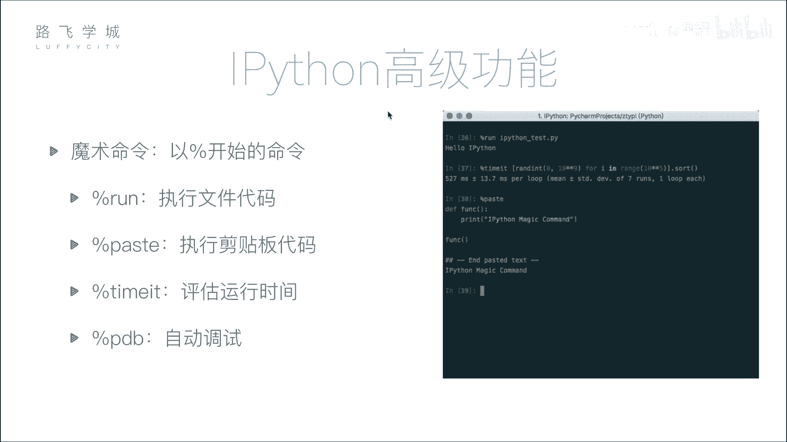
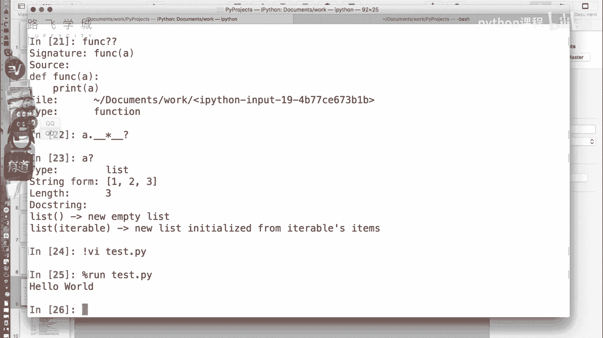
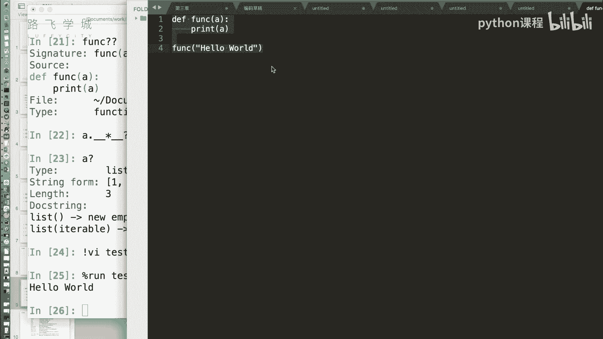
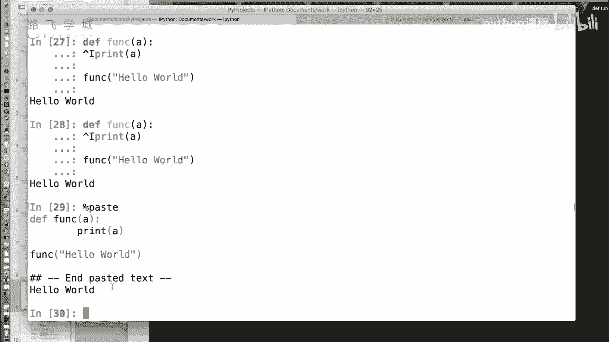
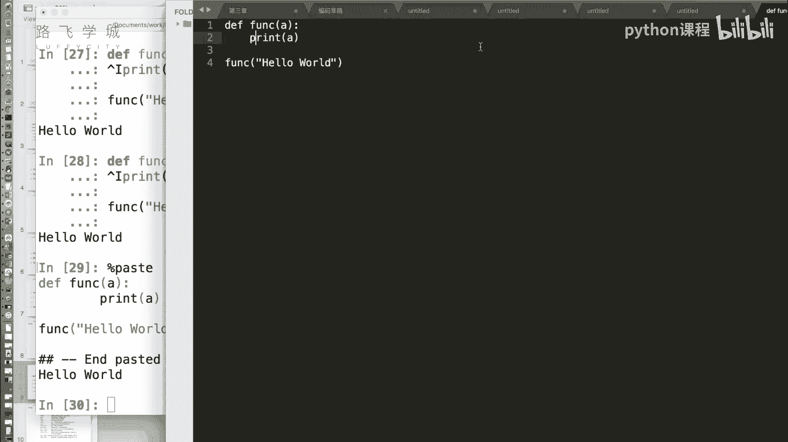
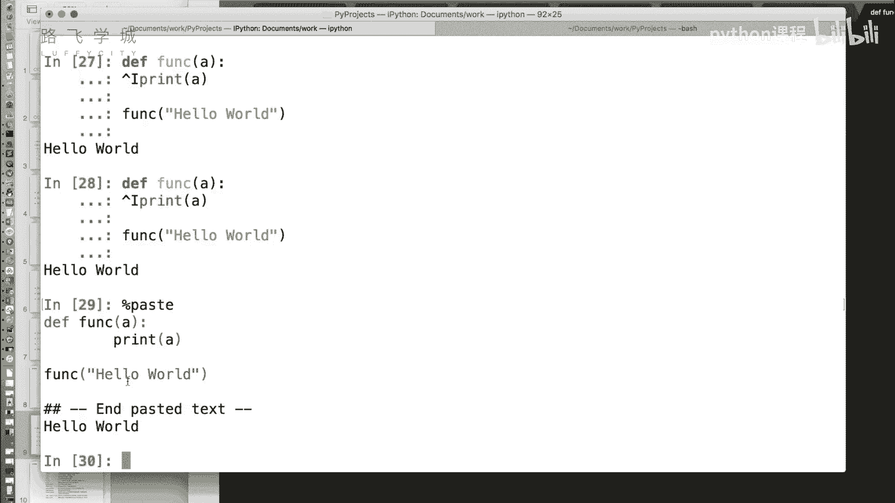
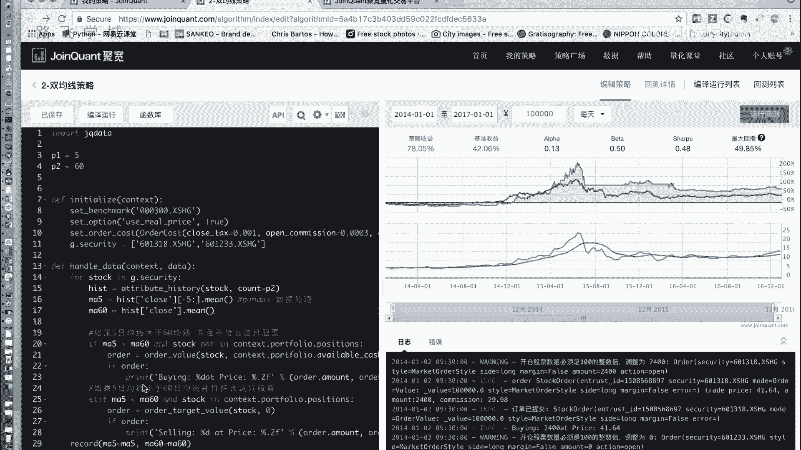
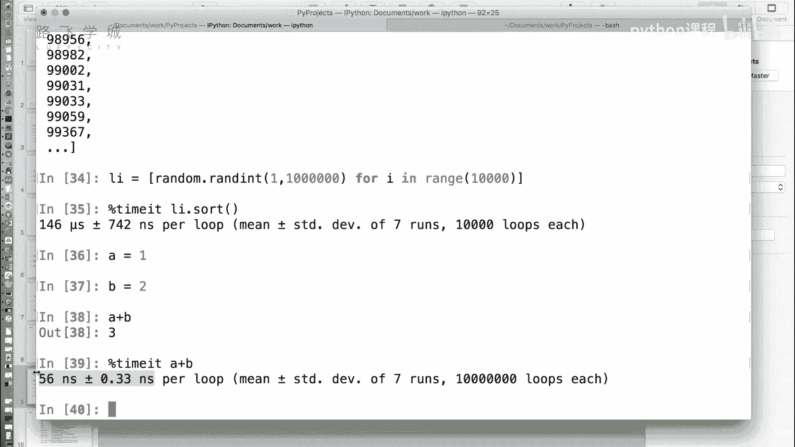

# Python机器学习与量化交易：P9：08 IPython魔术命令 🪄



在本节课中，我们将学习IPython中一系列强大且便捷的“魔术命令”。这些命令以百分号（`%`）开头，能极大地提升我们在交互式环境中的工作效率，例如直接运行外部脚本、粘贴代码块以及精确测量代码执行时间。

## 魔术命令简介

上一节我们介绍了IPython的基本功能。本节中，我们来看看IPython提供的一系列以百分号开头的特殊指令，它们被称为“魔术命令”。

魔术命令允许我们在不退出IPython交互式环境的情况下，执行一些高级操作。例如，运行外部Python脚本文件。

## 运行外部脚本：`%run`



在标准的Python命令行中，要运行一个脚本文件，通常需要退出命令行，然后执行类似 `python script.py` 的命令。在IPython中，我们可以使用 `%run` 命令直接运行。

以下是使用 `%run` 命令的步骤：



1.  首先，在任意文本编辑器中创建一个Python文件，例如 `hello.py`。
2.  在文件中写入简单的代码，例如 `print(“Hello, World!”)`。
3.  在IPython环境中，输入命令 `%run hello.py` 即可执行该脚本。

**代码示例**：
```python
# 假设 hello.py 文件内容为 print(“Hello, World!”)
%run hello.py
```
执行后，输出结果为：`Hello, World!`

## 粘贴并执行代码：`%paste`

有时我们需要从编辑器或其他地方复制一段代码到IPython中执行。直接粘贴可能会因为缩进（如Tab键）等问题导致错误。`%paste` 命令可以很好地解决这个问题。



`%paste` 命令会执行当前剪贴板中的代码内容。它先打印出代码，然后执行，非常适合测试长代码中的某一部分。



**操作示例**：
1.  从你的代码编辑器中复制任意一段Python代码。
2.  在IPython中输入 `%paste` 并回车。
3.  IPython会显示剪贴板中的代码并自动执行它。



## 测量代码执行时间：`%timeit`



在优化代码性能时，我们经常需要测量某段代码或函数的执行时间。虽然可以使用Python的 `time` 模块，但对于执行时间极短的代码，测量结果可能不准确（例如显示为0秒）。

`%timeit` 命令通过多次运行目标代码并计算平均耗时，能够提供非常精确的时间测量，尤其适用于微操作的性能分析。

**公式/概念**：
`%timeit` 的工作原理是：**多次执行 -> 取平均值**，以消除单次运行的随机误差。

让我们通过一个例子来理解它的用法和优势。

**代码示例**：
```python
import random

# 创建一个包含1万个随机数的列表
my_list = [random.random() for _ in range(10000)]

# 使用 %timeit 测量排序操作的时间
%timeit my_list.sort()
```
执行后，你可能会看到类似这样的输出：`146 µs ± 742 ns per loop (mean ± std. dev. of 7 runs, 10,000 loops each)`

输出结果解读：
*   `146 µs`：平均每次循环耗时146微秒。
*   `± 742 ns`：标准偏差为742纳秒，表示时间的波动范围。
*   `7 runs, 10,000 loops each`：总共进行了7轮测试，每轮测试中，`my_list.sort()` 这条语句被重复执行了10,000次。最终结果是这7轮测试的平均值。

这种测量方式使得即使是对 `a = 1 + 2` 这样的简单操作，也能测量出其纳秒（ns）级的执行时间，对于深入的代码性能优化非常有帮助。

## 课程总结

本节课中我们一起学习了IPython中三个实用的魔术命令：
1.  **`%run`**：用于在交互式环境中直接运行外部的Python脚本文件。
2.  **`%paste`**：用于安全地粘贴并执行剪贴板中的代码块，避免格式错误。
3.  **`%timeit`**：用于精确测量代码的执行时间，通过多次运行取平均值的方式，特别适合对短耗时操作进行性能分析。



掌握这些魔术命令，能让你的数据分析和机器学习工作流程更加流畅高效。