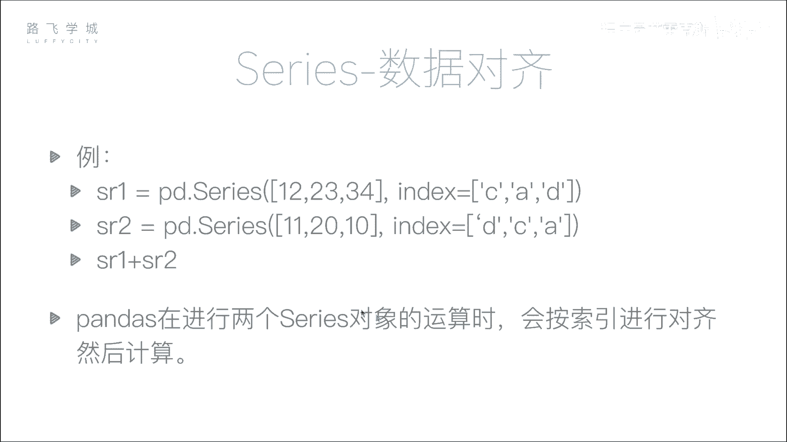
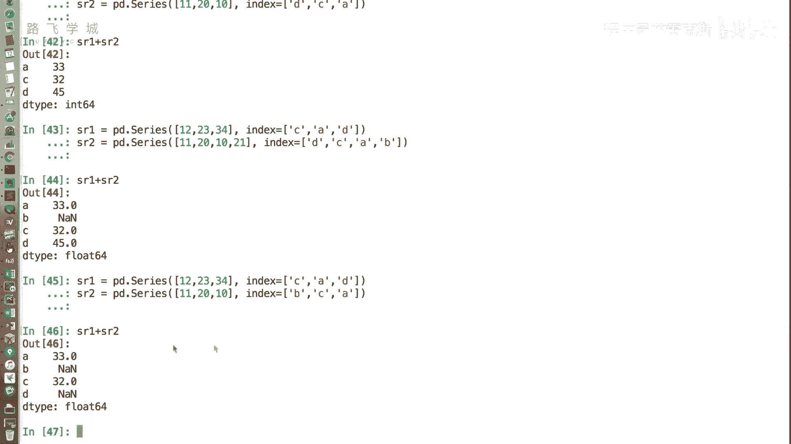
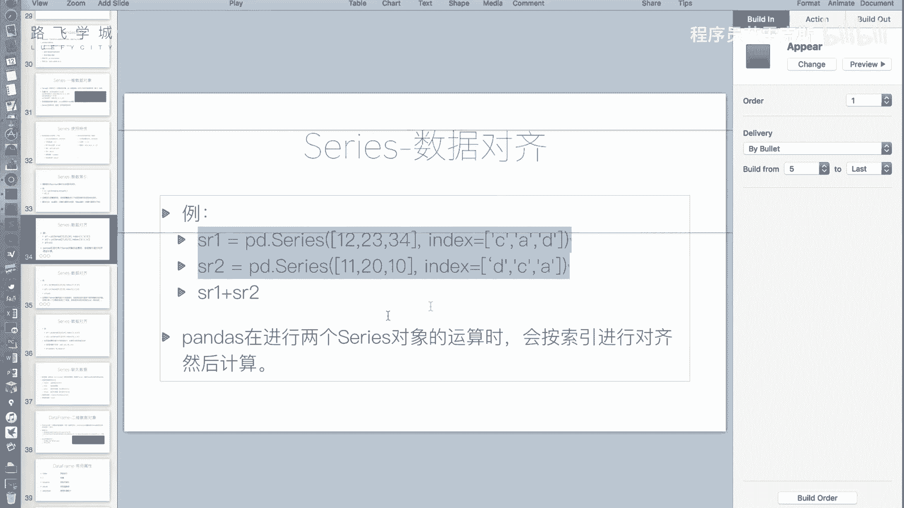
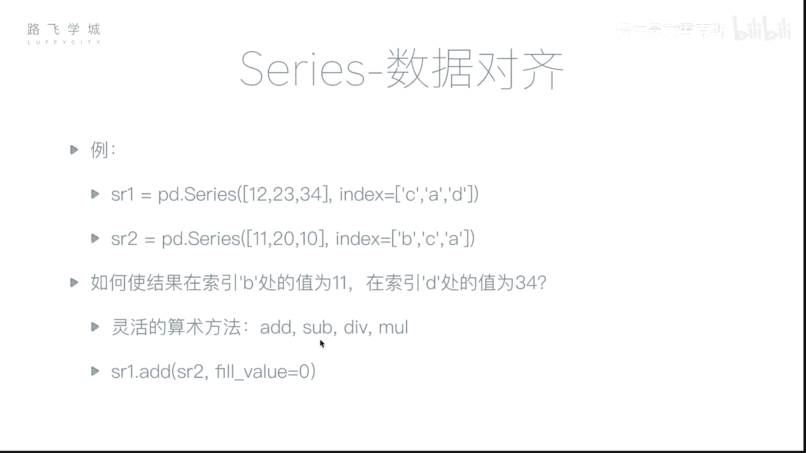
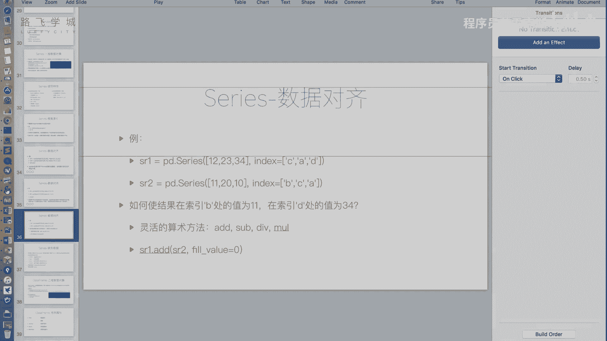
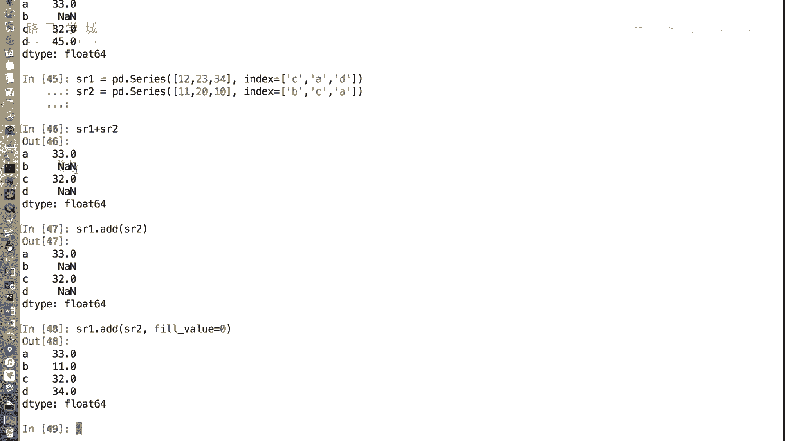

# Python金融量化投资分析：P18：Series数据对齐 📊

在本节课中，我们将要学习Pandas Series对象一个非常重要的特性：**数据对齐**。理解这一特性对于处理金融时间序列数据、合并不同来源的数据至关重要。

## 数据对齐的概念

上一节我们介绍了Series的基本操作，本节中我们来看看数据对齐。在NumPy数组中，运算通常是按位置（下标）进行的。但在Pandas的Series中，运算会优先按照**索引标签**进行对齐，而不是按照它们在序列中的位置。这意味着，只要两个Series的索引标签能够匹配，无论它们的顺序如何，都可以进行运算。

## 数据对齐示例

以下是两个简单的Series对象：

```python
import pandas as pd

sr1 = pd.Series([12, 23, 34], index=[‘C‘, ‘A‘, ‘D‘])
sr2 = pd.Series([11, 20, 10], index=[‘D‘, ‘C‘, ‘A‘])
```




如果执行 `sr1 + sr2`，结果会如何？如果是数组，会按位置相加：12+11， 23+20， 34+10。但在Series中，Pandas会查找两个Series中相同的索引标签，并将它们的值相加。

执行加法运算：

```python
result = sr1 + sr2
print(result)
```

运算过程如下：
*   **索引 ‘A‘**：`sr1[‘A‘]` 是 23， `sr2[‘A‘]` 是 10， 相加得 **33**。
*   **索引 ‘C‘**：`sr1[‘C‘]` 是 12， `sr2[‘C‘]` 是 20， 相加得 **32**。
*   **索引 ‘D‘**：`sr1[‘D‘]` 是 34， `sr2[‘D‘]` 是 11， 相加得 **45**。

最终结果Series的索引是 `[‘A‘, ‘C‘, ‘D‘]`， 值是 `[33, 32, 45]`。这个功能非常强大，它允许我们在处理类似“2023-10-01”的股票日数据时，即使两个数据表的日期顺序不同，也能正确地进行合并计算，而无需手动排序。

## 处理索引长度不一致的情况

在实际数据分析中，我们常遇到两个Series索引不完全一致的情况。例如，一个Series包含员工A、C、D的出勤天数，另一个Series包含员工A、B、C的出勤天数。

以下是当索引长度不一致时的情况：

```python
sr1 = pd.Series([12, 23, 34], index=[‘A‘, ‘C‘, ‘D‘])
sr2 = pd.Series([11, 20, 10], index=[‘A‘, ‘B‘, ‘C‘])
result = sr1 + sr2
print(result)
```

运算结果如下：
*   **索引 ‘A‘**：双方都有，正常相加为 **23**。
*   **索引 ‘B‘**：仅 `sr2` 有，`sr1` 没有对应值，结果为 **NaN** (Not a Number)。
*   **索引 ‘C‘**：双方都有，正常相加为 **43**。
*   **索引 ‘D‘**：仅 `sr1` 有，`sr2` 没有对应值，结果为 **NaN**。

Pandas使用 **NaN** 来表示缺失值。这确保了数据不会因为部分缺失而被错误计算，但同时也引入了需要处理的缺失值。

## 灵活的算术方法

有时，我们希望对缺失的部分进行特定填充，而不是默认为NaN。例如，在计算两个月出勤总天数时，如果某员工某个月未出勤，我们希望将其天数视为0，而不是缺失。

Pandas提供了一组灵活的算术方法来实现这个目的：

以下是四个主要的算术方法：
*   **`.add()`**： 加法
*   **`.sub()`**： 减法
*   **`.mul()`**： 乘法
*   **`.div()`**： 除法

这些方法可以接受一个 `fill_value` 参数，用于指定当一个Series有值而另一个没有时的填充值。

使用填充值的加法示例：



```python
sr1 = pd.Series([12, 23, 34], index=[‘A‘, ‘C‘, ‘D‘])
sr2 = pd.Series([11, 20, 10], index=[‘A‘, ‘B‘, ‘C‘])



# 使用add方法，并填充缺失值为0
result_filled = sr1.add(sr2, fill_value=0)
print(result_filled)
```



运算结果如下：
*   **索引 ‘A‘**：23 (12+11)
*   **索引 ‘B‘**：11 (0+11， `sr1`中‘B‘用0填充)
*   **索引 ‘C‘**：43 (23+20)
*   **索引 ‘D‘**：34 (34+0， `sr2`中‘D‘用0填充)



这样，我们就得到了一个没有NaN的完整结果，更符合某些业务场景的需求。

## 总结

本节课中我们一起学习了Pandas Series的**数据对齐**特性。我们了解到：
1.  Series运算基于索引标签对齐，而非位置，这大大提升了数据处理的灵活性。
2.  当两个Series的索引不完全匹配时，运算会产生**NaN**缺失值。
3.  可以使用 `.add()`, `.sub()` 等灵活的算术方法，并通过 `fill_value` 参数控制缺失值的填充逻辑。



数据对齐是Pandas强大功能的基础，而运算中产生的缺失值则是我们需要面对的下一个问题。在接下来的课程中，我们将详细讲解如何处理这些缺失值。