# 量化金融专业知识与实务：P14：优矿平台回测框架介绍 🧱

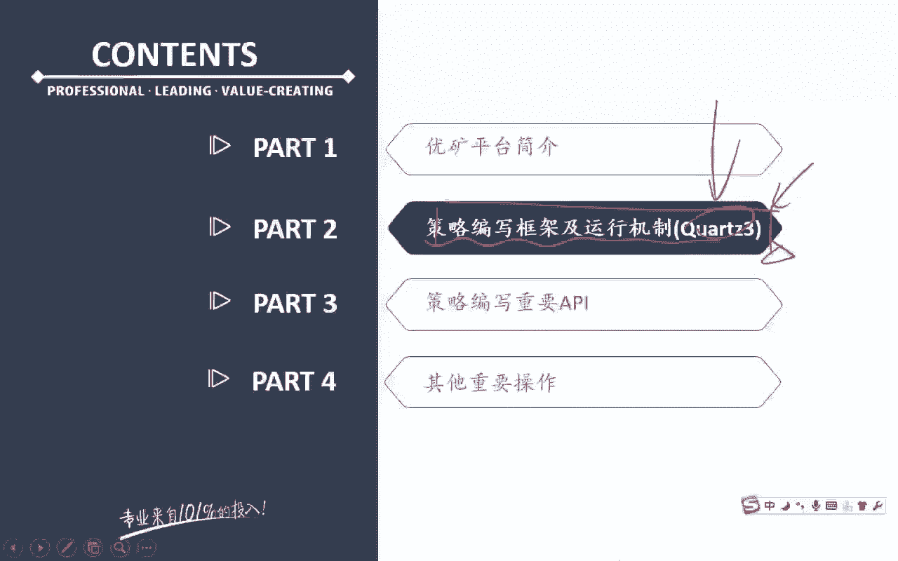

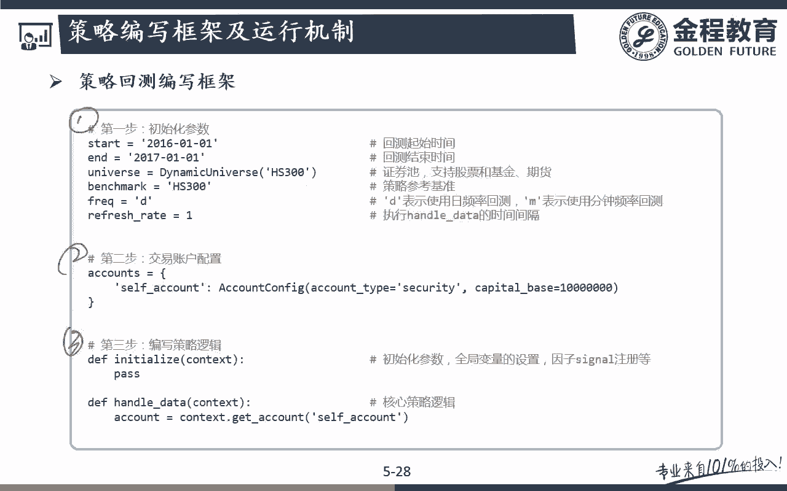

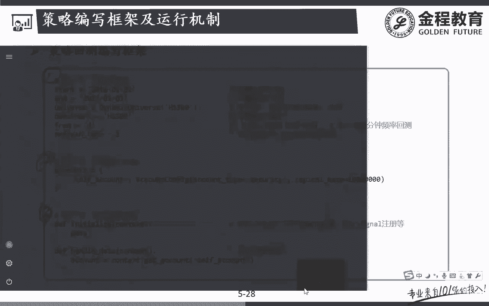

在本节课中，我们将要学习优矿平台回测框架的核心结构与运行机制。我们将把策略编写框架分解为三个基础部分，并详细解释每个部分的作用与关键参数，帮助初学者理解如何构建一个完整的量化策略。

## 策略框架的三个核心部分

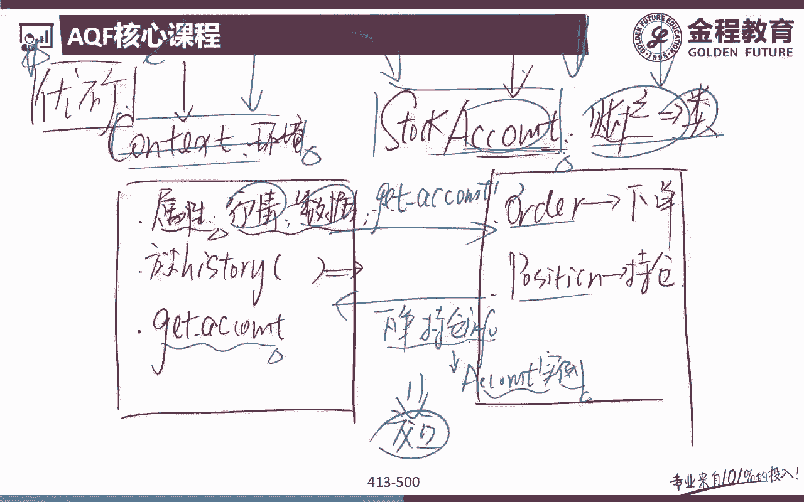

任何在优矿平台上编写的策略都离不开以下三个基础部分。你可以在这些部分的基础上增加更多内容，但这三部分是构成策略的基石。

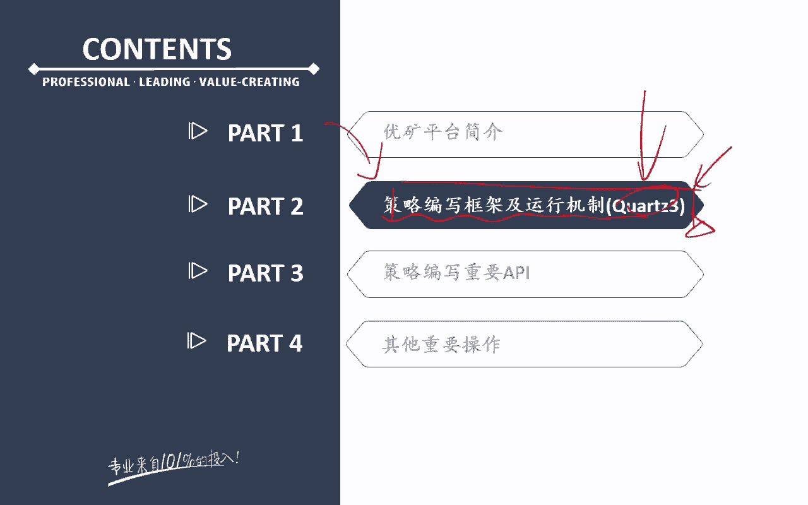

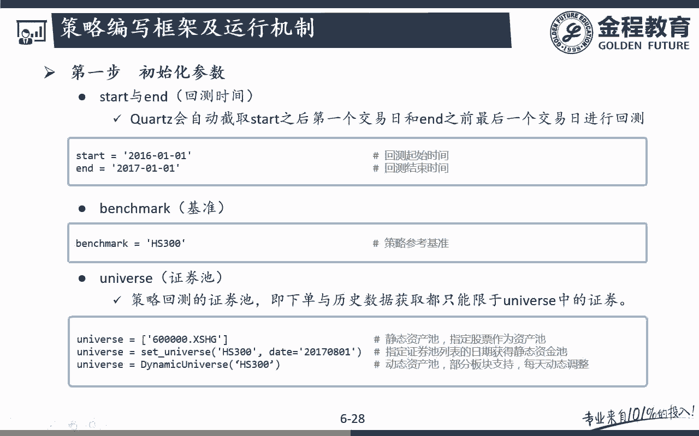

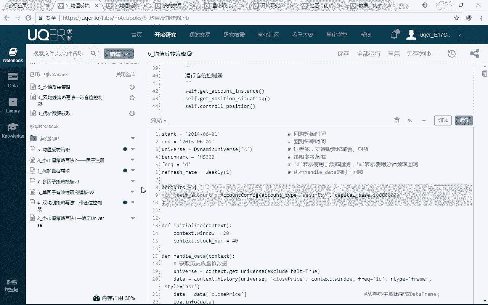

### 第一部分：参数初始化

第一步是进行回测参数的初始化。这部分定义了策略运行的基本环境。

以下是需要初始化的关键参数：
*   **`start` 与 `end`**：定义回测的起始和结束日期。例如 `start = ‘2016-01-01’`，`end = ‘2017-01-01’`。
*   **`benchmark`**：设定策略的比较基准，例如沪深300指数 (`‘000300.XSHG’`)。
*   **`universe`**：定义策略可投资的资产池。这可以是动态或静态的。
    *   **动态资产池**：例如 `DynamicUniverse(‘000300.XSHG’)`，它会自动根据指数成分股的定期调整来更新可投资股票列表。
    *   **静态资产池**：例如 `set_universe([‘000001.XSHE’])`，只投资于指定的某一只或一篮子股票。
*   **`frequency` 与 `refresh_rate`**：共同决定策略的运行频率。
    *   **`frequency = ‘day’`** 表示日线级别策略。
    *   **`refresh_rate = 1`** 表示每个交易日运行一次策略逻辑。`refresh_rate = 5` 则表示每5个交易日运行一次。
    *   也可使用 `refresh_rate = ‘weekly_1’` 表示每周第一个交易日运行。
*   **`max_history_window`**：设定策略开始时可以获取的历史数据窗口长度，默认通常为100天。如果需要计算250日均线等指标，则需要将此参数设置为更大的值，例如150。

### 第二部分：交易账户配置

第二步是配置交易账户。优矿支持多账户管理，这通过字典结构实现。

以下是账户配置的关键步骤：
*   **创建账户字典**：例如 `accounts = {‘stock_account’: account}`。字典的键（如 `‘stock_account’`）是自定义的账户名称。
*   **实例化账户配置类**：通过 `AccountConfig` 类来创建账户实例，并设置其属性。
    *   **`account_type`**：账户类型，例如股票账户为 `‘security’`。
    *   **`capital_base`**：初始资金，例如 `100000`。
    *   **`commission`**：交易佣金费率，例如买入为 `Commission(buycost=0.0005)`，卖出为 `Commission(sellcost=0.001)`。
    *   **`slippage`**：交易滑点，例如 `Slippage(0.002)`，用于模拟实际交易中因买卖价差导致的成交价偏差。

### 第三部分：策略逻辑编写

第三步是编写策略的核心交易逻辑。这部分包含两个主要函数。

上一节我们介绍了如何设置策略环境和账户，本节中我们来看看如何编写策略的执行逻辑。

*   **`initialize` 函数**：初始化函数，在整个回测周期内**只执行一次**。通常在这里定义一些全局变量或注册因子。
*   **`handle_data` 函数**：策略逻辑主函数，其执行频率由第一部分中的 `frequency` 和 `refresh_rate` 决定。所有买卖决策的逻辑都在此函数中编写。
    *   在 `handle_data` 开始时，通常需要先通过 `context.get_account(‘stock_account’)` 获取当前账户的实例，以了解持仓和资金情况。
    *   `context` 对象包含了当前回测日的市场数据、账户信息等，是策略逻辑编写的基础。

## 优矿回测框架运行流程图解 🔄

为了更直观地理解整个框架如何协同工作，我们可以参考以下运行流程：

1.  **初始化阶段**：执行参数设置、创建 `context` 实例、配置账户，并运行一次 `initialize` 函数。
2.  **循环执行阶段**（每个调仓日）：
    *   **判断是否结束**：如果回测日期超过 `end`，则跳至步骤3。
    *   **获取数据**：将当前的 `context`（包含前一个交易日收盘后的市场数据）传入 `handle_data` 函数。
    *   **执行策略**：在 `handle_data` 中，首先通过 `get_account` 获取账户实例，然后根据策略逻辑判断买卖条件。
    *   **下单与撮合**：使用 `order` 等函数下达买卖指令。平台会模拟真实市场进行撮合成交（遵循先卖后买原则，并考虑涨跌停、成交量限制）。
    *   **更新状态**：撮合完成后，更新 `context` 中的行情数据和 `account` 中的持仓、资金信息。
    *   **进入下一日**：日期推进至下一个调仓日，重复此循环。
3.  **报告生成阶段**：回测结束后，系统自动生成详细的绩效分析报告。

## 重要细节与注意事项 ⚠️

理解框架的细节能帮助避免常见错误。

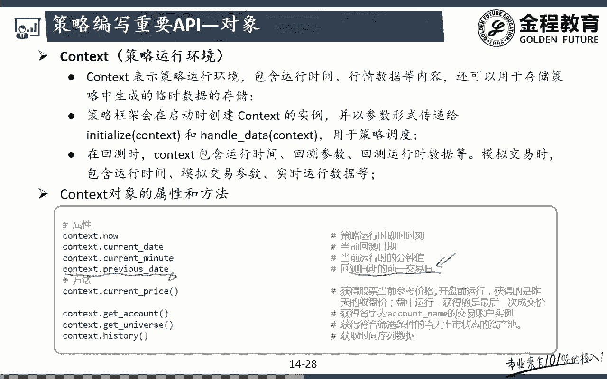

### 数据获取与未来函数

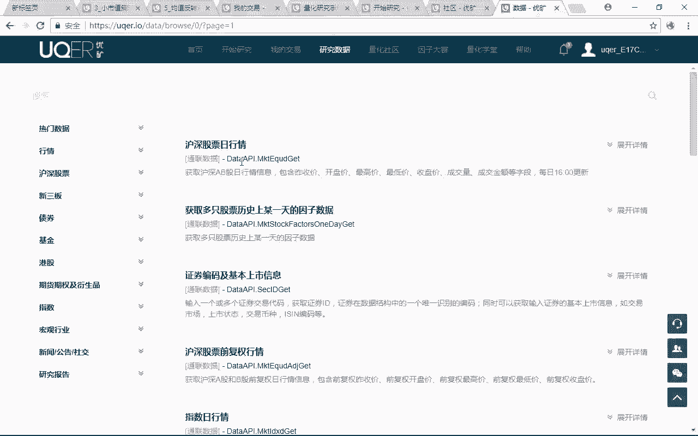

在 `handle_data` 函数中，通过 `context` 提供的方法（如 `history`）获取的数据，**默认是回测日的前一个交易日收盘后的数据**。这是为了防止使用未来数据（未来函数）。例如，在回测2016年1月4日（周一）时，`handle_data` 获取的是2016年1月1日（周五）收盘后的数据。

### 订单撮合机制

优矿的撮合机制尽可能模拟真实市场：
*   **成交原则**：默认采用**先卖后买**的顺序，以释放资金。
*   **成交量限制**：市价单的成交量会受到下一根K线（如次日）总成交量的限制。如果订单量大于可用成交量，则部分成交，剩余部分顺延至后续交易日尝试成交。
*   **涨跌停处理**：平台会自动处理涨跌停限制，在涨停时无法买入，在跌停时无法卖出，这比自行编写策略时手动处理更为便捷和可靠。

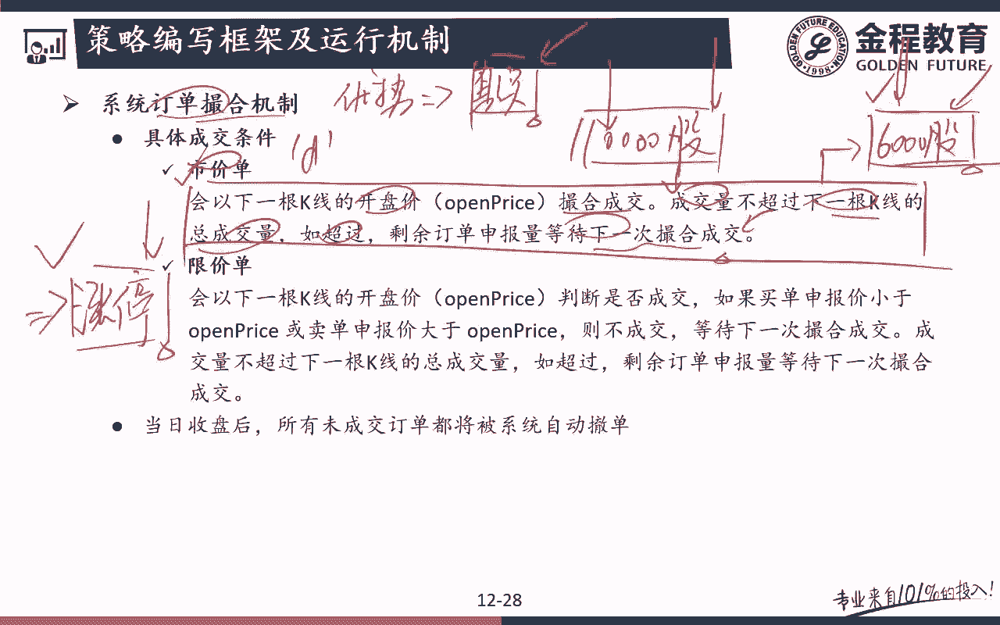

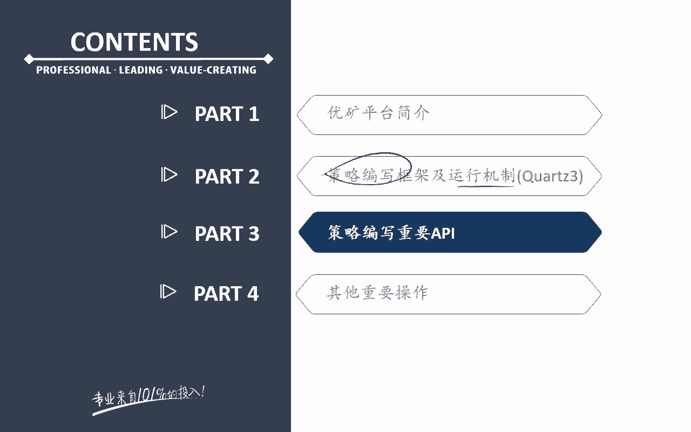

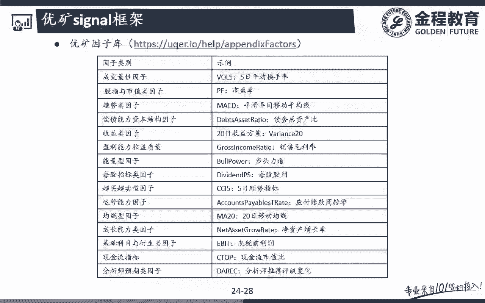

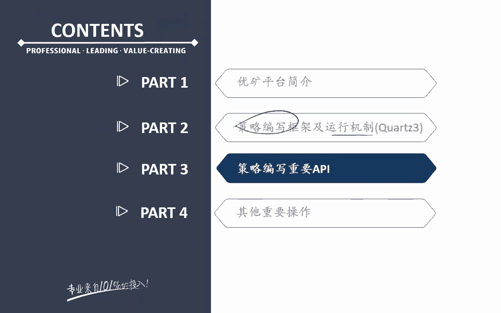

本节课中我们一起学习了优矿量化回测平台的核心框架。我们将其分解为**参数初始化、账户配置和策略逻辑编写**三个部分，并了解了它们如何通过 `context` 对象串联起来，按照清晰的流程运行。掌握这个框架是使用优矿平台进行策略开发和回测的基础。