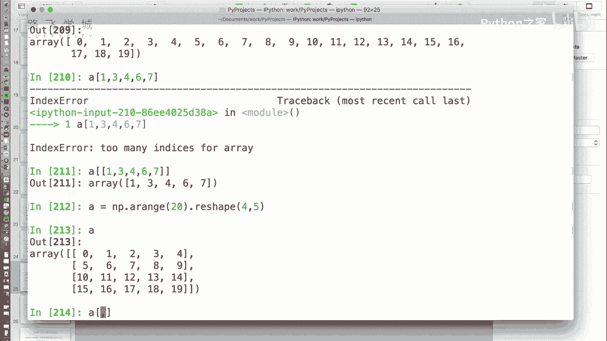
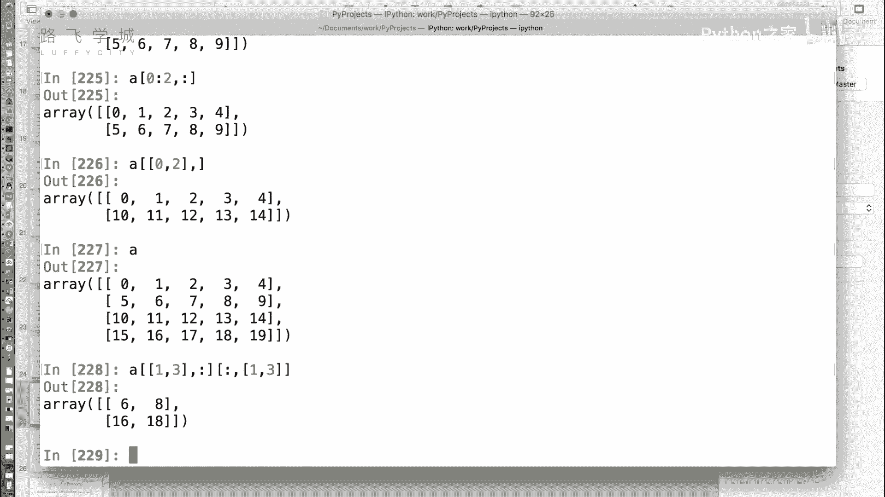
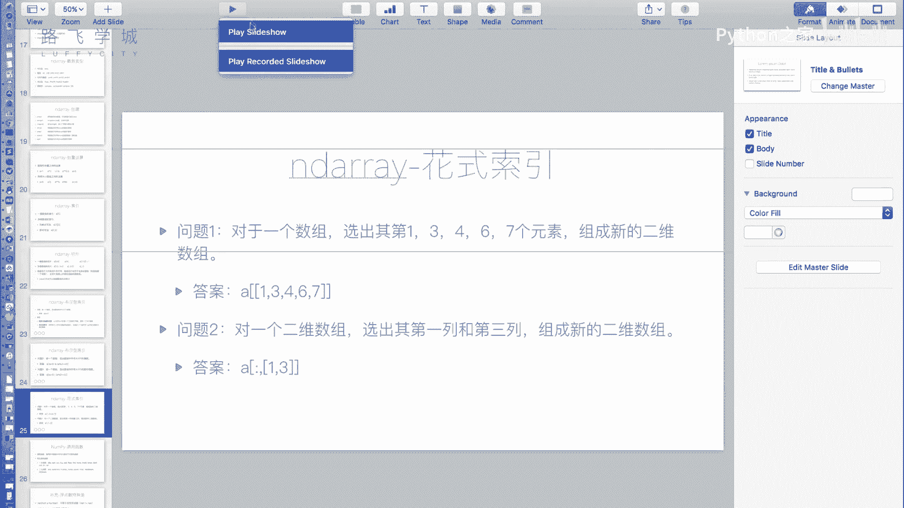

# Python金融量化分析：P12：NumPy数组花式索引 🎯


在本节课中，我们将要学习NumPy数组的“花式索引”。这是一种非常灵活的数据选取方式，允许我们根据一个整数数组来选取数据，尤其适用于选取无规律位置的元素。


上一节我们介绍了布尔型索引，本节中我们来看看花式索引的具体用法和规则。

## 花式索引的基本概念

花式索引允许我们使用一个整数数组作为索引，来选取原数组中对应位置的元素。这与普通索引（单个数字）和切片（连续范围）不同，它可以选取任意、无规律位置的元素。

例如，对于一个一维数组，我们想选取第1、3、4、6、7号元素（索引从0开始）。使用普通方法无法直接实现，但花式索引可以轻松做到。


以下是花式索引的基本语法：
```python
import numpy as np
a = np.arange(20)  # 创建一个0到19的数组
indices = [1, 3, 4, 6, 7]  # 指定要选取的索引位置
result = a[indices]  # 使用花式索引选取
print(result)  # 输出：[1 3 4 6 7]
```
**核心公式**：`数组[索引数组]`



## 二维数组的花式索引

对于二维数组，花式索引的规则同样适用。我们可以通过逗号分隔行和列的索引方式，来组合使用不同的索引方法。

以下是几种索引方法在二维数组中的组合示例：

1.  **常规索引 + 切片**：选取特定行和连续的列。
    ```python
    arr = np.arange(20).reshape(4, 5)  # 4行5列的二维数组
    # 选取第0行，第2到第4列（不包含第4列）
    result = arr[0, 2:4]
    ```

2.  **常规索引 + 布尔型索引**：选取特定行中满足条件的列。
    ```python
    # 选取第0行中所有大于2的元素
    result = arr[0, arr[0] > 2]
    ```

3.  **花式索引 + 全切片**：选取指定的多行和所有列。
    ```python
    # 选取第1行和第3行的所有列
    result = arr[[1, 3], :]
    ```

## 重要注意事项：避免两侧同时使用花式索引

需要特别注意一个规则：**逗号两侧不能同时使用花式索引**，否则会产生意想不到的结果，它会被解释为选取坐标对，而不是行列组合。

例如，我们想选取第1行&第1列、第1行&第3列、第3行&第1列、第3行&第3列这四个位置的元素。
```python
# 错误的写法：这并不会得到我们想要的四个值
result = arr[[1, 3], [1, 3]]
# 输出：[6, 18] 它只取了(1,1)和(3,3)两个位置的值
```
这种写法被解释为选取`(1,1)`和`(3,3)`这两个坐标点上的值，而不是行列的组合。

## 如何正确选取行列组合

如果想选取多行和多列交叉的所有元素，需要分步操作。



以下是正确选取第1、3行与第1、3列所有交叉点元素的步骤：
```python
# 第一步：选取第1行和第3行的所有列
step1 = arr[[1, 3], :]
# 第二步：在step1的结果上，选取所有行的第1列和第3列
final_result = step1[:, [1, 3]]
```
或者合并为一行：
```python
final_result = arr[[1, 3], :][:, [1, 3]]
```




本节课中我们一起学习了NumPy的花式索引。我们了解了它的基本用法，学习了如何在二维数组中组合不同的索引方式，并特别注意了避免在逗号两侧同时使用花式索引的规则。掌握这些灵活的索引技巧，能帮助我们在金融数据分析中更高效地提取和处理所需的数据子集。