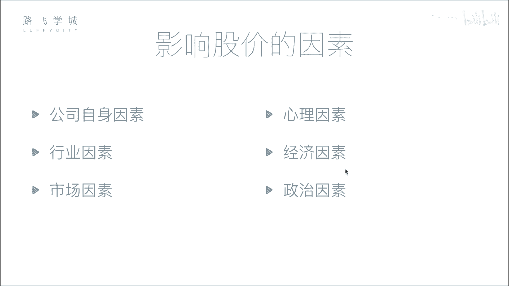
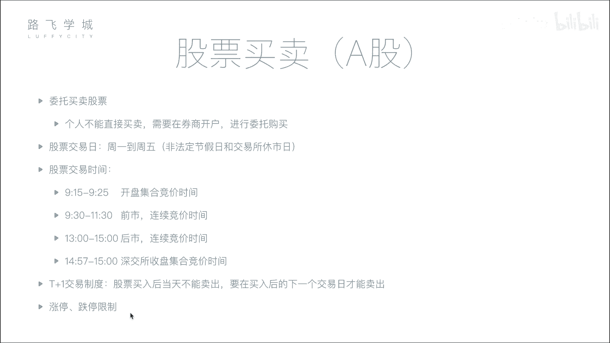

# 金融量化分析：P4：04 影响股价因素与股票买卖知识 📈

在本节课中，我们将学习影响股票价格的主要因素，并了解股票买卖的基本流程与规则。理解这些基础知识是进行量化分析和交易的前提。

## 影响股价的六大因素

上一节我们了解了股票的基本概念，本节中我们来看看哪些因素会决定股票价格的涨跌。影响股价的因素可以归纳为以下六点。

### 1. 公司自身因素
这是影响股价最根本的因素。公司的经营状况、盈利能力、发展前景等直接决定了其内在价值。如果公司发展良好，预期未来价值增长，其股价通常会上涨；反之，若公司出现重大负面事件或经营不善，股价则会下跌。

### 2. 市场因素
这是影响股价最直接的因素。股价的短期波动主要由市场供求关系决定。其核心逻辑是：
*   **买盘 > 卖盘**：供不应求，价格上涨。
*   **卖盘 > 买盘**：供过于求，价格下跌。

### 3. 行业因素
整个行业的发展趋势会影响行业内所有公司的股价。例如，当某个行业（如人工智能）处于风口期，受到市场追捧，该行业的相关公司股价普遍可能上涨；反之，如果某个行业前景黯淡，其公司股价也可能集体承压。

### 4. 心理因素
投资者的情绪和非理性行为会影响股价。例如，从众心理可能导致恐慌性抛售或盲目追涨。历史上多次股市剧烈波动，部分原因就是由投资者的群体心理效应引发的。

### 5. 经济因素
国家宏观经济状况和政策会影响整体股市。例如：
*   **利率调整**：存款利率上升可能吸引资金从股市流向银行，导致市场资金减少，对股价构成压力。
*   **货币政策、通货膨胀率**等宏观经济指标也会对股市产生广泛影响。

### 6. 政治因素
国际关系、地区局势、国家政策等政治事件会显著影响市场信心和资本流向。例如，地缘政治紧张局势可能引发市场恐慌，导致资金撤离股市，造成股价下跌；而相关领域的政策利好则可能刺激特定板块（如军工股）上涨。

## 股票买卖流程与规则

了解了影响价格的因素后，我们来看看实际买卖股票需要遵循的步骤和规则。

### 开户与委托
个人投资者不能直接在交易所买卖股票，必须通过证券公司（券商）进行。以下是基本步骤：
1.  在券商处开设证券账户和资金账户。
2.  通过券商提供的系统（如交易软件）连接至交易所。
3.  提交买卖指令，这个过程称为“委托”。

### 交易日与交易时间
股票交易并非随时可以进行，它有严格的时间规定。

*   **交易日**：通常为每周一至周五（法定节假日除外）。
*   **交易时间**：一个交易日内的交易分为以下几个阶段：

以下是A股市场主要的交易时段划分：

*   **开盘集合竞价**：**9:15 - 9:25**
    *   此期间接受委托申报，但不进行即时撮合。
    *   在**9:25**这一刻，系统将所有有效委托集中在一起，按照“**最大成交量**”原则计算出当日的开盘价。
*   **连续竞价（早市）**：**9:30 - 11:30**
    *   系统按照“价格优先、时间优先”的原则对买卖委托进行即时、连续的撮合成交。
*   **连续竞价（午市）**：**13:00 - 14:57**
    *   下午的连续交易时段。
*   **收盘集合竞价（仅深交所）**：**14:57 - 15:00**
    *   此期间接受委托，但不撮合，在**15:00**集中撮合，产生收盘价。
    *   *注：上海证券交易所的收盘价为当日最后一笔交易前一分钟所有交易的成交量加权平均价。*

### 交易制度：T+1与涨跌停板
这是A股市场两项重要的基础交易规则：

*   **T+1交易制度**：指当日（T日）买入的股票，必须到下一个交易日（T+1日）才能卖出。但当日卖出股票获得的资金，当日可以用于购买其他股票。
*   **涨跌停板限制**：为防止股价过度波动，A股对普通股票设有每日价格涨跌幅限制。通常，一只股票在一个交易日内的价格，相对于前一个交易日的收盘价，上涨和下跌的幅度均不得超过**10%**（ST等特殊股票为5%）。价格达到涨跌幅上限即为“涨停”或“跌停”。

---

本节课中我们一起学习了影响股票价格的六大核心因素（公司自身、市场、行业、心理、经济、政治），并掌握了股票买卖的基本流程、交易时间划分以及T+1、涨跌停板等关键交易规则。这些知识是构建量化分析模型和制定交易策略的重要基础。