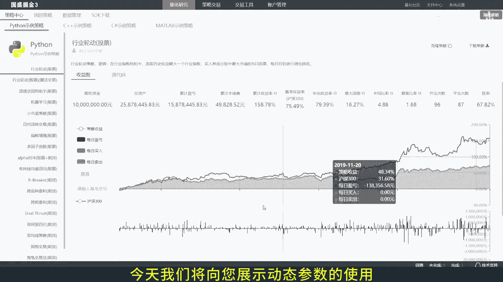
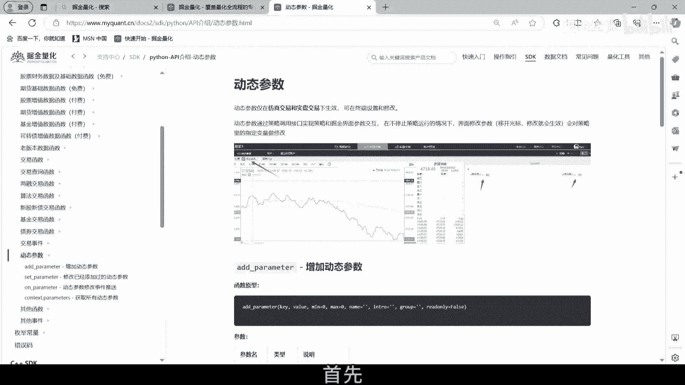
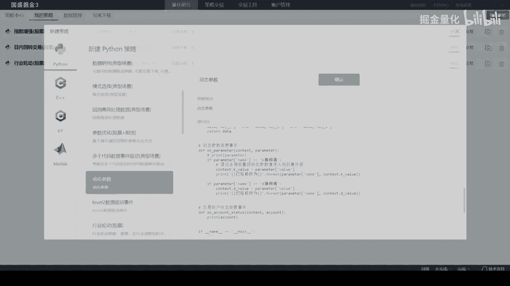
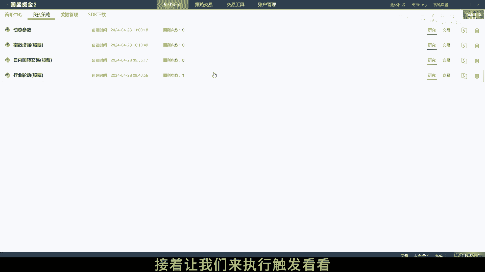
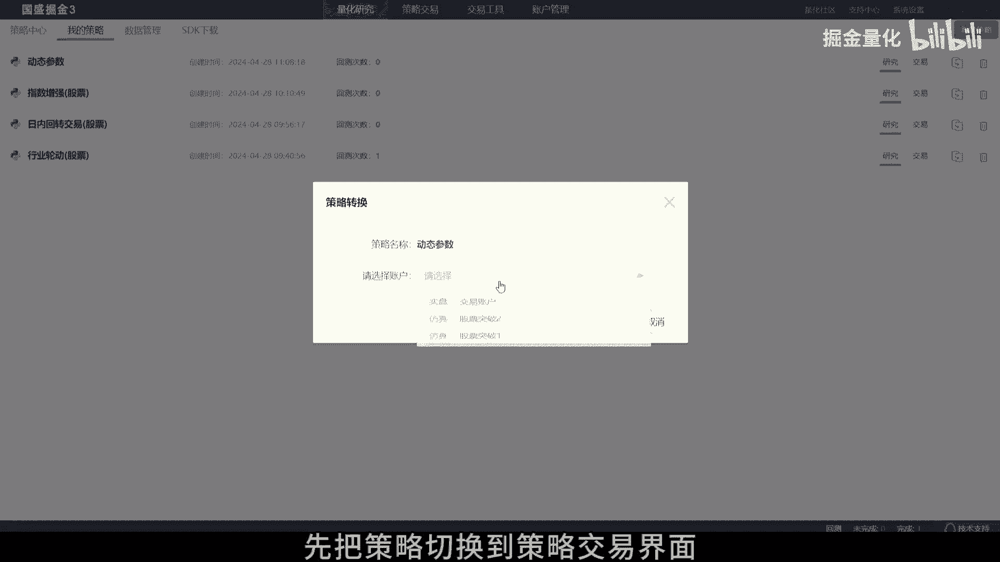
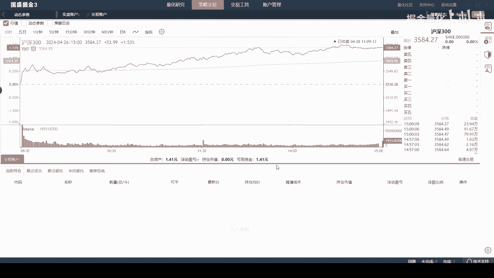
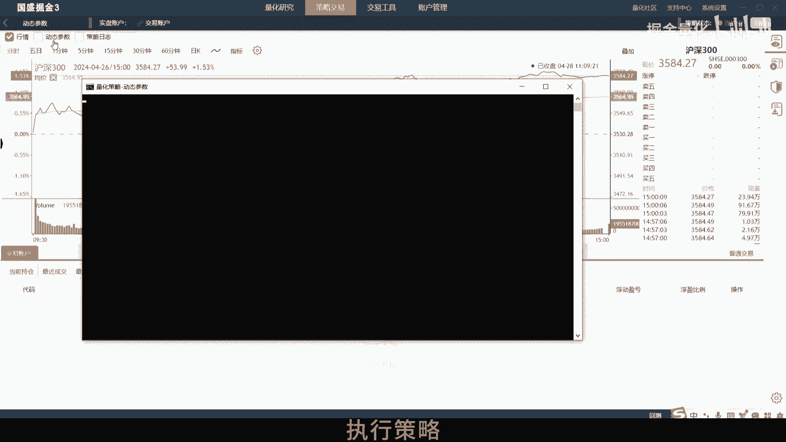
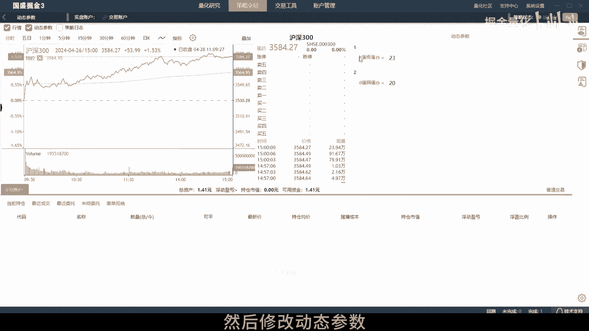
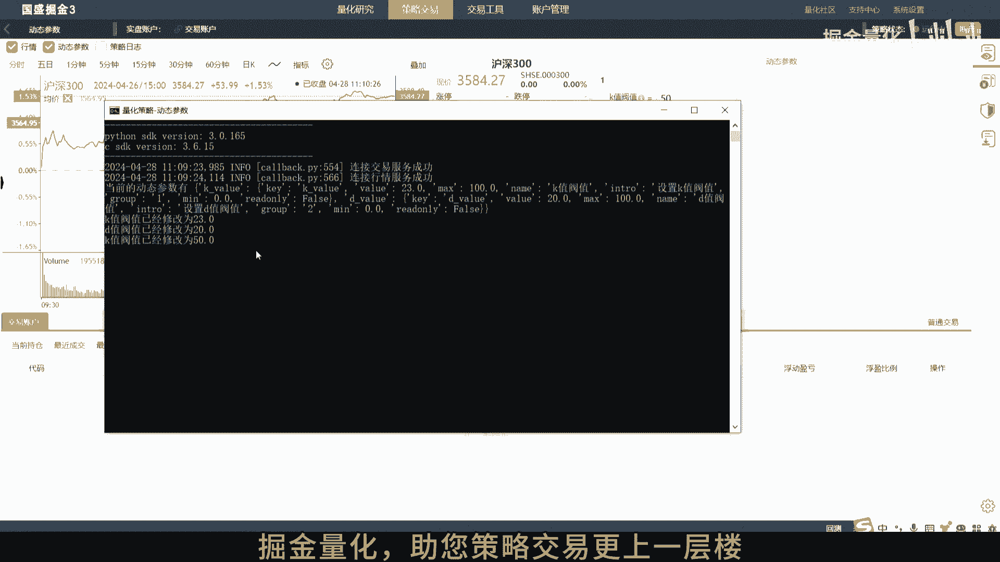

# 掘金量化：5.4：动态参数调整教程 🎛️


在本节课中，我们将学习如何在掘金量化终端中使用动态参数功能。动态参数允许我们在不停止策略运行的情况下，通过终端界面实时调整策略内部的变量，从而实现更灵活的策略调试和优化。

## 概述



动态参数是策略通过调用特定接口，实现与掘金终端界面进行参数交互的功能。其核心价值在于，策略在持续运行的过程中，我们可以通过界面修改参数，这些修改会实时同步到策略内部指定的变量中。

## 创建动态参数示例策略

上一节我们介绍了动态参数的概念，本节中我们来看看如何创建一个使用动态参数的策略。



首先，我们需要进入策略编辑界面。点击“策略编辑”按钮即可进入。



在策略编辑界面中，我们可以看到动态参数是通过 `set_parameter()` 函数进行设置的。当终端界面的参数被修改后，策略会通过 `on_parameter()` 这个动态参数变更事件来接收更新。

以下是设置动态参数的关键代码结构：

```python
# 在策略初始化时设置动态参数及其初始值
def on_start(self):
    self.set_parameter('my_param', 10)  # 设置一个名为‘my_param’的参数，初始值为10

# 定义动态参数变更事件的处理函数
def on_parameter(self, parameter):
    if parameter.name == 'my_param':
        self.my_variable = parameter.value  # 将界面修改的值赋给策略内部变量
        print(f"动态参数已更新为: {self.my_variable}")
```



## 执行策略与调整参数



我们已经了解了如何在代码中设置动态参数，接下来让我们在终端中执行策略并触发参数修改。

首先，需要将操作界面切换到“策略交易”面板。



在“策略交易”界面中，点击“交易”按钮，并选择您要使用的交易账户，然后点击“确定”。

账户选择完毕后，点击“启动”按钮来执行策略。



策略启动后，我们可以在运行面板找到“动态参数”选项。勾选它，即可看到我们在代码中设置的参数列表。直接修改参数值，例如将数字从10改为20。



此时，观察策略的控制台输出，可以看到类似“动态参数已更新为: 20”的日志信息。这证明界面参数的修改已成功传递到正在运行的策略中。

## 重要注意事项

在使用动态参数时，有两点需要特别注意：

1.  **模式限制**：动态参数功能**仅支持实时模式**，在仿真或实盘场景下可用，回测模式中无法使用。
2.  **缓存机制**：重启掘金终端后，之前设置的动态参数缓存会被清空。因此，策略需要重新调用 `set_parameter()` 接口来初始化参数。常见的做法是在策略每日启动时进行设置，或者通过 `schedule` 定时任务在每天开盘前执行参数初始化。

## 总结



本节课中我们一起学习了掘金量化终端动态参数功能。我们掌握了其核心概念：通过 `set_parameter()` 设置、通过 `on_parameter()` 事件响应。我们演练了从策略编写到终端界面修改的完整流程，并了解了该功能的使用限制和注意事项。利用动态参数，你可以更高效地对策略进行实时微调和优化。

感谢您观看本教程。如果您在使用过程中有任何疑问，欢迎随时联系我们的技术支持团队。