# cTrader量化交易编程教程：5.5：for循环语句 🔄

在本节课中，我们将要学习 `for` 循环语句。`for` 循环是一种能够自动设定循环条件和退出条件的循环结构，相比 `while` 循环，它更不容易造成死循环，结构也更清晰。

## 理解for循环的结构与流程

上一节我们介绍了循环的基本概念，本节中我们来看看 `for` 循环的具体结构。`for` 循环包含三个用分号分隔的部分，通常被称为循环器。

以下是 `for` 循环的基本语法结构：
```csharp
for (int i = 0; i < 10; i++)
{
    // 要重复执行的代码块
}
```

*   **初始化部分 (`int i = 0`)**: 定义一个整型变量 `i` 作为循环计数器，并初始化为0。
*   **循环条件部分 (`i < 10`)**: 在每次循环开始前判断此条件。只要条件为 `true`，就执行循环体内的代码。
*   **迭代部分 (`i++`)**: 每次循环体执行完毕后，计数器 `i` 的值会增加1（自增）。

`for` 循环的运行规则如下：
1.  首先执行初始化语句，定义计数器 `i` 并赋值为0。
2.  判断循环条件 `i < 10`。第一次判断时 `i=0`，条件成立，进入循环体。
3.  执行循环体内的所有代码。
4.  循环体执行完毕后，执行迭代语句 `i++`，此时 `i` 变为1。
5.  程序跳回步骤2，再次判断条件 `i < 10`。只要条件成立，就重复步骤3和4。
6.  当 `i` 自增到10时，条件 `10 < 10` 不成立，循环终止，程序继续执行 `for` 循环之后的代码。

这个过程形成了一个清晰的闭环：**初始化 -> 条件判断 -> 执行代码 -> 更新计数器 -> 再次判断**。只要正确设置条件，就能有效避免死循环。

## 在cTrader中编写for循环

现在，我们将在cTrader的Visual Studio环境中实际编写代码，对比 `while` 循环与 `for` 循环。

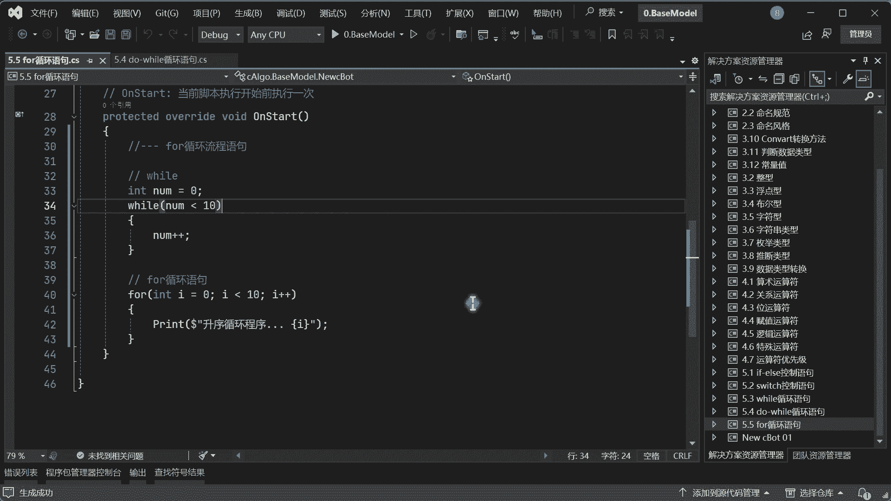

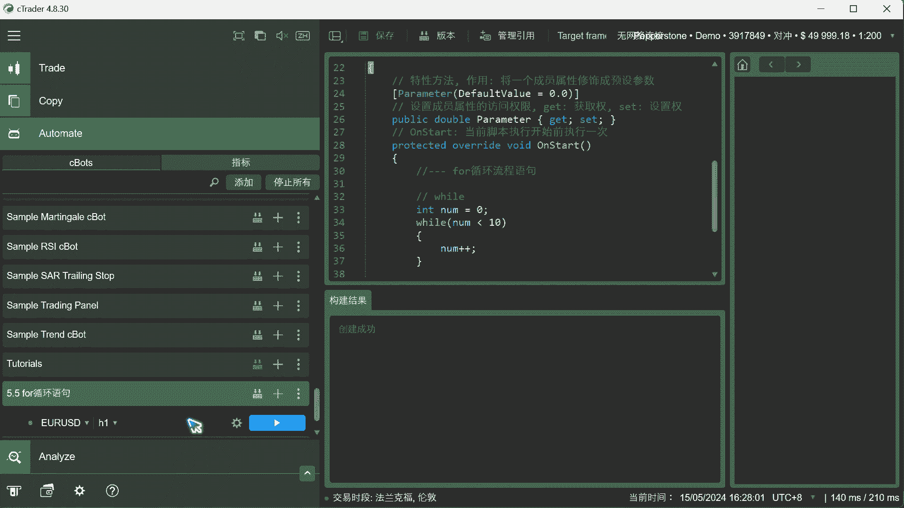

首先，我们回顾一下用 `while` 循环打印0到9的写法：
```csharp
int number = 0;
while (number < 10)
{
    Print(number);
    number++;
}
```

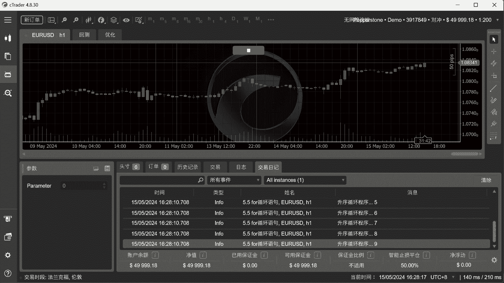

接下来，我们使用 `for` 循环实现相同的功能。在代码编辑器中，输入 `for` 后按两次 `Tab` 键，IDE会自动生成 `for` 循环的基本结构，这比手动编写 `while` 循环更快捷。

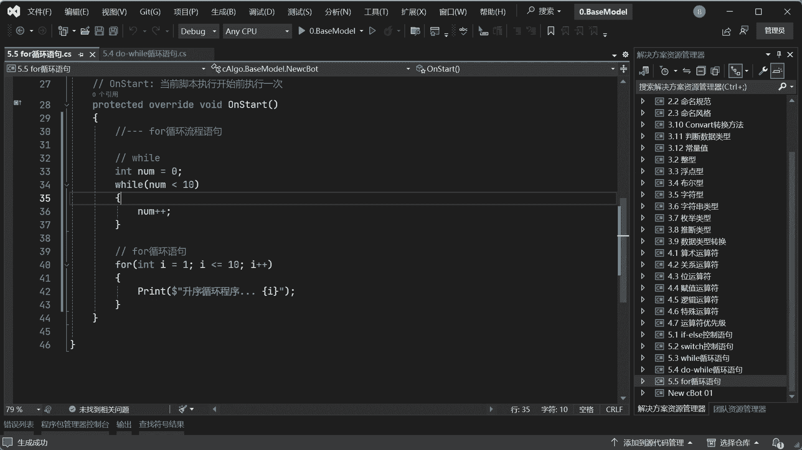

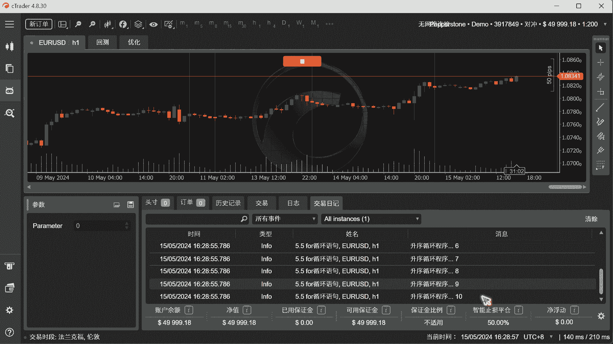

```csharp
// 升序循环程序
for (int i = 0; i < 10; i++)
{
    Print("升序: " + i);
}
```

运行这段代码，输出面板会依次打印从0到9的数字。这里 `i < 10` 使得循环恰好执行10次（i从0到9）。如果需要打印1到10，可以将循环条件修改为 `i <= 10` 并将初始化改为 `int i = 1`。

`for` 循环的计数器变量 `i` 的作用域仅限于该循环内部。这意味着你可以在同一个方法的不同 `for` 循环中都使用变量名 `i`，它们互不干扰。

## 实现降序循环

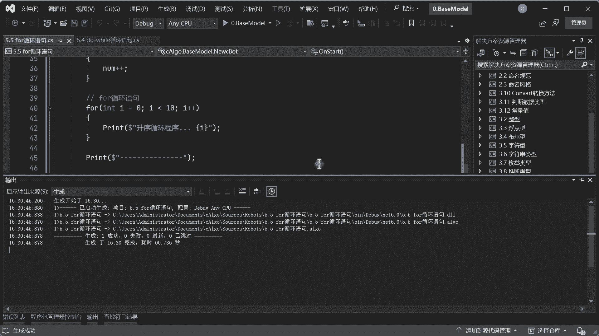

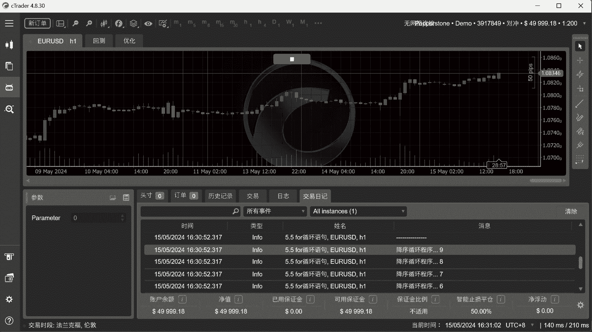

除了升序循环，`for` 循环也能轻松实现降序循环。关键在于调整初始化、条件和迭代部分。

以下是实现从9打印到0的降序循环代码：
```csharp
// 降序循环程序
for (int i = 9; i >= 0; i--)
{
    Print("降序: " + i);
}
```

*   **初始化 (`int i = 9`)**: 计数器 `i` 从9开始。
*   **条件 (`i >= 0`)**: 只要 `i` 大于或等于0，循环就继续。
*   **迭代 (`i--`)**: 每次循环后，计数器 `i` 减少1。

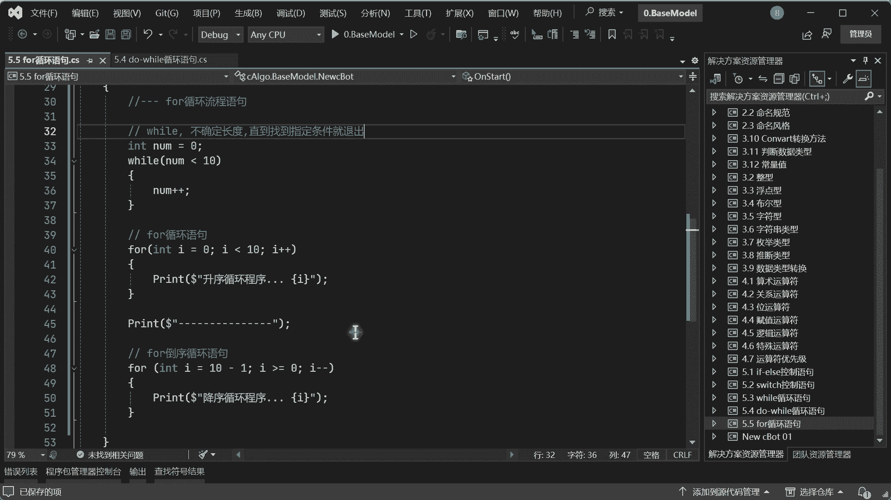

为什么初始化值是9而不是10？因为升序循环打印了0到9共10个数字。为了对称，降序循环也从9开始到0结束，同样是10个数字。如果从10开始，则会打印10到0，共11个数字。

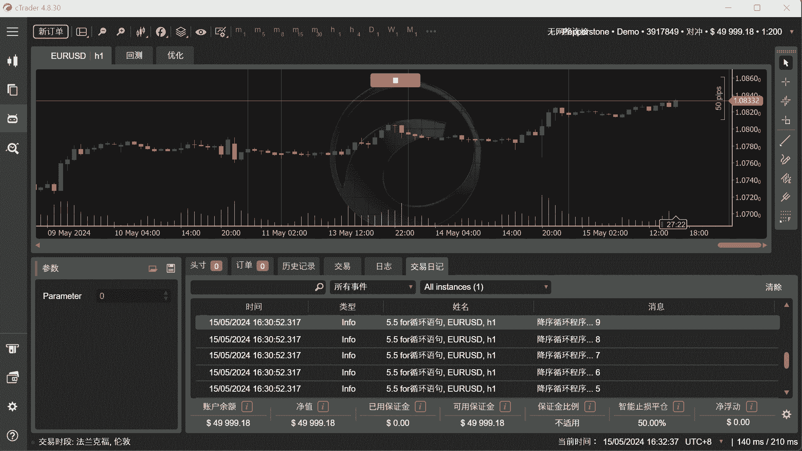

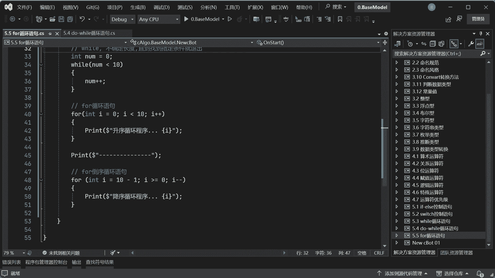

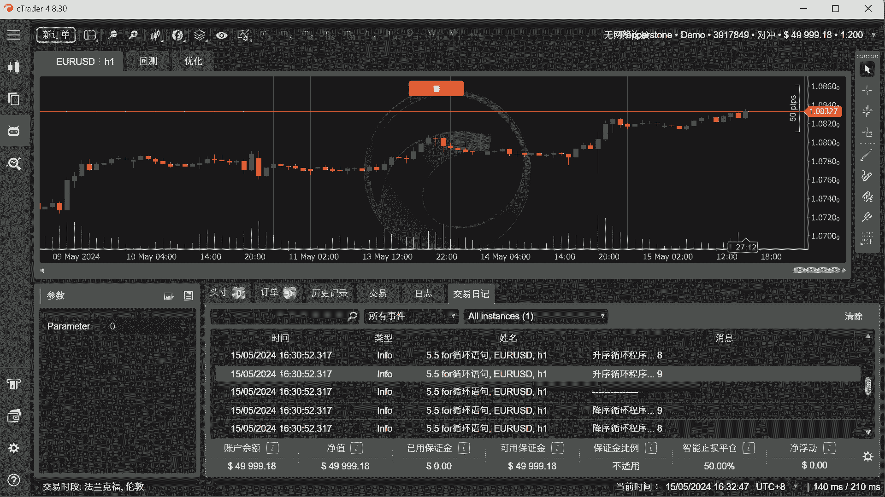

## 核心要点总结

本节课中我们一起学习了 `for` 循环语句的核心知识：

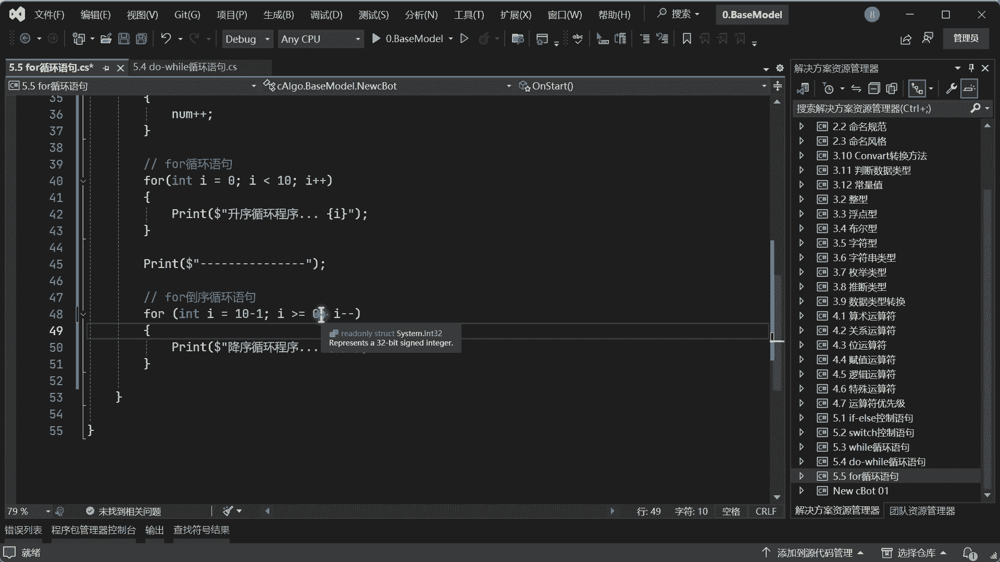

1.  **结构清晰**：`for` 循环将循环变量的**初始化**、**条件判断**和**迭代更新**集中在一行内，结构紧凑，意图明确。
2.  **避免死循环**：由于其闭环设计，只要正确设置循环条件，就能有效避免因忘记更新变量而导致的死循环。
3.  **灵活可变**：循环的起始值、结束条件和迭代步长都可以根据需求灵活调整。例如，使用 `i += 2` 可以实现每次递增2的循环。
4.  **作用域隔离**：循环计数器（如 `i`）的作用域通常局限于该循环体内，在不同循环中使用同名变量不会冲突。
5.  **应用场景**：`for` 循环特别适合在**循环次数已知**的情况下遍历数据，例如计算订单总盈利、遍历数组所有元素等。而 `while` 循环更适用于**循环次数未知**，需要满足某个特定条件才退出的场景。

`for` 循环是量化编程中处理重复性任务（如分析历史数据、管理多个订单）的利器。掌握其正序和倒序的写法，将为后续学习数组、集合等数据结构的遍历打下坚实基础。