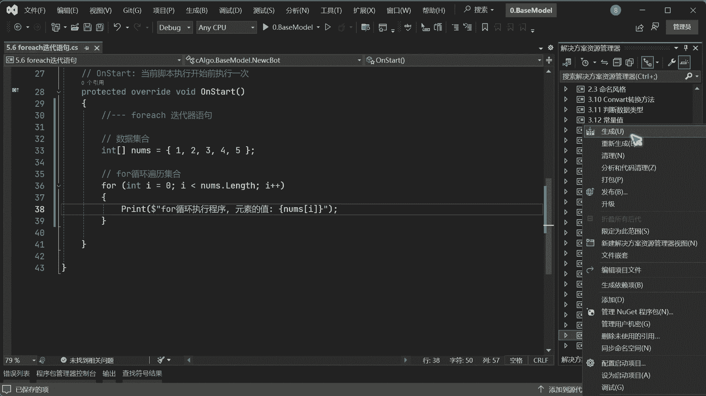
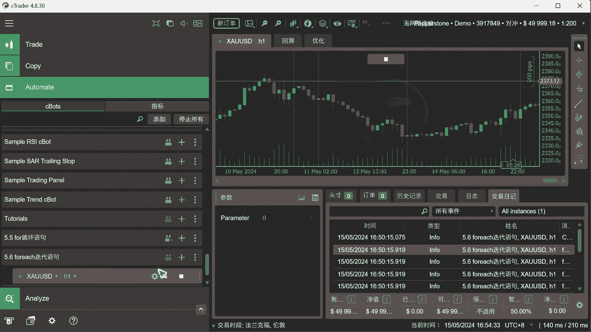
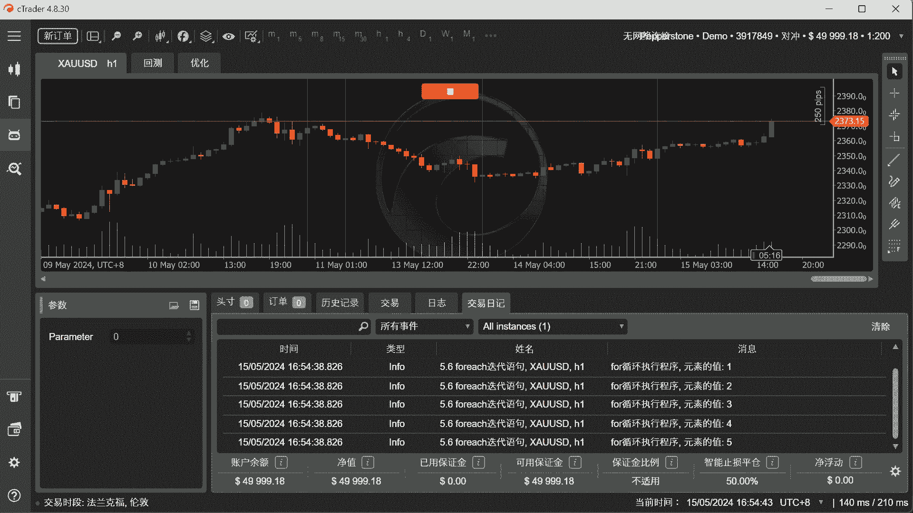
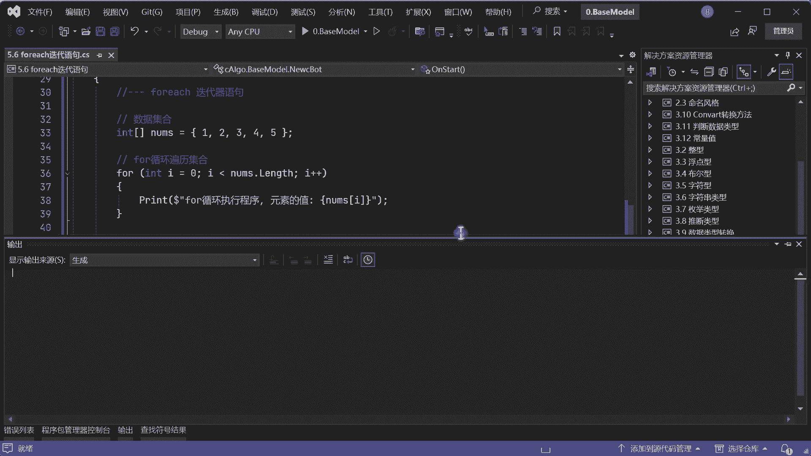
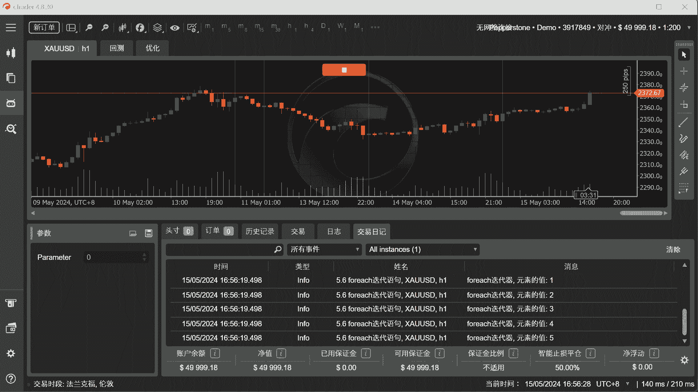
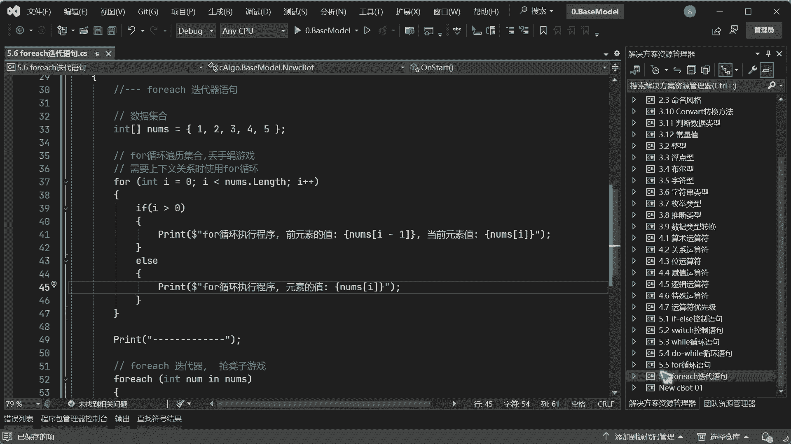
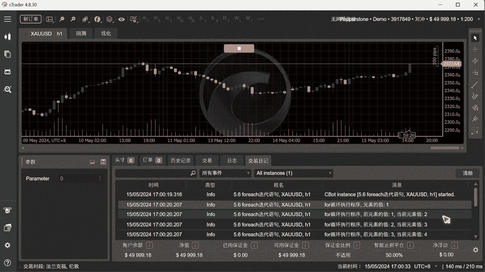
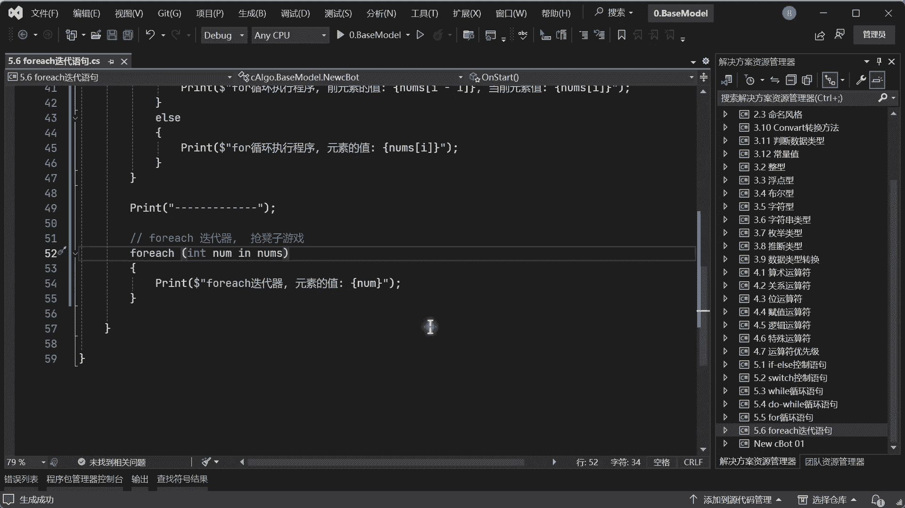

# Ctrader量化交易编程教程：5.6：foreach迭代语句 🚀

在本节课中，我们将要学习C#中的`foreach`迭代语句。我们将通过对比`for`循环，来理解`foreach`的工作原理、适用场景以及它与`for`循环的核心区别。

## 概述

`foreach`是一种用于遍历集合（如数组、列表）中每个元素的迭代语句。它与`for`循环不同，`for`循环需要一个计数器来控制循环次数，而`foreach`则像是一个排号系统，按顺序处理集合中的每个元素，直到没有元素为止。

上一节我们介绍了`for`循环的基本用法，本节中我们来看看`foreach`迭代器如何工作。

## `foreach`的工作原理

`foreach`的运行机制类似于一个有序的排队面试过程。假设有一个包含五个数字的集合，就像五个人排队面试。`foreach`会从集合中依次取出每一个元素（叫号），交给一个临时变量进行处理（面试），处理完毕后继续取下一个。当集合中没有更多元素时（叫号无人应答），迭代便自动结束。

## 代码示例：对比`for`与`foreach`

首先，我们创建一个包含五个整数的数组作为数据集合。

```csharp
int[] numbers = {1, 2, 3, 4, 5};
```

### 使用`for`循环遍历集合



以下是使用`for`循环遍历数组并打印每个元素的代码。`for`循环通过索引（下标）来访问集合中的元素。



```csharp
// 使用for循环遍历集合
for (int i = 0; i < numbers.Length; i++)
{
    Print("for循环执行程序，元素的值: " + numbers[i]);
}
Print("---------------------");
```



在这段代码中：
*   `int i = 0`：初始化计数器`i`为0，因为数组索引从0开始。
*   `i < numbers.Length`：循环条件，只要`i`小于数组长度就继续执行。
*   `i++`：每次循环后计数器`i`加1。
*   `numbers[i]`：通过索引`i`访问数组中对应的元素。

### 使用`foreach`迭代器遍历集合

接下来，我们使用`foreach`语句来完成同样的遍历任务。

```csharp
// 使用foreach迭代器遍历集合
foreach (int num in numbers)
{
    Print("foreach迭代器，元素的值: " + num);
}
```

在这段代码中：
*   `int num`：这是一个临时变量，用于存储每次从集合中取出的单个元素。
*   `in numbers`：指定要从哪个集合（`numbers`数组）中取出元素。
*   每次迭代，`num`会自动被赋值为集合中的下一个元素，直到所有元素都被处理一遍。



运行上述两段代码，输出结果都是依次打印数字1到5。这说明在简单的遍历场景下，两者功能是等效的。



## `for`循环与`foreach`迭代器的核心区别

你可能会问，既然`for`循环也能做到，为什么还需要`foreach`？它们的主要区别在于设计理念和适用场景。

### 1. 是否需要“上下文关系”

**上下文关系**指的是在遍历过程中，需要访问当前元素的前一个或后一个元素。

*   **`for`循环**：因为它持有索引`i`，所以可以轻松访问相邻元素。
    ```csharp
    for (int i = 0; i < numbers.Length; i++)
    {
        // 访问当前元素
        int current = numbers[i];
        // 可以访问前一个元素（需确保索引有效）
        if (i > 0)
        {
            int previous = numbers[i - 1];
            Print($"前值: {previous}, 当前值: {current}");
        }
    }
    ```
*   **`foreach`迭代器**：它只提供当前元素的值，无法直接获取其前后元素的位置或值。它就像一个“抢凳子游戏”，每次只处理坐在凳子上的那个人，不关心他前后是谁。

**结论**：当你的算法需要基于元素在集合中的相对位置（上下文）进行计算时，必须使用`for`循环。

### 2. 性能与内存占用的简化理解

我们可以用一个比喻来理解：
*   **`for`循环** 像“丢手绢”游戏，它清楚地知道围成一圈的所有人（所有元素及其位置）。
*   **`foreach`迭代器** 像“抢凳子”游戏，它只关注当前正在跑动或坐在唯一凳子上的那个人（当前元素）。

从资源角度看，`foreach`在遍历时，内存中通常只维护当前一个元素的引用，而`for`循环通过索引可以潜在访问整个集合。在某些情况下，`foreach`在内存访问模式上可能更优化，但对于初学者，首先应关注代码的清晰度和正确性。

## 使用场景总结



以下是选择使用`for`循环还是`foreach`迭代器的简单指南：



*   **使用 `for` 循环的场景**：
    *   需要知道当前元素的索引。
    *   需要访问或修改当前元素的前驱或后继元素。
    *   需要以非标准步长（如每次增加2）遍历集合。
    *   需要在循环过程中根据索引修改集合本身（注意并发修改风险）。

*   **使用 `foreach` 迭代器的场景**：
    *   只需要顺序遍历集合并处理每一个元素的值。
    *   代码追求简洁和易读性。
    *   遍历的集合类型明确支持`foreach`（所有标准集合都支持）。

对于大部分简单的遍历任务，“不需要上下文关系时，优先使用`foreach`”是一个好习惯，因为它更简洁，不易出错（例如，不会出现索引越界错误）。

## 本节课总结



本节课中我们一起学习了`foreach`迭代语句。
*   我们了解了`foreach`是一种按顺序遍历集合中每个元素的方法，无需手动管理计数器。
*   我们通过代码对比了`for`循环和`foreach`迭代器在遍历数组时的异同。
*   我们深入探讨了二者的核心区别：**`for`循环通过索引访问，支持上下文操作；`foreach`直接提供元素值，代码更简洁**。
*   最后，我们总结了二者各自的使用场景，帮助你今后在编程中做出合适的选择。

记住这个简单的原则：当只需关心“元素是什么”时，用`foreach`；当还需要关心“元素在哪里”时，用`for`。