# cTrader量化交易编程教程：5.7：嵌套循环 🔄

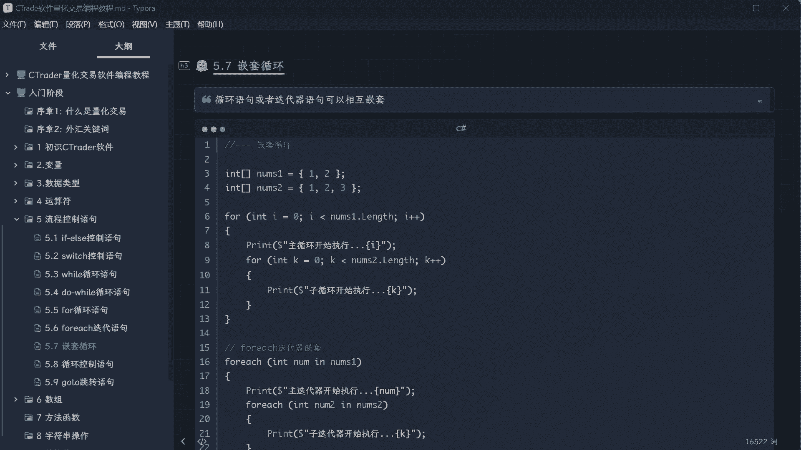

在本节课中，我们将要学习循环结构中的一个重要概念——嵌套循环。前面我们学习的循环语句或迭代器都是单层循环，而嵌套循环允许我们在一个循环内部再放置另一个循环，从而实现更复杂的遍历逻辑。

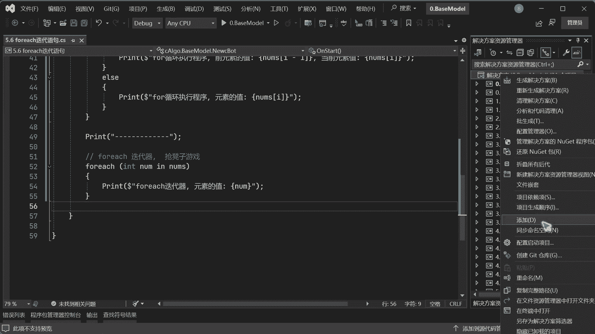

---

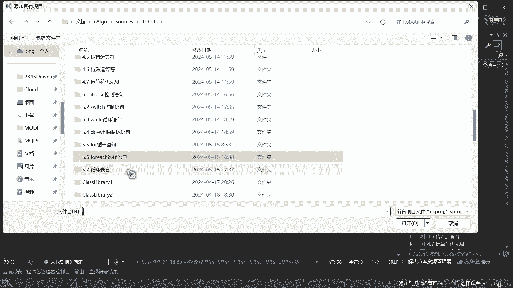

## 准备工作

首先，我们需要准备一些数据集合（数组）来演示嵌套循环。虽然数组的详细内容将在后续课程中讲解，但为了理解循环嵌套，这里需要先使用它。

```csharp
int[] array1 = { 1, 2 };
int[] array2 = { 1, 2, 3 };
```

以上代码创建了两个整数数组，`array1`包含两个元素，`array2`包含三个元素。

---

## for循环嵌套

上一节我们介绍了基本的for循环，本节中我们来看看如何使用for循环进行嵌套。

以下是for循环嵌套的基本结构：

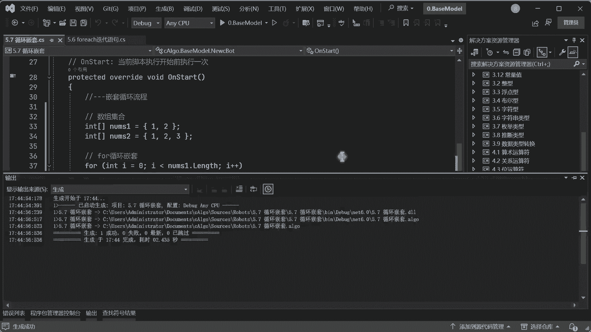

```csharp
for (int i = 0; i < array1.Length; i++)
{
    Print($"主循环执行，序号：{i}");
    for (int j = 0; j < array2.Length; j++)
    {
        Print($"子循环执行，序号：{j}");
    }
}
```

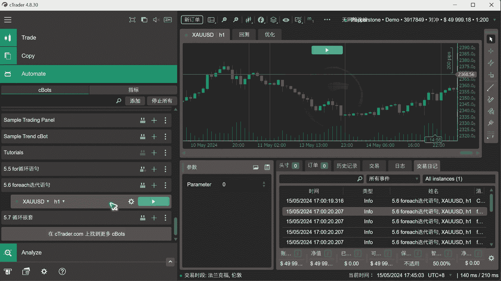

**代码解析**：
*   外层循环（主循环）使用变量`i`遍历`array1`。
*   内层循环（子循环）使用变量`j`遍历`array2`。**注意**：内层循环的计数器变量名（如`j`）必须与外层循环（`i`）不同，否则会导致编译错误。

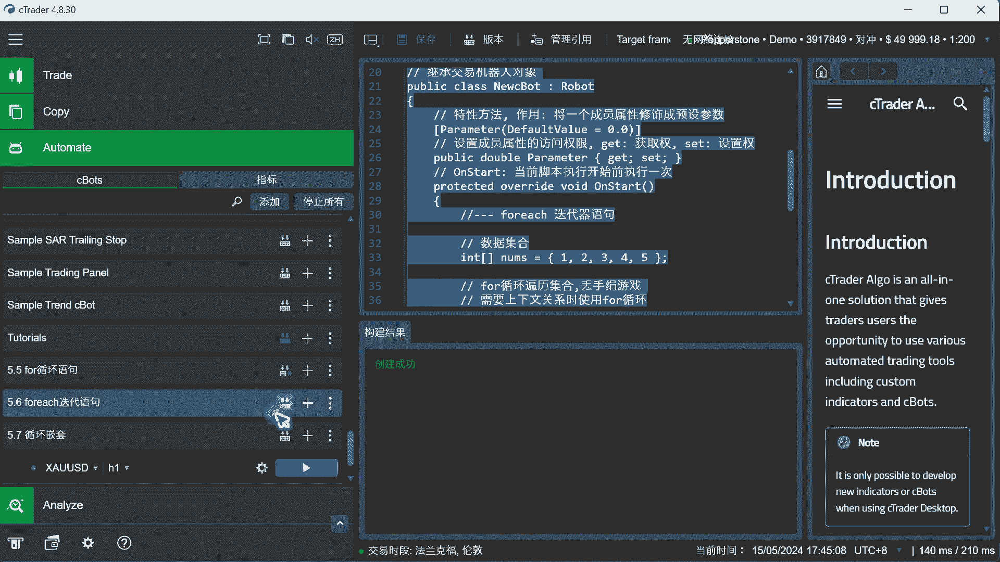

**运行逻辑**：
程序运行时，**外层循环每执行一次，其内部的内层循环会完整地执行所有迭代**。然后程序才会回到外层循环，进行下一次迭代。

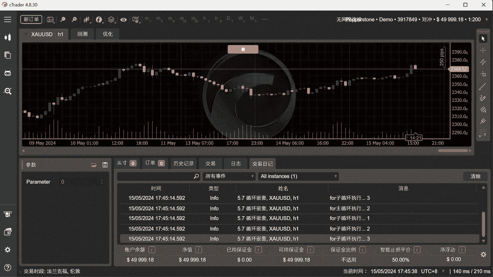

例如，上述代码的输出顺序将是：
1.  主循环执行 (i=0)
2.  子循环执行 (j=0)
3.  子循环执行 (j=1)
4.  子循环执行 (j=2)
5.  主循环执行 (i=1)
6.  子循环执行 (j=0)
7.  子循环执行 (j=1)
8.  子循环执行 (j=2)

---

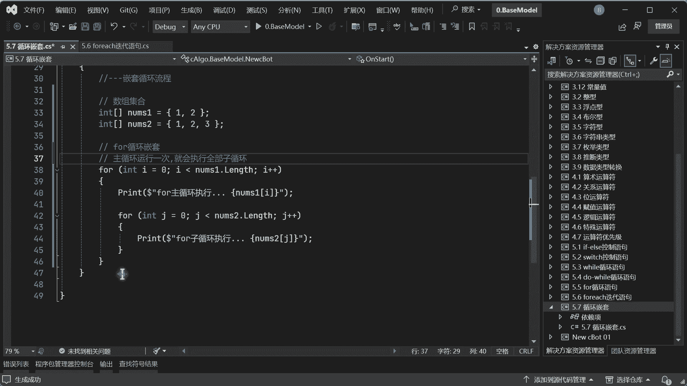

## foreach迭代器嵌套

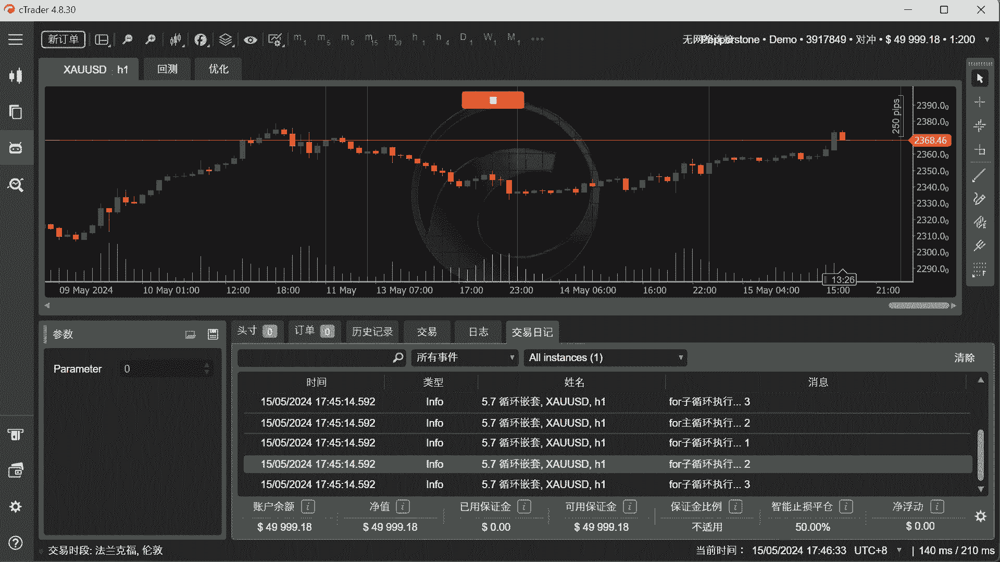

除了for循环，foreach迭代器也可以进行嵌套。其原理与for循环嵌套类似。

以下是foreach迭代器嵌套的示例：

```csharp
foreach (int num1 in array1)
{
    Print($"主迭代器运行，元素：{num1}");
    foreach (int num2 in array2)
    {
        Print($"子迭代器运行，元素：{num2}");
    }
}
```

**运行逻辑**：
同样遵循“外层迭代一次，内层完整遍历”的规则。外层迭代器每取出`array1`中的一个元素，内层迭代器就会完整地遍历一遍`array2`中的所有元素。

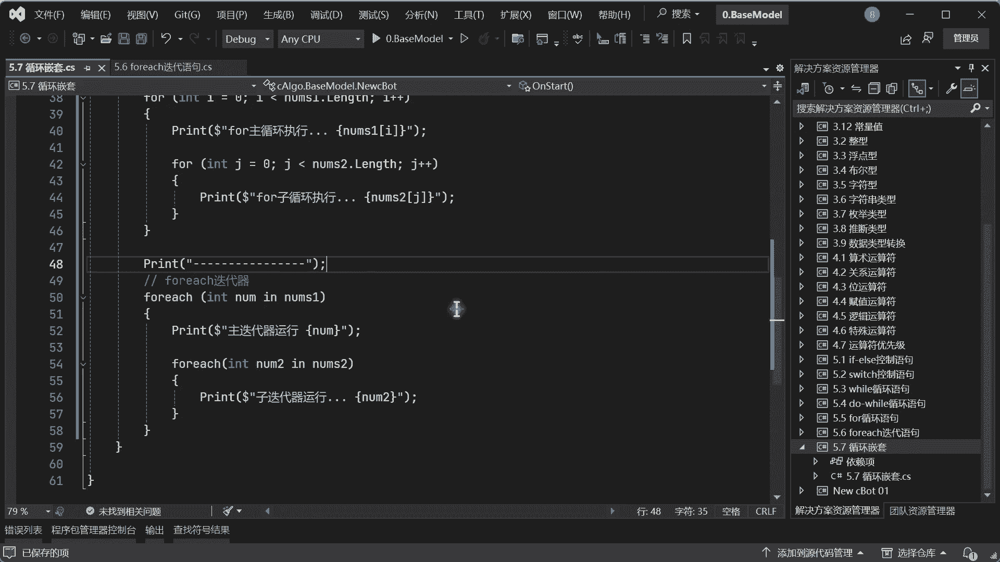

---

## 混合嵌套循环

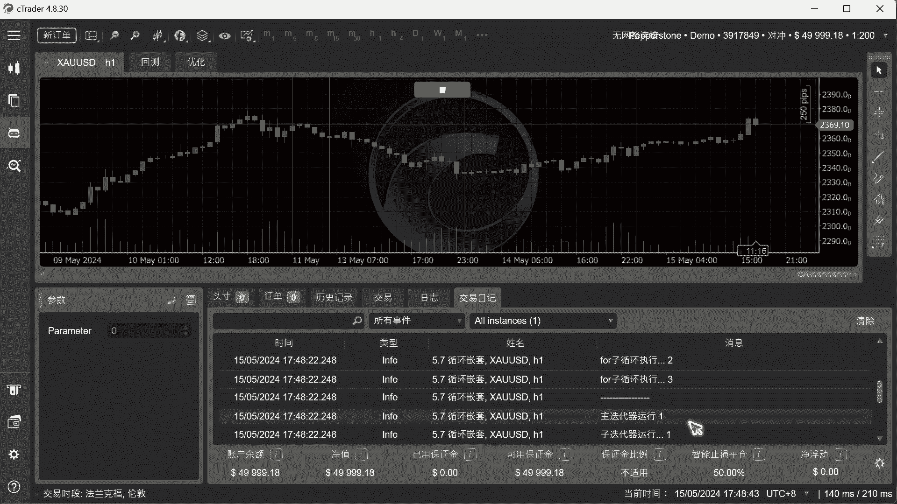

循环嵌套并不要求内外层使用同一种循环类型，它们可以自由组合。

以下是for循环与foreach迭代器混合嵌套的示例：

```csharp
for (int i = 0; i < array1.Length; i++)
{
    Print($"for循环执行，序号：{i}");
    foreach (int num in array2)
    {
        Print($"foreach迭代器运行，元素：{num}");
    }
}
```

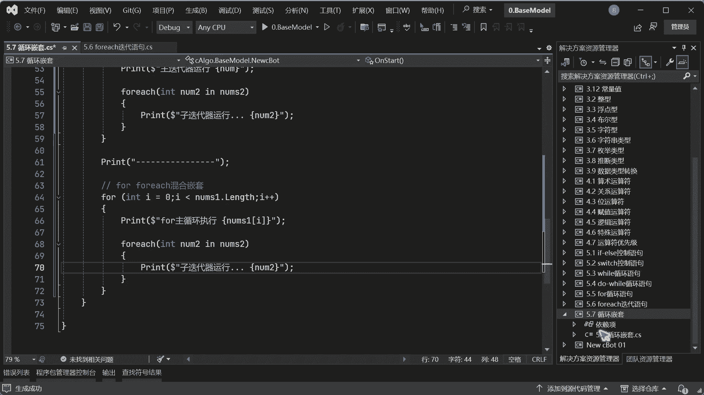

**核心概念**：
无论使用`for`、`while`还是`foreach`进行嵌套，其核心运行机制都是不变的：**当程序进入外层循环的一次迭代时，会先执行其内部整个内层循环的所有迭代，然后才会进行外层循环的下一次迭代**。

---

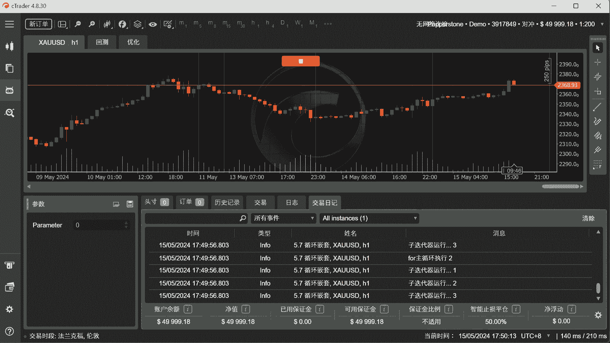

## 总结

本节课中我们一起学习了嵌套循环。我们了解到：
1.  嵌套循环允许在一个循环内部包含另一个循环。
2.  使用for循环或foreach迭代器均可实现嵌套。
3.  嵌套时，内外层循环的计数器或迭代变量名不能冲突。
4.  不同类型的循环（如for与foreach）可以混合嵌套。
5.  **最关键的一点**：嵌套循环的执行顺序是，外层循环的每次迭代都会触发内层循环的一次完整执行。

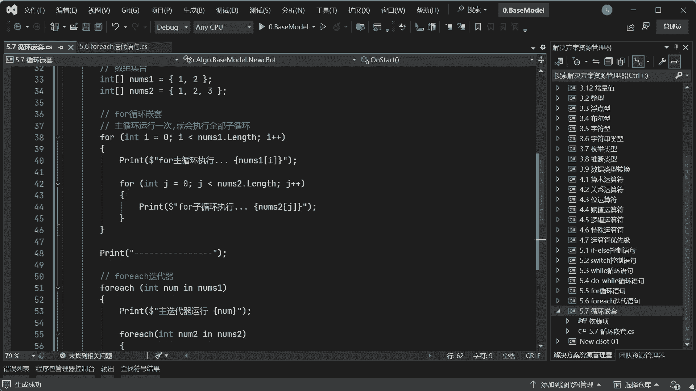

掌握嵌套循环对于处理多维数据、矩阵运算以及复杂的遍历逻辑至关重要，是量化交易编程中构建复杂策略的基础工具之一。