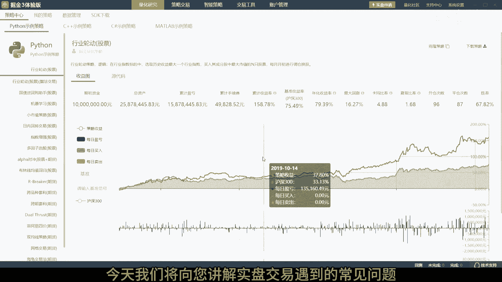
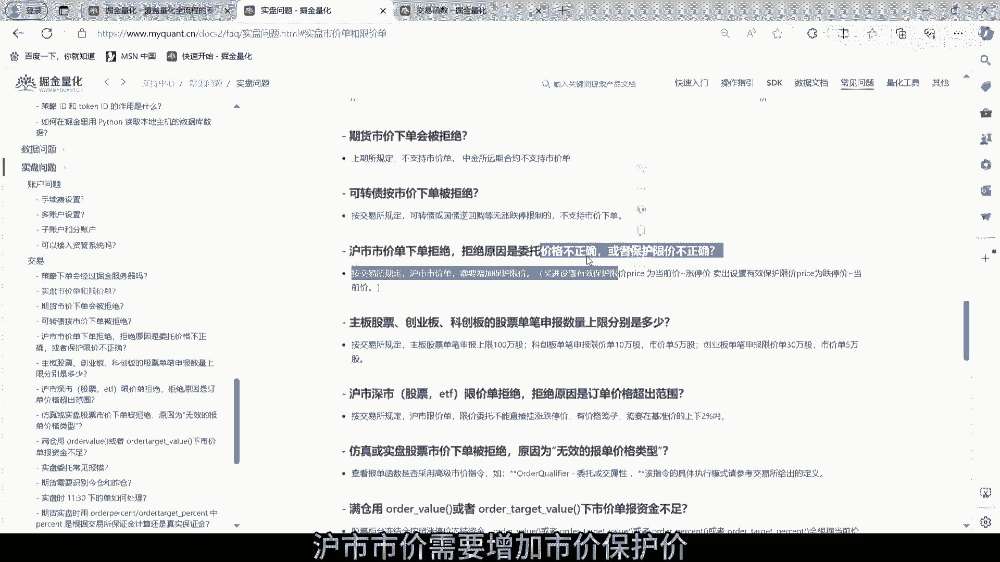
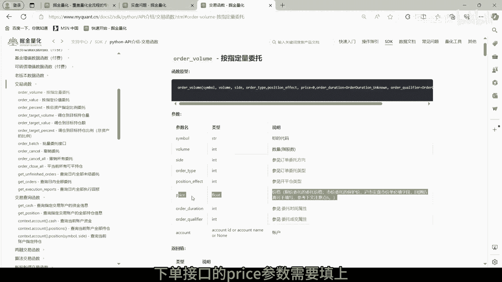
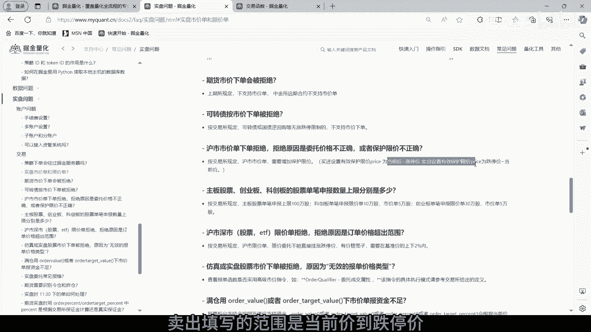
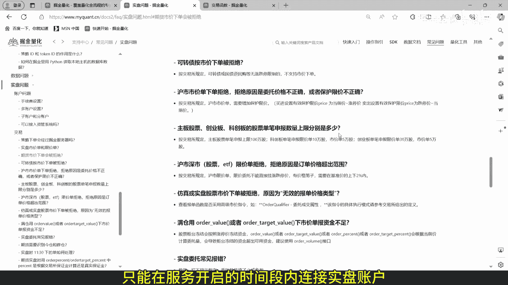
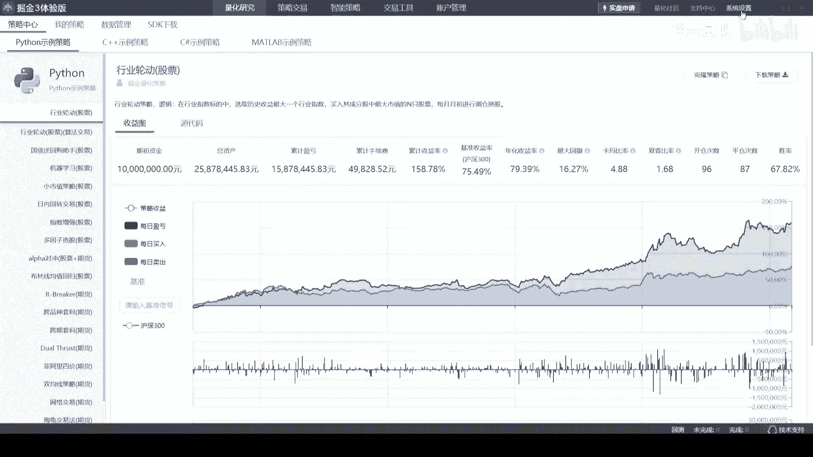
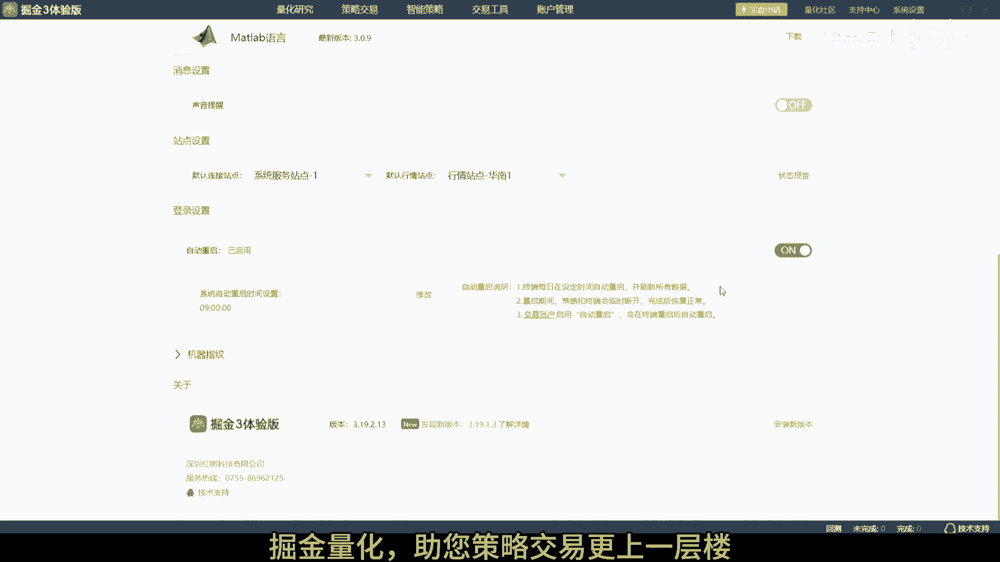

# 掘金量化终端股票实盘常见问题：P1：核心规则与操作指南 🧭

在本节课中，我们将学习掘金量化终端进行股票实盘交易时，必须了解的核心规则、常见限制以及自动化设置。掌握这些要点是确保交易策略顺利执行的基础。

上一节我们介绍了课程概述，本节中我们来看看实盘交易中的具体规则和注意事项。

## 订单价格规则 📊

在实盘交易中，不同品种和市场的订单价格申报有特定规则，必须严格遵守。

以下是关于订单价格的三点核心规则：

1.  **可转债与国债逆回购**：不支持市价单委托，必须使用限价单。
2.  **注册制新规（沪市）**：市价单申报需要增加市价保护价。
3.  **`order_volume`接口的`price`参数**：买入时，填写的价格范围应在**当前价**到**涨停价**之间；卖出时，填写的价格范围应在**当前价**到**跌停价**之间。

## 委托数量限制 📦

不同板块的股票对单笔委托申报数量有明确的上限规定。

以下是各板块的委托数量上限：

*   **主板股票**：单笔申报上限为 **100万股**。
*   **科创板**：
    *   限价单：单笔申报上限为 **10万股**。
    *   市价单：单笔申报上限为 **5万股**。
*   **创业板**：
    *   限价单：单笔申报上限为 **30万股**。
    *   市价单：单笔申报上限为 **5万股**。

**注意**：如果策略生成的委托量超过上述上限，需要由策略自行拆单，或使用平台提供的拆单算法进行处理。

## 限价委托的“价格笼子”机制 ⚖️

为维护市场公平，限价委托申报需符合“价格笼子”规则，即申报价格不能偏离基准价格过远。

以下是“价格笼子”的具体计算公式：

*   **买入申报价格**：不得高于 `买入基准价格 * 102%` 和 `买入基准价格 + 10个最小价格变动单位` 中的**较高者**。
*   **卖出申报价格**：不得低于 `卖出基准价格 * 98%` 和 `卖出基准价格 - 10个最小价格变动单位` 中的**较低者**。

## 极速柜台使用须知 ⚡

开通极速柜台服务后，交易流程会发生相应变化，请注意以下操作细节。

以下是使用极速柜台的关键时间点和操作切换说明：

1.  **交易切换**：开通后，资金和持仓将切换至极速柜台。此时，连接原主柜的交易软件将无法进行交易，必须在连接极速柜台的软件上操作。
2.  **数据同步**：盘后，极速柜台的数据会同步回主柜进行结算。
3.  **信息查看**：结算完成后，连接主柜的交易软件才能查看当天的完整交易信息。
4.  **服务时间**：极速柜台服务并非全天开启。通常服务开启时间为 **8:50 至 16:30**。只有在服务开启时间段内，才能成功连接实盘账户。

## 自动化设置 🔄

为了实现交易终端的全自动化运行，掘金终端提供了便捷的设置功能。

掘金终端支持设置**每日自动重启**和**自动重连实盘账户**。启用这些功能后，系统可在无人值守的情况下保持稳定运行，确保策略持续执行。

本节课中我们一起学习了股票实盘交易的核心规则，包括价格申报规则、委托数量限制、“价格笼子”机制、极速柜台的使用方法以及自动化设置。理解并正确应用这些知识，是保障您的量化策略在实盘环境中稳定运行的关键。