# Ctrader软件量化交易编程教程：5.8：循环跳转语句 🔄

在本节课中，我们将学习循环跳转语句。这些语句用于在循环过程中，根据特定条件中断整个循环或跳过某些循环步骤，从而更灵活地控制程序流程。

## 概述

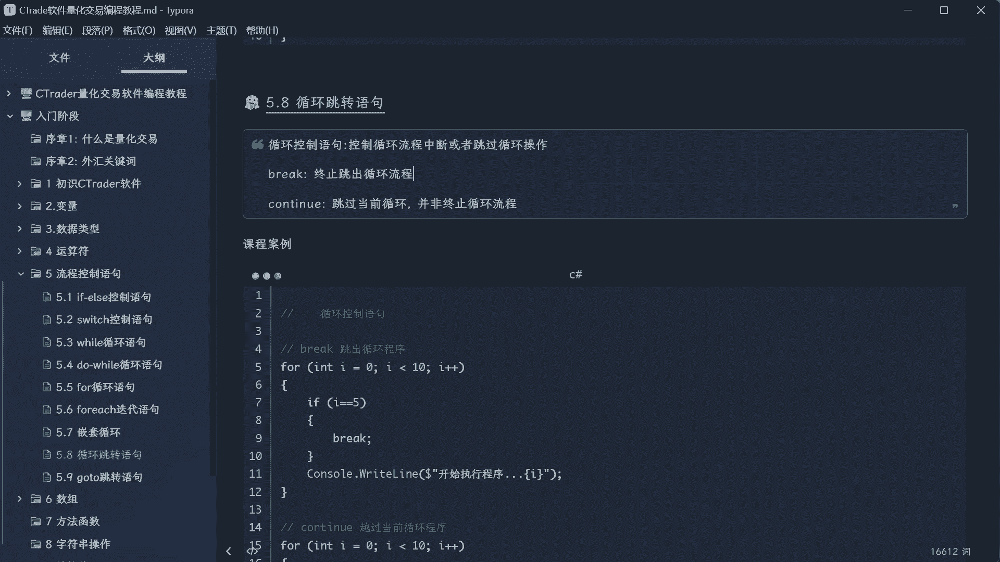

循环跳转语句主要包括 `break` 和 `continue`。`break` 用于完全终止当前所在的循环，而 `continue` 用于跳过当前循环的剩余代码，直接进入下一次循环。它们在处理数据筛选、条件中断等场景时非常有用。

---

## `break` 语句：终止循环 🛑

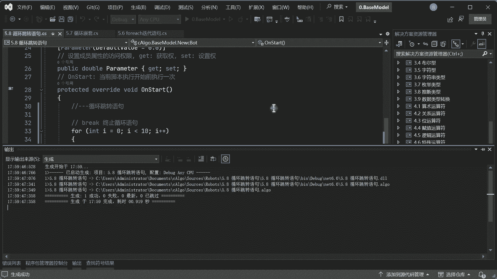

`break` 语句的作用是立即终止当前所在的循环。例如，在遍历订单列表寻找特定订单时，一旦找到目标订单，就可以使用 `break` 退出循环，避免不必要的后续遍历。

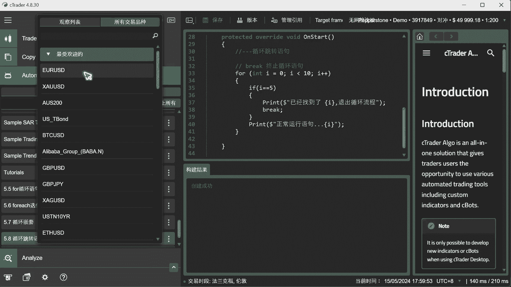

以下是 `break` 语句的基本用法示例：

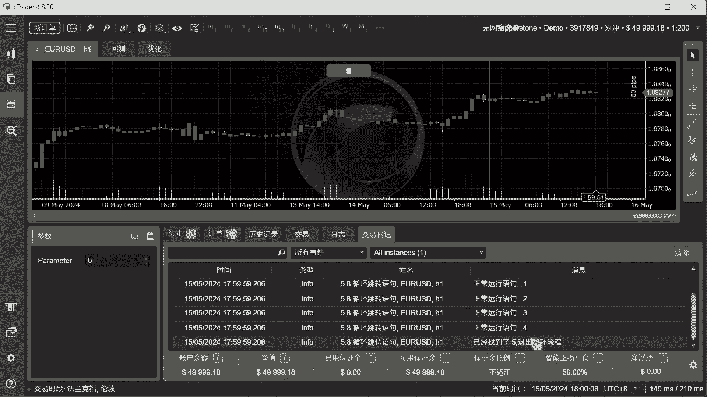

```csharp
for (int i = 0; i < 10; i++)
{
    Print("正常运行语句: " + i);
    if (i == 5)
    {
        Print("找到了 " + i + "，退出循环流程");
        break;
    }
}
```

运行上述代码，当 `i` 等于 5 时，循环会被 `break` 语句终止，因此只会打印 0 到 5，而 6 到 9 不会被执行。

---

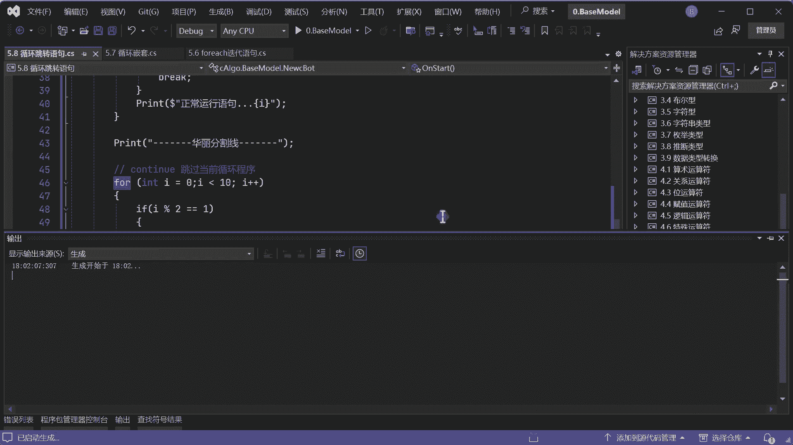

## `continue` 语句：跳过当前循环 ⏭️

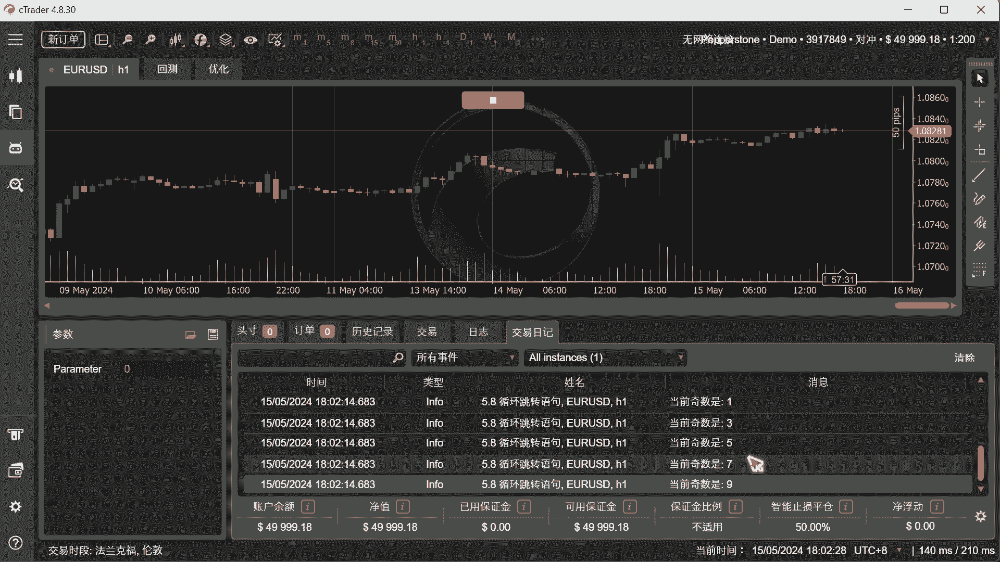

`continue` 语句的作用是跳过当前循环体中剩余的代码，直接进入下一次循环迭代。例如，在遍历订单时，如果只想处理多单（Buy），可以使用 `continue` 跳过所有空单（Sell）的处理逻辑。

以下是 `continue` 语句的基本用法示例，用于筛选并打印奇数：

```csharp
for (int i = 0; i < 10; i++)
{
    if (i % 2 == 0) // 如果是偶数
    {
        continue; // 跳过本次循环的剩余部分
    }
    Print("当前基数: " + i);
}
```

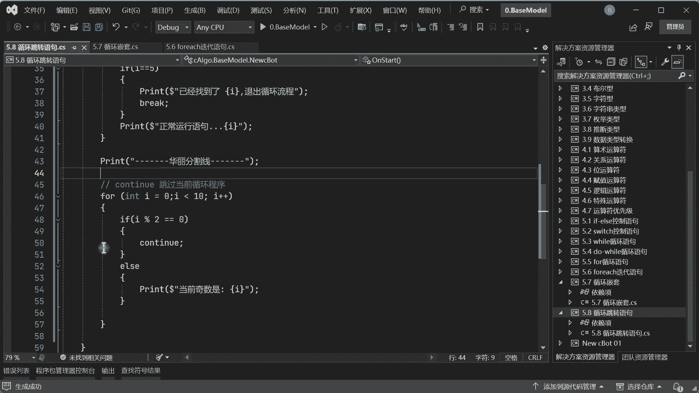

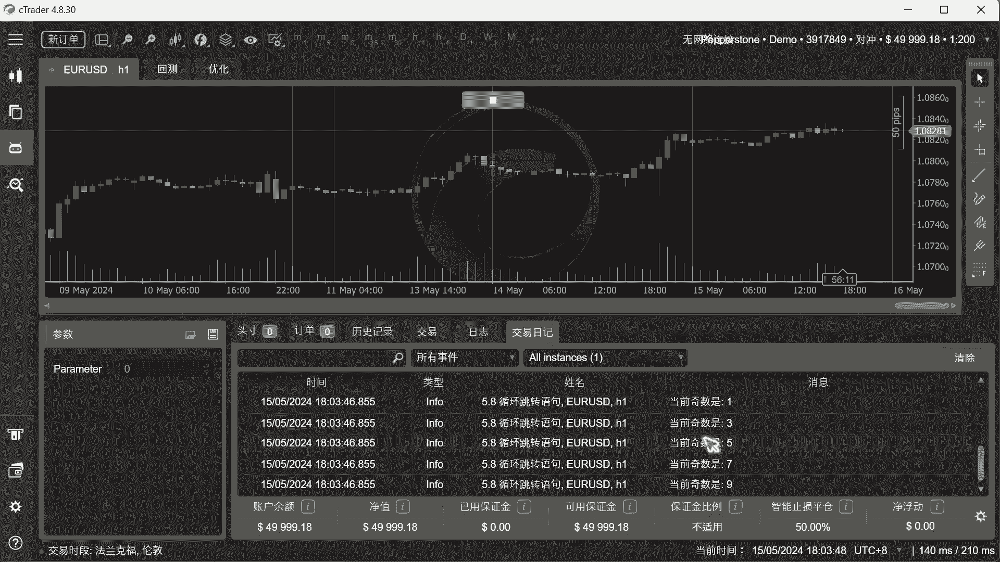

运行上述代码，`continue` 会跳过所有偶数对应的循环体，因此只会打印出 1、3、5、7、9 这些奇数。

为了提高效率，通常将 `continue` 放在循环开始处，用于优先过滤掉不满足条件的情况。

---

## 在 `foreach` 循环中的应用

`break` 和 `continue` 同样适用于 `foreach` 循环。以下是两个示例：

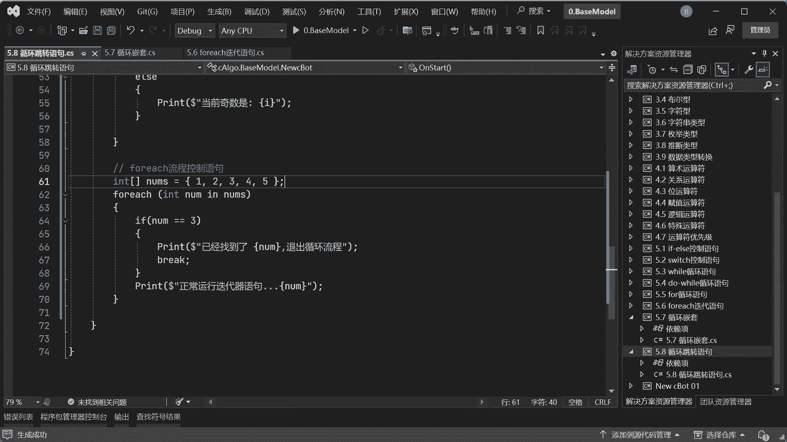

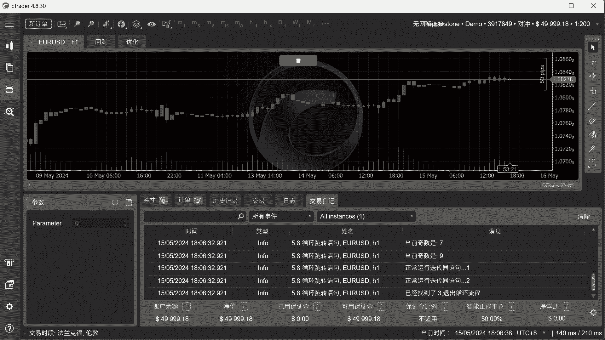

1.  **使用 `break` 在 `foreach` 中提前退出：**
    ```csharp
    int[] numbers = { 1, 2, 3, 4, 5 };
    foreach (int num in numbers)
    {
        Print("正常运行迭代器: " + num);
        if (num == 3)
        {
            Print("已经找到了值 " + num + "，退出");
            break;
        }
    }
    ```

2.  **使用 `continue` 在 `foreach` 中过滤元素：**
    ```csharp
    int[] numbers = { 1, 2, 3, 4, 5 };
    foreach (int num in numbers)
    {
        if (num % 2 == 0) // 如果是偶数
        {
            continue; // 跳过
        }
        Print("当前基数: " + num);
    }
    ```

---

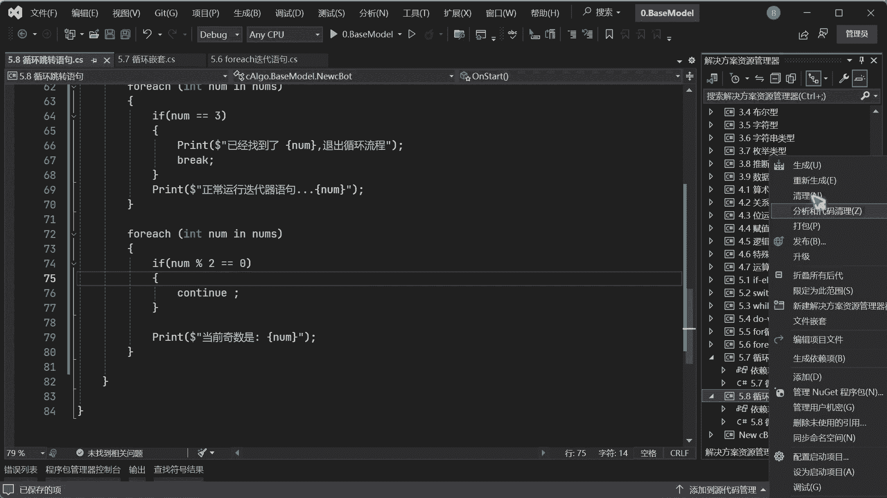

## 嵌套循环中的注意事项 🔄

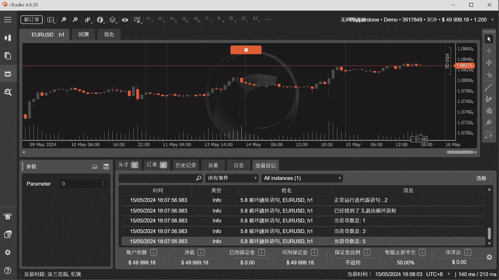

在嵌套循环（即循环内部包含另一个循环）中使用跳转语句时，需要特别注意其作用范围。`break` 和 `continue` 只作用于**它们所在的当前最内层循环体**，而不会影响外层的循环。

请看以下示例：

```csharp
for (int i = 0; i < 5; i++) // 外层循环
{
    for (int j = 0; j < 5; j++) // 内层循环
    {
        if (j == 3)
        {
            Print("子循环找到了 " + j);
            break; // 只跳出内层循环
        }
    }
}
```

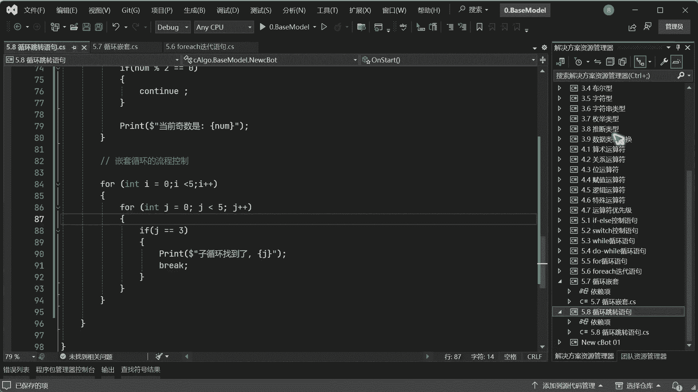

在这段代码中，内层循环的 `break` 只会终止当前的 `j` 循环。外层 `i` 循环会继续执行，因此“子循环找到了 3”这句话会被打印 5 次（对应外层循环的 5 次迭代）。如果想跳出外层循环，需要在外层循环中也设置相应的 `break` 条件。

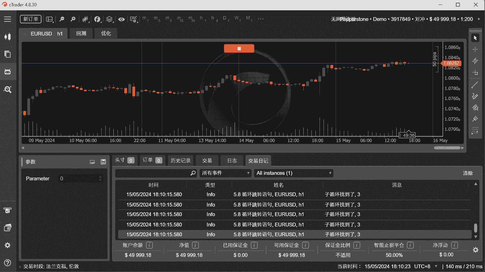

---

## 总结

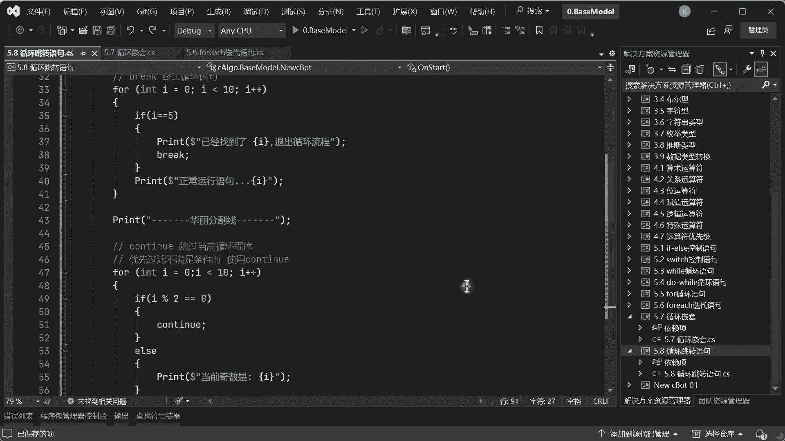

本节课我们一起学习了两种核心的循环跳转语句：
*   **`break`**：用于完全终止**当前**所在的循环。
*   **`continue`**：用于跳过**当前**循环的剩余代码，直接开始下一次循环。

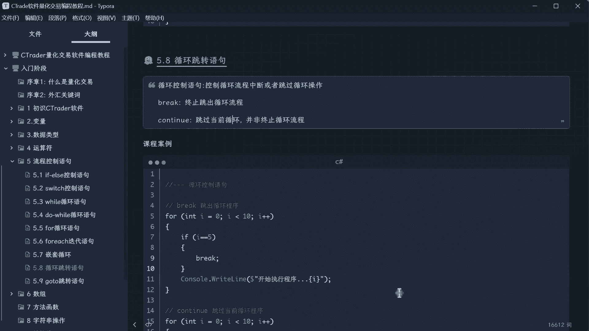

它们都能让循环控制更加精细和高效，特别是在数据遍历和条件筛选的场景中。记住，在嵌套循环里，它们的作用范围仅限于直接包含它们的那个循环体。