# cTrader量化交易编程教程：5.9：goto跳转语句 🧭

在本节课中，我们将要学习C#语言中的`goto`跳转语句。`goto`语句允许程序根据条件跳转到代码中指定的标签位置继续执行。我们将通过一个简单的评分系统示例，来理解其工作原理和使用时的注意事项。

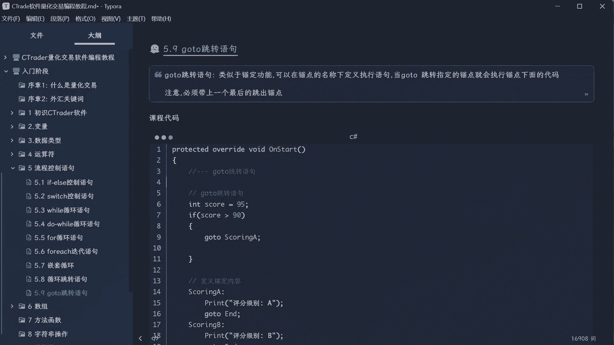

## 概述

`goto`语句的功能类似于一个锚点或书签。你可以在代码中定义多个标签（锚点），然后通过`goto`语句让程序跳转到指定的标签处开始执行。理解其执行流程对于避免代码逻辑错误至关重要。

上一节我们介绍了条件判断语句，本节中我们来看看如何使用`goto`进行更直接的流程控制。

## 编写锚点程序

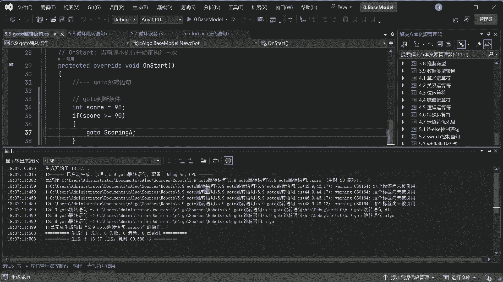

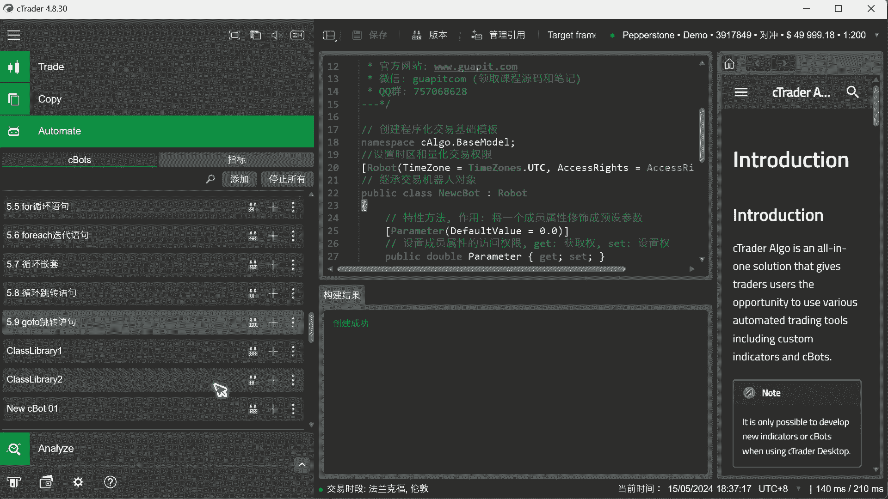

首先，我们需要定义程序中的各个锚点。以下是定义评分等级A、B、C、D以及程序结束标签的代码。

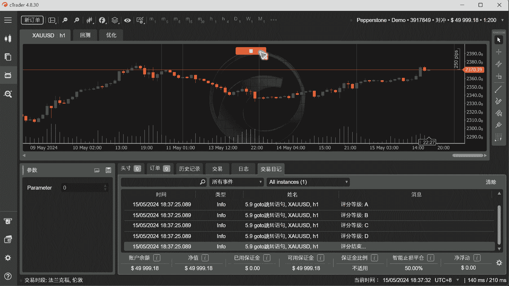

```csharp
// 定义锚点标签
A:
    Print("评分等级 A");
    goto End;

B:
    Print("评分等级 B");
    goto End;

C:
    Print("评分等级 C");
    goto End;

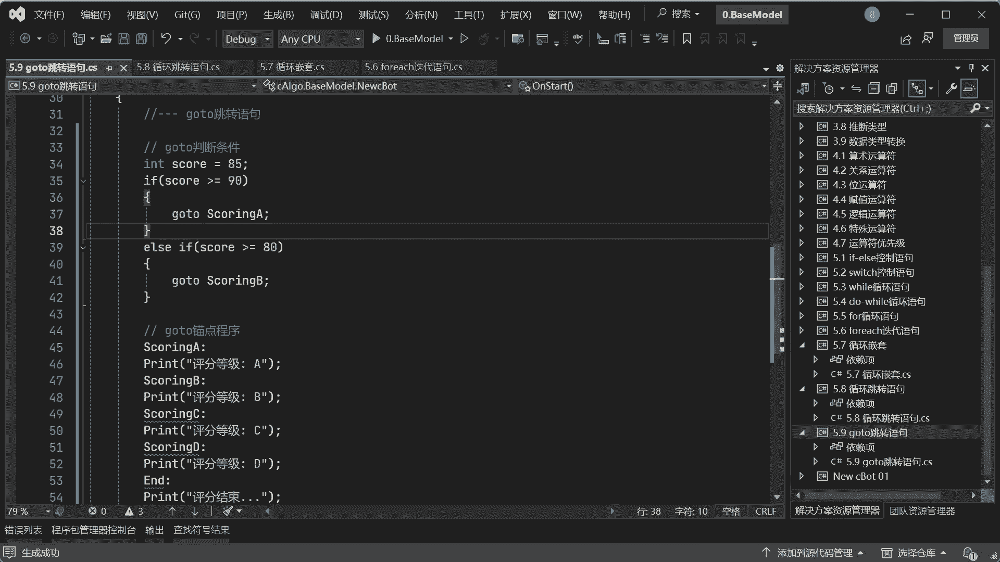

D:
    Print("评分等级 D");
    goto End;

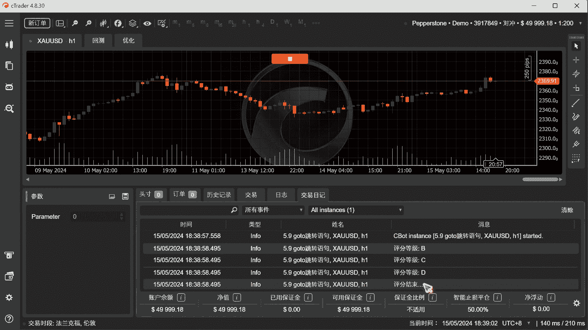

End:
    Print("...评分结束");
```

## 使用goto进行条件跳转

接下来，我们根据分数判断应该跳转到哪个评分锚点。以下是实现此逻辑的代码。

```csharp
// 定义分数变量
double score = 95;

// 根据分数跳转到不同锚点
if (score >= 90)
{
    goto A;
}
else if (score >= 80)
{
    goto B;
}
else if (score >= 70)
{
    goto C;
}
else
{
    goto D;
}
```

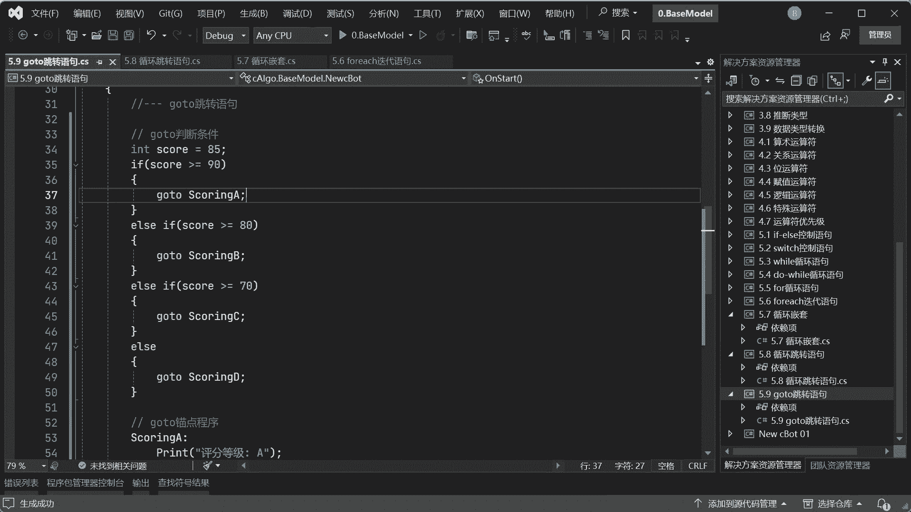

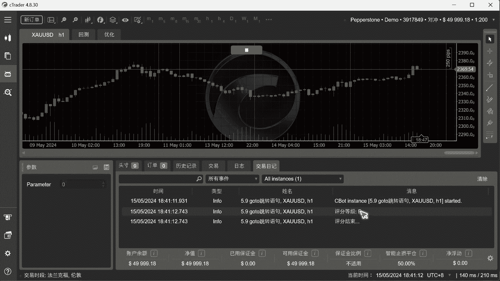

## 关键注意事项

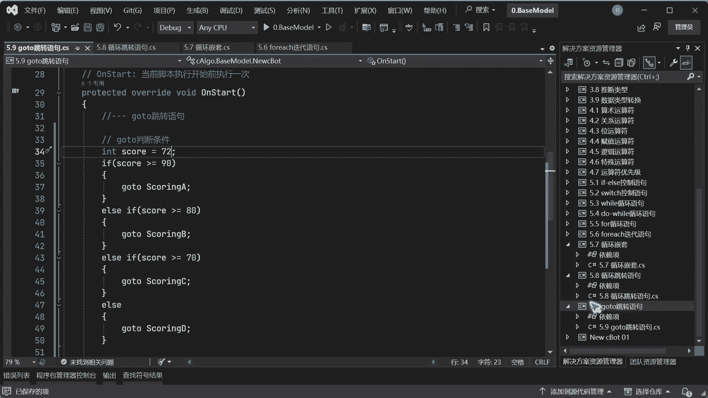

在使用`goto`语句时，有几个关键点必须注意，否则可能导致程序逻辑错误或死循环。

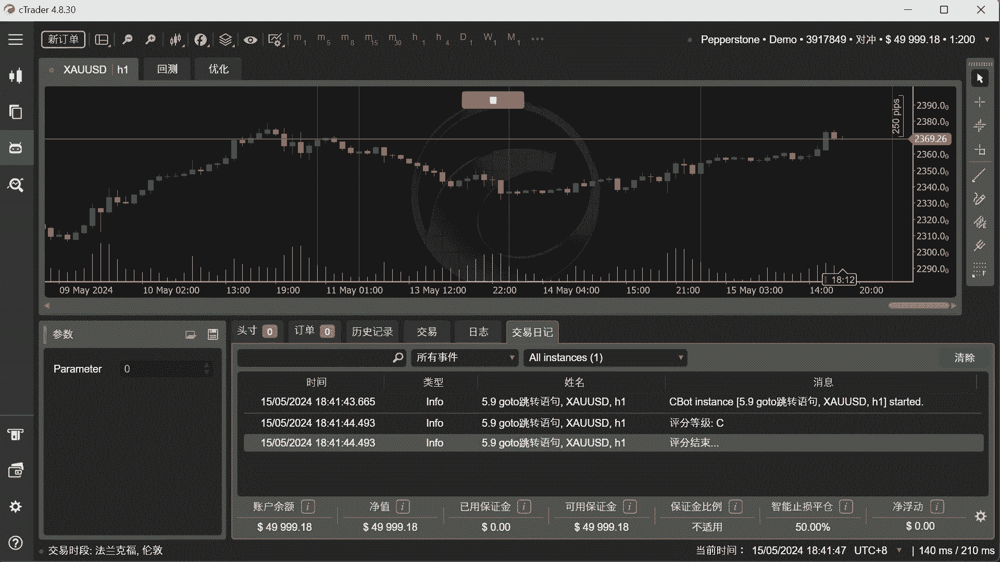

以下是使用`goto`时必须牢记的两点：

1.  **锚点标签必须定义在`goto`语句之后**：如果将标签定义在`goto`语句之前，程序跳转到标签后，会继续向下执行，很可能再次遇到`goto`判断条件，从而陷入死循环。
2.  **每个功能锚点后必须跳转到结束点**：在每个评分等级（如A、B、C、D）的代码块末尾，必须使用`goto End;`语句跳转到程序结束标签。否则，程序会继续顺序执行后面的所有锚点代码块，导致输出错误的结果。

## 总结

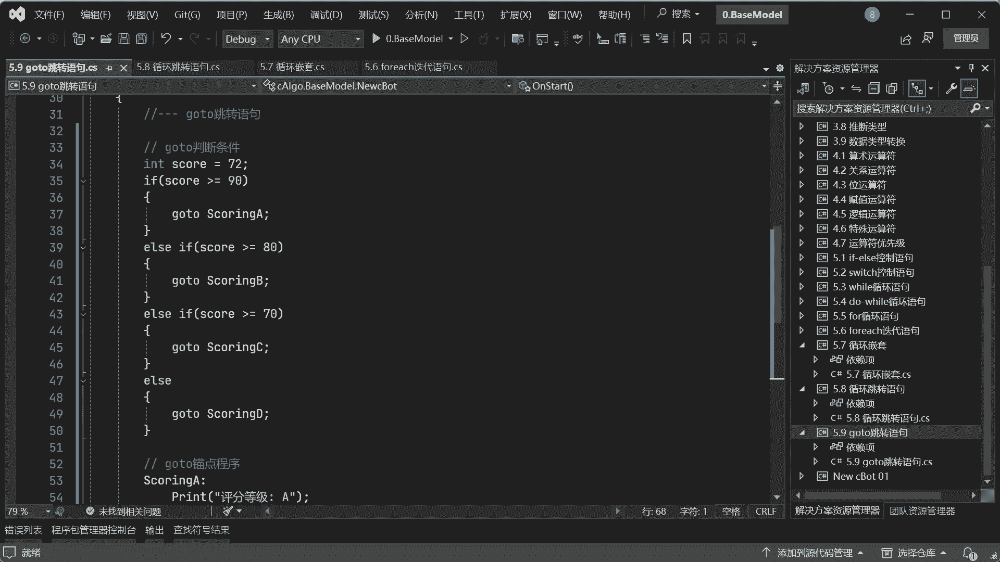

本节课中我们一起学习了`goto`跳转语句。我们了解到`goto`可以实现代码的定向跳转，但其使用需要格外小心。主要步骤是：先定义所有锚点标签和结束标签，然后在每个功能锚点末尾跳转到结束点，最后根据条件使用`goto`进行跳转。

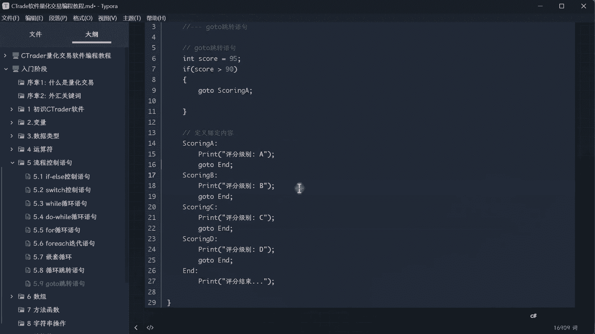

由于其容易破坏代码的结构化，导致流程难以跟踪和调试，因此在日常编程中**不建议频繁使用`goto`语句**。通常，使用 `if...else if...else` 或 `switch` 语句是更清晰、更安全的流程控制选择。理解`goto`有助于我们读懂可能遇到的旧代码，但在自己编写时应优先考虑更结构化的方法。