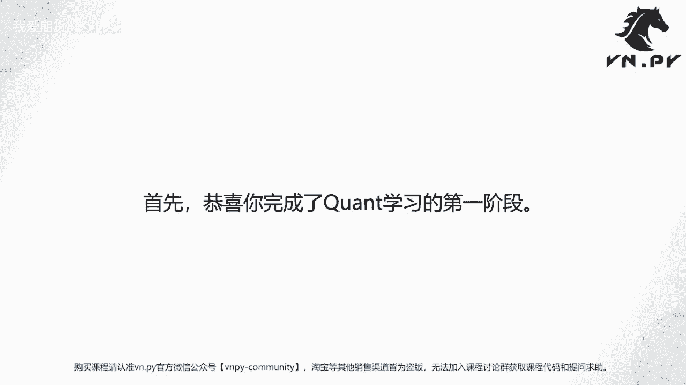
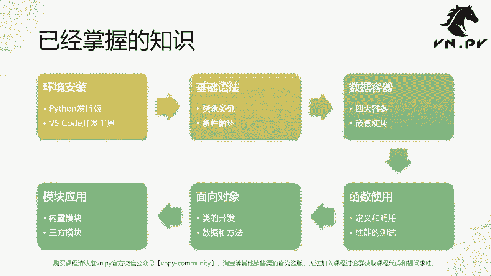
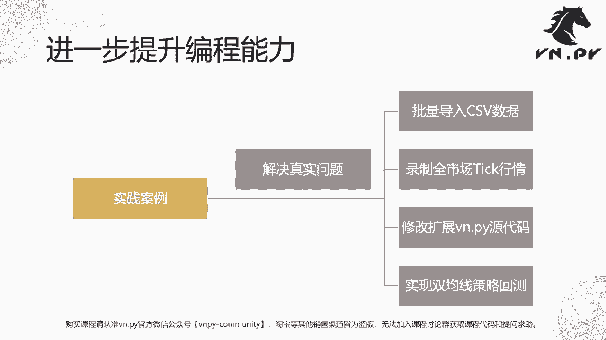

# 量化交易零基础入门：50：课程总结与展望 🎯

在本节课中，我们将对《量化交易零基础入门》系列课程已学习的内容进行系统性回顾与总结，并展望后续的实践案例。通过本次总结，你将清晰地看到自己已经掌握的知识体系，并为接下来的实战应用做好准备。

## 课程内容回顾 📚

恭喜你，已经完成了量化学习的第一阶段。整个课程内容可以归纳为以下六个核心模块。

### 1. 开发环境搭建 💻

我们首先学习了如何搭建Python开发环境。这包括Python运行环境本身，以及用于编写代码的开发工具。

*   **Python发行版**：Python发行版不仅包含Python解释器，还集成了官方内置模块以及针对特定功能打包的第三方模块。你可以根据需求选择合适的发行版，例如：
    *   官方标准版
    *   专注于科学计算的Anaconda
    *   为量化交易优化的VN Studio

*   **开发工具**：我们选择了VS Code作为代码编辑器。它轻量、可扩展，并支持智能提示、插件安装以及高效的代码导航与折叠等操作，能显著提升开发效率。

### 2. Python基础语法 🧱

上一节我们介绍了开发环境，本节中我们来看看Python的基础语法。这些概念是所有编程语言的基石。

*   **变量与数据类型**：Python简化了变量类型，最常用的有五种：
    *   整数 (`int`)
    *   浮点数 (`float`)
    *   字符串 (`str`)
    *   布尔值 (`bool`)
    *   空值 (`None`)

*   **控制语句**：用于控制程序流程，主要包括：
    *   **条件判断** (`if/elif/else`)：根据条件执行不同代码块。
    *   **循环** (`for`, `while`)：重复执行特定代码块。

### 3. 数据容器 📦

掌握了基础语法后，我们开始学习如何有效地组织和存储数据。以下是Python的四大核心数据容器：

*   **列表 (`list`)**：用于存储有序的元素序列。
*   **字典 (`dict`)**：用于存储键(`key`)值(`value`)对映射关系。
*   **集合 (`set`)**：用于存储唯一、无序的元素，常用于去重。
*   **元组 (`tuple`)**：用于存储不可变的有序序列。

这些容器可以灵活嵌套使用（例如，列表中可以包含字典），以构建复杂的数据结构，是程序中“数据”部分的核心载体。

### 4. 函数 🔧

为了提升代码的复用性和可维护性，我们学习了函数。函数主要有两大作用：

*   **代码复用**：将重复使用的逻辑封装成函数，减少代码量。
*   **抽象思维**：将复杂功能模块化，降低程序员的思维负担，使其能更专注于高层逻辑。

我们还重点介绍了如何使用Jupyter的 `%timeit` 魔法命令来测试函数性能，这对于追求高效率的量化交易应用至关重要。优化性能的一个基本原则是：**优先使用Python内置函数**。例如，使用内置的 `sum()` 函数对列表求和，其速度远快于自己编写的 `for` 循环。

### 5. 面向对象编程 (OOP) 🧠

面向对象编程是组织复杂代码的强大范式。我们学习了以下核心概念：

*   **类 (`class`)** 的定义与实例化。
*   **继承**：子类可以继承父类的属性和方法。
*   **多态**：同一接口在不同对象上表现出不同行为。
*   **类属性**与**实例属性**的区别。

通过面向对象的方法，我们不仅能复用逻辑（方法），还能复用与之关联的数据（属性），使代码结构更清晰、更易管理。

### 6. 模块化开发 📚

最后，我们学习了如何利用现有模块来加速开发。核心思想是“站在巨人的肩膀上”。

*   **使用模块**：直接调用Python内置模块或第三方模块提供的函数和类，避免重复造轮子。
*   **模块管理**：学习如何安装 (`pip install`) 和导入 (`import`) 所需的第三方库。

本质上，模块就是由函数和类组成的集合。掌握模块的使用，意味着你能够快速利用社区积累的丰富资源来解决实际问题。

## 从知识到实践：后续案例展望 🚀

至此，关于Python编程语言本身的核心知识你已经掌握。接下来的关键是将这些知识应用于解决实际问题。

为了帮助大家建立知识与实践的联系，我们将在后续课程中补充四个综合性的实践案例。这些案例比课程中的小练习规模更大，更贴近真实量化交易场景。

以下是后续将要学习的四个实践案例简介：

*   **案例一：批量导入CSV数据**：结合已学的`os`模块文件遍历、CSV文件读取以及数据库操作，实现自动化批量导入大量CSV文件的功能。
*   **案例二：使用VN.PY录制全市场Tick行情**：编写脚本，利用VN.PY实时录制全市场的Tick级数据，为高频或Tick级别的研究提供数据来源。
*   **案例三：修改与扩展VN.PY源代码**：学习如何通过环境变量或修改`site-packages`目录下的源码，安全地对VN.PY进行功能定制与扩展。
*   **案例四：实现双均线策略回测**：综合运用数据容器、数据导入等知识，编写一个简单的双均线交易策略，并进行回测，最后使用绘图模块可视化回测结果。

## 总结 📝

本节课中，我们一起回顾了整个《量化交易零基础入门》课程的核心内容，从环境搭建、Python语法、数据容器、函数、面向对象编程到模块化开发，构建了一个完整的Python量化开发知识体系。

现在，你已经掌握了Python这一强大的工具。接下来的课程，我们将通过一系列实践案例，帮助你将这些知识融会贯通，真正转化为解决实际量化交易问题的能力。请带着你学到的武器，自信地踏上新的探索之旅吧！

更多精华内容，请扫码关注我们的社区公众号。